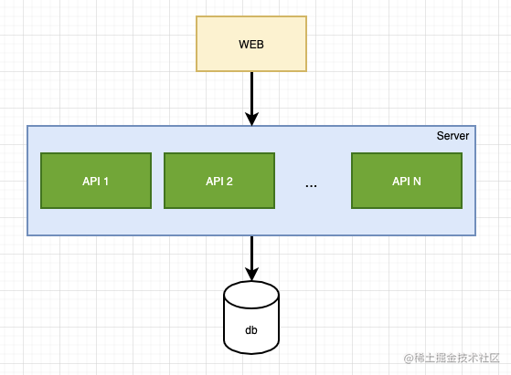
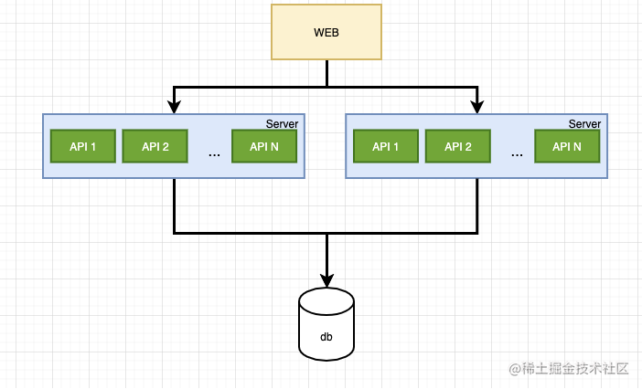
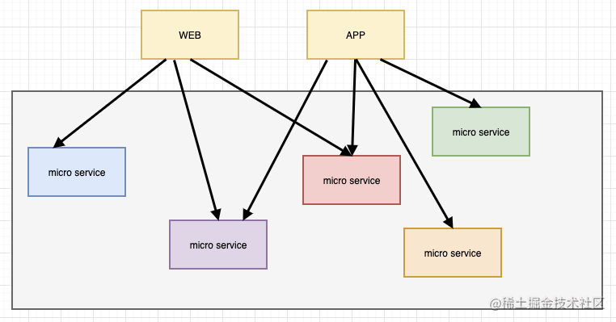
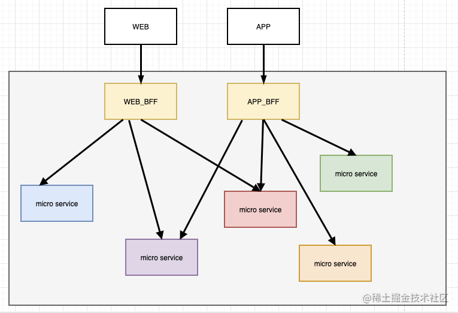
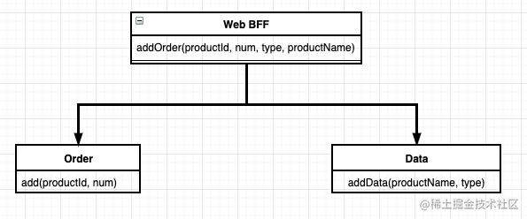
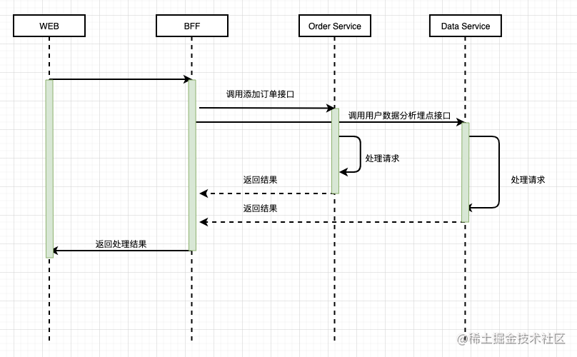
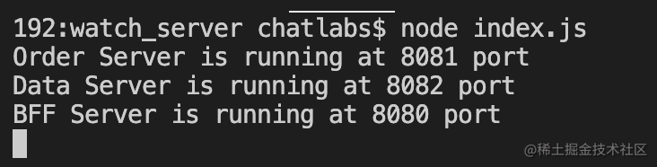
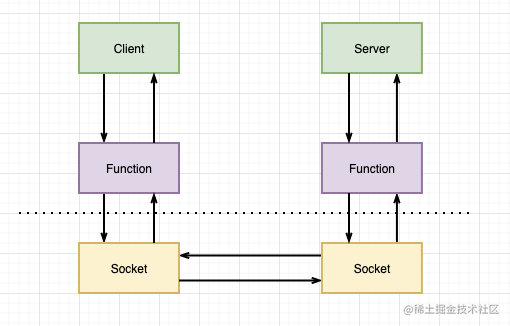

BFF: 服务于前端的后端


## 前言
我们开发一个简单的应用的业务架构如下



最开始的时候前端只需要调用一个服务就可以完成对应的业务。

后来，业务逻辑逐渐复杂。后端将复杂的业务分离成一个新的服务出来了



这时前端需要调用两个不同的业务接口才可以满足业务的需求。

随着业务越来越复杂，后端需要拆分的业务也越来越多(微服务化)，这时候前端需要满足业务需求，一个功能不得不用两个或多个微服务接口才能完成业务



这样的架构前端的代码必须会变的非常臃肿和繁杂，同时过多的请求可能也会导致网络性能瓶颈。所以为了解决这个问题，有人提出了BFF层
## BFF层

<span style="color: red">BFF(Backends For Frontends)服务于前端的后端</span>。后端各种微服务、API之间的一层胶水代码。主要的业务场景请求转发、数据组织、接口适配、鉴权和SSR

BFF是一种逻辑分层，BFF层服务会更多的考虑接口在前端的使用，并且在服务端直接进行业务逻辑的处理，又称为用户体验是撇弃

:::tip
BFF 可以用任何语言来实现：GO、Java、Php、Node，由于前端都是使用 JavaScript 作为开发语言，从脚手架 -> 组件 -> 编译 -> 包管理 -> CI/CD 都是是使用的 JavaScript，BFF 作为更多考虑前端的一种服务大多数时候是使用 Node 来编写。
:::
<span style="color: red">BFF并不是技术，而是一种逻辑的分层。他位于后端微服务于前端之前，最直接的作用就是对接处理前端的请求</span>



通过BFF层，前端在调用接口时，只需要调用业务的BFF层接口，BFF层将业务中需要请求的微服务整合起来。这样。即使我们在后端改动微服务时候，也只需改动BFF层，无需修改前端代码

### BFF能做什么？
- 服务聚合

    上文提到，BFF层可以将业务中的多个微服务整合起来，对外只暴露一个接口点，前端只需调用一个接口和关注数据的传输，无需关注微服务复杂的调用

- 缓存数据

    BFF层对接的是前端请求，作为业务请求微服务的处理点，它还可以做数据的缓存

- 访问控制

    <span style="color: red">服务中的权限控制，将所有服务中的权限控制集中在BFF层，使下层服务更加纯碎和独立</span>

## 使用Node构建BFF层
了解完BFF层是什么，接下来我们使用Node.js构建一个用于服务聚合的BFF层的demo。

### 业务场景
后端有两个微服务
- 一个是管理大数据系统的微服务,提供记录大数据信息和推送功能。
- 一个则是管理订单信息的微服务,提供订单的增删改查功能
- 前端在下单的同时也需要调用大数据信息录入的功能。

### 系统类图
后端提供服务的系统类图如下


## 调用时序图
BFF层接收到WEB请求后,向Order service和Data Service发送请求，两个服务处理完成后,BFF层向前端返回消息，时序图如下



### 构建一个简单的BFF层
系统设计完了，现在开始实现代码，首先实现**订单微服务和数据微服务**
```js
const http = require('http');

// 订单服务
const orderApp = http.createServer((req, res) => {
    handleOrderInput(req, res);
})
orderApp.listen(8081, () => {
    console.log('Order Server is running at 8081 port')
})

// 数据服务
const dataApp = http.createServer((req, res) => {
    handleDataInput(req, res);
})
dataApp.listen(8082, () => {
    console.log('Data Server is running at 8082 port');
})

function handleOrderInput(req, res) {
    switch(req.url) {
        case '/order/add':
            res.end('{ code: 200, msg: "success", data: ""}');
            break;
        default: 
            res.end('{ code: 500, msg: "route not found", data: ""}')
            break;
    }
}
function handleDataInput(req, res) {
    switch(req.url) {
        case '/data/add':
            res.end('{ code: 200, msg: "success", data: ""}');
            break;
        default: 
            res.end('{ code: 500, msg: "route not found", data: ""}');
            break;
    }
}
```
> 上面代码中，我们创建了订单服务和数据服务，分别占用8081和8082端口。接下来创建BFF层
```js
const http = require('http');
const BFF = http.createServer((req, res) => {
    handleBFF(req, res);
})
BFF.listen(8080, () => {
    console.log('BFF Server is running at 8080 port');
})

function handleBFF(req, res) {
    switch(req.url) {
        case '/order/add':
            addOrder(req, res);
            break;
        default: 
            res.end('{ code: 500, msg: "route not found", data: "" }');
            break;
    }
}
// 处理添加订单方法
function addOrder(req, res) {
    if(req.method !== 'POST') {
        res.end('{ code: 500, msg: "route not found", data: ""}');
        return;
    }
    let data = '';
    req.on('data', chunk => {
        data += chunk;
    })
    req.on('end', async () => {
        const orderResult = await publicRequest(
            'http://localhost:8081/order/add',
            data
        )
        const dataResult = await publicRequest(
            'http://localhost:8082/data/add',
            data
        )
        res.end(JSON.stringify({orderResult, dataResult}))
    })
}

// 公共请求方法
async function publicRequest(url, data) {
    return new Promise(resolve => {
        const request = http.request(url, response => {
            let resData = '';
            response.on('data', chunk => {
                resData += chunk;
            })
            response.on('end', () => {
                resolve(resData.toString())
            })
        })
        request.write(data);
        request.end();
    })
}
```
在BFF层中，创建了一个用户请求服务的公共请求方法。请求中将添加订单并且调用数据服务接口添加数据。测试一下



发送一个http请求
```js
POST http://localhost:8080/order/add HTTP/1.1
Content-Type: application-json
{
    "productId": 1,
  "type": "toy"
}
```
返回
```js
HTTP/1.1 200 OK 
Date: Mon, 16 Aug 2021 06:20:19 GMT 
Connection: close 
Content-Length: 120 
{"orderResult":"{ code: 200, msg: \"success\", data: \"\" }","dataResult":"{ code: 200, msg: \"success\", data: \"\" }"}
```
<span style="color: blue">到这里，一个简单的BFF层就是先了</span>

可以注意到，<span style="color: red">**在BFF层中调用其他服务接口时，现在使用的是HTTP请求，内网之间相当于做了一次请求转发。由于是基于HTTP协议，所以网络性能上可能也会有不太好的体验**</span>

<span style="color: red">有没有一种方法可以在传输层上传输请求信息呢？答案是使用RPC(远程过程调用)</span>

### 优化BFF层
- <span style="color: red">RPC远程过程调用</span>

    <span style="color: red">**简单的理解是一个节点请求另一个节点提供的服务**, 它是基于TCP的数据传输，数据会直接在传输层完成传输。服务器与客户端基于cocket链接。</span>数据传输的图如下：

    

- <span style="color: red">node中的实现</span>

    实现一个RPC框架是一个系统的工程，[下一节](/front-end/JavaScript/basics-5-1.html)中奖使用node.js实现RPC.


## 资料
[BFF-服务前端的后端（真香）](https://juejin.cn/post/7045218306717909023)

[你学BFF和Serverless了吗](https://juejin.cn/post/6844904185427673095)

[使用 Node.js 构建 BFF 层（一）](https://juejin.cn/post/6996935339386339336)