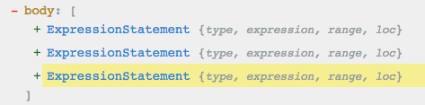
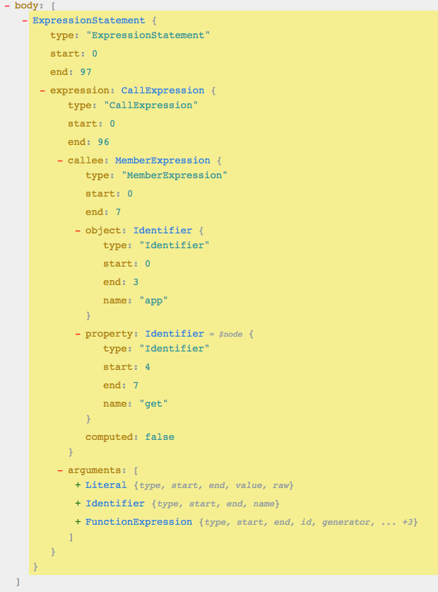
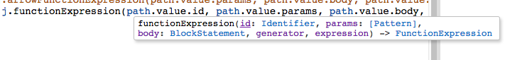

jscodeshift是fb出的一个codemod toolkit,基于recast这个js解析器封装了很多方便使用的工具方法。但是由于官网对使用方式的描述有点迷，刚用起来会有点蛋疼，所以写篇教程说一下。

简单先说明一下jscodeshift能用来干嘛，<span style="color: blue">其实就是能够解析js，将js内容解析成AST语法树，然后提供一些便利的操作接口，方便我们对各个节点进行更改，比如更改所有属性名之类的。</span>比如这个官方提供的最简单的demo
```js
const j = require('jscodeshift');

j(jsContent)
    .find(j.Identifier)
    .replaceWith(
        p => j.identifier(p.node.name.split('').reverse().join(''))
    );
```
可以实现的效果就是
```js
console.log('123');
```
会被转换为
```js
elosnoc.gol('123');
```
更复杂一些的话，我们甚至可以基于jscodeshift来做类似于babel的功能，将es6转换为es5，当然已经有babel的情况下就没必要在实现了，那还可以做啥呢？就是codemod，也就是代码自动升级工具，比如框架进行了一个大的升级，业务代码要升级框架要进行大量更改，而这些更改操作就可以通过jscodeshift来实现了。

## 使用
### 配套工具
在具体说jscodeshift如何使用之前，有个网站是必须配合使用的，就是jscodeshift提供的一个配套的ast可视化工具[AST explorer](https://astexplorer.net/)

基本上使用jscodeshift都要配合这个站点上的可视化的ast tree来实现

比如我有一串js内容为下面这段
```js
app.say = function(test) {
    console.log(test);
}
app.get('/api/config/save', checkConfigHighRiskPerssion, function() {
    console.log('cool')
})
app.say('123')
```
你们可以把代码贴到ast explorer中用鼠标一道各个节点看看，在这里不好截那么大的图，就只截了ast tree的结构



可以看到有三个ExpressionStatement结构，如果我们点开中间那个，其实也就是app.get那串代码，结果就如下：



可以看到上面那串代码呗转换成了这么一种树形结构，其中ExpressionStatement代表的是表达式模块，也就是app.get整个串代码，其中MemberExpression代表的是app.get，arguments代表的是后面的方法参数那串，然后按顺序，Literal就是'/api/config/save',Identifier 就是 checkConfigHighRiskPermission，然后 FunctionExpression 就是最后的那个方法。

那么，如果我需要把上面代码中的 app.get... 的那段代码，把里面的 app.get 换成 app.post，并且把 app.get 中的那个回调方法，换成一个 generator 该怎么换？下面就介绍如何增删改查。

### 查
jscodeshift提供了方便的find方法供我们快速查找到我们需要处理的节点,而查找方式就是按照ast explorer中的结构来查找
```js
const ast = j(jsContent).find(j.CallExpression, {
    callee: {
        object: {
            name: 'app',
        },
        property: {
            name: 'get'
        }
    }
})
```
通过find方法，查找所有的CallExpression,然后传入查询条件，查询条件其实就是CallExpression中的json结构，所以传入callee.object.name为app,然后传入callee.property.name为get,找到的path就是我们要的path了

### 改
找到我们需要的CallExpression，先替换app.get为app.post，直接接着上面的代码写
```js
// 找到名称为get的Identifier，然后替换成一个新的identifier
ast.find(j.Identifier, { name: 'get' }).forEach(path => {
    j(path).replaceWith(j.identifier('post'));
})
```
然后是替换function为generator
```js
// 找到app.get表达式中的function，替换成generator function
ast.find(j.FunctionExpression).forEach(path => {
    j(path).replaceWith(
        j.functionExpression(
            path.value.id, // identify方法名
            path.value.params, // 方法参数
            path.value.body, // 方法体
            true, // 是否为generator
            false // expression
        )
    )
})
```
然后在调用
```js
ast.toSource();
```
就可以看到代码已经被改成
```js
app.say = function(test) {
    console.log(test);
}
app.post('/api/config/save', checkConfigHighRiskPerssion, function *() {
    console.log('cool');
})
app.say('123')
```
简单来说，在ast explorer出现了type，在jscodeshift中都可以用来查找，比如我要找MemberExpression就是js.MemberExpression,我要找Identifier就j.Identifier.<span style="color: blue">所以需要什么类型的节点，就 **j.类型名称** 就能查到所有这个类型的节点</span>

如果想了解所有的类型，可以戳这个连接[https://github.com/benjamn/ast-types/tree/master/def](https://github.com/benjamn/ast-types/tree/master/def)

说完类型，如果我们要创建一个某种类型的节点，就像上面的通过replaceWith成新的generator节点，也是跟类型一样的，只是首字符小写了，比如我要创建一个MemberExpression就调用js.memberExpression(...args),我要创建一个FunctionExpression就调用j.functionExpression(...args),而至于入参要传上面，在ast explorer写代码的时候，只要写了这个方法就会有入参提示



知道了这些，在举个例子，我要把上面的function 不替换成generator了，而是替换成剪头函数也是一样，就只需要改成使用arrowFunctionExpression方法即可
```js
ast.find(j.FunctionExpression).forEach(path => {
    j(path).replaceWith(
        j.arrowFunctionExpression(
            path.value.params, // 方法参数
            path.value.body, // 方法体
            false // expression
        )
    )
})
```
### 增
如果要增加节点的话 jscodeshift 也提供了两个方法，分别是 insertAfter 和 insertBefore，看方法名就可以知道，这两个方法分别是用于插前面，还是插后面。比如也是上面的 app.get 中，我想在后面的回调中再插入一个回调。就可以直接用 insertAfter：
```js
ast.find(j.FunctionExpression)
    .forEach(path => {
        j(path).insertAfter(
            j.arrowFunctionExpression(
                path.value.params,   // 方法参数
                path.value.body,     // 方法体
                false                // expression
            )
        )
  	})
```
### 删
如果想删掉某个节点，则只需要 replaceWith 传入空值即可。
```js
// 删除
j(path).replaceWith()
```
## 小技巧
再说个小技巧，如果我们需要插入一大段代码，如果按照上面的写法，就得使用 jscodeshift 的 type 方法生成一个又一个节点对象。相当繁琐。那如何来偷懒呢？比如我要在某个 path 后面加一段 console 的代码：
```js
j(path).insertAfter(
    j(`console.log('123123')`).find(j.ExpressionStatement).__paths[0].value
)
```
也就是将代码转换成ast对象，然后在找到根节点插入到path后面。就可以了
> 据网友提醒，在罪行的jscodeshift版本中，已经可以通过下面的代码实现了上面的功能
```js
j(path).insertAfter(`console.log('123123')`)
```

## 最后
上面说的find、forEach、replaceWith、insertAfter、insertBefore方法都是比较常用的，除此之外还有filter、get等方法，具体哪些方法可以直接看jscodeshift的collection的[源码](https://github.com/facebook/jscodeshift/blob/main/src/Collection.js)。个人觉得直接看源码比看文档简单多了

## 资料
[jscodeshift简易教程](https://github.com/whxaxes/blog/issues/10)