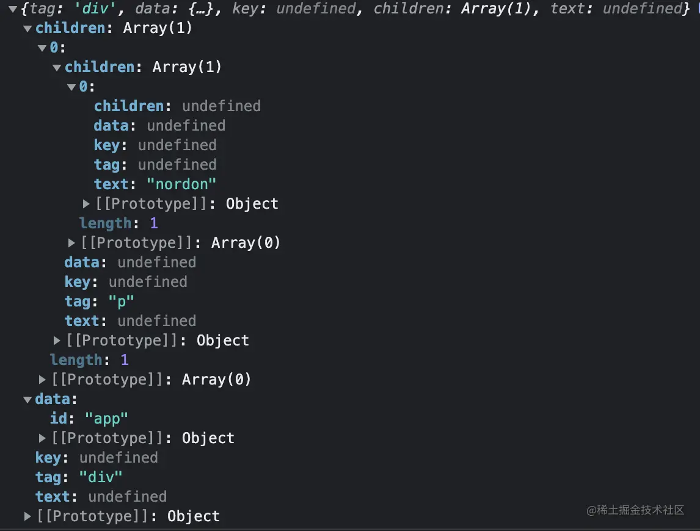

在Vue的渲染流程中，render函数绝对是核心流程，AST和虚拟DOM在生成render函数的过程中扮演着重要的角色，部分前端初学者容易将AST和虚拟DOM混淆。因此在本文主要介绍一下两者以及为何使用虚拟DOM

## 概念差异
AST语法树概念
:::tip
抽象语法树(Abstract Syntax Tree)，简称AST,它是源代码语法结构的一种抽象表示。它以树状的形式表现编程语言的语法结构，树上的每个节点都表示源代码中的一种结构
:::

虚拟DOM概念
:::tip
Virtual DOM(虚拟DOM)，是由**普通的JS对象来描述DOM对象**，因为不是真实的DOM对象，所以叫Virtual DOM
:::

通过概念可以总结:AST是对原生语法结构的描述，虚拟DOM是对于DOM节点的描述，两者共同点都是使用对象来进行描述

## 结构差异
现在有一个一段HTML
```html
<div id="app">
    <p>{{name}}</p>
</div>
```
在Vue中生成的对应AST
```js
{
  "type": 1,
  "tag": "div",
  "attrsList": [
    {
      "name": "id",
      "value": "app",
      "start": 5,
      "end": 13
    }
  ],
  "attrsMap": {
    "id": "app"
  },
  "rawAttrsMap": {
    "id": {
      "name": "id",
      "value": "app",
      "start": 5,
      "end": 13
    }
  },
  "children": [
    {
      "type": 1,
      "tag": "p",
      "attrsList": [],
      "attrsMap": {},
      "rawAttrsMap": {},
      "parent": "[Circular ~]",
      "children": [
        {
          "type": 2,
          "expression": "_s(name)",
          "tokens": [
            {
              "@binding": "name"
            }
          ],
          "text": "{{name}}",
          "start": 22,
          "end": 30,
          "static": false
        }
      ],
      "start": 19,
      "end": 34,
      "plain": true,
      "static": false,
      "staticRoot": false
    }
  ],
  "start": 0,
  "end": 41,
  "plain": false,
  "attrs": [
    {
      "name": "id",
      "value": "\"app\"",
      "start": 5,
      "end": 13
    }
  ],
  "static": false,
  "staticRoot": false
}
```
在Vue中生成的对应render函数
```js
_c("div", {
    attrs: {
        "id": "app"
    }
}, [_c('p', [_v(_s(name))])])
```
虚拟DOM通过调用render函数中的_c、_v等函数创建，最终形式如下图



## 选择虚拟DOM原因
为何Vue选择使用虚拟DOM而不是直接使用真实的DOM呢？

1. 保证性能下线

    首先真实的DOM上包含了太多无用的属性，使用虚拟DOM可以大大的减少不必要的属性存在，可以很好地释放内存的压力

    其实操作真实DOM是非常消耗性能的一件事情，由于JS是单线程，当我们去操作DOM的时候无论是获取还是更改一些属性的时候，都会引起浏览器的render,若是频繁或者不恰当的操作DOM则会引起严重的性能问题，因为直接操作DOM的代价是非常大的。采用虚拟DOM可以将全部的修改一次性的更新到页面，不用修改一次而导致浏览器render一次

    虽然虚拟DOM很好，但是并不说其真的拥有很好的性能，不能盲目夸虚拟DOM性能，因为在大量的虚拟DOM进行diff算法比较的时候并不能很好的保证性能

2. 提高开发体检

    想一想在刀耕火种或者JQ时代我们前端被DOM支配的恐怖，不用操作DOM是一件多么幸福的事情，Vue释放了我们直接操作DOM的双手，让我可以去做更多的事情

3. 跨端

    由于虚拟DOM的存在，Vue不仅可以用于浏览器，还在小程序、weex等领域发光发热