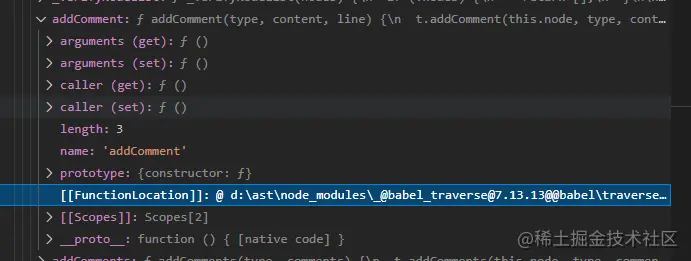

## 前言
在之前学习中，多次碰到AST。例如：webpack、Taro、前端的逆向调试(碰到变态的混淆)、以及一些自己开发的玩具。但每次都是前面学完很久不用，后面就忘记了。官方文档虽然写的非常详实， 但是每次重读一遍确实令人揪心。这次决定，写下来一些，以免忘记。也给大家分享下。我们着重于动手操作，概念可以根据文末的参考文献及工具章节有比我更详尽的解释。
:::tip
说到AST语法树，离不开Babel，它的工作流可以用下面的一张图来表示，代码首先经由babylon解析成抽象语法树(AST),后经一些遍历和分析转换(主要过程),最后根据转换后的AST生成新的常规代码。
:::


AST语法树长这样


## 准备
以下列出来的清淡，是开启本文的前置条件
- ES6
- ndoejs以及vscode(熟悉并了解node脚本调试方式)
- babel
- 深刻明白仔细阅读文档的重要性

### 开始准备环境
1. mkdir AST_TEST
2. cnpm init -y
3. cnpm i @babel/generator @babel/parser @babel/traverse @babel/types --save
4. touch index.js

<span style="color: red">package.json注意加一个type: 'module',开启我们的ESM模块写法(注意node版本)</span>

其他没啥好讲的，解释下四个包到底干啥的
- <span style="color: blue">[@babel/parse](https://babeljs.io/docs/en/babel-parser):解析Javascript代码为AST结构(解析包)</span>
- <span style="color: blue">[@babel/traverse](https://babeljs.io/docs/en/babel-traverse): 转换AST结构为自己需要的(转换包)</span>
- <span style="color: blue">[@babel/types](https://babeljs.io/docs/en/babel-types)： AST结构有些复杂，这个工具包帮助生成那些复杂语法对象</span>
- <span style="color: blue">[@babel/generator](https://babeljs.io/docs/en/babel-generator): 解析AST对象为Javascript代码(生成包)</span>

@babel/types是辅助宝，其他的三个分别对应了我们AST的三个步骤：解析-转换-生成。后面我们根据这三个步骤展开

## 解析
我们先修改index.js运行如下代码
```javascript
import parser from '@babel/parse';
const { parse } = parser;
const code = `var square = function(n) {
    return n * n;
}`
const ast = parse(code);
console.log(ast.program.body);
```
我们先使用了一个Javascript转为AST结构，接下来打印出来的东西，如果第一次看到，也许有点懵逼


可以看到信息量很大，这里我们先只关注熟悉的内容。先看花括号，我们要记住一点：<span style="color:red">一个花括号就是一个Node。</span>每个Node都包含有一个重要的属性，就是type

### 借助astexplorer
[astexplorer.net/](https://astexplorer.net/)强烈推荐这个网址，我们可以直接在线查看这段代码的AST语法树结构，并且支持多种编程语言


如红线所示区域，我讲一些不重要的内容隐藏了起来(也有用，只是此处忽略)。这样一来，我们可以着重观察属性，分别代表什么？

网站给出的demo代码
```javascript
let tips = [
  "Click on any AST node with a '+' to expand it",

  "Hovering over a node highlights the \
   corresponding location in the source code",

  "Shift click on an AST node to expand the whole subtree"
];

function printTips() {
  tips.forEach((tip, i) => console.log(`Tip ${i}:` + tip));
}
```


首先映入眼帘的是：Program这个对象，身上有一个sourceType,它有两个取值，一个是module，另一个是script。意思想必也猜到了，一个是模块化的Javascript，另一个是脚本形式的。

接下来body属性是一个数组，里面包含了一个变量声明(VariableDeclaration)和函数声明(FunctionDeclaration)。分别对应我们代码里面的两大块

### 开始分析
**<span style="color: blue">变量声明(VariableDeclaration)</span>**

完全展开后，大概是长成这个样子:
- kind："val" | 'let' | 'const'(必填)
- declarations: VariableDeclarator形式的数组(必填)

那么VariableDeclarator里面又是什么呢？
- id:标示符
- init: 表达式或者为空都可以

**<span style="color: blue">函数声明(FunctionDeclaration)</span>**为了简单期间，我这里简化了demo代码
```javascript
function printTips() {
    return 1;
}
```
此时AST如下图所示


- id:标识符(可选，可以为空)
- params:数组标识符(必填)
- body:块语句(必填)
在块语句里面，又包含了一个return语句，参数为1

### 如何查阅
刚刚我们将了那两个声明，我想你已经心里开始嘀咕，这么多都要记住吗？

当然不可能记住了，我们需要依赖文档进行查询，还记得前面提到的四个包吗？有一个包叫[@babel/types](https://babeljs.io/docs/en/babel-types)。点进去看看，是不是一目了然？所有的语句定义以及他们各自的interface都可以找到


## 转换
接下来这里是一个大章节，这里也是我们平时动手脚最多的地方。按照其他技术大佬的惯例，我们先来一个剪头函数转匿名函数的(ES6->ES5)的demo

大家先行体会，我们再来解释
```javascript
// index.js
import parse from '@babel/parser';
import traverse from '@babel/traverse';
import generate from '@babel/generator';

const code = `
var a = () => 'Hello,我是段需要转化的代码'
`;

const ast = parser.parse(code);

traverse.default(ast, {
    ArrowFunctionExpression(path) {
        var func = t.functionExpression(
            null, 
            [], 
            t.blockStatement([t.returnStatement(path.node.body)])
        )
        path.replaceWith(func)
    }
})
const res = generate.default(ast);
consolel.log(res.data)
```
看到代码肯定很懵，不要着急，从<span style="color:blue">const ast = parser.parse(code);</span>这段开始，我们前面都讲过了。终点逻辑在于
```javascript
traverse.default(ast, {
    ArrowFunctionExpression(path) {
        var func = t.functionExpression(
           null,
            [],
            t.blockStatement([t.returnStatement(path.node.body)])
        )
        path.replaceWith(func)
    }
})
```
### Visitor
在转化的过程中，我们要牢记一个叫做<span style="color:blue;font-weight:bold">Visitor(访问者)</span>的概念

每个被解析的语法都会被遍历，在这个过程中遇到了例如：箭头函数，变量声明等等，就会运行里面的逻辑

可以理解为是一个钩子函数，触发写好的逻辑。例如上面的代码里面：ArrowFunctionExpression类型就会被触发里面的逻辑。

如果想要每个都触发，有对应的：enter(进入遍历)和exit(退出遍历)两个钩子。同时每个钩子函数里面都有这两个小钩子
```javascript
traverse.default(ast, {
    ArrowFunctionExpression: {
        enter(path) {
            console.log('Entered!');
        },
        exit(path) {
            console.log('Exited!')
        }
    }
})
```
会先触发enter在触发exit.一般来说不推荐使用全局触发，尽量以精确的方式定位到节点。如果你需要同时指定多种类型为统一个逻辑可以这样写
```javascript
traverser.default(ast, {
    ['ArrowFunctionExpression|Identifier'](path) {
        console.log(path.node.type)
    }
})
```
当剪头函数和标识符出现的时候，就会触发！需要查询哪些钩子，？同样在前面给出的<span style="color:blue">@babel/types</span>都可以找到

### Path
这里一定要注意， path 和前面说的 AST 节点，不要搞混，是两个人，尽管是亲戚关系。也许官方的教程里面并没有强调（但意思也说明了）。
:::tip
Path是表示两个节点之间连接的对象
:::
我们拿它作为修改AST语法树的一个途径。要讲明白这个东西，我们必须要在vscode里面来做一个详细的调试，上图


属性非常多，里面都是关于路径操作和路径相关的信息。 我们重点看：
- node节点
- parentPaht父节点
- scope作用域


可以看到，node里面包含的就是我们平时最需要的一些内容。在回到前面的代码里
```javascript
traverse.default(ast, {
    ArrowFunctionExpression(path) {
        var func = t.functionExpression(
           null,
            [],
            t.blockStatement([t.returnStatement(path.node.body)])
        )
        path.replaceWith(func)
    }
})
```
我用t对象调用，也就是<span style="color:blue">@babel/types</span>这个工具包里的，来对照生成一个普通的匿名函数。你可能会有疑问，这是怎么写出来的，？答案是vsocode


当我们使用某个句子的时候，就会有提示输入的参数。关于使用什么句式比较好，可以直接用[astexplorer](https://astexplorer.net/)在线一转就知道了！

我们对path进行操作，就可以实现我们想要的一些逻辑。例子里面我就使用了 path.replaceWith 这个方法。

除此之外还有例如：
- path.toString() 转换为代码
- path.traverse() 递归的形式消除全局状态([官网](https://github.com/jamiebuilds/babel-handbook/blob/master/translations/en/plugin-handbook.md#toc-state)例子已经不错了)
- path.get() 更加方便的拿到路径，例如： path.get('body.0');可以理解为path.node.body[0]这样的形式，但是注意仅路径可以这样操作，访问属性是不允许的！
- path.isXX() XX为节点类型，可以判断是否符合节点类型。(types包也可以)
- path.getFunctionParent() 查找最接近的父函数或程序
- path.getStatementParent() 向上遍历语法树，直到找到在列表中的父节点路径
- path.findParent((path) => path.isObjectExpression()) 对于每一个父路径调用callback并将其NodePath当作参数，当callback返回真值时，则将其NodePath返回。
- path.find((path) => path.isObjectExpression()) 如果也需要遍历当前节点
- path.inList 来判断路径是否有同级节点，
- path.getSibling(index) 来获得同级路径,
- path.key 获取路径所在容器的索引,
- path.container 获取路径的容器（包含所有同级节点的数组）
- path.listKey 获取容器的key
- path.skip() 不往下遍历，跳过该节点
- path.stop() 停止遍历
- path.replaceWithMultiple() 替换多个节点，传入数组
- path.replaceWithSourceString() 用字符串替换源码
- path.insertBefore(); 在此节点之前插入节点
- path.insertAfter();在此节点之后插入节点
- path.remove();删除节点

关于path的常规操作非常多，尽管我列出来了这些但很可惜，我并没有找到完整的文档去把每一个方法介绍的非常清楚。这里我给出的方法


在这个path对象的prototype上挂载了非常多的函数，replaceWith就是其中之一，通过这种方式查询大概可以了解它的用法


展开后也可以找到它的代码实现地方，参照源码查看使用。举例，path.addComment方法，源码核心逻辑如下
```js
function addComments(node, type, comments) {
    if(!comments || !node) return node;
    const key = `${type}Comments`;

    if(node[key]) {
        if(type === 'leading') {
            node[key] = comments.concat(node[key]);
        } else {
            node[key] = comments.concat(comments);
        }
    } else {
        node[key] = comments;
    }
    return node;
}
```


根据断点调试可知，第一个参数必然是注释类型，第二个参数是注释的内容，第三个控制多行和单行注释。甚至我们可以手工直接加，也是生效的
```js
path.node.leadingComments = [
            {
              type: "CommentBlock",
              value: "这是我的一段注释2",
            },
        ]
```
### Scope

<span style="color:red">待写完....</span>
## 生成
关于生成其实没什么好说的，前往[@babel/generator](https://babeljs.io/docs/en/babel-generator)查阅更多
```javascript
const res = generate.default(ast);
console.log(res);
```
## 笔记
### generateUid系列API真香
之前只是知道它可以自动创建变量而已，并没有发现，在这里排上大用
```javascript
// 等待转换的代码如下
var n = 123; // 外部作用域n
function square(n) {
    return n * n; // 内部作用域n
}
console.log(n);
```
需要将这两个n分别重命名
```javascript
import parser from '@babel/parser';
import traverse from '@babel/traverse';
import generate from '@babel/generator';
import t from '@babel/types';

const code = `
var n = 123
function square(n) {
    return n * n;
}
console.log(n)
`;
const ast = parser.parse(code);
traverse.default(ast, {
    ['FunctionDeclaration|VariableDeclaration'](path) {
        path.scope.rename('n',path.scope.generateUid())//如果这里不用生成uid，而是写死某个值，那就实现不了这个功能！
    }
})

const res = generate.default(ast)
console.log(res.code)
```
最后输出
```javascript
var _temp = 123;
function square(_temp2) {
  return _temp2 * _temp2;
}
console.log(_temp);
```


## 资料
[Rollup体验Tree-sharking树摇](/front-end/engineering/study-tool3-1.html#rollup体验tree-sharking树摇)

[抽象语法树 AST](https://coldstone.fun/post/2021/04/26/learn-ast/)

[JavaScript AST入坑指南](https://juejin.cn/post/6945392689655316494)