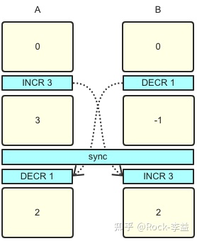
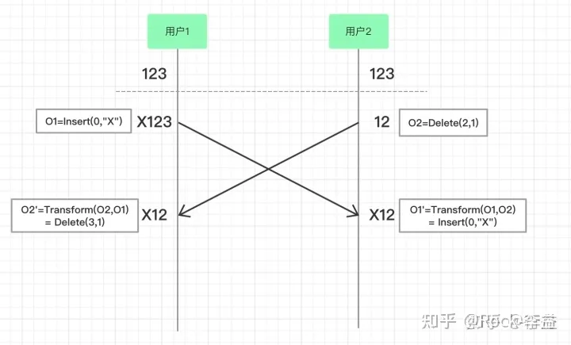

## 前言
CRDT跟OT算法都刷用于解决数据最终一致性

## 需求场景
1. 协同领域，如多人协同文档，国内有飞书、有道云、腾讯文档，国外有google docs
2. 去中心化领域，如去中心化数据库，国内有p2pdb、国外有orbit-db

## CRTD介绍
:::tip
CRTD(Conflict-Free Replicated Data Type 无冲突的复制数据类型),是各种基础数据结构最终一致算法的理论总结，能根据一定的规则自动合并，解决冲突，达到强最终一致的效果，CRDT并不是单一一种协议，而是一系列的协议组成的协议族，只要满足一下三个规律的算法都可以成为CRDT算法
:::
- 幂等律 A ∪ A = A

- 交换律 A∪B=B∪A （并集） A ∩ B = B ∩ A （交集）

- 结合律 (A∪B )∪C =A∪( B∪C )

以实现一个分布式加减计算器举例子，我们采用Op-based counter算法

...
--- 
## OT介绍
:::tip
OT算法的全称是Operation Transformation(操作转换),是在线协同系统中经常使用的操作合并算法。一开始只是用来解决在线文档多人操作的合并的问题，后来随着它的理论知识的完善应用到了更多领域，不过在线文档仍然是典型场景之一，OT算法是一种操作合并指导思想，是一类算法，在不同的应用场景下有不同实现。
:::
一般存在三个操作
- retain保持不变
- insert 插入字符串
- delet 删除字符串

如上图，两个用户在浏览器中打开了同一个在线文档，文档的初始内容是“123”。

1、用户1和用户2同时操作，用户1的操作是O1=Insert(0,"X")，表示在位置0，插入字符串X；

2、用户2的操作是O2=Delete(2,1)，表示从第二个位置开始删除元素，删除长度是1。

3、用户1浏览器中字符串先变成“X123”，O2操作到达用户1的浏览器之后，和O1发生转换O2'=Transform(O2,O1)= Delete(3,1)

4、O2'虽然也是执行删除操作，但是因为O1已经插入了X字符串，所以删除的位置+1，O2'变成了删除起始位置为3的元素，删除长度是1。对“X123”执行O2'操作，用户1本地的字符串变成“X12”。

5、用户2浏览器中字符串先变成“12”，O1操作到达用户2的浏览器之后，和O2发生转换O1'=Transform(O1,O2)=Insert(0,"X")

6、因为O2删除的元素是从第二个位置开始的，对O1'添加元素没有影响，所以O1'=O1。对“12”执行O1'操作，用户2本地的字符串变成“X12”。

总结: OT通过转换方法产生一个新的操作，使当前字符串应用到转换算法之后两个浏览器的内容保持一致。

### 相同场景，我们尝试用CRDT的Last Write Win来实现
1、假设我们按照服务器的时间戳，在服务器端对用户1跟用户2的两个写入操作进行排序，以最后到达的为最先的，并保存在链表中。

2、将操作顺序广播给用户1跟用户2,使得用户1跟用户2按照服务器的广播的操作顺序执行

3、由于网络延迟等的原因，步骤1 同样无法保证达到服务端的操作顺序一定是真实按照用户意图进行排序的。

总结： CRDT的强最终一致性的，是使所有客户端看到相同内容，并不能保证事件发生的顺序是按照用户真实意图。

## 两者区别
1. **这两种方法之间的一个非常简单的区别是OT尝试转换索引位置以确保收敛(所有客户端最终都具有相同的内容)，而CRDT使用通常不涉及索引转换的数学模型，如链表**
2. **OT通常在文本协同编辑领域，但是一般强依赖有中心服务器，而CRDT更适合分布式系统，不需要中心服务器，每个客户端都可以有独立的版本，如git**

## 总结
OT跟CRDT的算法都刷实现强最终一致性的算法，但是由于网络先后达到的顺序问题，并不能完全保证顺序是按照真是的用户意图发生，OT跟CRDT都刷为了让所有的节点看到相同的内容(这个内容的顺序可能不符合用户的真是意图)

## 资料
[CRDT跟OT算法的具体差异](https://zhuanlan.zhihu.com/p/528093574)

[多人协同编辑技术的演进](https://juejin.cn/post/7030327005665034247#heading-0)