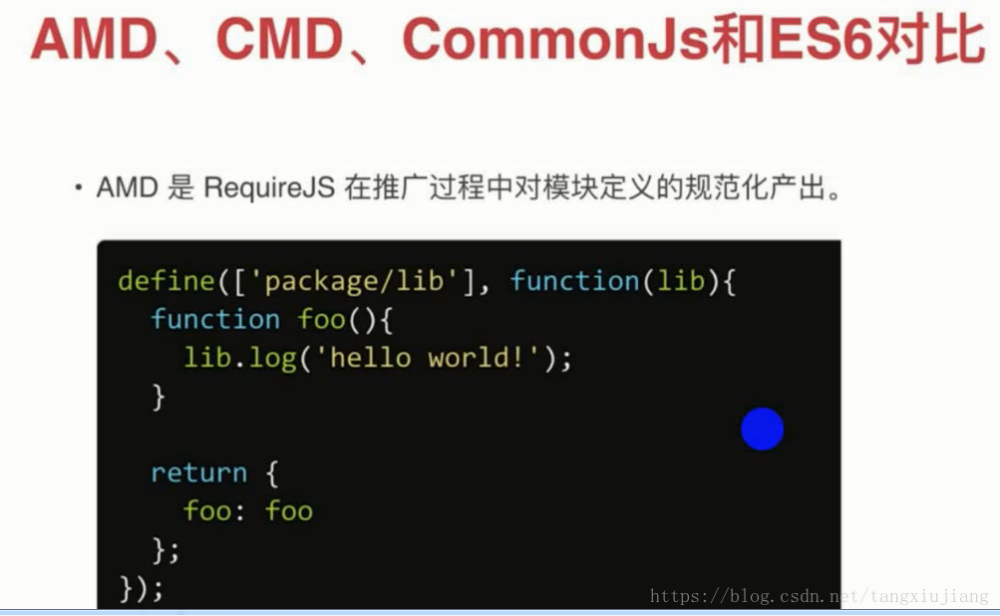
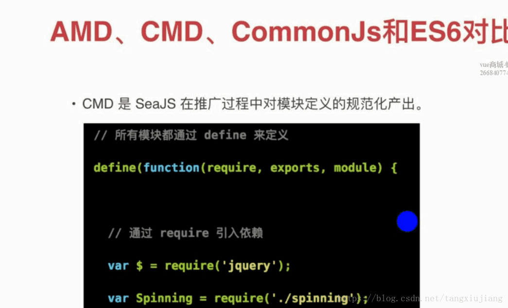
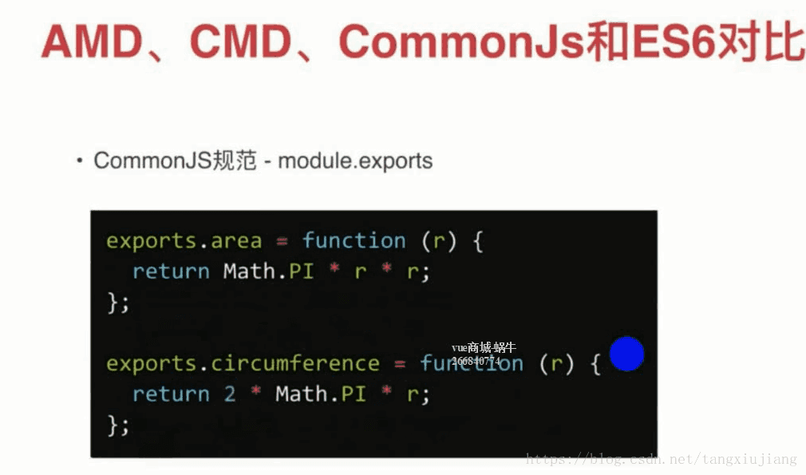
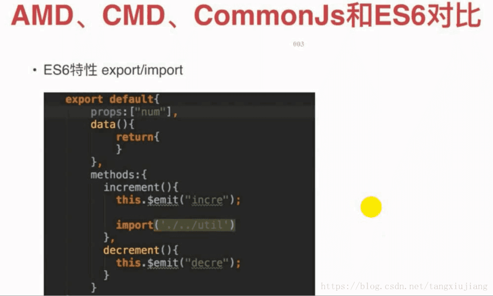

他们都是用于模块化定义中使用的,ADM/CDM/Commonjs是ES5中提供的模块化编程的方案,import/export是ES6中定义新增的。

## UMD 
UMD 叫做**通用模块定义规范（Universal Module Definition）** 也是随着大前端的趋势所诞生，它可以通过运行时或者编译时让同一个代码模块在使用 CommonJs、CMD 甚至是 AMD 的项目中运行。未来同一个 JavaScript 包运行在浏览器端、服务区端甚至是 APP 端都只需要遵守同一个写法就行了。

它没有自己专有的规范，是集结了 CommonJs、CMD、AMD 的规范于一身，我们看看它的具体实现：

```javascript
((root, factory) => {
    if (typeof define === 'function' && define.amd) {
        //AMD
        define(['jquery'], factory);
    } else if (typeof exports === 'object') {
        //CommonJS
        var $ = requie('jquery');
        module.exports = factory($);
    } else {
        root.testModule = factory(root.jQuery);
    }
})(this, ($) => {
    //todo
});
```

不难发现，<span style="color: blue">它在定义模块的时候会检测当前使用环境和模块的定义方式，将各种模块化定义方式转化为同样一种写法</span>。它的出现也是前端技术发展的产物，前端在实现跨平台的道路上不断的前进，UMD 规范将浏览器端、服务器端甚至是 APP 端都大统一了，当然它或许不是未来最好的模块化方式，未来在 ES6+、TypeScript、Dart 这些拥有高级语法的语言回代替这些方案。


## AMD-异步模块定义
AMD是RequireJS在推广过程中对模块定义的规划化产出，它是一个概念，RequireJS是对这个概念的实现，就好比Javascript语言是对ECMAScript规范的实现。AMD是一个组织,RequierJS是在这个组织下自定义的一套脚本语言



RequireJS:是一个AMD框架，可以异步加载JS文件，按照模块加载方法，通过define函数定义，第一个参数是一个数组,里面定义一些需要依赖的包，第二个参数是一个回调函数，通过变量来引用模块里面的方法，最后通过return来输出。

是一个依赖前置、异步定义的AMD框架(在参数里面引入js文件),在定义的同时如果需要用到别的模块，在最前面定义好即在参数数组里面引入，在回调里面加载

## CMD
CMD是Seajs在推广过程中对模块定义的规范化产出，是一个同步模块定义，是SeaJS的一个标准，Seajs是CMD概念的一个实现，SeaJS是淘宝团队提供的一个模块开发js框架



通过define()定义，没有依赖前置，通过require加载jquery插件，CMD是依赖就近，在什么地方使用就在什么地方require插件，即用即返，这是一个同步概念

## CommonJS

CoomonJS规范-- 是通过module.exports定义，在前端浏览器里面并不支持module.exports,通过node.js后端使用的。Nodejs端是使用CommonJs规范的，前端浏览器一般使用AMD/CMD/ES6等定义模块化开发的



输出方式有2种:默认输出--module export 和带有名字的输出-- exports.area

### exports和module.exports的区别
为了更好的理解exportsh嗯module.exports的关系 我们先来补点js基础
```javascript
var a = {name: 'xz 1'};
var b = a;

console.log(a);
console.log(b);

b.name = 'xz 2'
console.log(a);
console.log(b)

var b = {name: 'xz 3'};
console.log(a);
console.log(b)
```
运行结果
```javascript
{name: 'xz 1'}
{name: 'xz 1'}
{name: 'xz 2'}
{name: 'xz 2'}
{name: 'xz 2'}
{name: 'xz 3'}
```

解释一下: a是一个对象，b是对a的引用，即a和b指向同一个对象，即a和b指向同一块内存地址，所以前两个输出一样。当对b做修改时，即a和b指向同一块内存地址的内容发生了改变，所以a也会体现出来.所以第三四个输出一样。<span style="color: red">**当对b完全覆盖时，b就指向了一块新的内存地址(并没有对原先的内存块做修改)，a还是指向原来的内存块，即a和b不再指向同一块内存，也就是说a和b已无关系，所以最后两个输出不一样**</span>

明白了上述例子后，我们进入整体。我们只需要知道三点即可知道exports和module.exports的区别了

1. <span style="color: blue">exports是指向module.exports的引用</span>
2. <span style="color: blue">module.exports的初始值为一个空对象{},所以exports初始值也是{}</span>
3. <span style="color: blue">require()返回的是module.exports而不是exports();</span>

所以
```javascript
var name = 'nswbmw';
exports.name = name;
exports.sayName = function() {
    console.log(name);
}
```
给exports赋值其实是给module.exports这个空对象添加了两个属性而已，上面代码相当于
```javascript
var name = 'nswbmw';
module.exports.name = name;
module.exports.sayName = function() {
    console.log(name);
}
```
- 使用exports

```javascript
//circle.js
exports.area = function(r) {
    return r * r * Math.PI;
}

// app.js
var circle = require('./circle');
console.log(circle.area(4));
```
- 使用module.exports

```javascript
// area.js
module.exports = function(r) {
    return r * r * Math.PI
}

//app.js
var area = require('./area');
console.log(area(4));
```

上面两那个例子输出一样的。你也许会问，为什么不这样写呢？

```javascript
// area.js
exports = function(r) {
    return r * r * Math.PI
}
// app.js
var area = require('./area');
console.log(area(4));
```
运行上面的例子会报错。这是因为，前面的例子中通过给exports添加属性，只是对exports指向的内存做了修改，而
```javascript
exports = function(r) {
    return r * r * Math.PI;
}
```
其实是对exportsj你行了覆盖,也就是说exports指向了一块新的内存(内存为一个计算圆面试的函数)，也就是说exports和module.exports不再指向同一块内存，也就说此时exports和module.exports毫无关系，也就是说module.exports指向的那块内存并没有做任何改变，仍为以个空对象{},也就是说area.js导出了一个空对象，所以我们在app.js中调用area(4)会报TypeError:Object is not a function错误

所以一句话总结：**<span style="color: blue">当我们想让模块导出的是一个对象时，exports和module.exports均可使用(但exports也不能重新覆盖为一个新的对象)，而当我们想导出非对象接口时，就必须也只能覆盖module.exports</span>**

我们经常看到这样的写法
```javascript
exports = module.exports = somethings
// 等价于
module.exports = somethings
exports = module.exports;
```

<span style="color: blue">**因也很简单， module.exports = somethings 是对 module.exports 进行了覆盖，此时 module.exports 和 exports 的关系断裂，module.exports 指向了新的内存块，而 exports 还是指向原来的内存块，为了让 module.exports 和 exports 还是指向同一块内存或者说指向同一个 “对象”，所以我们就 exports = module.exports**。</span>

## ES6
ES6特性,模块化--export/import对模块进行导出导入的



## web component


## 文档
[什么是 CommonJs](https://www.jianshu.com/p/7bdba4dfa7e5)

[什么是 CMD](https://www.jianshu.com/p/aaa82b4346d0)

[什么是 AMD](https://www.jianshu.com/p/263ca3d04ea0)

[前端模块化总结](https://zhuanlan.zhihu.com/p/75980415)

[AMD&CMD区别](https://www.zhihu.com/question/203515072)