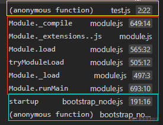

## CommonJS规范
JS是一种直译式脚本语言,也就是一遍编译一遍运行，所以没有模块的概念。因此CommonJS是为了完善JS在这方面的缺失而存在的一种规范

CommonJS定义了两个主要概念
- <span style="color: red">require函数，用于导入模块</span>
- <span style="color: red">module.exports变量，用于导出模块</span>

然而这两个关键字，浏览器都不支持，所以我认为这是为什么浏览器不支持CommonJS的原因。如果一定要在浏览器上使用CommonJS,那么就需要一些编译库，比如browserify来帮助我们将CommonJS编译成浏览器支持的语法，其实就是实现require和exports.

## Nodejs中CommonJS模块的实现
### require
导入，代码很简单， let { count, addCount } = require('./utils') 就可以了。

那么在导入的时候发生了些什么呢？<span style="color: red">**首先肯定是解析路径，系统给我们解析出一个绝对路径**,我们写的相对路径是给我们看的，绝对路径是给系统看的，毕竟绝对路径那么长，看着费力，尤其是当我们的项目在N个文件夹之下的时候。所以require的第一件事是解析路径</span>，我们可以写的很简洁，只需要写出相对路径和文件名即可，后缀都可以省略，让require帮我们去匹配寻找。<span style="color: red">**也就是说require的第一步是解析路径获取到模块内容**</span>

如果是核心模块，比如fs，就直接返回模块

如果是带有路径如/,./等等，则拼接处一个绝对路径，然后先读取缓存require.catch在读取文件。如果没有加后缀，则自动加后缀然后一一识别

1. js解析为Javascript文本文件
2. json解析JSON对象
3. node解析为二进制插件模块

首次加载后的模块会缓存在require.cache之中，所以多次加载require，得到的对象是同一个。

在执行模块代码的时候，会将模块包装成如下模式，以便作用域在模块范围内
```js
(function(exports, require, module, __filename, __dirname) {
    // 模块的实际代码在这里
})
```
[node.js官方解释](http://nodejs.cn/api/modules.html#modules_all_together)

### module
那么require触发的module做了些什么呢？我们看看用法，先写一个简单的导出模块，写好了模块之后，只需要把需要导出的参数，加入module.exports就可以了
```js
let count = 0;
function addCount() {
    count++;
}
module.exports = { count, addCount }
```
然后根据require执行代码时需要加上的，那么实际上我们的代码长成这样：
```js
(function(exports, require, module, __filename, __dirname) {
  let count=0
  function addCount(){
    count++
  }
  module.exports={count,addCount}
});
```


根据这个断点，我们可以整理出

黄色圈出来的是require，也就是我们调用的方法

红色圈出来的是Module的工作内容
```js
Module._compile
Module.extesions..js
Module.load
tryMouduleLoad
Module._load
Module.runMain
```
蓝色圈出来的是nodejs干的事，也就是NativeModule，用于执行module对象。

我们都知道在JS中，函数的调用栈stack的方式，也就是先进后出，也就是require这个函数触发之后，图中的运行时从上到下运行的。也就是蓝色框最先运行.我把他的部分代码扒出来，研究研究

NativeModule原生关键代码，这一块用于封装模块的
```js
NativeModule.wrap = function(script) {
    return NativeModule.wrapper[0] + script + NativeModule.wrapper[1];
}
NativeModule.wrapper = [
    '(function (exports, require, module, __filename, __dirname) { ',
    '\n});'
];
```
等NativeModule触发Module.runMain之后，我们的模块加载开始了，我们按照从下至上的顺序来解读吧。

。。。

### 总结
这些代码看得人真的很晕，<span style="color: red">其实主要流程就是require之后解析路径，然后触发Module这个类，然后Model的_load的方法就是在当前模块中创建一个新module的缓存，以保证下一次在require的时候可以直接返回而不用再次执行。然后就是这个新module的load方法载入并通过VM执行代码返回对象给reuqire</span>

<span style="color: red">**正因为是这样编译运行之后赋值给的缓存，所以export的值是一个参数，而不是函数，那么如果当前参数的数值改变并不会引起export的改变，因为这个赋予export的参数是静态的，并不会引起二次运行**</span>


## 资料
[读懂CommonJS的模块加载](https://juejin.cn/post/6844903685466619911)