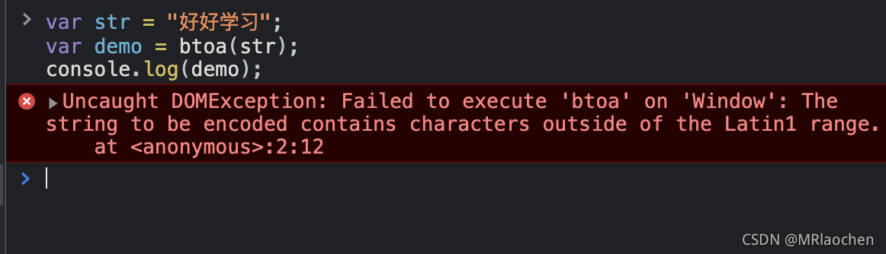

## 前言
btoa和atob是window对象的两个函数，其中
- <span style="color: red">btoa: 是binary to ascii,用于将binary的数据用ascii码表示，即Base64的编码过程</span>
- <span style="color: red">atob: 是ascii to binary，用于将ascii码解析成binary数据，即Base64的解码过程</span>

## btoa
binary to ascii,用于将ascii字符串或二进制数据转换成一个base64编码过得字符串表示，即Base64的编码过程，常用于编码字符串
```js
var str = 'hello world';
var demo = btoa(str);
console.log(demo); // aGVsbG8gd29ybGQ=
```
> <span style="color: red">**注意：btoa不能编辑Unicode字符**</span>
```js
var str = '好好学习';
var demo = btoa(str);
console.log(demo); // Uncaught xxxxxx
```
上面操作，此时会报错，翻译过来就是：无法在“Window”上执行“btoa”：要编码的字符串包含超出 Latin1 范围的字符。



## atob
ascii to binary，用于解码一个已经被base-64编码过得数据，即解码Base64编码的字符串

```js
let demo = 'aGVsbG8gd29ybGQ=';
var str = atob(demo);
console.log(str); // hello world
```
## Unicode字符编码
刚才上面的例子中我们相对Unicode字符编码进行编码，直接使用btoa不行的，所以我们使用encodeURIComponent和decodeURIComponent方法。

因为btoa仅支持ASCII字符序列，所以我们要先使用encodeURIComponent，将中文字符编码转变为ASCII字符序列

:::tip
编码时，先用encodeURIComponent对字符串进行编码，再用btoa进行Base64编码；
解码时，先用atob对Base64编码的船进行解码，在用decodeURIComponent对字符串进行解码

注意：
- 编码的过程：Unicode字符 -------> 先encodeURI -------> 再btoa编码
- 解码的过程：先atob解码 -------> 再decodeURI -------> Unicode字符
:::

```js
// 编码
var str = '好好学习';
var demo = btoa(encodeURIComponent(str));
console.log(demo); // JUU1JUE1JUJEJUU1JUE1JUJEJUU1JUFEJUE2JUU0JUI5JUEw

// 解码
var demo = 'JUU1JUE1JUJEJUU1JUE1JUJEJUU1JUFEJUE2JUU0JUI5JUEw'

var str1 = decodeURIComponent(atob(demo))

console.log(str1)//好好学习
```
不过虽然达到了曲线救国的目的，但是由于encodeURLComponent 和 decodeURIComponent 已经达到了转义控制字符的目的，使用atob和btoa感觉是多此一举

## IE低版本处理方式
在使用atob和btoa这两个函数时需要注意的是，IE9是不支持的(虽然现在都是面向Chrome浏览器编程)。

我们使用第三方Base64工具：webtoolkit.base64是一个第三方实现的 Base64 编码工具，完美的支持 unicode 编码的字符串。
```js
Base64.encode('中文')//"5Lit5paH"

Base64.decode('5Lit5paH');//"中文"
```


## 资料
[window对象的函数btoa和atob](https://blog.csdn.net/MRlaochen/article/details/120284076)