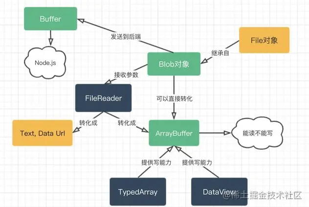
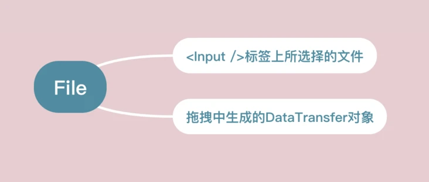
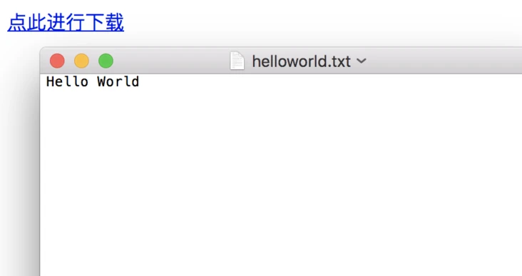
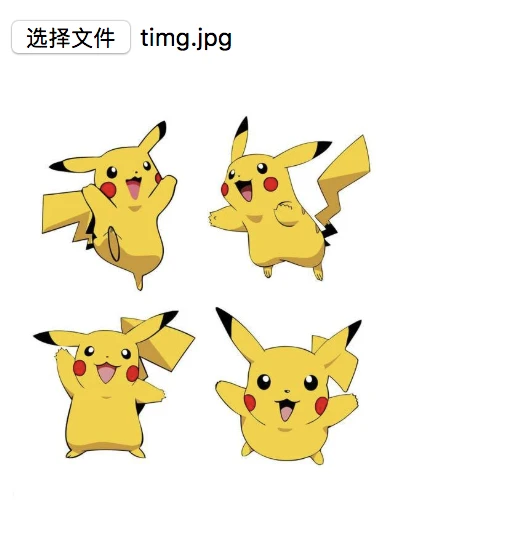
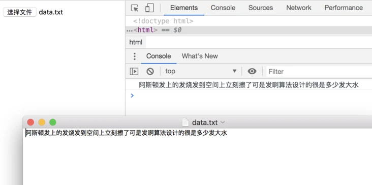
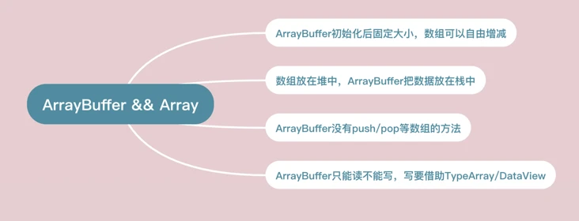
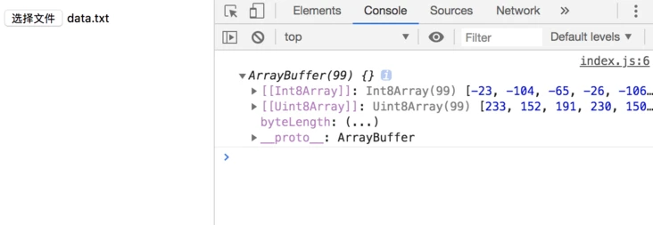
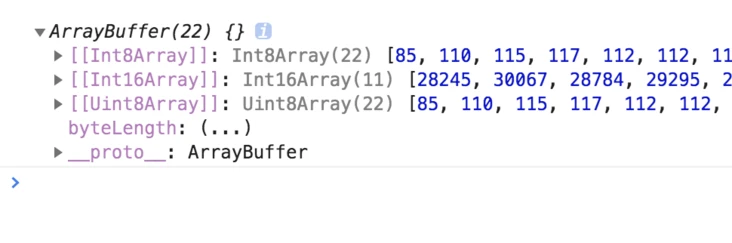
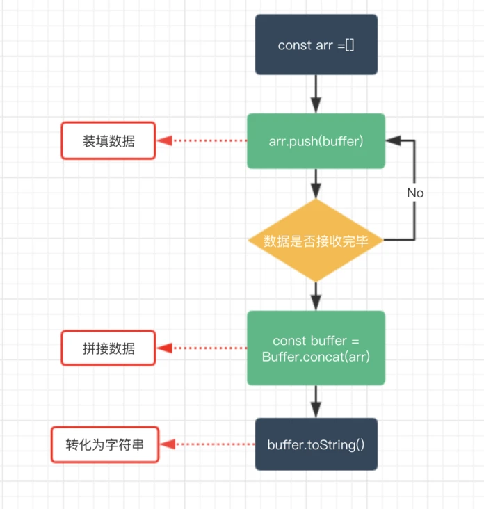

Blob、ArrayBuffer和Buffer都是前端二进制数据

- <span style="color: red">**Blob:** 前端的一个专门用于支持文件操作的二进制对象</span>
- <span style="color: red">**ArrayBuffer:** 前端的一个通用的二进制缓冲区，类似数组，但是API和特性上有诸多不同</span>
- <span style="color: red">**Buffer:** Node.js提供的一个二进制缓冲区，常用来处理I/O操作</span>  

他们三者的关系如下图所示



demo--读取
```js
let myBlobParts = ['<html><h2>Hello Semlinker</h2></html>']; // an array consisting of a single DOMString
let myBlob = new Blob(myBlobParts, {type : 'text/html', endings: "transparent"})
const reader = new FileReader();
reader.onload = function() {
    const content = reader.result;
    console.log(content)
}
reader.readAsText(myBlob);
```

## Blob
我们首先来介绍Blob,Blob是用来支持文件操作的。简单的说：<span style="color: blue">在JS中，有两个构造函数File和Blob，而File继承了所有Blob的属性</span>

<span style="color: blue">所以在我们看来，File对象可以看做一种特殊的Blob对象。</span>

在前端工程中，我们在哪些操作中可以获取File对象呢？请看


> 目前File API规范的状态为Working Draft

我们上面说了,File对象是一种特殊的Blob对象，那么它自然就可以直接调用Blob对象的方法。让我们看一看Blob具体有哪些方法，以及能收用他实现哪些功能


### Blob实战
<span style="color: blue">通过window.URL.createObjectURL方法可以把一个blob转化为一个Blob URL,并且用作文件下载或者图片显示的链接</span>

Blob URL所实现的下载或者显示等功能，仅仅可以在单个浏览器内部进行。而不能在服务器上进行存储，亦或者说它没有在服务器端存储的意义

下面是一个Blob的例子，可以看到它很短
```js
blob:d3958f5c-0777-0845-9dcf-2cb28783acaf
```
<span style="color: blue">**和冗长的Base64格式的Data URL相比，Blob URL的长度显然不能够存储足够的信息，这也就意味着它只是类似于一个浏览器内部的『引用』。从这个角度看Blob URL是一个浏览器自行制定的一个伪协议**</span>

### Blob下载文件
<span style="color: blue">我们可以通过window.URL.createObjectURL,接受一个Blob(File)对象，将其转化为Blob URL,然后赋给a.download属性，然后在页面上点击这个链接就可以实现下载了</span>

```html
<!-- html部分 -->
<a id="h">点击进行下载</a>
<!-- js部分 -->
<script>
    var blob = new Blob(['Hello World']);
    var url = window.URL.createObjectURL(blob);
    var a = document.getElementById('h');
    a.download = 'helloworld.txt';
    a.href = url;
</script>
```
> download属性不兼容IE，对IE可通过window.navigator.msSaveBlob方法或其他进行优化(IE10/11)

运行结果



### Blob图片本地显示
window.URL.createObjectURL生成的Blob URL还可以赋给img.src，从而实现图片的显示
```html
<!-- html部分 -->
<input type="file" id="f"/>

<!-- js部分 -->
<script>
    document.getElementById('f').addEventListenter('change', (e) => {
        var file = e.files[0];
        const img = document.getElementById('img');
        const url = window.URL.createObjectURL(file);
        img.src = url;
        img.onload = function() {
            // 释放一个之前通过调用URL.createObjectURL创建的URL对象
            window.URL.revokeObjectURL(url)
        }
    })
</script>
```
运行结果



### Blob文件分片上传
<span style="color: blue">通过Blob.slice(start, end)可以分割大Blob为多个小Blob</span>

<span style="color: blue">xhr.send是可以直接发送Blob对象的</span>
- 前端

    ```html
    <!-- html部分 -->
    <input type="file" id="f">
    <!-- js部分 -->
    <script>
        function upload(blob) {
            var xhr = new XMLHttpRequest();
            xhr.open('POST', '/ajax', true);
            xhr.setRequestHeader('Content-type', 'text/plain');
            xhr.send(blob);
        }
        document.getElementById('f').addEventListener('change', function(e){
            var blod = this.files[0];
            const CHUNK_SIZE = 20;
            const SIZE = blob.size;
            let start = 0;
            let end = CHUNK_SIZE;
            while(start < SIZE) {
                upload(blob.slice(start, end));
                start = end;
                end = start + CHUNK_SIZE;
            }
        }, false)
    </script>
    ```
- Node端

    ```js
    app.use(async (ctx, next) => {
        await next();
        if (ctx.path === '/ajax') {
            const req = ctx.req;
            const body = await parse(req);
            ctx.status = 200;
            console.log(body);
            console.log('------')
        }
    })
    ```
- 文件内容

    According to the Zhanjiang commerce bureau, the actual amount of foreign capital utilized in Zhanjiang from January to October this year was

    运行结果

    

### 本地读取文件内容
<span styl="color: red">如果想要读取Blob或者文件对象并转化为其他格式的数据，可以借助FileReader对象的API进行操作</span>
- FileReader.readAsText(Blob): 将Blob转化为本文对象
- FileReader.readAsArrayBuffer(Blob): 将Blob转为ArrayBuffer格式数据
- FileReader.readAdDataURL(): 将Blob转化为Base64格式的Data URL

下面我们尝试把一个文件的内容通过字符串的方式读取出来
```js
<input type="file" id="f"/>

document.getElementById('f').addEventListener('change', function(e) {
    let file = this.files[0];
    const reader = new FileReader();
    reader.onload = function() {
        const content = reader.result;
        console.log(content)
    }
    reader.readAsText(file)
}, false)
```
运行结果


<span style="color: red">上面介绍了Blob的用法，我们不难发现，Blob是针对文件的，或者说它就是一个文件对象，同时呢我们发现Blob欠缺对而精致数据的细节操作能力，比如如果要具体修改某一部分二进制数据，Blob显然就不够用了，而这种细粒度的功能则可以有下面介绍的ArrayBuffer来完成</span>

## ArrayBuffer
让我们用一张图看下ArrayBuffer的大体功能


同时要说明，ArrayBuffer跟JS的原生数组有很大的区别，如图



### 通过ArrayBuffer的格式读取本地数据
```js
document.getElementById('f').addEventListener('change', function(e) {
    const file = this.files[0];
    const fileReader = new FileReader();
    fileReader.onload = function() {
        const content = fileReader.result;
        console.log(content)
    }
    fileReader.readAsArrayBuffer(file)
})
```
运行结果



### 通过ArrayBuffer的格式读取Ajax请求数据
<span style="color: blue">通过xhr.responseType = "arraybuffer"指定响应的数据类型</span>

在onload回调里打印xhr.response
- 前端
    ```js
    const xhr = new XMLHttpRequest();
    xhr.open('GET', '/ajax', true);
    xhr.responseType = 'arraybuffer';
    xhr.onload = function() {
        console.log(xhr.response);
    }
    xhr.send();
    ```
- Node端

    ```js
    const app = new Koa();
    app.use(async (ctx) => {
    if (pathname = '/ajax') {
            ctx.body = 'hello world';
            ctx.status = 200;
    }
    }).listen(3000)
    ```
运行结果


### 通过TypeArray对ArrayBuffer进行写操作
```js
const typedArray1 = new Int8Array(8);
typedArray1[0] = 32;

const typedArray2 = new Int8Array(typedArray1);
typedArray2[1] = 42;

console.log(typedArray1);
//  output: Int8Array [32, 0, 0, 0, 0, 0, 0, 0]
 
console.log(typedArray2);
//  output: Int8Array [32, 42, 0, 0, 0, 0, 0, 0]
```
### 通过DataView对ArrayBuffer进行写操作
```js
const buffer = new ArrayBuffer(16);
const view = new DataView(buffer);
view.setInt8(2, 42);
cosnole.log(view.getInt8(2))
// 输出42
```

## Buffer
Buffer是Node.js提供的对象，前端没有。它一般应用于IO操作，例如接收前端请求数据时候，可以通过以下的Buffer的API对接收到的前端数据进行整合



🌰：

Node端
```js
const app = new Koa();
app.use(async (ctx, next) => {
    if (ctx.path === '/ajax') {
        const chunks = [];
        const req = ctx.req;
        req.on('data', buf=> {
            chunks.push(buf);
        })
        req.on('end', () => {
            let buffer = Buffer.concat(chunks);
            console.log(buffer.toString())
        })
    }
})
app.listen(3000)
```
前端
```js
const xhr = new XMLHttpRequest();
xhr.open("POST", "ajax", true);
xhr.setRequestHeader('Content-Type', 'text/plain')
xhr.send("asdasdsadfsdfsadasdas");
```
运行结果

Node端输出
```
asdasdsadfsdfsadasdas
```

## 资料
[一些方法](/wander/Work/common.html)

[流文件下载](/front-end/JavaScript/a-site-blob.html)

[聊聊JS的二进制家族：Blob、ArrayBuffer和Buffer](https://segmentfault.com/a/1190000040678647)

[JS的二进制家族：Blob、ArrayBuffer和Buffer | 8月更文挑战](https://juejin.cn/post/6992205283732766750)

[拖拽献祭中的黑山羊-DataTransfer对象](https://www.zhangxinxu.com/wordpress/2018/09/drag-drop-datatransfer-js/)