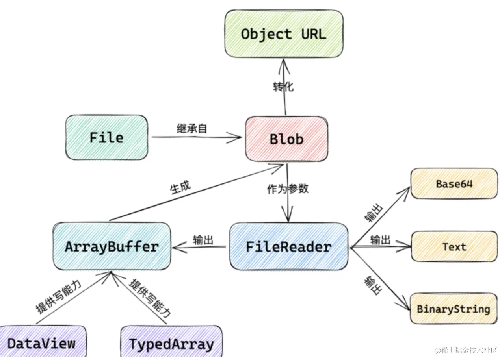
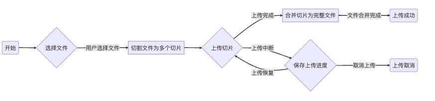
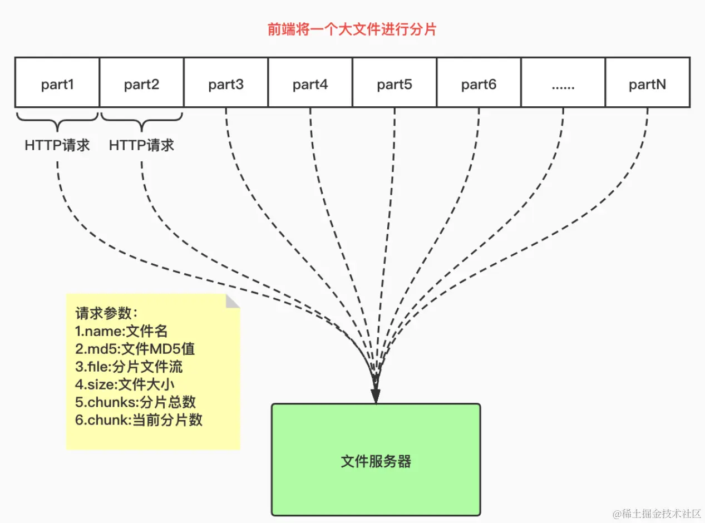

## 前端文件流操作
在前端开发中，文件流操作是指通过数据流的方式处理文件，对文件进行读取、写入和展示等操作。

### 数据流和文件处理的基本概念
数据流是指连续的数据序列，可以从一个源传输到另一个目的地。在前端开发中，文件可以被看做数据流的一种形式，可以通过数据流的方式进行处理。文件处理涉及读取及写入文件的操作，包括读取文件的内容、写入数据到文件，以及对文件进行删除、重命名等操作。

### Blob对象和ArrayBuffer：处理二进制数据
在前端处理文件时，经常需要处理二进制数据。Blob(Binary Large Object)对象用来表示二进制数据的一个借口，可以存储大量的二进制数据。<span style="color: red">Blob对象可以通过构造函数进行创建，也可以通过其他API生成，例如通过 FormData 对象获取上传的文件。</span>而ArrayBuffer 是JavaScript中的一个对象类型，用于表示一个通用的、固定长度的二进制数据缓冲区。我们可以通过 ArrayBuffer 来操作和出来二进制数据。代码如下
```js
import React, { useState } from 'react';

function FileInput() {
    const [fileContent, setFileContent] = useState('');

    // 读取文件内容到ArrayBuffer
    return new Promise((resolve, reject) => {
        const reader = new FileReader();

        // 注册文件读取完成后的回调函数
        reader.onload = function(event) {
            const arrayBuffer = event.target.result;
            resolve(arrayBuffer);
        }

        // 读取文件内容到ArrayBuffer
        reader.readAsArrayBuffer(file);
    })
}

// 将ArrayBuffer转换为十六进制字符串
function arrayBufferToHexString(arrayBuffer) {
    const uint8Array = new Uint8Array(arrayBuffer);
    let hexString = '';
    for(let i = 0; i < uint8Array.length; i++) {
        const hex = uint8Array[i].toString(16).padStart(2, '0');
        hexString += hex;
    }
    return hexString;
}

// 处理文件选择事件
function handleFileChange(event) {
    const file = event.target.files[0];

    if(file) {
        readFileToArrayBuffer(file).then(arrayBuffer => {
            const hexString = arrayBufferToHexString(arrayBuffer);
            setFileContent(hexString);
        }).catch(error => {
            console.log('文件读取失败: ' + error);
        })
    } else {
        setFileContent('请选择一个文件');
    }
}

return (
    <div>
        <input type="file" onChange={handleFileChange}/>
        <div>
            <h4>文件内容：</h4>
            <pre>{fileContentg}</pre>
        </div>
    </div>
)

export default FileInput;
```
上面代码里,我们创建了一个名为FileInput的函数式组件。该组件包含一个文件选择框和一个用于显示文件内容的&lt;pre&gt;元素。当用户选择文件时，通过FileReader将文件内容读取为ArrayBuffer,然后将ArrayBuffer转换为十六进制字符串，并将结果显示在页面上。

### 使用FileReader 进行文件读取
FileReader是前端浏览器提供的一个API，用于读取文件内容。通过FileReader，我们可以通过异步方式读取文件，并将文件内容转换为可用的数据形式。比如文件数据或二进制数据。FileReader提供了一些读取文件的方法。例如readAsText()、readAsArrayBuffer()等，可以根据需要选择合适的方法来读取文件内容

### 将文件流展示在前端页面中
一旦我们成功的读取了文件内容，就可以将文件流展示在前端页面上。具体的展示方式取决于文件的类型。例如，对于文本文件，可以直接将其内容显示在页面的文本框或区域中；对于图片文件，可以使用 &lt;img&gt; 标签展示图片；对于音视频文件，可以使用 &lt;video&gt; 或 &lt;audio&gt; 标签来播放。 通过将文件流展示在前端页面上，我们可以实现在线预览和查看文件内容的功能。

好的，这一部分就基本介绍完毕，总结一下。前端文件操作流是处理大型文件的一种常见方式，他可以通过数据流的方式对文件进行操作。Blob对象 和 ArrayBuffer是处理二进制数据的重要工具。而FileReader则是读取文件内容的的关键组件。通过这些技术，我们可以方便的在前端页面上进行操作或者文件展示。

## 文件切片下载
这一步就进入到我们今天文章主题了，先来主要的看下流程



### 传统文件下载的性能问题
文件切片下载是一种提升文件下载效率的技术，通过将大文件分割成多个小片段(切片),并使用多个并发请求同时下载这些切片，从而加快整体下载速度。

传统的文件下载对于大文件来说存在性能问题。当用户请求下载一个大文件时，服务器需要将整个文件发送给客户端。这会导致一下几个问题
1. 较长的等待时间：大文件需要较长的时间来传输到客户端，用户需要等待很长时间才能开始使用文件
2. 网络阻塞：由于下载过程中占用了网络带宽，其他用户可能会遇到瞎子啊速速慢的问题。
3. 断点续传困难：如果下载过程中出现网络故障或者用户终端下载，需要重新下载整个文件，无法继续之前的下载进度。

### 利用文件切片提升下载效率



文件切片通过将文件分割成多个小片段，每个片段大小通常在几百KB到几MB之间。然后客户端通过多个并发请求同时下载这些片段。这样做的好处是：
1. 快速启动：客户端可以快速下载，因为只需要下载第一个切片即可
2. 并发下载：通过使用多个并发请求下载切片，可以充分利用带宽，并提高整体下载速度
3. 断点续传：如果下载中断，客户端只需要重新下载中断切片，而不需要重新下载整个文件，切片上传示例

```js
const [selectedFile, setSelectedFile] = useState(null);
const [pregress, setProgress] = useState(0);

// 处理文件选择事件
function handleFileChange(event) {
    setSelectedFile(event.target.files[0]);
}

// 处理文件上传事件
function handleFileUpload() {
    if(selectedFile) {
        // 计算切片数量和每个切片的大小
        const fileSize = selectedFile.size;
        const chunkSize = 1024 * 1024;
        const totalChunks = Math.ceil(fileSize / chunkSize);

        // 创建FormData对象，并添加文件信息
        const formData = new FormData();
        formData.append('file', selectedFile);
        formData.append('totalChunks', totalChunks);

        // 循环上传切片
        for(let chunkNumber = 0; chunkNumber < totalChunks; chunkNumber++) {
            const start = chunkNumber & chunkSize;
            const end = Math.min(start + chunkSize,fileSize);
            const chunk = selectedFile.slice(start, end);
            formData.append(`chunk-${chunkNumber}`, chunk, selectedFile.name);
        }

        // 发起文件上传请求
        axios.post('/upload', formData, {
            onUploadProgress: progressEvent => {
                const progress = Math.round((progressEvent.loaded / progressEvent.total) * 100);
                setProgress(progress);
            }
        }).then(response => {
            console.log('文件上传成功:', reponse.data);
        }).catch(error => {
            console.error('文件上传失败:', error)
        })
    }
}
```
当设计到切片上传和下载时，前端使用的技术通常是基于前端库或框架提供的文件处理功能，结合后端服务实现

上面代码我们提到了文件如何切片上传
- 当用户选择文件后,通过handleFileChange函数处理文件选择事件，将选择的文件保存在 selectedFile状态中。
- 当用户点击上传按钮，通过 handleFileUpload 函数处理文件上传事件
- 在 handleFileUpload 函数中，计算切片数量和每个切片的大小，并创建一个 FormData 对象用于存储文件信息和切片数据

### 实现客户端切片下载的方案
实现客户端切片下载的基本方案如下
1. 服务端将单文件切割成多个切片，并为每个切片生成唯一的标示符
2. 客户端发送请求获取切片列表，同时开始下载第一个切片
3. 客户端在下载过程中，根据切片列表发起并发请求下载其他切片，并逐渐拼接合并下载的数据
4. 当所有切片都下载完成后，客户端将下载的数据合并为完整的文件

```js
function downloadFile() {
    // 发起文件下载请求
    fetch('/download', {
        method: 'GET',
        headers: {
            'Content-Type': 'application/json'
        }
    })
    .then(response => response.json())
    .then(data => {
        const totalSize = data.totalSize();
        const totalChunks = data.totalChunks;

        let downloadedChunks = 0;
        let chunks = [];

        // 下载每个切片
        for(let chunkNumber = 0; chunksNumber < totalChunks; chunkNumber++) {
            fetch(`/download/${chunkNumber}`, {
                method: 'GET',
            })
            .then(response => response.blob())
            .then(chunk => {
                downloadedChunks++;
                chunks.push(chunk);

                // 当所有切片都下载完成时
                if(downloadedChunks === totalChunks) {
                    // 合并切片
                    const mergedBlob = new Blob(chunks);
                    // 创建对象 URL，生成下载链接
                    const downloadUrl = window.URL.createObjectURL(mergedBlob);

                    // 创建<a>元素并设置属性
                    const link = dowument.createElement('a');
                    link.href = downloadUrl;
                    link.setAttribute('download', 'file.txt');

                    //模拟点击下载
                    link.click();
                    // 释放资源
                    window.URL.revokeObjectURL(downloadUrl);
                }
            })
        }
    }).catch(error => {
        console.log('文件下载失败：', error)
    })

}
```
我们看下代码，首先使用 BLOB 对象创建对象URL，用于生成下载链接，然后创建a标签并设置href的属性为刚刚创建的对象URL,继续设置a标签的download属性为文件名，方便点击的时候自动下载文件

### 显示下载进度和完成状态
为了显示下载进度和完成状态，可以在客户端实现以下功能：
1. 显示进度条:客户端可以通过监听每个切片的下载进度来计算整体下载进度，并实时更新进度条显示
2. 显示完成状态: 当所有切片都下载完成后，客户端可以显示下载完成的状态，例如显示一个完成的图标或者文本

这里我们可以继续接着 切片上传代码示例 里的继续可以
```js
// 处理文件下载事件
function handleFileDownload() {
    axios.get('/download', {
        responseType: 'blob',
        onDownloadProgress: progressEvent => {
            const progress = Math.round((progressEvent.loaded / progressEvent.total) * 100);
            setProgress(progress);
        }
    }).then(response => {
        // 创建一个临时的URL对象用于下载
        cosnt url = window.URL.createObjectUrl(new Blob([response.data]));
        const link = document.createElement('a');
        link.href = url;
        link.setAttribute('download', 'file.txt');
        document.body.appendChild(link);
        link.click();
        document.body.removeChild(link);
    }).catch(error => {
        console.error('文件下载失败:', error)
    })
}

<button onClick={handleFileDownload}>下载文件</button>
<div>进度：{progress}%</div>
```
- 当用户点击下载按钮时，通过 handleFileDownload 函数处理文件下载事件
- 在 handleFileDownload 函数中，使用 axios 库发起文件下载请求，并设置 responseType: 'blob' 表示返回二进制数据
- 通过监听 onDownloadProgress 属性获取下载进度，并更新进度条显示
- 下载完成后，创建一个临时的 URL 对象用于下载，并通过动态创建 &lt;a&gt; 元素模拟点击下载。

## 大文件上传的问题与解决方案
### 传统的文件上传方式存在的问题
- 大文件上传耗时长，容易导致请求超时
- 占用服务器和网络带宽资源，可能影响其他用户的访问速度
- 如果上传终端，需要重新上传整个文件，效率低下
- 难以实现上传进度的显示和控制

### 前端文件切片上传的优势
- 将大文件分割为更小的文件切片，分多次上传，提高上传效率和稳定性
- 提供上传进度的监控和展示，提高用户体验
- 充分利用浏览器的并发上传能力，减轻服务器负担
- 实现断点续传功能，避免重复上传已上传的部分

### 实现切片上传的方法
- 使用Javascript的 File API 获取文件对象，并使用 Blob.prototype.slice() 方法将文件切割为多个切片
- 使用 FormData 对象将切片数据通过AJAX或Fetch API发送到服务器
- 在后端服务器上接收切片并保存到临时存储中，等待后续合并
- 在客户端通过监听上传进度事件，在进度条或提示中展示进度

```js
const [file, setFile] = useState(null);  //用来存放我本地上传的文件

const chunkSize = 1024 * 1024; // 1MB 切片大小

  const upload = () => {
    if (!file) {
      alert("请选择要上传的文件！");
      return;
    }

    const chunkSize = 1024 * 1024; // 1MB

    let start = 0;
    let end = Math.min(chunkSize, file.size);

    while (start < file.size) {
      const chunk = file.slice(start, end);
      
      // 创建FormData对象
      const formData = new FormData();
      formData.append('file', chunk);

      // 发送切片到服务器
      fetch('上传接口xxxx', {
        method: 'POST',
        body: formData
      })
      .then(response => response.json())
      .then(data => {
        console.log(data);
        // 处理响应结果
      })
      .catch(error => {
        console.error(error);
        // 处理错误
      });

      start = end;
      end = Math.min(start + chunkSize, file.size);
    }
  };
  
 return (
    <div>
      <input type="file" onChange={handleFileChange} />
      <button onClick={upload}>上传</button>
    </div>
  );
}
```
在上面的代码中，创建了一个名为Upload的函数组件。它使用了React的useState钩子来管理选中的文件。

通过 onChange 事件监听文件输入框的变化，并在 handleFileChange 函数中获取选择的文件，并更新file状态，

点击“上传”按钮时，调用upload函数。它与之前的示例代码类似，将文件切割为多个大小相等的切片，并使用FormData对象和fetch函数发送切片数据到服务器。

### 实现断点续传技术: 记录和恢复上传状态
- 在前端，可以使用 localStorage 或 sessionStorage 来存储已上传的切片信息，包括已上传的切片索引、切片大小等
- 每次上传千，先检查本地存储中是否存在已上传的切片信息，若存在，则从断点处继续上传
- 在后端，可以使用一个临时文件夹或数据库来记录已接收的切片信息，包括已上传的切片索引、切片大小等
- 在上传完成前，保存上传状态，以便在上传中断后能够恢复上传进度

```js
import React, { useState, useRef, useEffect } from 'react';

function Upload() {
    const [file, setFile] = useState(null);
    const [uploadedChunks, setUploadedChunks] = useState([]);
    const [uploading, setUploading] = useState(false);
    const uploadRequestRef = useRef();

    const handleFileChange =  event=> {
        const selectedFile = event.target.files[0];
        setFile(selectedFile);
    }

    const uploadChunk = chunk => {
        // 创建FormData对象
        const formData = new FormData();
        formData.append('file', chunk);

        // 发送切片到服务器
        return fetch('your-upload-url', {
            method: 'POST',
            body: formData
        })
        .then(response => response.json());
        then(data => {
            console.log(data);
            // 处理相应结果
            return data;
        })
    }

    const upload = async () => {
        if(!file) {
            alert('请选择要上传的文件');
            return;
        }

        const chunkSize = 1024 * 1024; // 1MB
        const totalChunks = Math.ceil(file.size / chunkSize);

        let start = 0;
        let end = Math.min(chunkSize, file.size);

        setUploading(true);

        for(let i = 0; i < totalChunks; i++) {
            const chunk = file.slice(start, end);
            const uploadedChunkIndex = uploadedChunks.indexOf(i);
            if(uploadedChunkIndex === -1) {
                try {
                    const response = await uploadChunk(chunk);
                    setUploadedChunks(prevChunks => [...prevChunks, i]);
                } catch(error) {
                    console.log(error);
                    // 处理错误
                }
            }
            start = end;
            end = Math.min(start + chunkSize, file.size);
        }

        setUploading(false);

        // 上传完毕，清除本地缓存的欺骗信息
        localStorage.removeItem('uploadedChunks');
    }

    useEffect(() => {
        const storedUploadedChunks = localStorage.getItem('uploadedChunks');
        if (storedUploadedChunks) {
            setUploadedChunks(JSON.parse(storedUploadedChunks));
        }
    }, [])

    return (
        <div>
            <input type="file" onChange={handleFileChange}/>
            <button onClick={upload} disabled={uploading}>
                {uploading? '上传中...' : '上传'}
            </button>
        </div>
    )
}
```
首先，使用useState钩子创建了一个 uploadedChunks 状态来保存已上传的切片索引数组。初始值为空数组。

然后,我们使用 useRef 钩子创建了一个 uploadRequestRef 引用，用于存储当前的上传请求。

在 handleFileChange 函数中，我们更新了 file状态以选择要上传的文件。

在 uploadChunk 函数中，我们发送切片到服务器，并返回一个Promise对象来处理相应结果。

在upload函数中，我们添加了断点续传的逻辑。首先，我们获取切片的总量，并设置uploading状态为true来禁用上传按钮。

然后，我们使用for循环遍历所有切片。对于每个切片，我们检查 uploadedChunks 数组中是否已经包含了该索引，如果不包含，则进行上传操作。

在上传切片之后，我们将已上传的切片索引添加到 uploadedChunks 数组，并使用 localStorage 保存已上传的切片信息。

最后，在上传完毕后，我们将 uploading 状态设为false,并清除本地存储的切片信息

## 优化用户体验:切片下载与上传的应用场景
### 后台管理系统中的文件下载和上传
- 文件下载：在后台管理系统中，用户可能需要下载大型文件，如报表、日志文件、数据库备注等。通过将文件切片下载，可以提高下载速度和稳定新个，同时允许用户中断下载并从中断处继续瞎子啊
- 文件上传：后台管理系统中，用户可能需要上传大型文件，如数据导入、文件备份等。使用切片上传可以提高上传效率，分批上传文件切片，并显示上传进度，使用户能够了解上传的状态。

### 图片/视频上传和预览
- 图片上传和预览: 在图片上传场景中，用户可以选择多张图片进行上传。通过切片上传通过切片上传，可以加快图片上传速度，并实时显示上传进度。同时，在上传完成后，可以提供预览功能，让用户可以立即查看上传的图片。
- 视频上传和预览：对于较大的视频文件，切片上传可以确保上传过程可靠且高效。同时，可以实现上传进度的实时展示。上传完成后，通过切片下载技术，用户可以流畅地观看视频，无需等待整个文件下载完成。

### 云存储和云盘应用中的文件操作
- 文件分块上传：云存储和云盘应用通常需要处理大量文件的上传。通过切片上传可以提高上传速度和稳定性，并允许用户中断并继续上传。

- 文件分块下载：当用户需要下载云存储或云盘中的大型文件时，可以使用切片下载技术，加快下载速度并提供中断恢复功能。

- 文件预览和在线编辑：通过将文件切片并进行预览，在线编辑，可以提供更好的用户体验。用户可以在不需完全下载文件的情况下，直接预览和编辑文件。


## 其他
- Blob是现代浏览器中提供的能够装载二进制流(文件)的容器对象
- ArrayBuffer是能够状态Blob(二进制流)数据的原始缓冲区，ArrayBuffer不能直接通过js读写
- TypeArray是ArrayBuffer的一种类数组的视图对象，可以将ArrayBuffer按不同的字节读取成类似数组形式的数据类型，从而可以像读取数据元素一样，实现对Arraybuffer数据的读写。常见的TypeArray包括 Uint8Array、Uint16Array、Uint32Array 等

所以我对三者的理解是：Blob &lt;-&gt;ArrayBuffer &lt;-&gt;TypeArray &lt;-&gt;Array,由于TypeArray和Array有些相似，因此旺旺我会选择在TypeArray这层做处理，下面是相互转换的方法

### websocket接收arrayBuffer
```js
// websocket的情况下二进制流的获取
var svip = 'ws://127.0.0.1:8080';
var ws = new WebSocket(svip);
ws.binaryType = 'arraybuffer';
ws.onmessage = function(e) {
    var message = e.data;
}
```
### blob转arrayBuffer
```js
var bl = new Blob();// bl是要转换的blob
var fr = new FileReader();
fr.onload = function() {
    var ab = this.result;
}
fr.readAsArrayBuffer(bl);
```
### ArrayBuffer to Blob（ArrayBuffer转blob）
```js
var ab = new ArrayBuffer(32);
var blob = new Blob([ab]); // 注意必须包裹[]
```
### ArrayBuffer to Unit8 (ArrayBuffer 转Uint9数组)
```js
var ab = arrayBuffer;// arrayBuffer为要转换的值
var u8 = new Uint8Array(ab)
```
### Uint8 to ArrayBuffer
```js
var u8 = new Uint8Array();
var ab = u8.buffer; // ab即是u8对应的arrayBuffer
```
### Array to ArrayBuffer
```js
var arr = [0x15,0xFF,0x01,0x00,0x34,0xAB,0x11];
var u8 = new Uint8Array(arr);
var ab = u8.buffer;
console.log(ab); // ab为要解析的ArrayBuffer
```

### TypeArray to Array 
```js
var arr = [0x01,0x02,0x00,0x00,0x00,0x00,0x03];
var u8 = new Uint8Array(arr);
console.log(typeof u8.push);
```
TypsArray to array的方法，在ES6中可以用Array.from实现
```js
function Uint8Array2Array(u8a) {
    var arr = [];
    for(let i = 0; i < u8a.length; i++) {
        arr.push(u8a[i]);
    }
    return arr;
}
```