## 背景
<span style="color: red">使用JS的数组时，发现JS的数组可以存放不同类型的元素、并且数组长度是可变的。what？这跟我之前接触的数组不一样啊。**数据结构中定义的数组是定长的、数据类型一致的存储结构**</span>。JS中的数组竟然如此特殊，这也算为什么标题中加了""的原因。带着一脸的懵逼，打开搜索引擎，一探究竟

## 什么是数组
首先来看下什么是数组，下面的图是维基百科对于数组的定义


图中有两个关键的点：<span style="color: blue">**相同类型、连续内存**</span>

这两个关键点先不必深究，继续往下看，下面来结束

看完数据结构中的定义，在看下具体语言中对数组的实现

<span style="color: blue">C、C++、Java、Scala等语言中数组的实现，是通过在内存中划分一串连续的、固定长度的空间，来实现存放一组有限个相同数据类型的数据结构</span>。这里面涉及到几个重要的概念：**连续、固定长度、相同数据类型**，与数据结构中的定义是类似的

### 连续
连续空间存储是数组的特点，下图是数组在内存中的存储示意图
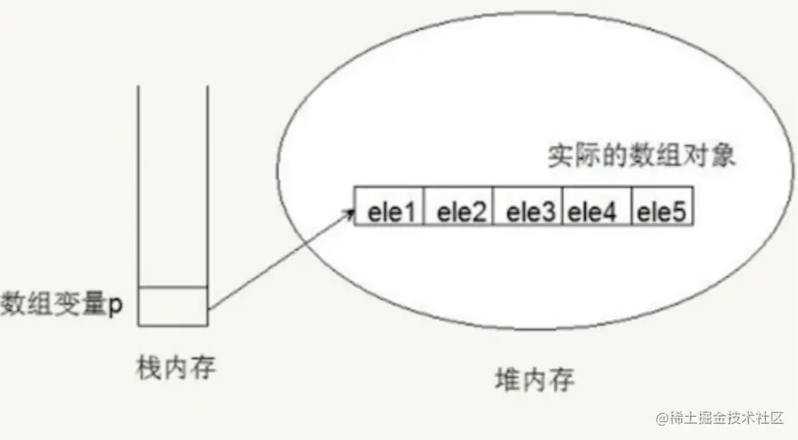

可以明显的看出各元素在内存中是相邻的，是一种线性的存储结构

### 固定长度
因为数组的空间是连续的，这就意味着在内存中会有一整块空间来存放数组，如果不是固定长度，那么村内中韦玉数组之后的区域会没有办法分配，内存不知道数组还要不要继续存放，要使用多长的空间。长度固定，就界定了数组使用内存的界限，数组之外的空间就可以分配给别人使用

### 相同数据类型
因为数组的长度是固定的，如果不是相同数据类型，一会存一个int，一会存一个string，两种不同长度的数据类型，不能保证各自存放几个，这样有悖固定长度的规定，所以也要是相同的数据类型

看到这，相比大部分人应该感觉：嗯，这跟我认识的数据几乎吻合吧

那我们再来点刺激的，进入正才，Javascript中的数组

## Javascript中的数组
先来看下代码
```js
let arr = [100, 12.3, 'red', 'blue', 'green'];
arr[arr.length] = 'black';
console.log(arr.length); // 6;
console.log(arr[arr.length - 1]); // black;
```
这短短几行代码可以看出JS数组非同寻常的地方。第一行代码，数组中竟然存放了三种数据类型?? 第二行代码，竟然向数组中添加了一个值？？第三行和第四行代码验证了，数组的长度改变了，添加的值也生效了

---

除了这些，JS的数组还有很多特殊的地方，比如：

JS数组不止可以存放上面的三种数据类型，它还可以存放数组、对象、函数、Number、undefined、Null、String、Boolean等等。

JS的数组可以表现的像栈一样，为数组提供了push()和pop()方法。也可以表现的像队列一样，使用shift()和unshift()方法，可以像使用队列一样使用数组

看到这里，应该可以看出一点端倪，大胆猜想，JS数组不是基础的数据结构实现的，应该是在基础上面做了一些封装。光猜想不行，搞技术得实事求是，下面开始飙车，一步步验证猜想

## 刨根问底：从V8源码上看数组的实现
Talk is cheap,show me the code.

下面意图是V8中数组的源码

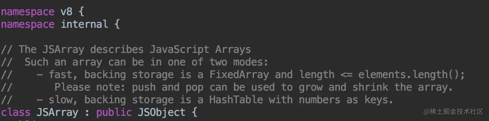

首先，我们看到JSArray是继承自JSObject，也就是说，数组是一个特殊的对象。

那这就好结束为什么JS的数组可以存放不同的数据类型，他是个对象吗，内部也是key-value的存储形式

我们使用这段代码来验证下
```js
let a = [1, 'Hello', true, function() {
    return 1;
}]
%DebugPrint(a) // 调试语句 要加
```
通过jsvu来看一下底层是如何实现的：

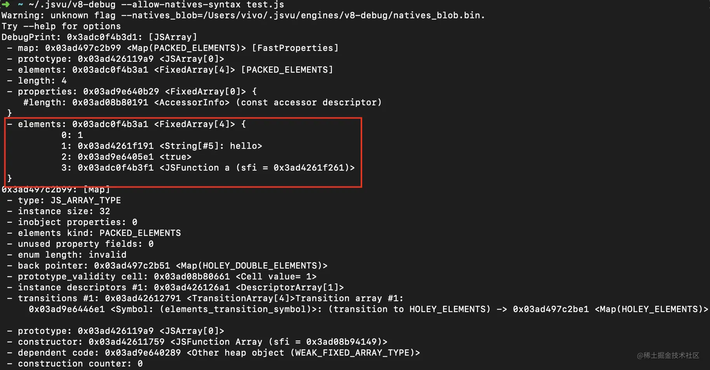

可以看到,底层就是一个Map,key为0， 1,2,3这种索引，value就是数组的元素

<span style="color:red">数组的index其实是字符串</span>

验证完这个问题，我们再继续看上面的V8源码，摩拳擦掌，准备见大招了！ 从注释上可以看出，JS 数组有两种表现形式，fast 和 slow ，啥？英文看不懂？那我让谷歌帮我们翻译好了！

<span style="color: red">**fast**</span>

> 快速的后备存储结构是FixedArray，并且数组的长度<= elements.length()>

FixedArray是V8实现的一个类似于数组的类，它表示一段固定长度的连续内存

<span style="color: red">**slow**</span>

> 缓慢的后备存储结构是一个以数组为键的HahsTable

HahsTable，维基百科中结束的很哈哈
:::tip
散列表(Hash table，也叫哈希表)，是根据键key而直接访问在内存存储位置的数据结构。也就是说，它通过计算一个关于键值的函数，将所需查询的数据映射到表中一个位置来访问记录，这加快了查找速度。这个映射函数称作散列函数，存放记录的数组称散列表
:::

### 快数组（Fast Elements）
<span style="color: blue">快数组是一种线性的存储方式。新创建的空数组，默认的存储方式是快数组，快数组的长度是可变的，可以根据元素的增加和删除来动态调整存储空间大小</span>，内部是通过扩容和收缩机制实现，那来看下源码中是怎么扩容和收缩的

源码中扩容的实现方法(C++)

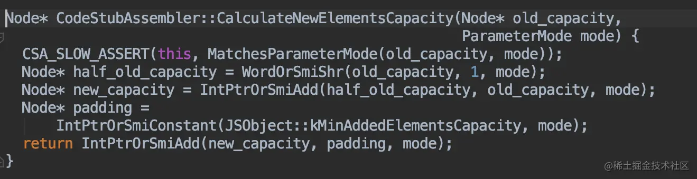

新容量的计算方式

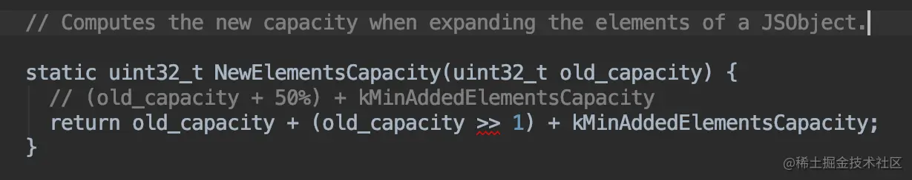

> new_capacity = old_capacity / 2 + old_capacity + 16

也就是，扩容后的新容量 = 旧容量的1.5倍 + 16

扩容后会将数组拷贝到新的内存空间中，源码

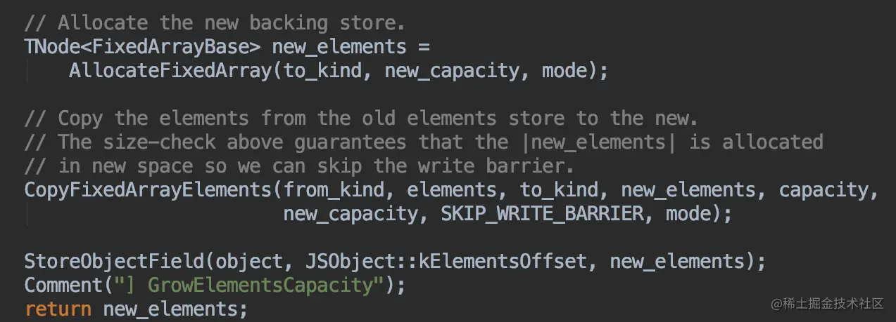

看完了扩容，再来看看当空间多余时如何收缩数组空间。

源码中收缩的实现方法（C++）:

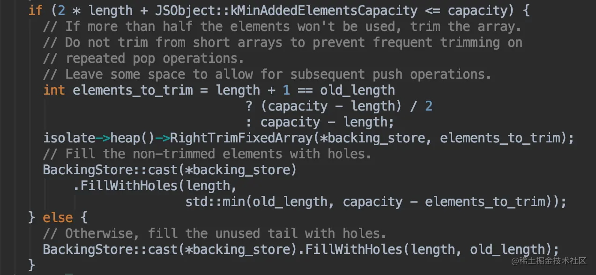

可以看出搜索数组的判断是：如果容量 >= length的2倍 + 16,则进行收缩容量调整，否则用holes对象(什么是holes对象？下面解释)填充未被初始化的位置

如果收缩，那收缩到多大呢？

看上面图中的这段代码

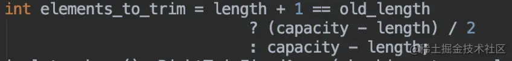

<span style="color: blue">这个elements_to_trim就是需要收缩的大小，需要根据 length + 1 和 old_length 进行判断，是将空出的空间全部收缩掉还是只收缩二分之一。</span>

解释完了扩容和减容，来看下刚刚提到的holes对象。

<span style="color: blue">holes(空洞)对象指的是数组中分配了空间，但是没有存放元素的位置。</span>对于holes，快数组有个专门的模式，在Fast Elements模式中有一个扩展，就是Fastr Holey Elements模式

Fast Holey Elements模式适合于数组中holes(空洞)情况，即只有某些索引存在数据，而其他的索引都没有赋值的情况。

那什么时候会是Fast Holey Elements 模式呢？

当数组中有空洞，没有赋值的数组索引将会存储一个特殊的值，这样在访问这些位置时就可以得到 undefined。这种情况下就会是 Fast Holey Elements 模式。

Fast Holey Elements 模式与Fast Elements 模式一样，会动态分配连续的存储空间，分配空间的大小由最大的索引值决定。
新建数组时，如果没有设置容量，V8会默认使用 Fast Elements 模式实现。

如果要对数组设置容量，但并没有进行内部元素的初始化，例如let a = new Array(10);，这样的话数组内部就存在了空洞，就会以Fast Holey Elements 模式实现。

使用jsvu调用v8-debug版本的底层实现来验证一下：

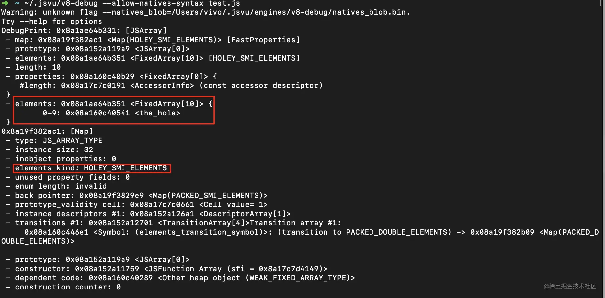

一目了然，HOLEY_SMI_ELEMENTS 就是Fast Holey Elements 模式 。

如果对数组进行了初始化，比如let a = new Array(1,2,3);，这种就不存在空洞，就是以Fast Elements 模式实现。

验证：

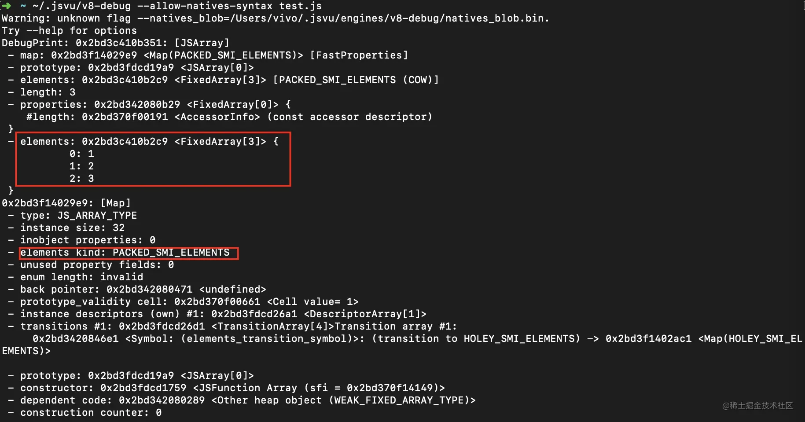

这个PACKED_SMI_ELEMENTS就是Fast Elements 模式。

快数组先到这，再来看下慢数组：

### 慢数组
<span style="color: blue">慢数组是一种哈希表的内存形式。不用开辟大块连续空间，节省了内存，但是由于需要维护一个HashTable，其效率会比快数组低</span>

源码中Dictionary的结构

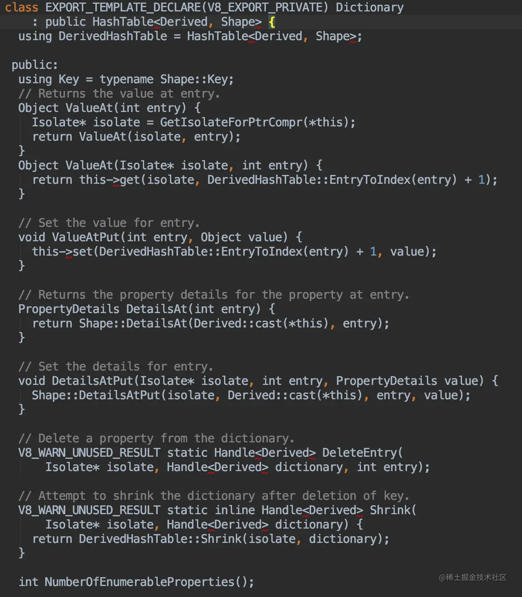

可以看到，内部是一个HashTable，然后定义了一些操作方法，如Java的HashMap类似

那既然有快数组和慢数组，总不能存储结构一成不变吧，也该有具体情况下的快慢数组转换，下面来看一下什么情况下会发生转换。

## 快数组慢数组之间的转换

### 快 -> 慢
首先来看V8中判断数组是否应该转为慢数组的源码

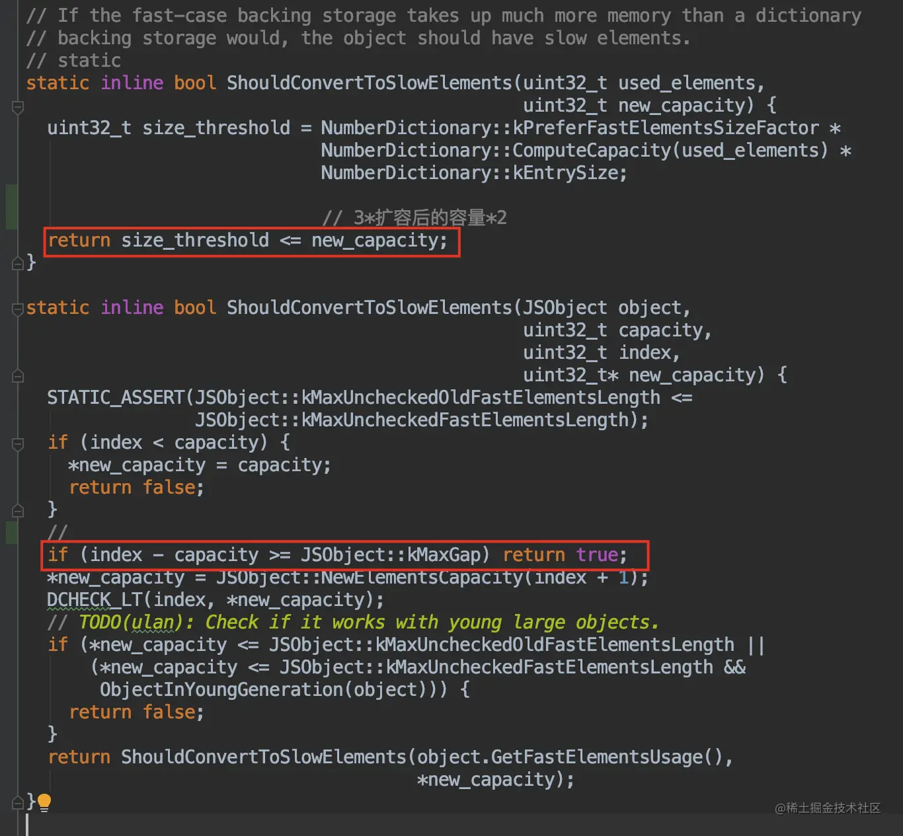

关键代码：
- 新容量 >= 3 * 扩容后的容量 * 2，会转变为慢数组
- 当加入的index - 当前capacity >= kMaxGap(1024)时(也就是至少有1024个空洞)，会转变为慢数组

我们主要来看下第二种关键代码的情况

kMaxGap 是源码中的一个常量，值为1024。

也就是说，当对数组赋值时使用远超当前数组的容量+ 1024时（这样出现了大于等于 1024 个空洞，这时候要对数组分配大量空间则将可能造成存储空间的浪费，为了空间的优化，会转化为慢数组。

```js
let a = [1,2];
a[1030] = 1;
```
数组中只有三个元素，但是却在 1030 的位置存放了一个值，那么中间会有多于1024个空洞，这时就会变为慢数组。

来验证一下
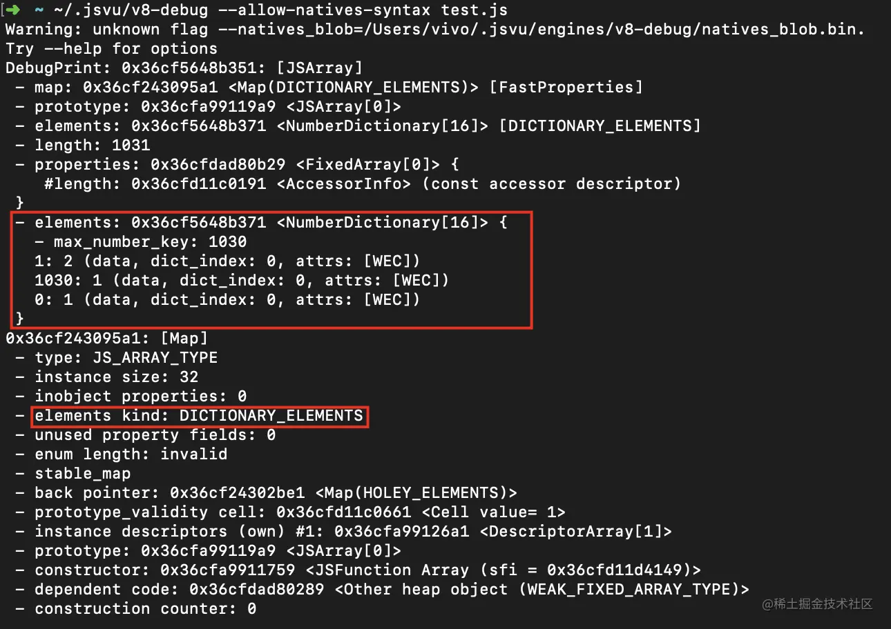

可以看到，此时的数组确实是字典类型了，成功！

好了，看完了快数组转慢数组，再反过来看下慢数组转换为快数组。

### 慢-> 快
处于哈希表实现的数组，在每次空间增长时， V8 的启发式算法会检查其空间占用量， 若其空洞元素减少到一定程度，则会将其转化为快数组模式。

V8中是否应该转为快数组的判断源码：

关键代码：

当慢数组的元素可存放在快数组中且长度在 smi 之间且仅节省了50%的空间,则会转变为快数组

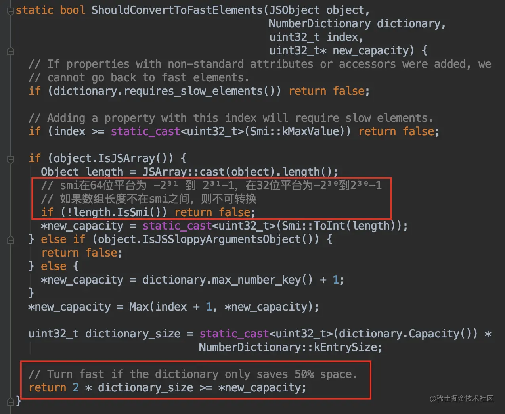

```js
let a = [1,2];
a[1030] = 1;
for(let i = 200; i < 1030; i++) {
    a[i] = i;
}
```
上面我们说过的，在 1030 的位置上面添加一个值，会造成多于 1024 个空洞，数组会使用为 Dictionary 模式来实现。

那么我们现在往这个数组中再添加几个值来填补空洞，往 200-1029 这些位置上赋值，使慢数组不再比快数组节省 50% 的空间，会发生什么神奇的事情呢？

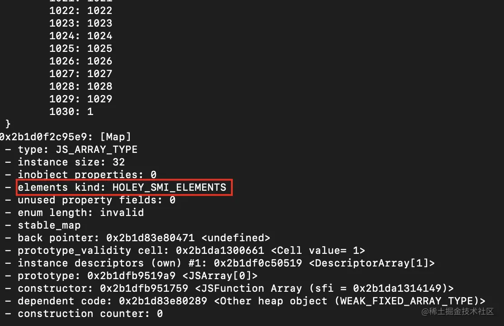

可以看到，数组变成了快数组的 Fast Holey Elements 模式，验证成功。

那是不是快数组存储空间连续，效率高，就一定更好呢？其实不然。

### 个有优劣

<span style="color: blue">快数组就是以空间换时间的方式，申请了大块连续内存，提高效率。 慢数组以时间换空间，不必申请连续的空间，节省了内存，但需要付出效率变差的代价。</span>

## 扩展ArrayBuffer
JS在ES6也推出了可以按照需要分配连续内存的数组，这就是ArrayBuffer。

ArrayBuffer会从内存中申请设定的二进制大小的空间，但是并不能直接操作它，需要通过ArrayBuffer构建一个视图，通过视图来操作这个内存。
```js
var bf = new ArrayBuffer(1024)
```
这行代码就申请了 1kb 的内存区域。但是并不能对 arrayBuffer 直接操作，需要将它赋给一个视图来操作内存。
```js
var b = new Int32Array(bf);
```
这行代码创建了有符号的32位的整数数组，每个数占 4 字节，长度也就是 1024 / 4 = 256 个。

代码验证
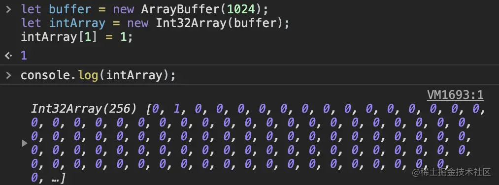

## 总结
看到这，脑瓜子是不是嗡嗡的？喘口气，我们来回顾一下，这篇文章我们主要讨论了这几件事：

1. 传统意义上的数组是怎么样的？
2. Javascript中的数组有哪些特别之处
3. 从V8源码下研究JS数组的底层实现
4. JS数组的两种模式是如何转换的
5. ArrayBuffer

总的来说，JS数组看似与传统数组不一样，其实只是V8在底层实现上了做了一层封装，使用两种数据结构实现数组，通过时间和空间维度的取舍，优化数组的性能

## 资料
[探究JS V8引擎下的“数组”底层实现](https://juejin.cn/post/6844903943638794248)

[使用 jsvu 快速调试 v8](https://www.pipipi.net/questions/13798.html)

[V8中的快属性与内联缓存](https://blog.csdn.net/wmaoshu/article/details/108696679)