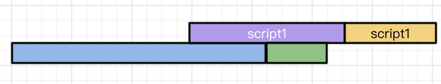

:::tip
script标签用于加载脚本与执行脚本，在前端开发中可以说是非常重要的标签了
**直接使用script脚本的话，html会按照顺序来加载并执行脚本，在脚本加载&执行的过程中，会阻塞后续的DOM渲染**
:::
现在大家习惯于在页面中引用各种的第三方脚本，如果第三方服务商出现一些小问题，比如延迟之类的，就会使得页面白屏。

好在script提供了两种方式来解决上述问题，async和defer,这两个属性使得script都不会阻塞DOM的渲染。

但既然会存在两个属性，那么就说明，这两个属性肯定有差异的

## defer
:::tip
如果script标签设置了该属性，则浏览器会异步的下载该文件并不会影响到后续DOM渲染；
如果有多个设置了defer的script标签存在，则会按照顺序执行所有的script；
**defer脚本会在文档渲染完毕后，DOMContentLoaded事件调用前执行。**
:::
我们做了一个测试页面，页面中包含了两个script标签的加载，给他们都加上defer标识。
P.S. 为了更直观，我们给script1.js添加了1s的延迟，给script2.js添加了2s的延迟。

下图是页面加载的过程&script脚本的输出顺序

不难看出，虽然script1加载用时虽然比script2短，但因为defer的限制，所以Ta只能等签名的脚本执行完后才能执行

## async
:::tip
async的设置,会使得script脚本异步的加载并在允许的情况下执行
**async的执行，并不会按script在页面中的顺序来执行，而是谁先加载谁执行**
:::
修改测试页面

遂得到了如下的结果，页面加载时长上，并没有什么变化，毕竟都是异步加载的脚本。
但是我们可以看到一个小细节，**DOMContentLoaded事件的触发并不受async脚本加载的影响，在脚本加载完之前，就已经触发了DOMContentLoaded。**

## 画图简要说明
拿四个不同的样色来说明各自代码的含义

**更正:文档渲染应该为 文档解析**

### 普通script
文档解析的过程中，如果遇到script脚本，就会停止页面的解析进行下载(但是Chrome会做一个优化，如果遇到script脚本，会快速的查看后面有没有需要下载其他资源的，如果有的话，会先下载那些资源，然后在进行下载script所对应的资源，这样能够节省一部分下载时间)

资源的下载是在解析过程中进行的，虽说script1脚本会很快的加载完毕，但是他前边的script2并没有加载&执行，所以他只能处于一个挂起的状态，等待script2执行完毕后在执行。

当这两个脚本都执行完毕后，才会继续解析页面。

### defer
文档解析时，遇到设置了defer脚本，就会在后台进行下载，但是并不会阻塞文档的解析，当页面解析&渲染完毕后，会等到所有的defer脚本加载执行完毕后并按顺序执行，执行完毕后触发DOMContentLoaded事件。

### async
async 脚本会在加载完毕后执行。

async脚本的加载不计入DOMContentLoaded事件统计，也就是说下面两种情况都有可能发生

## 推荐场景
### defer
如果你的脚本代码依赖于页面中的DOM元素(文档是否解析完毕)，或被其他脚本文件依赖
1. 评论框
2. 代码语法高亮
3. polyfill.js

### async
如果你的脚本并不关心页面中的DOM元素(文档是否解析完毕)，并且也不会产生其他脚本需要的数据
1. 百度统计

## 资料
[原文](https://www.cnblogs.com/jiasm/p/7683930.html)