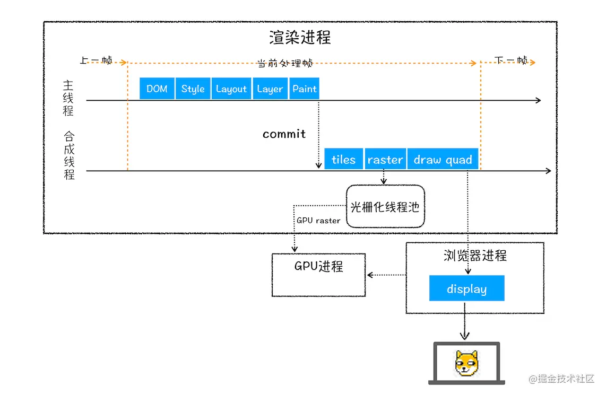
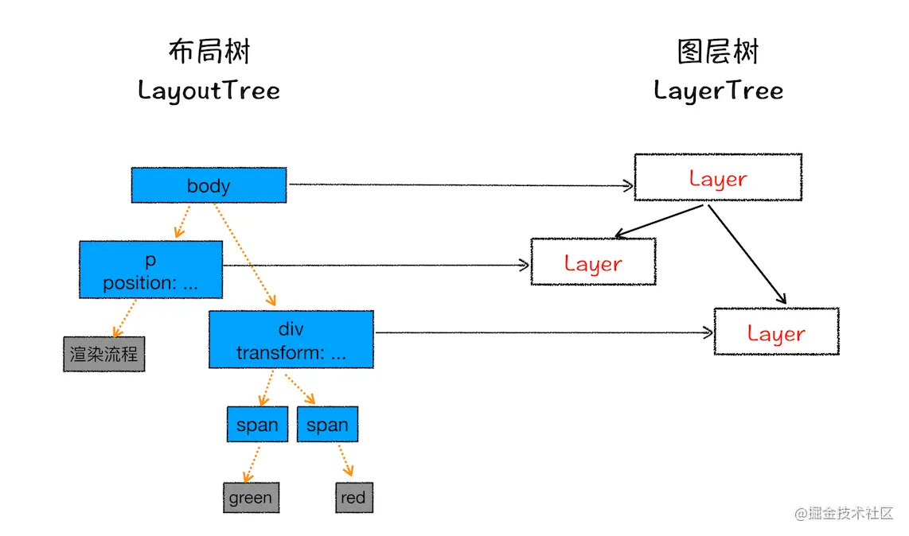
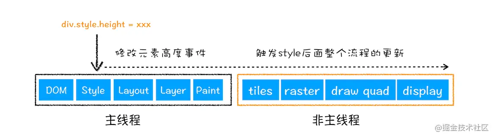
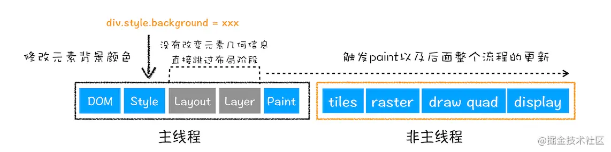
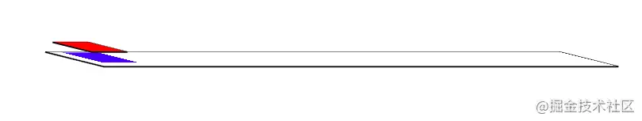

## 浏览器渲染页面流程
开篇先盗图，一下是李兵老师在讲解&lt;浏览器工作原理与实践&gt;时提供的一张图



:::danger
主线程 = GUI 渲染线程/ JS 引擎线程 因为二者互斥不会同时运行且都会阻塞UI 也有叫UI线程的

工作线程= 事件触发线程 + 定时触发器线程 + 异步 HTTP 请求线程 + web works 等用户执行耗时任务的线程

合成线程：用于合成帧的线程/一些动画属性变化也可以单独在这个线程运行 不需要经过主线程 提高渲染性能

raster 线程：和合成线程共同作用 用于同层分块的 提高渲染性能
:::

从上图可知，浏览器下载html后，大致流程
1. DOM解析
2. 样式解析
    - style标签会先解析
    - link标签会先下载，在解析
    - 以上两种情况会阻塞DOM解析？？---css解析不会阻塞dom解析
3. script下载、执行
    - 遇到内嵌script代码，会执行该代码，执行之前会等待2步骤完成，因为js可能需要操作样式
    - 遇到外链script标签，会下载并执行js代码
    - 以上两种情况会阻塞DOM解析

> 从以上情况可知，平时把script放在body标签最后的原因:提升首屏渲染速度、避免js获取不到DOM元素等

4. 生成布局树

    

    每个dom节点都对应这一个布局树的节点，从上图的对应关系看，并不是所有的dom节点都对应图层树一个layer，如果没有对应的layer，该节点隶属于它的父元素的layer。那么，如何才能生成一个layer呢？以下两种情况会产生一个layer
    - 拥有层叠上下文的元素
        position:fixed,asbsolute等脱离文档流的属性；opacity透明度，filter过滤等
    - 需要剪裁(clip)的地方也会被创建为图层，比如出现滚动条

5. 生成图层树
    <span style="color: red">生成图层树后，就开始绘制了，**也就是图1中paint步骤,其实paint并不是真正的绘制，而是生成一个绘制列表，然后将绘制列表交给合成线程，之后由GPU生成位图，最后由浏览器进程渲染到页面**上。也就是说paint之后，主线程就空闲了，如果之后没有任务了。这关系到GPU加速，下面再讲</span>

## 什么是重排(回流)



上面是一个浏览器渲染页面的完整流程，但是不是每个流程都是必须执行的，那么重排是什么意思呢？当改变元素宽度、高度等影响布局的属性时，就会触发layout和layer两个流程，这就是所谓的重排或者回流。

重排会占用主线程，因为主线程是单线程，所以影响性能。比如动画，动画是一帧一帧渲染的，假设每一帧都涉及到了重排，并且每一帧之间有一个复杂的js代码执行，就会导致每一帧渲染时间延长，当渲染时间超过16ms时,也就是低于60hz，就会造成视觉上卡顿

## 什么是重绘



了解了重排，同理可知，没有layout和layer，直接paint，就是重绘。比如修改background-color,color等不影响布局的操作。没有重排，将大大提升性能

注意：重排一定会造成重绘

### 如何减少重排和重绘
- 使用createElementFragment操作dom，最后一期推入文档
- 使用class去修改样式
- 避免使用table布局
- dom读写分离

## GPU加速

了解了重排和重绘，那么GPU加速又是什么呢？其实就是GPU为该元素单独绘制一个复合层，当修改样式时不影响其他复合层。以下样式将开启GPU加速

- transform动画
- opacity动画
- 设置translateZ()、translate3D();
- 设置will-change等

下面我们看下浏览器GPU加速具体是怎么表现的
```html
html lang="en">
<head>
  <meta charset="UTF-8">
  <meta name="viewport" content="width=device-width, initial-scale=1.0">
  <title>Document</title>
  <style>
    @keyframes move {
      from {
        transform: translateX(0);
      }
      to {
        transform: translateX(200px);
      }
    }
    .move {
      animation: move 3s linear;
    }
  </style>
</head>
<body>
  <div class="move" style="background-color: red; width: 100px; height: 100px; position: absolute; z-index: 2;"></div>
  <div style="background-color: blue; width: 100px; height: 100px; position: absolute; z-index: 1; left: 40px;"></div>
</body>
</html>
```
我们用Chrome浏览器测试一下，打开开发者工具=>layers

**首先，页面的布局不是2d的，它其实是一个3D的层叠，假设屏幕横向为X轴，纵向为Y轴，那么我们眼睛看的方向就是z轴。开启GPU加速的元素，GPU将会为它绘制一个复合层，如下**



在以上动画执行过程中，我们可以看到红色块是单独的复合层，复合层之间是独立的，重排、重绘都不会相互影响，这样就达到了性能优化的目的

另外我们可以发现在动画执行前和之后，红色块是没有单独的复合层的，这样页面会闪一下，原因是动画开始前红色块生成复合层时是经历过一次重绘，同样结束后也经历了一次重绘，那么如何避免呢

就是上面提到了transform(translateZ、translate3D)、will-change这几个属性，一开始就会给DOM生成一个复合层，这样就不会经理动画前后的重绘

- css加载不会阻塞DOM树的解析
- css加载会阻塞DOM树的渲染
- css加载会阻塞后面js语句的执行、

## 资料
[原文](https://juejin.cn/post/6868906622774935565)

[CSS什么情况引起回流,回流（重排）与重绘](https://blog.csdn.net/weixin_42301080/article/details/119368348)

[怎么查看](https://www.jianshu.com/p/e1839e06ec8a)

[优化](https://www.pianshen.com/article/94631124156/)

[浏览器渲染之回流重绘](https://mp.weixin.qq.com/s/O0poI3y62W0vO8Z858lY4Q)

[浏览器渲染简述](https://segmentfault.com/a/1190000014733203)