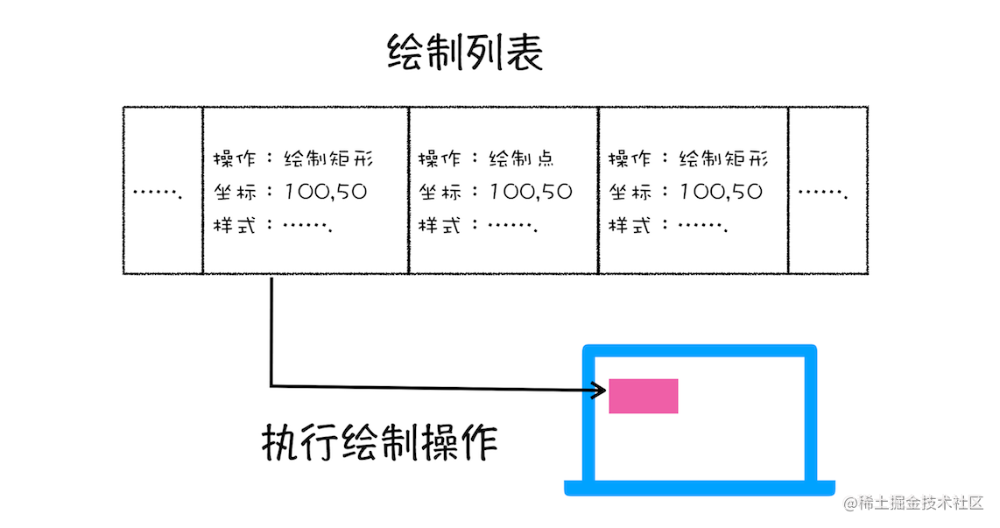
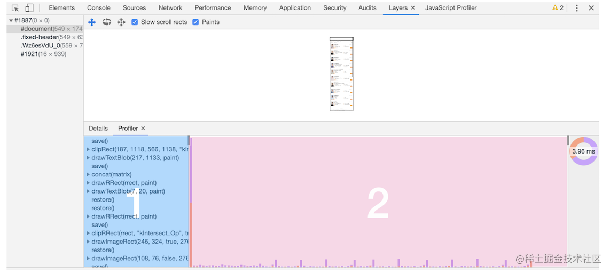
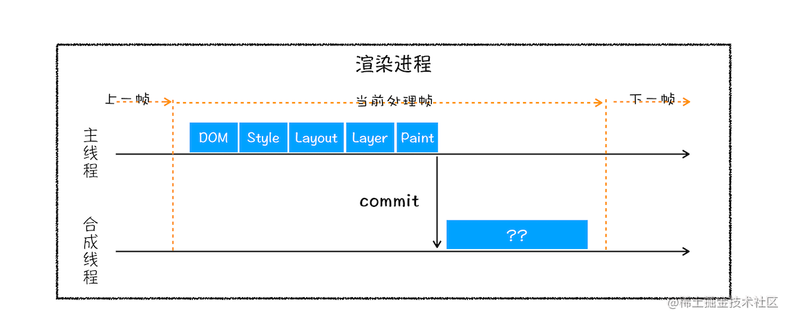
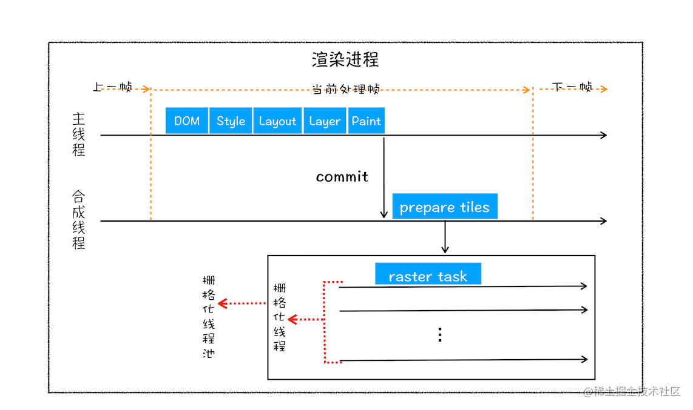
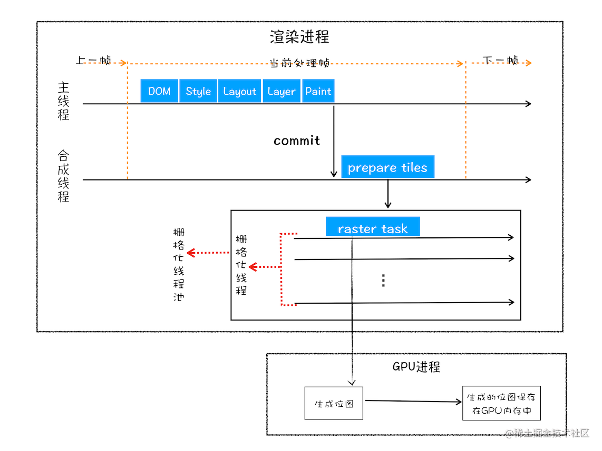

## 图层绘制
在完成图层树的构建之后，渲染引擎会对图层树中的每个图层进行绘制，那么接下来我们看看渲染引擎是怎么实现图层绘制的？

试想一下，如果给你一张纸，让你先把纸的背景涂成蓝色，然后在中间位置画一个红色的圆，最后再在圆上画个绿色三角形，你会怎么操作？

通常，你会把你的绘制操作分解成散步
1. 绘制蓝色背景
2. 在中间绘制一个红色的圆
3. 再在圆上绘制绿色三角形

渲染引擎实现图层的绘制与之类似，会把一个图层绘制拆分成很多小的绘制指令，然后在把这些指令按照顺序组成一个待绘制列表，如下图所示

从图中可以看出，绘制列表中的指令其实非常简单，就是让其执行一个简单的绘制操作，比如绘制粉色矩形或黑色的线等。而绘制一个元素通常需要好几条绘制指令，因为每个元素的背景、前景、边框都需要单独的指令去绘制。所以在图层绘制阶段，输出的内容就是这些待绘制列表。

你也可以打开"开发者工具"的"Layers"标签，选择document层，来实际体验下绘制列表，如下图所示

## 栅格化操作
绘制列表只是用来记录绘制顺序和绘制指令的列表, 而实际上绘制操作是由渲染引擎中的合成线程来完成的。你可以结合下图看下渲染主线程和合成线程之间关系

渲染进程中的合成线程和主线程

如图所示，当图层的绘制列表准备好之后，主线程会把该绘制列表提交(commit)给合成线程,那么接下来合成线程是怎么工作的呢？

合成线程会按照视口附近的图块来优先生成位图，实际上啊生成位图的操作是由栅格化来执行的。**所谓栅格化，是指将图块转换为位图**。而图块是栅格化执行的最小单位。渲染进程维护了一个栅格化的线程池，所有图块的栅格化都是在线程池内执行的，运行方式图下图所示

合成线程提交图块给栅格化线程池

通常，栅格化过程都会使用GPU来加速生成，使用GPU生成位图的过程叫快速栅格化，或者GPU栅格化，生成的位图被保存在GPU内存中。**相信你还记得，GPU操作是运行在GPU进程中，如果栅格化操作使用了GPU，那么最终生成位图的操作是在GPU中完成的，这就涉及了跨进程操作**。具体形式你可以参考下图

## 资料
[浏览器渲染之图层绘制与栅格化操作](https://juejin.cn/post/7034123172836278286)