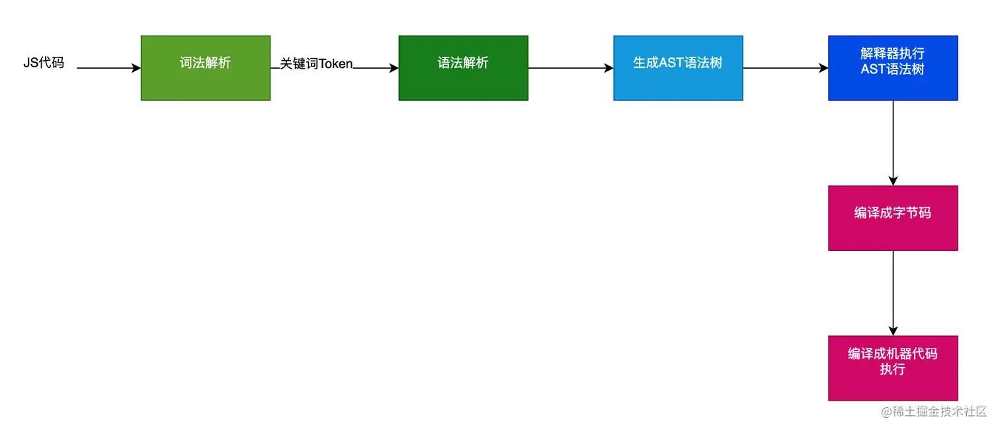
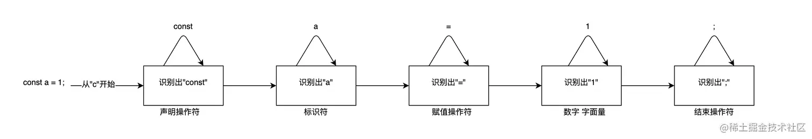
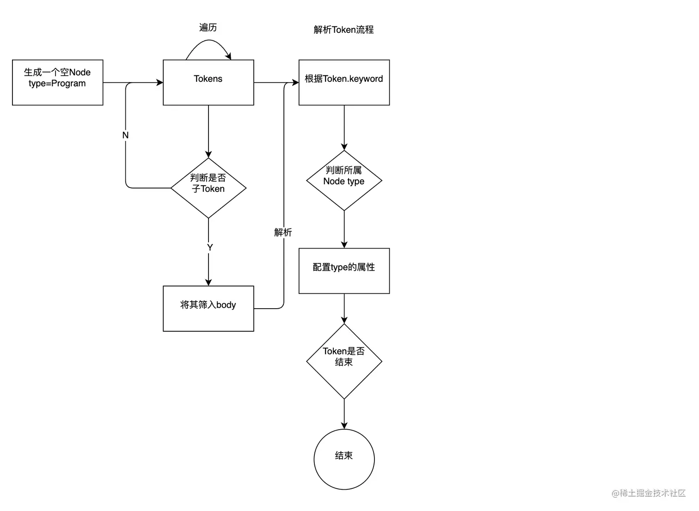
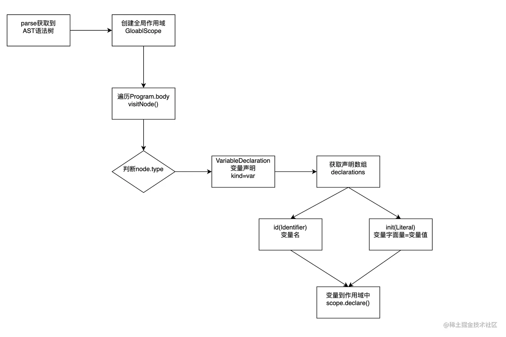

## JS引擎
之前有篇文章[理解React中Fiber架构(一)](https://qborfy.com/today/20230117.html)中有讲到浏览器进程如何渲染网页和执行js代码的，我们在复习一遍

一个完整的web网页在浏览器显示和交互的进程(chrome为主)，需要设计到县城主要以下几个部分

- **GUI渲染线程**，负责渲染浏览器界面HTML元素，当界面需要重绘(Repaint)或由于某种操作引发回流(reflow)时，该线程就会执行
- **Javascript引擎线程**,JS内核，负责处理Javascript脚本程序。一直等待着任务队列中人物的到来，然后解析Javascript脚本运行代码
- **定时触发线程**,定时器setInterval与setTimeout所在线程,为什么要单独弄个线程处理定时器？是因为Javascript引擎是单线程的，如果处于阻塞县城状态就会影响计时的准确
- **事件触发线程**,用来控制事件轮训，JS引擎自己忙不过来,需要浏览器另开县城协助
- **异步http请求线程**,在XMLHttpRequest或fetch在连接后是通过浏览器开一个线程请求，将检测到状态变更时，如果设置有回调函数，异步线程就产生状态变更时间放到Javascript引擎的处理队列中等待处理。这里需要注意XMLHttpRequest和fetch的区别，fetch是w3c标准化后一个专门提供给开发调用发起http的API接口，XMLHttpRequest是一个非标准化的Http请求对象，主要是可以发起http请求获取XML数据

针对JS引擎，官方定义是：
> Javascript引擎是一个专门处理Javascript脚本的虚拟机，一般会附带在网页浏览器之中--[JS引擎 维基百科](https://zh.wikipedia.org/zh-hans/JavaScript%E5%BC%95%E6%93%8E)

因此，我们了解JS引擎在浏览器中的主要作用就是，**解析JS代码、并运行代码**，那么它是怎么做到的呢？

如同我们人一样去认识一门语言，电脑也一样，当我们写了一行代码，JS引擎要识别出来，它同样去分析代码，然后确定执行，主要有以下几个步骤

- <span style="color: blue">词法分析，主要是**分词(tokenize)**, 将JS代码比较关键词(如function、const、let等)，拆出来放到解析器里</span>
- <span style="color: blue">语法分析,主要是解析(parse),主要用了预解析器和解析器</span>
    - 预解析器会判断哪些代码需要立即执行，哪些嗲吗不需要立即执行，需要立即执行的代码才会放到解析器里去解析
    - 解析器，从词法分析获取关键词做标记，将代码生成一个抽象语法树，也叫AST语法树
- <span style="color: blue">生成AST语法树，AST语法树由解析器生成后，将会传递给到解释器</span>
- <span style="color: blue">生成字节码，主要由解释器将AST语法树编译成字节码</span>
- <span style="color: blue">执行代码,将字节码转成机器代码，以更快的速度在电脑中执行</span>



所以我们要模拟JS引擎要实现功能主要有以下几块

- 分词器，将JS关键词进行标记
- 解析器，生成AST语法树
- 解释器，执行AST语法树

## 词法分析
> 将源代码分解并组织成一组有意义的单词，这一过程即为词法分析(Token)

词法分析的工作就是将一个长长的字符串识别出一个个的单词，这一个个单词就是Token，具体实现效果如下

```js
const a = 1;

//  经过词法分析会将上面拆分如下对象
[
  ("var": "keyword"),
  ("a": "identifier"),
  ("=": "assignment"),
  ("1": "literal"),
  (";": "separator"),
];
```
如果用途来显示的话，它应该是这个样子的



根据上面的结果，那么词法分析的实践步骤应该如下
- 先分词，分词的逻辑使用正则表达式
    - 先判断是否为关键词，如：运算符(+-*/=)、声明符(var、const、function)等。
    - 如果是则执行拆词
    - 接着遇到空格也拆词
    - 遇到换行符或;也拆词
    - ...还有符合条件判断也拆词
    - 最终会获取到一个数组，["var", "a", "=", "1", ";"]
- 再判断该词属于哪个类型，如： var属于keyword关键字。

利用Acron做词法分析，代码如下
```js

const acron = require('acorn');

/**
 * 利用acorn库进行词法分析
 * @param {*} code 代码
 * @param {*} ecmaVersion ECMAScript的标准版本 
 * @returns 
 */
const getToken = (code, ecmaVersion = '11') => {
    const tokenObj = acron.tokenizer(code, {
        ecmaVersion,
        locations: true
    });
    const tokens = [];
    let token = tokenObj.getToken();
    console.log(token)
    while (token.end !== token.start) {
        tokens.push(token);
        token = tokenObj.getToken();
    }
    return tokens;
}

getToken(`const a= 1+1;`); // 最终输出Token数组

// 输出如下对象
[ {
  "type": { // 关键词Token所属类型
    "label": "const",  // 解析到的关键词所属的类型 为const
    "keyword": "const", //  关键字
    ...
  },
  "value": "const", // 解析到的 关键词Token
  "start": 0, // 关键词的开始位置
  "end": 5 // 关键词的结束位置 下一个位置是空白符
}, ...]
```
## 语法解析
> 将词法分析阶段生成的Token转换为抽象语法树(Abstract Syntax Tree)，这一过程称之为语法解析(Parsing)

简单来说，就是利用Token标示符去生成AST语法树

### 语法树
在语法解析前,我们需要对AST语法树有一个认知，即是：什么是AST语法树

:::tips
抽象语法树(Abstract Syntax Tree),简称AST，它是源代码语法结构的一种抽象表示。它以树状的形式表现编程语言的语法结构，树上的每个节点都表示源代码中的一种结构
:::
用比较容易理解的话，<span style="color: blue">用一个树形结构去描述我们源代码，从而能让机器能更好识别我们所想要实现的功能</span>

目前市面上Javascript语言的AST语法树结构基本上都遵循[ESTree语法树规范](https://github.com/estree/estree)

这里说明一下ESTree语法树规范的起源，能让我们更容易理解语法解析的过程：
:::tips
使用不同工具构建的语法树可能会有不同的结构，如果大家都遵从同样的规范，那么相关联的生态链工具的开发更为轻松、明细。很早之前，FireFox浏览器所使用的Javascript引擎SpiderMonkey曾经提供了一个Javascript API,是的开发者可以直接调用SpiderMonkey的Javaascript的分析器。这个 API 所描述的 JavaScript 抽象语法树格式渐渐流行起来，如今成为 JavaScript AST 的通用描述。ESTree语法树规范 正是在此基础上建立起来的，它现在是社区对 JavaScript 抽象语法树构建时采用最广泛的规则，可以认为是社区推动的事实标准。众多基础设施开发者一起维护着这个规范，包括 Dave Herman（Mozilla 研究中心的首席研究员和策略总监）、 Nicholas C. Zakas（ESLint 的作者）、Ingvar Stepanyan（Acorn 的作者）、Mike Sherov 与 Ariya Hidayat（Esprima 的作者）以及 Babel.js 团队等。

ESTree语法树规范 的初始版本是基于 ES5 的[2]，后续的 ES6/ES7/ES8 等版本的规范，都只针对新增语言特性提出。
:::
[ESTree语法树规范](https://github.com/estree/estree)基于ECMAScript标准去描述不同标准的AST树结构，具体如下

```js
// 节点对象  下面这个版本属于ES2015的规范
interface Node {
    type: string;
    loc: SourceLocation | null;
}

extend interface Program {
    sourceType: "script" | "module";
    body: [ Statement | ImportOrExportDeclaration ];
}

interface IfStatement <: Statement { // <: 标识前者是后者的子集 即是继承的关系
    type: "IfStatement";
    test: Expression;
    consequent: Statement;
    alternate: Statement | null;
}
```
因此了解JS的AST语法树结构，需要对ESTree规范有了解，它分别定义不同类型节点的数据结构，拿几种常见的做一下介绍，具体如下所示：

- Program,一个完整的程序源码树，就是树的根节点，因此也属于Node类型
- Node,语法树的基础节点
    - Function，函数声明或表达式，继承节点Node
    - Statement，代码内容，标识任何声明，继承节点Node
        -Declaration 声明节点
    - Expression， 表达式，标识任何声明，继承节点Node
    -Pattern，解构绑定和赋值节点，继承节点Node

- Identifier,标识符，如：变量名、函数名
- Literal,字面量，对应Javascript，就是基本值，例如布尔值true,数字200、字符串'this is a string'

一个AST语法的组成结构大概如下
```shell
Program
|-- body: Node[] // 代码主体
|     |-- Function // 函数声明
|     |-- Statement // 代码内容
|     |-- Declaration // 变量声明
|     |-- Expression // 表达式
|          |-- Literal
|          |-- Identifier
```
还需要解答一个问题，就是在AST语法树中，如何判断一个节点的完整性呢?

按照ESTree的规范：遇到一个空节点（比如：换行/分号/结构体结束符}]等），则拆成一个完整的节点。

### 实现原理
弄明白AST语法树的数据结构，接下来就是如何将之前词法分析的Token数组解析成语法树结构，解析流程图(Acron.js实现)如下：



利用Acron做发育解析，代码如下
```js
const code = `function sum(a, b){return a + b;};const a = sum(1,2)`;

const acron = require('acorn');

console.log(acron.parse(code));
```
最终得到结构如下：
```js
Node {
  type: 'Program',
  start: 0,
  end: 53,
  body:
   [ Node {
       type: 'FunctionDeclaration',
       start: 0,
       end: 31,
       id: [Node],
       expression: false,
       generator: false,
       async: false,
       params: [Array],
       body: [Node] },
     Node { type: 'EmptyStatement', start: 31, end: 32 },
     Node {
       type: 'VariableDeclaration',
       start: 33,
       end: 53,
       declarations: [Array],
       kind: 'const' } ],
  sourceType: 'script' }
```

## 解释器
> 解释器，就是遍历AST语法树，然后根据Node节点类型，去执行或计算每个节点

这里实现一个JS解释器，需要对AST语法树Node节点每个类型做区分判断，主要有以下几种
- 变量
- 作用域以及作用域链
- 条件判断
- For循环，其中的break和continue
- 函数部分Function
- 生成器Generator
- 异步Async

因此我们需要几个类去保存相关的值
- Scope，作用域类，作用域内的值以及作用域链(当前作用域可以找到父级作用域链)
- Visitor,AST树Node节点处理类，里面有函数 visitiNode(node, scope),用来处理对应node类型，其中VISITOR是所有类型函数的Map对象，用来快速查询
- Variable,变量存储类,用来存储变量类型和值

```js
/**
 * 遍历AST语法树，并执行对应的处理函数
 * @param node
 * @param scope
 */
visitNode(node, scope) {
    const { type } = node;
    if(VISITOR[type]) {
        return VISITOR[type]({ node, scope, content: this });
    }
    return undefined;
}
```
### 变量和作用域
在JavaScript中，对变量的生命通常是绑定在作用域中的，而作用域分为以下几种：

- 全局作用域，全局作用域中仅存在一处，即为最上级的环境
- 函数作用域,函数存在并执行时，内存存储函数作用域
- 块级作用域，每个block块{}都可产生作用域，如if for while 等

我们举个例子，以var a = 1;为例,我们需要哪些代码，才能实现从AST树解析，将变量a被声明在全局变量作用域中，具体步骤如下图



这里实现一个作用域Scope类，参考代码如下
```js
class Scope {
  /**
     * 
     * @param {*} type 
     * @param {*} parent 
     */
    constructor(type, parent) {
        this.parent = parent || null; // 父级作用域
        this.type = type; // 作用域类型 Global, Function, Block
        this.targetScope = new Map();  // 当前作用域
    }

    /**
     * 变量声明方法,变量已定义则抛出语法错误异常
     * @param {*} kind 变量类型
     * @param {*} rawName  变量名
     * @param {*} value 变量值
     * @returns 
     */
    declare(kind, rawName, value) {
        this.targetScope.set(rawName, value);
    }
}
```
#### 上下文This
上下文的this对象其实指的就是当前作用域，然而我们了解过JS中的this是可以改变的，如：

- call()、bind()、apply()等函数，当执行到相关函数的时候，需要将传递进来的scope的替换成当前的scope
- ES6中的剪头函数等，this指向上一级

### 其他类型解释
#### 条件判断
IfStatement,里面有属性: test为判断条件，consequent为条件成立时执行的语句，alternate为条件不成立时执行的语句，参考代码如下
```js
// visitNode会执行AST语法树节点函数
const { test, consequent, alternate } = node;
const testValue = visitNode(test, scope);
if (testValue) {
    if(consequent){
       visitNode(consequent, scope);
    }
} else {
    if(alternate){
       visitNode(alternate, scope);
    }
}
```
其他部分逻辑就不会在这里一一描述，具体Node类型都有自己的判断逻辑，因此想要了解完整逻辑，可以到完整源码里查看，注解都十分清晰。

完整源码地址在：[github.com/qiubohong/q…](https://github.com/qiubohong/qiubohong.github.io/tree/master/code/jsengine/src/interpreter/index.js)

## 总结
本文涉及的东西有点多，花了好几天时间才弄明白，因此有些知识点在这里做一下小总结：

- JS引擎是有三部分组成的，分别是：词法分析,语法解析和解释器
- 词法解析和语法解析，最终的目标是生成符合ESTree规范的AST语法树
- 解释器的作用就是依据AST语法树去执行相关逻辑，输出所需要的最终结果

    - 比较重要的部分在于变量、作用域和作用域链的实现
    - 其他部分则是依据对应ECMAScript 规范实现对应逻辑皆可


## 资料
[js事件循环](/front-end/JavaScript/browser-eventLoop.html)

[用JS实现一个JS引擎竟如此简单](https://juejin.cn/post/7205517870976270394#heading-2)