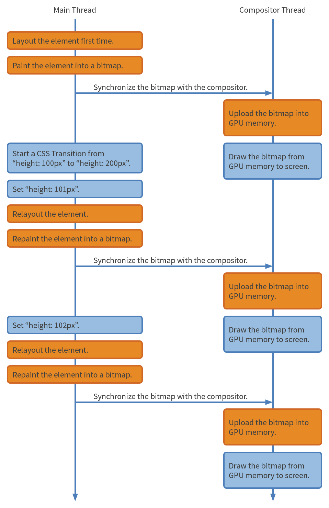
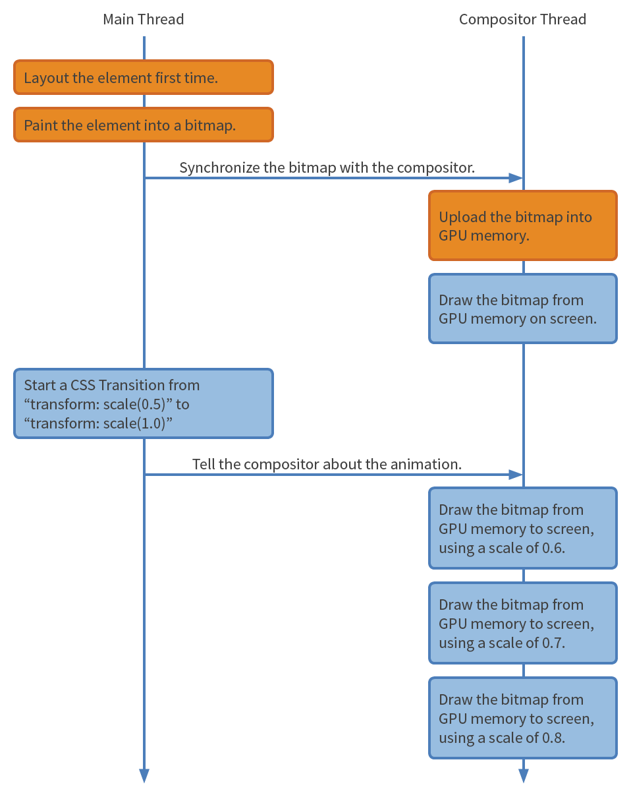

## 浏览器的内部机制
现代浏览器通常由两个重要的线程组成，这两个线程一起工作完成绘制页面的任务
- 主线程
- 合成线程

1. 主线程需要做的任务如下
    - <span style="color:blue">运行Javascript</span>
    - <span style="color:blue">计算HTML元素的css样式</span>
    - <span style="color:blue">layout(relayout)</span>
    - <span style="color:blue">将页面元素绘制成一张或多张位图</span>
    - <span style="color:blue">将位图发送给合成线程</span>
2. 合成线程主要任务是
    - <span style="color:blue">利用GPU将位图绘制到屏幕上</span>
    - <span style="color:blue">让主线程将可见的或即将可见的位图发送给自己</span>
    - <span style="color:blue">计算那部分页面是可见的</span>
    - <span style="color:blue">计算那部分页面是即将可见的(当你的滚动页面的时候)</span>
    - <span style="color:blue">在你滚动时移动部分页面</span>

<span style="color:blue">在很长的一段时间内，主线程都忙于运行Javascript和绘制大型元素，当它忙碌的时候，它就没空响应用户的输入了。</span>

<span style="color:blue">**换个角度说，合成线程一直保证对用户输入的响应。它会在页面改变时每秒绘制60次，即使页面还不完成**。</span>

<span style="color:blue">例如，当用户滚动一个页面时，合成线程会让主线程提供最新的可见部分的页面位图，然而主线程不能即使响应，这时合成线程不会等待，它会绘制已有的页面位图，对于没有的部分则绘制白屏</span>

## GPU
之前提到合成线程会使用GPU来绘制位图，让我们快速熟悉下GPU的概念。如今大多手机，电脑都带有GPU芯片，它非常特别，它很擅长做某些事情，又不是很长做其他事情

GPU做如下操作很快
1. <span style="color: blue">绘制东西到屏幕上</span>
2. <span style="color: blue">一次次绘制同一张位图到屏幕上</span>
3. <span style="color: blue">绘制同一张位图到不同位置、旋转角度和缩放比例</span>

GPU不擅长做
1. 加载位图到内存中

## transion:height
现在我们对运行页面的软件和硬件有一个粗略的了解。让我们看看主线程和合成线程如何处理css transition的

假设我们见一个页面元素的高度从100px渐变到200px代码如下
```css
div {
    height: 100px;
    transition: height 1s linear
}
div:hover {
    height: 200px;
}
```
下图是主线程和合成线程的互相交互的时间线图,<span style="color: orange">注意：黄色盒子的操作是潜在耗时较长的，蓝色盒子的操作是很快的</span>



<span style="color: blue">你可以看到很多黄色盒子，这意味着浏览器要做很多复杂的操作，这就表明这个transition动画可能会很卡</span>

<span style="color: blue">在transition动画的每一帧中，浏览器都要做relayout和repaint，然后将位图发送给GPU，之前提到了，加载位图到GPU内存是很慢的</span>

<span style="color: blue">浏览器之所以这么拼命的工作是因为元素在不停的变化，而且修改元素的高度可能会导致子元素的大小也会变化，所以浏览器不得不进行relayout，在relayout之后主线程还需要重新生成元素的位图</span>

## transition: transform
所以高度的变化是很耗时的，有没有什么东西耗时更少呢？

假设我们见一个元素缩小到起一半大小，同时假设我们使用了css transform属性来进行缩放，那么这个缩小的动画的CSS如下
```css
div {
    transform：scale(0.1);
    transition: transform 1s linear
}
div:hover {
    transform: scale(1)
}
```
看看这次的时间线图


这次我们很少看到黄色盒子了，这就意味着这个动画可以很不流畅，那么为什么transform的动画会比height的动画差别那么大？

<span style="color: blue">依据规范，CSS transrom属性并不会触发当前元素或者附近元素的relayout，浏览器将当前元素视为一个整体，它会缩放、选择、移动这一整个元素。</span>

<span style="color: red">这对浏览器来说是天大的好消息！浏览器只需要在动画开始之时生成位图，然后将位图发送给GPU，之后浏览器不需要做额外的relayout和repaint，甚至不需要发送位图给GPU，**浏览器只需要充分发挥GPU的长处：绘制同一张位图到不同的位置、选择角度和缩放比例**</span>

## 设计意图
这是否意味着我们不应该使用height的动画呢？当然不是，有时这就是设计的需要，并且动画也可以足够快，可能你的元素是隔离的，并且不会导出其他部分页面触发relayout；可能你的元素很简单，浏览器可以很快完成repaint；更可能你的元素很小，浏览器只需要发送一张很小的位图到GPU中。

当然，如果你可以在不影响设计意图的情况下使用一个更低耗的CSS属性自然是记好的。举个例子：你设计了一个按钮，在tab按钮之后弹出一个菜单。弹出的过程中是一个CSS动画。按照一般思路，我们可以用到CSS的top和height属性来实现弹出效果。但是其实我们可以用更低耗的CSS transform属性来实现类似的弹出效果

总结一下做动画时速度很快的CSS属性
- CSS transform
- CSS opacity
- CSS filter（具体要看filter的复杂度）

　　这个列表目前很小，但是随着浏览器越来越先进，你会看到这个列表越变越大。同样的也不要小看这张列表上的属性，你会惊讶居然可以用这么几个简单的属性实现这么多复杂的动画效果，发挥你们的创造力吧！


## 资料
[浅析主线程与合成线程、GPU优缺点、不同动画实现方式transition:height/transition:transform时浏览器工作的区别](https://www.cnblogs.com/goloving/p/14979318.html)