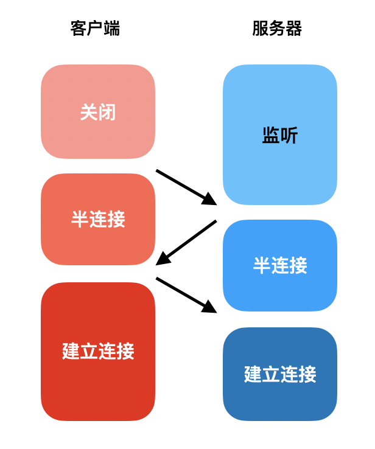
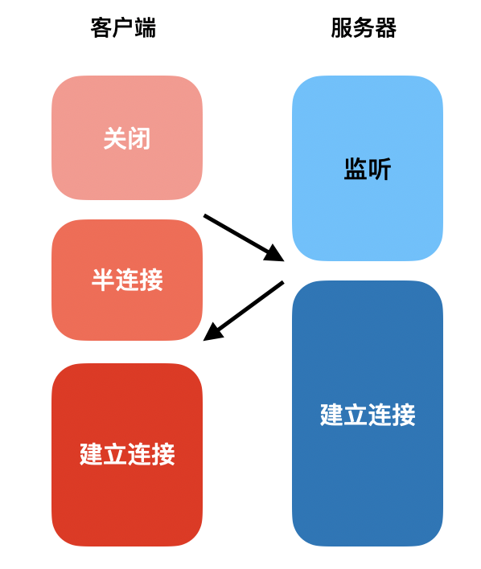
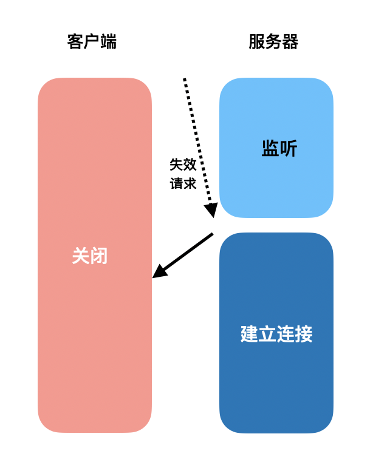
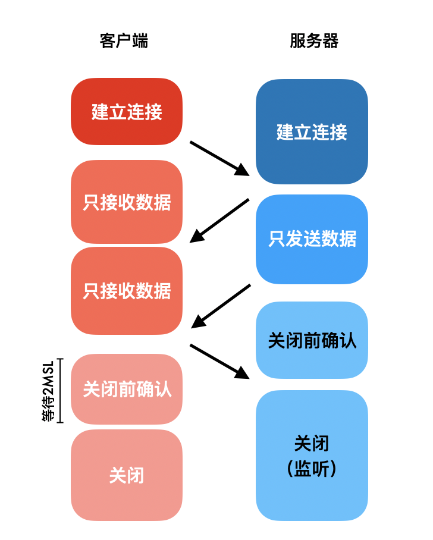
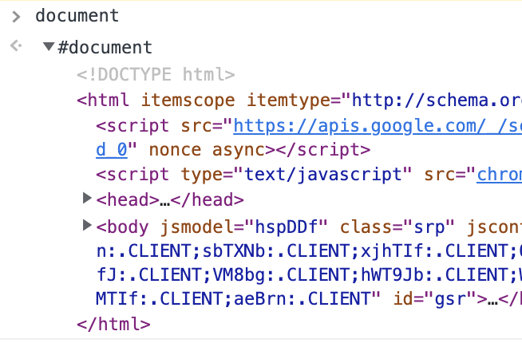
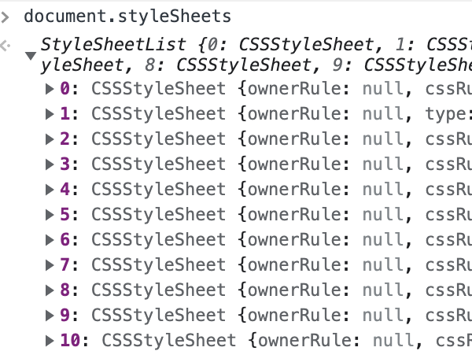
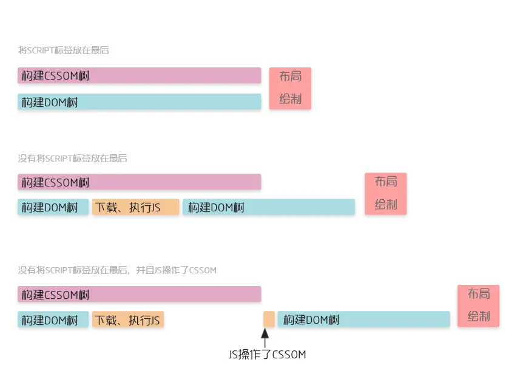
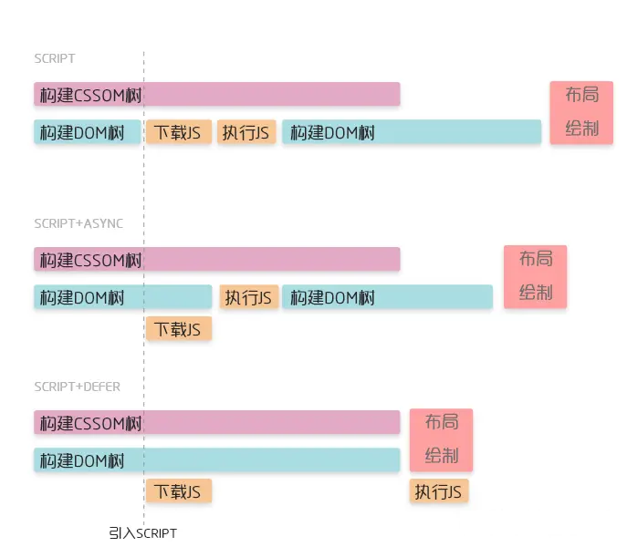

当面试官问出这个题后，大部分内心都是窃喜，早就被下这篇八股文

但是稍等，下面几个问题你能答上来吗？
1. <span style="color: red">浏览器对URL为什么要解析?URL参数用的是什么字符编码？那encodeURI和encodeURIComponent有什么区别</span>
2. <span style="color: red">浏览器缓存的disk cache和memory cache是什么？</span>
3. <span style="color: red">预加载prefetch、preload有什么差别?</span>
3. <span style="color: red">JS脚本的async和defer有什么区别？</span>
3. <span style="color: red">TCP握手为什么要三次，挥手为什么要四次</span>
3. <span style="color: red">HTTPS的握手有了解过吗？</span>

同样的问题，可以拿来招聘p5也可以是p7，只是深度不同，所以我重新整理了一遍整个流程

## 概述
在进入正题之前，先简单了解一下浏览器的架构作为前置知识。浏览器是多进程的工作的，"从URL输入到渲染"会主要涉及到的，是浏览器进程、网络进程和渲染进程三个：
1. <span style="color: blue">浏览器进程负责处理、响应用户交互，比如点击、滚动</span>
2. <span style="color: blue">网络进程负责处理数据的请求，提供下载功能</span>
3. <span style="color: blue">渲染进程负责将获取到的HTML、CSS、JS处理成可以看见、可以交互的页面</span>

"从URL输入到页面渲染"整个过程可以分成网络请求和浏览器渲染两个部分，分别由网络进程和渲染进程处理

## 网络请求
网络请求部分进行了这几项工作
1. URL的解析
2. 检查资源缓存
3. DNS解析
4. 建立TCP连接
5. TLS协商密钥
6. 发送请求&接受响应
7. 关闭TCP连接

接下来会一一展开

### URL解析
浏览器会首先会判断输入的内容是一个URL还是搜索关键字。

如果是URL,会把不完整的URL合成完成完整的URL。一个完整的URL应该是：<span style="color: blue">协议+主机+端口+路径[+参数][+锚点]</span>。比如我们在地址栏输入www.baidu.com,浏览器最终会将起拼接成https://www.baidu.com/默认使用443端口

如果是搜索关键字，会将其拼接到默认搜索引擎的参数部分去搜索。这个流程需要对输入的不安全字符编码进行转义(安全字符指的是数字、英文和少数符号)。因为URL的参数是不能有中文的，也不能有一些特殊字符，比如=？&，否则当我搜索1+1 = 2，假如不加以转义，url会是/search?q= 1 + 1 = 2&source=chrome，和url本身的分隔符=产生了歧义。

<span style="color: blue">url对非安全字符转义时，**使用的编码叫百分号编码**，因为它使用百分号加上两位的16进制数表示。这两位16进制数来自UTF-8编码，将每一个中文转换成3个字节</span>,比如我在google地址栏输入"中文"，url会变成/search?q=%E4%B8%AD%E6%96%87，一共6个字节。

<span style="color: blue">我们在写代码的时候经常会用到encodeURI 和encodeURIComponent正是起这个作用的，他们的规则基本一样，**只是= ? & ; /这类URI组成符号，这些在encodeURI中不会被编码，但在encodeURIComponent中统统会。因为encodeURI是编码整个URL，而encodeURIComponent编码的是参数部分**，需要更加严格把关</span>。

### 检查缓存
检查缓存一定是在发起真正的请求之前进行的，只有这样缓存的机制才会生效。如果发现有对应的缓存资源，则去检查缓存的有效期

1. 在有效期内的缓存资源直接使用，称之为强缓存，从chrome网络面板看到这类请求直接返回200，size是memory cache或者disk cache。memory cache是指资源从内存中去除，disk cache是指从磁盘中被取出；<span style="color: blue">从内存中读取比从硬盘中快很多，但资源能不能分配到内存要取决于当下的系统状态。通常来说，刷新页面会使用内存缓存，关闭后重新打开会使用硬盘缓存</span>

2. 超过有效期，则携带缓存的资源标识向服务端发起请求，检验能否继续使用，如果服务端告诉我们，可以继续使用本地缓存，则返回304，并且不携带数据；如果服务器告诉我们需要用更新的资源，则返回200，并且携带更新后的资源和资源标识缓存到本地，方便下一次使用。

### DNS解析
如果没有成功使用本地缓存，则需要发起网络请求了。首先要做的是DNS解析

会依次搜索：
1. 浏览器的DNS缓存
2. 操作系统的DNS缓存
3. 路由器的DNS缓存
4. 向服务商的DNS服务器查询
5. 向全球13台根域名服务器查询

为了节省时间，可以在HTML头部去做DNS的预解析
```html
<link rel="dns-prefetch" href="http://www.baidu.com"/>
```
> 为了保证响应的及时，DNS解析使用的是UDP协议

### 建立TCP连接
我们发送的请求是基于TCP协议的，所以要先进行连接建立，建立连接的通信是打电话，双方都在线；无连接的通信是发短信，发送方不管接收方，自己说自己的

这个确认连接方在线的过程就是通过TCP三次握手完成的。
1. <span style="color: blue">客户端发送建立连接请求;</span>
2. <span style="color: blue">服务端发送建立连接确认，此时服务端为该TCP连接分配资源</span>
3. <span style="color: blue">客户端发送建立连接确认的确认，此时客户端为该TCP连接分配资源</span>



<span style="color: red">为什么要三次握手才算建立连接完成</span>

可以先假设简历连接只要两次会发生什么？把上面的状态图少加修改，看起来一切正常



但假如这时服务端收到一个失效的建立连接请求，我们会发现服务端的资源被浪费了---此时客户端并没有想给它传送数据，但它却准备好了内存等资源一直等待着。



所以说，三次握手是为了保证客户端存活，防止服务端在收到失效的超时请求造成资源浪费

### 协商加密秘钥--TSL握手
为了保障通信的安全，我们使用的是HTTPS协议，其中的s指的就是TLS。TSL使用的是一种非对称+对称的方式进行加密

对称加密就是两边拥有相同的秘钥，两边都知道如何将密文加密解密。这种加密方式速度很快，但是问题在于如何让双方都知道秘钥。因为传输数据都是走的网络，如果将秘钥通过网络的方式传递的话，秘钥被接火，将失去了加密的意义

非对称加密，每个人都有一把公钥和私钥，公钥所有人都可以知道，私钥只有自己知道，将数据用公钥加密，解密必须使用私钥。这种加密方式就可以完美解决对称加密存在的问题，缺点是速度很慢。

我们采用非对称加密的方式协商处一个对称秘钥，这个密钥只有发送方和接收方知道的秘钥。流程如下

1. <span style="color: blue">客户端发送一个随机值以及需要的协议和加密方式</span>
2. <span style="color: blue">服务端收到客户端的随机值，发送自己的数字证书，附加上自己产生的一个随机值，并根据客户端需求的协议和加密方式使用对应的方式</span>
3. <span style="color: blue">客户端收到服务端的证书并验证是否有效，验证通过在生成一个随机值，通过服务端证书的公钥去加密这个随机值并发送给服务端</span>
4. <span style="color: blue">服务端收到加密过的随机值，并使用私钥解密获得第三个随机值，这时候两端都拥有了三个随机值，可以通过这三个随机值按照之前约定的加密方式生成秘钥，接下来的通信就可以通过对称密钥来加密解密</span>

通过以上步骤克制，在TLS握手阶段，两端使用非对称加密的方式来通信，但是因为非对称加密损耗的性能比对称加密大，所以在正式传输数据时，两端使用对比加密的方式。

### 发送请求&接受响应

HTTP的默认端口是80，HTTPS的默认端口是443。

请求的基本组成是请求行+请求头+请求体

```js
POST /hello HTTP/1.1
User-Agent: curl/7.16.3 libcurl/7.16.3 OpenSSL/0.9.7l zlib/1.2.3
Host: www.example.com
Accept-Language: en, mi

name=niannian
```
响应的基本组成是响应行+响应头+响应体
```js
HTTP/1.1 200 OK
Content-Type:application/json
Server:apache

{password:'123'}
```
### 关闭TCP连接
等数据传输完毕，就要关闭TCP连接了。关闭连接的主动方可以是客户端，也可以是服务端，这里以客户端为例，整个过程有四次握手：

1. <span style="color: blue">客户端请求释放连接，仅表示客户端不在发送数据了</span>
2. <span style="color: blue">服务端确认连接释放，但这时可能还有数据需要处理和发送；</span>
3. <span style="color: blue">服务端请求释放连接，服务端这时不再需要发送数据时；</span>
4. <span style="color: blue">客户端确认连接释放;</span>



- 为什么要有四次挥手

    <span style="color: blue">TCP 是可以双向传输数据的，每个方向都需要一个请求和一个确认。因为在第二次握手结束后，服务端还有数据传输，所以没有办法把第二次确认和第三次合并。</span>

- 主动方为什么要等待2MSL

    客户端在发送完第四次的确认报文段后会等待2MSL才正真关闭连接，<span style="color: blue">MSL是指数据包在网络中最大的生存时间。目的是确保服务端收到了这个确认报文段，</span>

    假设服务端没有收到第四次握手的报文，试想一下会发生什么？在客户端发送第四次握手的数据包后，服务端首先会等待，在1个MSL后，它发现超过了网络中数据包的最大生存时间，但是自己还没有收到数据包，于是服务端认为这个数据包已经丢失了，它决定把第三次握手的数据包重新给客户端发送一次，这个数据包最多花费一个MSL会到达客户端。

    一来一去，一共是2MSL，所以客户端在发送完第四次握手数据包后，等待2MSL是一种兜底机制，**如果在2MSL内没有收到其他报文段，客户端则认为服务端已经成功接受到第四次挥手，连接正式关闭**。

## 浏览器渲染
上面讲完了网络请求部分，现在浏览器拿到了数据，剩下的需要渲染进程工作了。浏览器渲染主要完成了一下几个工作：

- <span style="color: blue">构建DOM树</span>
- <span style="color: blue">样式计算</span>
- <span style="color: blue">布局定位</span>
- <span style="color: blue">图层分层</span>
- <span style="color: blue">图层绘制</span>
- <span style="color: blue">显示</span>

### 构建DOM树
HTML文件的结构没法被浏览器理解，所以要先把HTML中的标签贬称搞一个可以被JS使用的结构。

在控制台可以尝试打印document，这就是解析出来的DOM树。



### 样式计算
CSS文件一样没法被浏览器直接理解，所以首先把CSS解析成样式表。这三类样式都会被解析：
- <span style="color: blue">通过link引用外部CSS文件</span>
- <span style="color: blue">&lt;style&gt;标签内的样式</span>
- <span style="color: blue">元素style属性内嵌的CSS</span>

在控制台打印document.styleSheets,这就是解析出的样式表


利用这份样式表，我们可以计算出DOM树中每个节点的样式。之所以叫计算， 是因为每个元素要继承其父元素的属性
```html
<style>
    span {
        color: red;
    }
    div {
        font-size: 30px;
    }
</style>
<div>
    <span>年年</span>
</div>
```
比如上面的年年，不仅要接受span设定的样式，还要继承div设置的。

DOM树中的节点有了样式，现在被叫做渲染树。

- 为什么要把css放在头部，js放在body的尾部

    在解析HTML的过程中，遇到需要加载的资源特点如下

    - css资源异步下载，下载和解析都不会阻塞构建dom树&lt;link href="./style.css" rel="stylesheet" /&gt;
    - <span style="color: red">**JS资源同步下载，下载和执行都会阻塞DOM树&lt;script src="./index.js"/&gt;**</span>

    因为这样的特性，往往推荐将CSS样式表放在head头部，JS文件放在body尾部，使得渲染能尽早开始

- CSS会阻塞HTML解析吗？

    上面提到的页面渲染是渲染进程的任务，这个渲染进程中又分为GUI渲染线程和js线程

    解析HTML生成DOM树，解析CSS生成样式表以及后面去生成布局树、图层数都是由GUI显然线程去完成的，这个线程可以一边解析HTML，一边解析CSS，这两个是不会冲突的，所以也提倡把CSS在头部引入

    但是在js线程执行时，GUI渲染线程没有办法去解析HTML，这是因为JS可以操作DOM，如果两者同时进行可能引起冲突。如果这时JS去修改了样式，那此时CSS的解析和JS的执行也没法同时进行了，会先等CSS解析完成，在去执行JS，最后去解析HTML。

    

    从这个角度来看，CSS有可能阻塞HTML的解析

- 预加载扫描器是什么？

    上面提到的外链资源，不论是同步加载JS还是异步加载CSS、图片等，都要到HTML解析到这个标签才能开始，这四部不是一种友好的方式。实际上从2008年开始，浏览器开始逐步实现了预加载扫描器：<span style="color: blue">在拿到HTML文档的时候，先扫描整个文档，把CSS、JS、图片和web字体等提前下载</span>

- js脚本引入时async和defer有什么差别

    <span style="color: blue">**预加载扫描器解决了JS同步加载阻塞HTML解析的问题**，但是我们还没有解决JS执行阻塞HTML解析的问题。所有有了async和defer属性</span>

    - 没有defer或async,浏览器会立即加载并执行执行脚本
    - async属性表述异步解析引入的JavaScript,经加载好，就会开始执行
    - defer属性表示延迟到DOM解析完成，在执行引入的js

    

    > 在加载多个JS脚本的时候，async是无顺序的执行，而defer是有顺序执行

- preload、prefetch有什么区别


## 资料
[穷追猛打，阿里二面问了我30分钟从URL输入到渲染...](https://mp.weixin.qq.com/s/E1RSUV8t6yJhraDEHF0NRQ)