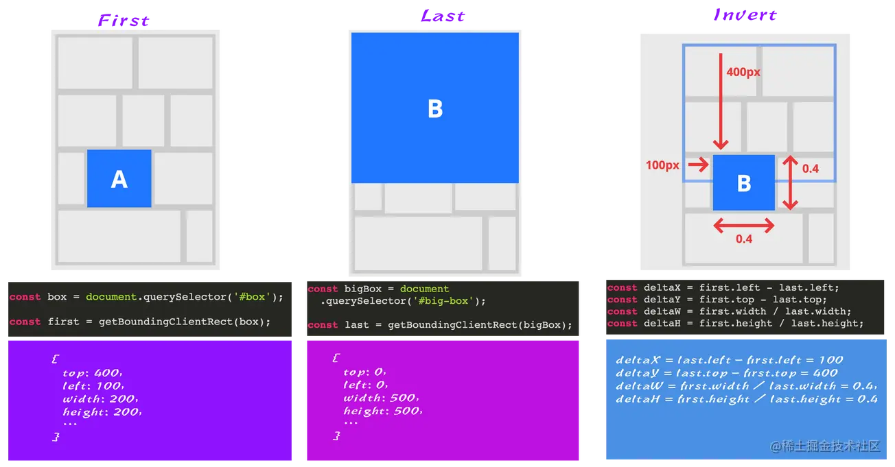
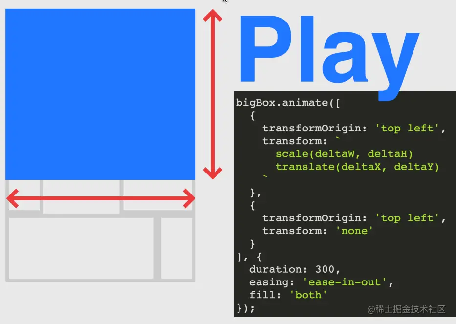

:::danger
在无阻塞的情况下setInterval(() => {left1 += 10;div1.style.left = `${left1}px`}, 0)

window.requestAnimationFrame(step);

setInterval(当setTimeout的定时的时间小于4ms，一律按照4ms来算)页面展示上快于requestAnimationFrame

主线程执行left的值大于requestAmimationFrame
:::
在前端实现动画有三种主流的方式
- Canvas
- CSS3
- Dom
当然，DOM+JS的这种方式由于极易引起浏览器重绘或回流，有非常大的性能风险，对于这种动画的优化方法就是不用DOM进行动画操作。

## CSS3动画优化原理
要想进行CSS的动画必须了解一定的浏览器原理，我们会介绍浏览器原理的几个概念，图层、重绘、回流

### 图层
浏览器在渲染一个页面时，会将页面分为很多个图层，图层有大有小，每个图层上有一个或多个节点。在渲染DOM的时候，浏览器所做的工作实际上是:
- <span style="color: blue">获取DOM后分割为多个图层</span>
- <span style="color: blue">对每个图层的节点计算样式结果(Recalculate style -- 样式重计算)</span>
- <span style="color: blue">为每个节点生成图形和位置(Layout--回流和重布局)</span>
- <span style="color: blue">将每个节点绘制到图层位图中(Paint Setup和Paint--重绘)</span>
- <span style="color: blue">图层作为纹理上传值GPU</span>
- <span style="color: blue">符合多个图层到页面上生成最终屏幕图像(Composite Layers--图层重组)</span>

### 回流
有些节点，当你改变它时，会需要重新布局(这也就意味着需要重新计算其他被影响的节点的位置和大小)

这种情况下，被影响的DOM树越大(可见节点)，重绘所需要的时间就会越长，而渲染一帧动画的时间也响应变长。所以需要尽力避免这些属性

一些常用的改变时会触发布局的属性

盒子模型相关属性会触发重布局
- width
- height
- padding
- margin
- display
- border-width
- border 
- min-height

定位属性和浮动也会触发重布局
- top
- bottom
- left 
- right
- position
- float
- clear

改变节点内部文字结构也会触发重布局
- text-align
- overflow-y
- font-weight
- overflow
- font-family
- line-height
- vertival-align
- white-space
- font-size

### 重绘
修改时候只触发重绘的属性有：
- color
- border-style
- border-radius
- visibility
- text-decoration
- background
- background-images
- background-position
- background-repeat
- background-size
- outline-color
- outline
- outline-style
- outline- width
- box-shadow
这些属性都不会修改节点的大小和位置，自然不会触发重布局，但是节点内部的渲染效果进行了改变，所以只需要重绘就可以了.

## CSS3动画优化
经过上面的介绍，我们大致了解了浏览器的绘制原理,那么想进行css动画优化需要遵循一下原则
1. <span style="color: red">尽量将动画放在一个独立图层，这样可以避免动画效果影响其他渲染层的元素</span>
2. <span style="color: red">尽量避免回流和重绘</span>
3. <span style="color: red">尽量使用GPU，速度更快</span>

因此我们需要创建独立的合成层

那么如何才能创建合成层呢？

直接原因
- 硬件加速的iframe元素(比如iframe切入的页面中有合成层)demo
- video元素
- 覆盖在video元素上的视频控制栏
- 3D或者硬件加速的2D canvas元素
    - demo:普通2D Canvas不会提升为合成层
    - demo:3d Canvas提升为合成层
- 硬件加速的插件，比如flash等等
- 在DPI较高的屏幕上，fix定位的元素会自动的被提升到合成层中。但在DPI较低的设备上却并非如此，因为这个渲染层的提升会使得字体渲染方式由字像素变为灰阶
- 有3D transform
- backface-visibility为hidden
- 对 opacity、transform、fliter、backdropfilter 应用了 animation 或者 transition（需要是 active 的 animation 或者 transition，当 animation 或者 transition 效果未开始或结束后，提升合成层也会失效）
- will-change 设置为 opacity、transform、top、left、bottom、right（其中 top、left 等需要设置明确的定位属性，如 relative 等）demo
- 后代元素原因:
    - 有合成层后代同时本身有 transform、opactiy（小于 1）、mask、fliter、reflection 属性 demo
    - 有合成层后代同时本身 overflow 不为 visible（如果本身是因为明确的定位因素产生的 SelfPaintingLayer，则需要 z-index 不为 auto） demo
    - 有合成层后代同时本身 fixed 定位 demo
    - 有 3D transfrom 的合成层后代同时本身有 preserves-3d 属性 demo
    - 有 3D transfrom 的合成层后代同时本身有 perspective 属性 demo

提升合成层的最好方式是使用CSS的will-change属性。从上一节合成层产生的原因中，可以知道will-change设置为 opacity、transform、top、left、bottom、right 可以将元素提升为合成层。

关于合成层的更多知识可以移步淘宝FED的无线性能优化：Composite

### 如何避免重绘和回流
具体而言,就是多使用transform 或者 opacity 来实现动画效果,上述方法在合成层使用不会引起重绘和回流.

### 如何利用GPU加速
- opacity
- translate
- rotate
- scale

## Canvas优化
<span style="color: red">**CSS虽然更加简单也更加保证性能的下限**，但是要实现更加复杂可控的动画，那就必须用到Canvas + Javascript这个组合了</span>

**Canvas作为浏览器提供的2D图形绘制API本身有一定的复杂度,优化的方法非常多,我们仅仅介绍几种比较主流的优化方式.**

### 运行requestAnimationFrame
很多时候我们会使用setInterval这种定时器来完成js动画循环，但是定时器在单线程的js环境下并不可靠，并不能保证严格按照开发者的设置来进行动画循环，因此很多时候setInterval会引起掉帧的情况。

因此requestAnimationFrame的优势就体现出来了
- 性能更好：优点是它能够将所有的动画都放在一个浏览器重绘周期里去做，这样能保存你的CPU的循环次数，提高性能
- 开销更小: requestAnimationFrame是由浏览器专门为动画提供的API，在运行时浏览器会自动优化方法的调用，并且如果页面不是激活状态下的话，动画会自动暂停，有效节省GPU开销

### 离屏Canvas
离屏渲染的原理就是把离屏Canvas当成一个缓存区。把需要重复绘制的画面数据进行缓存起来，较少调用canvas的API的消耗
1. 创建离屏canvas；
2. 设置离屏canvas的宽高；
3, 在离屏canvas中进行绘制；
4. 在离屏canvas的全部或部分绘制到正在显示的canvas上

### 避免浮点运算
利用 canvas进行动画绘制时，如果计算出来的坐标是浮点数，那么可能会出现 CSS Sub-pixel的问题，也就是会自动将浮点数值四舍五入转为整数，那么在动画的过程中，由于元素实际运动的轨迹并不是严格按照计算公式得到，那么就可能出现抖动的情况，同时也可能让元素的边缘出现抗锯齿失真
这也是可能影响性能的一方面，因为一直在做不必要的取证运算.

### 较少调用Canvas API
canvas也是通过操纵 js来绘制的，但是相比于正常的 js操作，调用 canvas API将更加消耗资源，所以在绘制之前请做好规划，通过 适量 js原生计算减少 canvas API的调用是一件比较划算的事情.

比如,作粒子效果时，尽量少使用圆，最好使用方形，因为粒子太小，所以方形看上去也跟圆差不多。至于原因，很容易理解，我们画一个圆需要三个步骤：先beginPath，然后用arc画弧，再用fill进行填充才能产生一个圆。但是画方形，只需要一个fillRect就可以了。虽然只是差了两个调用，当粒子对象数量达到一定时，这性能差距就会显示出来了。

### web worker
在进行某些耗时操作，例如计算大量数据，一帧中包含了太多的绘制状态，大规模的 DOM操作等，可能会导致页面卡顿，影响用户体验.

web worker最常用的场景就是大量的频繁计算，减轻主线程压力，如果遇到大规模的计算，可以通过此 API分担主线程压力，此 API兼容性已经很不错了，既然 canvas可以用，那 web worker也就完全可以考虑使用.

## 资料
[前端动画性能优化](https://zhuanlan.zhihu.com/p/353588150)

[页面代码合并_requestAnimationFrame详解以及无线页面优化](https://blog.csdn.net/weixin_33137081/article/details/112625502)

[requestAnimationFrame](https://blog.csdn.net/dreamlandz/article/details/121288788)

[前端浏览器刷新渲染机制是什么？](https://www.zhihu.com/question/399230074)

## animation(Css)

### 兼容性与属性

> 猛戳[这里](https://caniuse.com/?search=animation)查看兼容性

+ animation-name: 动画名称
+ animation-duration: 动画时长
+ animation-timing-function: 动画执行方式
+ animation-delay: 动画延迟时间
+ animation-iteration-count: 动画执行次数
+ animation-direction: 是否反向执行动画
+ animation-fill-node: 动画执行前后的样式

```css
.box {
    width: 200px;
    heigh: 200px;
    background-color: aqua;
    position:absolute;
    left: 0;
    top: 0;
    animation: test 3s linear 2s infinite;
}

@keyframes test {
    from {}
    to {
        width: 50px;
        height: 50px;
        background-color: red;
        opacity: 0.5;
        left: 500px;
        top: 500px;
    }
}

<div class="box"></div>
```

## requestAnimationFrame(JS)

### 兼容性与基本概念

- 优势: 
    - 浏览器可以优化并行的动画动作，更合理的重新排列动作序列，并把能够合并的动作放在一个渲染周期内完成，从而呈现出更流畅的效果
    - 一旦页面不处于浏览器的当前标签，就会停止刷新，这就节省了CPU、GPU和电力

- 使用
    - 持续调用requestAnimFrame即可
    - 可以使用cancelAnimationFrame清除动画

### 举例

```js
#anim  {
    position: absolute;
    left: 0;
    width: 150px;
    height: 150px;
    line-height: 150px;
    background: aqua;
    color: white;
    border-radius: 10px;
    padding: 1em;
}

<div id="anim">Click here to start animation</div>

// 兼容处理
window.requestAnimFrame = (function() {
    return (
        window.requestAnimationFrame || 
        window.wikitRequestAnimationFrame || 
        window.mozRequestAnimationFrame ||
        window.oRequestAnimationFrame ||
        window.msRequestAnimationFrame ||
        function (callback, element) {
            window.setTimeout(callback, 1000/ 60);
        }
    )
})()

var elem = document.getElementById('anim');
var startTime = undefined;

function render(time) {
    time = Date.now();
    if (startTime === undefined) {
        startTime = time;
    }
    elem.style.left = ((time - startTime) / 10) % 300 + 'px';
    elem.style.top = ((time - startTime) / 10) % 300 + 'px';
    elem.style.borderRadius = ((time - startTime) / 10) % 300 + 'px';
    elem.style.opacity = Math.floor((time - startTime / 100)) % 2 === 0 ? 1 : 0.3
}

elem.onclick = function() {
  (function animloop() {
    render()
    requestAnimFrame(animloop)
  })()
}
```
[参考文档](https://www.jianshu.com/p/fa5512dfb4f5)

### window.requestAnimationFrame

[参考地址](https://developer.mozilla.org/zh-CN/docs/Web/API/Window/requestAnimationFrame)

window.requestAnimationFrame()告诉浏览器--你希望执行一个动画,并且要求浏览器在下次重绘之前调用指定的回调函数更新动画。该方法需要传入一个回调函数作为参数，该回调函数会在浏览器下一次重绘之前执行

:::danger
注意:若你想在浏览器下次重绘之前继续更新下一帧动画，那么回调函数自身必须再次调用window.requestAnimationFrame();
:::

当你准备更新动画时你应该调用此方法。这将使浏览器在下一次重绘之前调用你传入该方法的动画函数(即你的回调函数)。
回调函数执行次数通常是每秒60次，但在大多数遵循W3C建议的浏览器中，回调函数执行次数通常与浏览器屏幕刷新次数想匹配。为了提高性能和电池寿命，因此在大多数浏览器中，当requestAnimationFrame()运行在后台标签页或者隐藏的iframe里时，requestAnimationFrame()会被暂时停用以提升性能和电池寿命。

回调函数会被传入DOMHighResTimeStamp参数，DOMHighResTimeStamp指示当前被requestAnimationFrame()排序的回调函数被触发的时间。在同一个帧中的多个回调函数，他们每一个都会接受到一个相同的时间戳，即使在计算上一个回调函数的工作负载期间已经消耗了一些事件。该时间戳是一个十进制数，单位是毫秒，最小精度是1ms

:::danger
请确保总是使用第一个参数(或其他获得当前事件的方法)计算每次调用之间的时间间隔，否则动画在高刷新率的屏幕中会运行的更快，请参考下面里的做法
:::

#### 语法

:::tip
window.requestAnimationFrame(callback);
:::

##### 参数
- callback

下一次重绘之前更新动画帧所调用的函数(即上面所说的回调函数)。该回调函数会被传入DOMHighResTimeStamp参数，该参数与performance.now()的返回值相同，它表示requestAnimationFrame()开始去执行回调函数的时刻。

- 返回值

一个long正数，请求ID，是返回列表中唯一的标识。是个非零值，没别的意义。你可以传这个值给window.cancelAnimationFrame()以取消回调函数。

##### 范例

```js
const element = document.getElementById('some-element-you-want-to-animate');
let start;

function step(timestamp) {
    if (start === undefined) {
        start = timestamp;
    }
    const elapased = timestamp - start;

    // 这里使用`Math.min()`确保元素刚好停在200px的位置
    element.style.transform = `translateX(${Math.min(0.1 * elapsed, 200)}px)`;

    // 在两秒后停止动画
    if (elapsed < 2000) {
        window.requestAnimationFrame(step);
    }
}

window.requestAnimationFrame(step);
```

## Element.animate()
Element接口有animate()方法是一个创建新Animation的便捷方法，将它应用于元素，然后运行动画。它将返回一个新建的Animation对象实例
```js
var animation = element.animate(keyframes, options)
```
### 示例
在示例 [Down the Rabbit Hole (with the Web Animation API)](https://codepen.io/rachelnabors/pen/rxpmJL/?editors=0010) 中, 我们用 animate() 来快速创建并运行使 #tunnel 元素无限循环缓慢升起的动画。注意关键帧的对象数组和时间可选项
```js
document.getElementById('tunnel').animate([
    { transform: 'translateY(0px)' },
    { transform: 'translateY(-300px)'}
], {
    duration: 1000,
    iterations: Infinity
})
```

[Element.animate()](https://developer.mozilla.org/zh-CN/docs/Web/API/Element/animate)

## FLIP
通常,我们使用的Web应用大多数都只是简单的从一个视图切换到另一个树图，导致页面体验不直观，但是我们可以通过技术的手段把这方便的及哦啊胡做的更得体：

在创建UI时,添加合理的UI过渡动效，避免跳转和瞬间移动。如果将生活中的一些自然运动用到UI动效中来，将会给你的用户带来眼前一亮的感觉。毕竟，所有与你互动的东西都源于生活中自然的运动

接下来，我们将一起探讨你可能熟悉的某一类有意义的增强用户体验的UI动效。这种技术有一个专业术语：<span style="color: red">FLIP(First, Last, Invert, Play)</span>.FLIP技术可以以一种高性能的方式来动态的改变DOM元素的位置和尺寸，而不需要管它的布局是如何计算或渲染的(比如，height、width、float、绝对定位、Flexbox和Grid等)，在改变的过程中赋予一定的动效，从而达到我们所需要的目的，让UI动效更合理，相应增强用户的体验。

### FLIP是什么
FLIP是一种记忆设备和技术，最早是由@Paul Lewis提出的，FLIP是First、Last、Invert和Play四个单词字母的缩写

```js
// 获取当前元素边界
const first = el.getBoundingClientRect();
// 通过给元素添加一个类名，设置元素最后状态的位置和大小(在.totes-at-the-end中添加相应的样式规则) // 布局发生了变化
el.classList.add('totes-at-the-end'); // 记录元素最后状态的位置和尺寸大小
const last = el.getBoundingChientRect();
const deltaX = first.left - last.left;
const deltaY = first.top - last.top;
const deltaW = first.width / last.width;
const deltaH = first.height / last.height;
elm.animate([ 
    { transformOrigin: 'top left', transform: ` translate(${deltaX}px, ${deltaY}px) scale(${deltaW}, ${deltaH}) ` },
    { transformOrigin: 'top left', transform: 'none' }
], { duration: 300, easing: 'ease-in-out', fill: 'both' } );
```
为了便于大家更好的理解FLIP技术制作的动效原理，借用下图向大家展示，或许更易于理解：


加上最后一个过程Play，实现的动画效果如下图所示：




[前端动画之FLIP技术](https://juejin.cn/post/6844903967613255693)

[JS动画三剑客——setTimeout、setInterval、requestAnimationFrame](https://www.cnblogs.com/spoem/p/13214089.html)