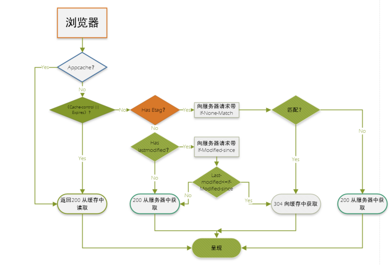

:::tip
说白了就是利用本地存储，把一部分数据保存在客户端，减少对服务器的请求，降低服务器压力，提升网页加载速度。

作为一名前端人缘，前端缓存只是是必须掌握的，因为一个网页打开页面的速度直接关系到用户体验，用户粘度，而提高网页的打开速度有很多方面需要优化，其中比较重要的一点就是利用好缓存，缓存文件可以重复利用，还可以减少带宽，降低网络负荷
:::

## 缓存

缓存从宏观上分为私有缓存和共享缓存，共享缓存就是哪些能被各级代理缓存的混存。私有缓存就是用户专享的，各级代理不能缓存的缓存.

缓存从微观上可以分为一下几类：
- 浏览器缓存
- 代理服务器缓存
- cdn缓存
- 数据库缓存
- 应用层缓存

这里主要对浏览器的缓存进行说明

## HTTP缓存
### 强缓存
- 不会向服务器发送请求，直接从缓存中读取资源
- 请求返回200的状态码
- 在chrome控制台的network选项中可以看到size显示from disk cache或from memory cache

from memory cache代表使用内存中的缓存，from disk cache则代表使用的是硬盘中的缓存,浏览器的读取缓存的顺序为memory->disk。在浏览器中，浏览器会在js和图片等文件解析执行后直接存入内存缓存中，那么当刷新时只需直接从内存缓存中读取(from memory cache);**而css文件则会存入硬盘文件中，所以每次渲染页面都需要从硬盘读取缓存(from disk cache)**

Expires和cache-control两者对比：差别不大，区别在于Expires是http1.0产物，Cache-Control是http1.1.产物，两者同时存在的话，Cache-Control优先级高于Expires。

### 协商缓存

协商缓存就是强制缓存失效后，浏览器携带缓存标识向服务器发起请求，由服务器根据缓存标识决定是否使用缓存的过程

#### Last-Modified和If-Modified-Since
浏览器在第一次访问资源时,服务器返回资源的同时，在response header中添加Last-Modified的header，值是这个资源在服务器上的最后修改时间，浏览器接收后缓存文件和header；

浏览器下一次请求这个资源，浏览器检测到有Last-Modified这个header，于是添加If-Modified-Since这个header，值就是Last-Modified中的值；服务器再次接收到这个资源请求，会根据If-Modified-Since中的值与服务器中这个资源的最后修改事件对比，如果没有变化，返回304和空响应题，直接从缓存读取，如果If-Modified-Since的时间小于服务器中这个自愿的最后修改事件，说明文件有更新，于是返回新的资源文件和200

缺点: 1.某些服务器不能获取精确的修改时间 2.文件修改事件改了，但文件内容却没有变。

#### Etag和If-None-Match
Etag是上一次加载资源时，服务器返回的response header,是对该资源的一种唯一的标识，只要资源有变化，Etag就会重新生成。浏览器在下一次加载资源向服务器发送请求时，会将上一次返回的Etag值放到request header里的IF-None-Match里，服务器只需要比较客户端传过来的If-None-Match跟自己服务器上该资源的Etag是否一致，就能很好判断资源相对客户端而言是否被修改过了。如果服务器发现Etag匹配不上，那么直接以常规GET 200回包形式将新的资源(当然也包括了新的Etag)发给客户端；如果Etag是一致的，则直接返回304知会客户直接用本地缓存即可

#### 协商缓存两种方式的比较
1. 首先在精确度上，Etag要优于Last-Modified，Last-Modified的时间单位是秒,如果某个文件1秒内改变了多次，那么他们的Last-Modified其实并没有体现出来修改，但是Etag每次都会改变确保精度；如果是负载均衡的服务器，各个服务器生成的Last-Modified也有可能不一致
2. 性能上，Etag要逊于Last-Modified，毕竟Last-Modified只需要记录时间，而Etag需要服务器通过计算来计算出一个hash值
3. 优先级上，服务器校验优先考虑Etag

## 缓存机制
appcache优先于强缓存，强制缓存优先于协商缓存进行，若强制缓存(Expries和Cache-Control)生效则直接使用缓存，若不生效则进行协商缓存(Last-Modified/If-Modified/Since和Etag/If-None-Match).协商缓存由服务器决定是否使用缓存,若协商失败，那么代表该请求的缓存失效，返回200，重新返回资源和缓存标识，在存入浏览器缓存中；生效则返回304，继续使用缓存。具体流程图

## 本地存储
本地存储主要有一下几种，localStroage, sessionStorage和cookie,Websql和IndexDB主要用在前端有大容量存储需求的页面上，例如，在线编辑浏览器或者网页邮箱。他们都可以讲数据存储在浏览器上，应该更具不同呢的场景进行使用。

### Cookie
Cookie主要由服务器生成，且前端也可以设置，保存在客户端本地的一个文件，通过response响应头的set-Cookie字段进行设置，且Cookie的内容自动在请求的时候传递给服务器。在客户端和服务器之间来回传递，耗性能

Cookie包含的信息：

它可以记录你的用户ID、密码、浏览过的网页、停留时间等信息。当你再次来到该网站时，网站通过读取Cookies，得知你的相关信息，就可以做出相应的动作，如在页面显示欢迎你的标语，或者让你不用你输入id、密码就可以直接登录等。一个网站只能读取它自己放置的信息，不能读取其他网站的Cookie文件。因此，Cookie文件还保存了host属性，即网站的域名或ip。 
这些属性以名值对的方式进行保存，为了安全，它的内容大多进行了加密处理。Cookie文件的命名格式是：用户名@网站地址[数字].txt
Cookie的优点：

- 给用户跟那个人性化的使用体验，如记住"密码功能"、老用户登录欢迎语
- 弥补了HTTP无连接特性
- 站点统计访问人数的一个依据

Cookie的缺点

- 它无法解决多人共用一台电脑的问题，带来了不安全因素
- Cookie文件容易被误删除
- 一人使用多台电脑
- Cookie欺骗。修改host文件，可以非法访问目标站点的Cookie
- 容量有限制，不能超过4kb
- 在请求头上带有数据安全性差

## 需要注意的问题
304 etag 数据库还是会查找搜索  304主要是省流量

## 资料
[原文](https://www.cnblogs.com/captainMforlife/p/11288424.html)

[浏览器缓存(一)：强缓存 MEMORY CACHE 和 DISK CACHE](https://blog.csdn.net/atty_ping/article/details/109839541)