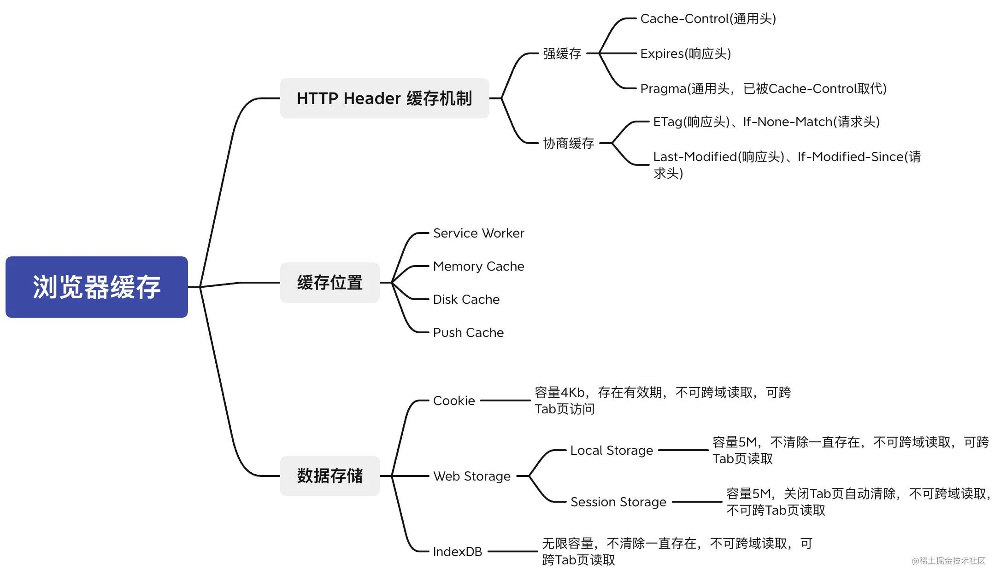
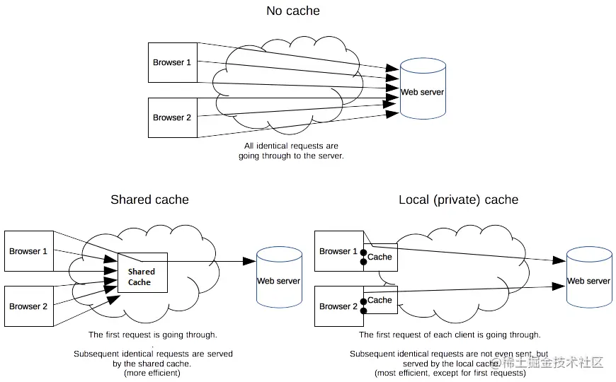

谈起性能优化,大家一开始就能想到缓存,缓存可以说是软件开发领域进行性能优化最简单高效的一种方式。好的缓存可以有效减少数据获取的代码(这里的代价抽象来说就是：传输距离、传输耗时和传输体积)

譬如，在前端领域使用合适的HTTP缓存可以缩短网页请求资源的距离，减少延迟，并且由于缓存文件可以重复利用，还可以减少带宽，降低网络负荷。基于浏览器本地存储方案进行数据缓存可以有效减少重复的数据请求和解析工作，让用户数据更快展现。

浏览器缓存从缓存类型来说可以分为资源缓存和数据缓存，资源缓存也就是常说的HTTP缓存，其可以包含有HTTP Header缓存机制、缓存位置两个内容，本文将全面梳理浏览器缓存中射击的知识点,希望为大家提供一些参考

## 浏览器缓存
### 资源缓存
资源缓存的主要对象是web站点的html、js、css、image、video、audio等静态资源文件。浏览器识别这些资源类型主要通过Content-Type实体头部，Content-Type标识着资源的[MIME](https://developer.mozilla.org/zh-CN/docs/Web/HTTP/Basics_of_HTTP/MIME_types)类型

资源缓存因为缓存数据的特殊性(无需解析响应数据体，整个响应体是纯文本数据)，可以采用多级缓存方式进行共享存储。也就是说可以在浏览器和服务器之间在家一层或多层代理缓存，代理缓存接受并转发浏览器的请求，然后接收浏览器的响应并缓存到本地。

根据是否加有代理缓存，可以将资源缓存归类为两类：私有缓存与共享缓存

- 共享缓存

    共享缓存可以被多个用户使用。例如，ISP或你所在的公司可能会假设一个web代理来作为本地网络基本的一部分提供给用户。这样热门的资源就会被重复利用，减少网络拥堵与延迟

- 私有缓存

    共享缓存存储的响应能够被多个用户使用。私有缓存只能用于单独用户。所以你在自己浏览器上的看到的缓存资源就是一种私有缓存。这些资源不能跨浏览器共享，更不能跨机器共享。

    下图分别示例了无缓存、共享缓存、私有缓存的模式

    

### 数据缓存
这里的数据缓存是限定在浏览器的缓存，跟服务端的缓存不是一回事儿。

那么浏览器的数据缓存是怎么做到呢？

答案就是Cookie、Web Storage、IndexDB三种浏览器本地数据存储API.关于这三种API除了IndexDB大家不长使用外，其他两种应该是用的很频繁吧。所以，其实大家在日常工作中已经大量使用了数据缓存技术

## 资源缓存过程分析

## 资料
[聊聊浏览器缓存策略那些事儿](https://juejin.cn/post/7066738436794744840#heading-2)