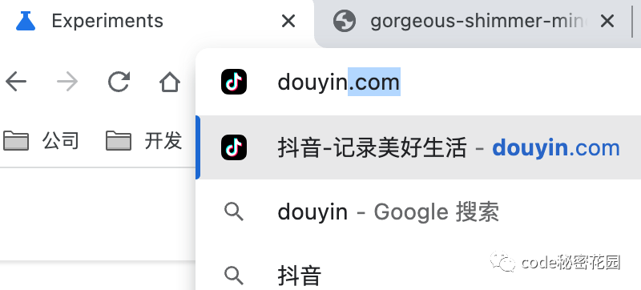
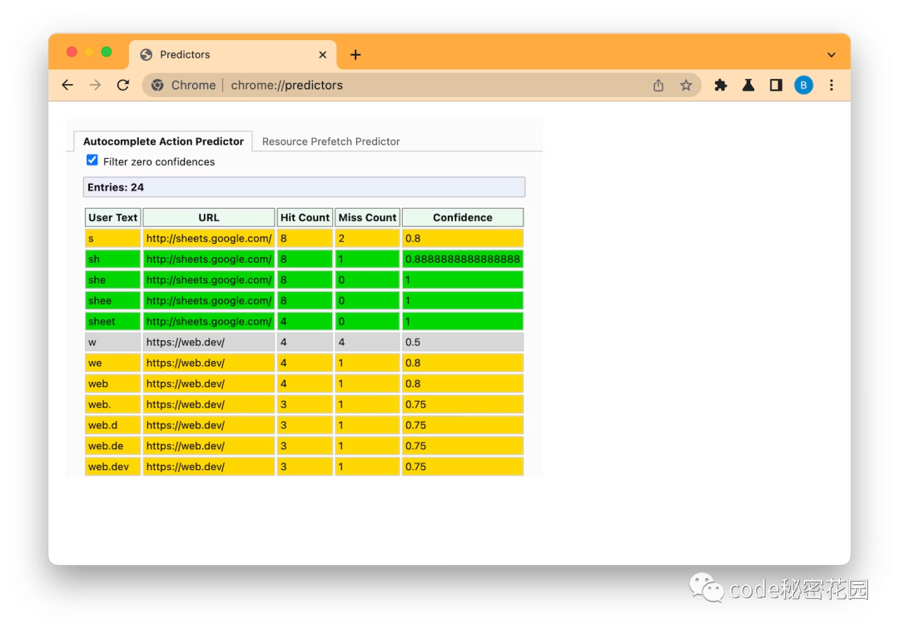
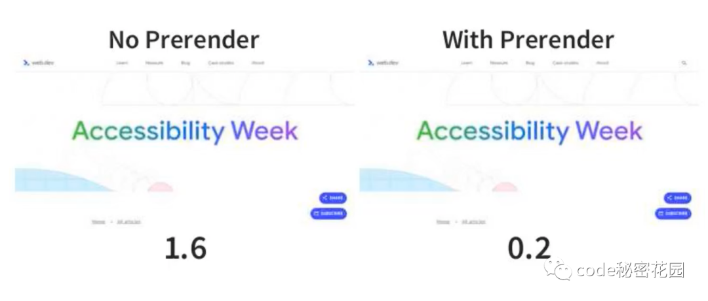
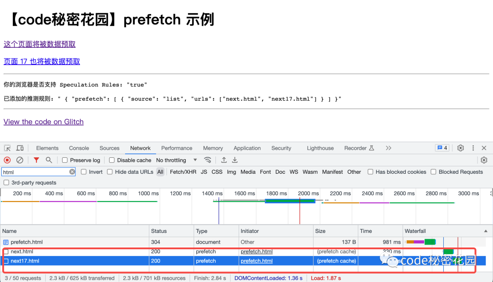
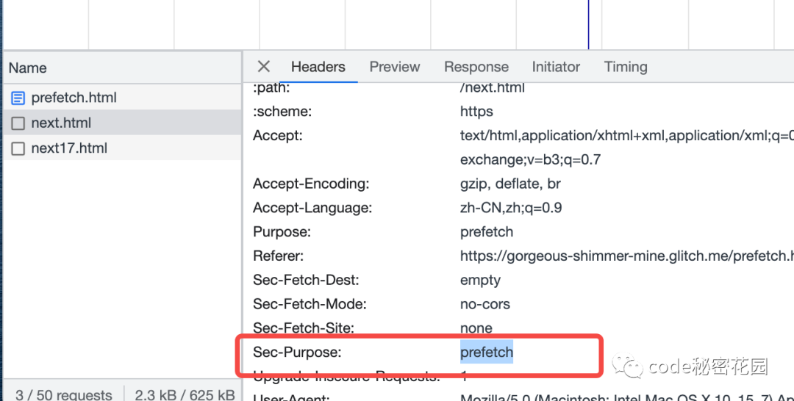
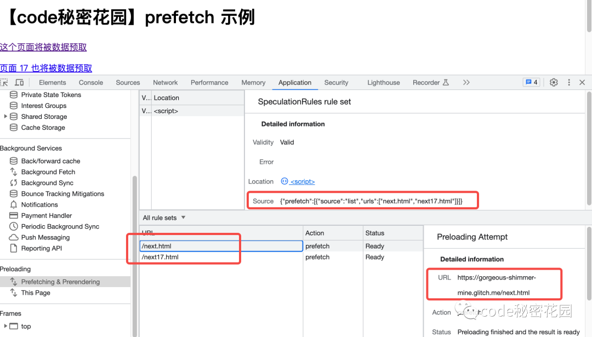
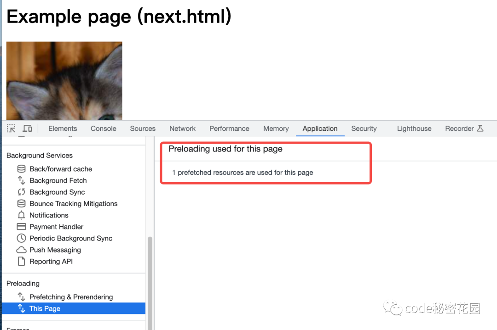
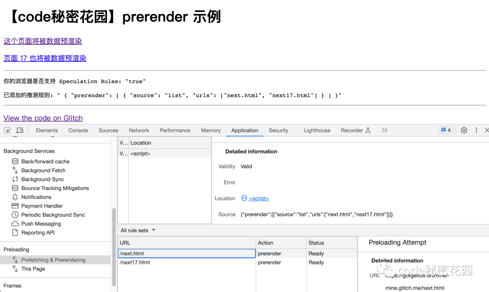

## 预渲染技术
什么是预渲染呢？

很好理解，就是当我们还没有访问页面时提前对页面进行渲染，等到我们真正访问页面时就不需要再话费额外的时间去渲染页面了。

在当今网页最重要的性能指标(Core Web Vitals)中,Largest Contentful Pint(LCP)(最大内容渲染)占据着重要的位置，这个指标也很好理解，也就是一个网页当前视口中可见的最大元素的渲染时间。

当我们访问一个网页时，浏览器首先会从服务器请求HTML。服务器返回HTML相应，然后HTML会告诉浏览器下一步的工作，包括请求CSS、Javascript等资源。等待这些资源返回后，浏览器才会进行真正的渲染动作.

所以,在以前，想要实现预渲染可能会通过下面两种方式

<span style="color: red">第一种是预取下个页面的资源</span>，根据Google Chrome的统计显示，网页大约40%的可见延迟都话费在浏览器等待服务器返回的第一个字节上了，所以提前把页面资源预取回来也可以极大的提高页面的性能；
```html
<link ref="prefetch" href="/next-page"/>
```
<span style="color: red">另一种方式，不仅会预取资源，还会提前进行一定渲染</span>
```html
<link ref="prerender" href="/next-page"/>
```
但除了Chrome之外，这种方式并没有得到广泛的支持，而且它不是一个表达能力很强的API

后来,Chrome又实现了NoState Prefetch，它和&lt;link ref="prefetch" href="/next-page/"&gt;这种方式类似，会提前获取未来需要加载的页面所需的资源，但不会完全预渲染页面，也不会执行Javascript。


NoState Prefetch确实可以通过改善资源加载来帮助我们提高页面性能，但它不会像完整预渲染那样提供及时的页面加载能力。

最近，Chrome团队引入一套全新的完整页面预渲染能力。

为了避免现有用于的复杂性，并且能够让预渲染技术的未来继续发张，新的预渲染机制将不适用&lt;link ref="prerender"...&gt; 以及 NoState Prefetch的保留的语法，未来也可能在某些节点禁用这些用法。

## 新一代预渲染
Chrome 提出的新一代预渲染技术奖通过一下三种方式提供：

当你在 Chrome 地址栏中输入 URL 时，如果Chrome 推测你会访问某个页面，它可能自动为你预渲染这个页面

当你在 Chrome 地址栏中输入一个关键字，Chrome可能会根据搜索引擎的提示自动为你预渲染页面



这意味着啥呢？当你在地址栏输入几个关键字，还没点进去，浏览器已经在帮你渲染了！！

<span style="color: green">大家可以通过 chrome://predictors 来看一下 Chrome 对你也中 URL 的预测</span>



绿色代表 Chrome 认为你有大于 80% 的概率会访问该页面，让你还没开始访问时，Chrome已经开始为你渲染这个页面了。

黄色代表 Chrome 认为你有大于 50% 的概率会访问该页面，这时候 Chrome 不会进行预渲染，但是会提前帮你预取资源。

那么在web开发中，我们怎么主动控制我们的网页的预渲染能力呢？

Speculation Rules API 可以以变成的编程的方式告诉 Chrome 需要预渲染哪些页面。这就取代了之前的&lt;link ref="prerender"... &gt;写法，它们可以是静态配置，也可以由Javascript动态注入

后面会详细介绍



以上是 web.dev 开启预渲染之前和之后性能对比(最大内容渲染)这个指标有了很大的提升

## Speculation Rules API
### 数据预取
将下面的 JSON 添加到网页中，可以出发浏览器对 next.html 和 next17.html 的数据预取

```html
<script type="speculationrules">
  {
    "prefetch": [
      {
        "source": "list",
        "urls": ["next.html", "next17.html"]
      }
    ]
  }
</script>
```
Prefetch 的推测规则只会对 HTML 文档进行预取，而不会预取页面上的子资源。

:::tip
与旧的 &lt;link ref="prefetch"&gt; (预取的数据存放在HTML缓存)机制不同，通过Speculation Rules 进行的预取，数据是保存在内存中的，所以浏览器一点需要可以更快的访问到这些资源
:::

我们可以在 Network 看板中通过 Speculation Rules 进行预取的资源请求



其对应的资源类型为 prefetch,并且此类请求还会添加一个 Sec-Purpose: prefetch HTTP Header，服务端可以通过这个 Header来师表这些请求



另外，在 Application 看板中也专门新增了一个 Preloading 部分来帮助我们调式和查看推测规则，这里我们可以看到当前页面配置的预渲染规则集是怎样的，以及对哪些页面进行了数据预期



打开一个在推测规则中的页面，我们也可以看到这个页面是成功被预取的：



## 预渲染
如果要实现页面的预渲染，将下面的 JSON 添加到网页中，语法和预取是一样的

```html
<script type="speculationrules">
    {
        "prerender": [
            {
                "source"： "list",
                "urls": ["next.html", "next17.html"]
            }
        ]
    }
</script>
```
:::tip
目前浏览器只能支持同站站点的预渲染，例如 https://1.conardli.com 可以预 https://17.conardli.com 上的页面。注意如果是非同源的情况，需要预渲染的页面必须包括一个 Supports-Loading-Mode: credentialed-prerender Header 。
:::
**但是, 与Prefetch不同的是，预渲染的请求在Network看办理没办法直接看到的，因为他们是在 Chrome 中单独渲染进程中获取和渲染的**

这时候，我们只能通过 Application 的 Preloading 看板进行调试了



### 组合规则
一个页面上可以同时配置多个推测规则
```html
<script type="speculationrules">
{
  "prefetch": [
    {
      "source": "list",
      "urls": ["数据预取17.html"]
    }
  ]
}
</script>
<script type="speculationrules">
{
  "prerender": [
    {
      "source": "list",
      "urls": ["预渲染17.html"]
    }
  ]
}
</script>
```
同样的，一个推测规则也可以设置为数组：
```html
<script type="speculationrules">
{
  "prerender": [
    {
      "source": "list",
      "urls": ["17.html"]
    },
    {
      "source": "list",
      "urls": ["1717.html"]
    }
  ]
}
</script>
```
<span style="color: red">注意：目前浏览器限制一个页面最多预渲染10个子页面</span>

### JS动态添加
一般来讲，推测规则可以有两种配置方式

第一种是静态JSON的方式，对于一些拥有静态内容的页面，比如博客，一般要预渲染的页面是固定的，可以用静态配置

但是大部分网站还是动态的，我们可能要根据一些条件来动态判断要预渲染的页面，可以用 Javascript 添加

```js
// 判断浏览器是否支持 speculationrules
if (HTMLScriptElement.supports &&
    HTMLScriptElement.supports('speculationrules')) {
    const specScript = document.createElement('script');
    specScript.type = 'speculationrules';
    specRules = {
    prerender: [
        {
            source: 'list',
            urls: ['/17.html'],
        },
    ],
    };
    specScript.textContent = JSON.stringify(specRules);
    console.log('添加预渲染规则: 17.html');
    document.body.append(specScript);
}
```

## 资料
[原文](https://mp.weixin.qq.com/s/0SnEBljUKjmBDQkeZnUiDQ)