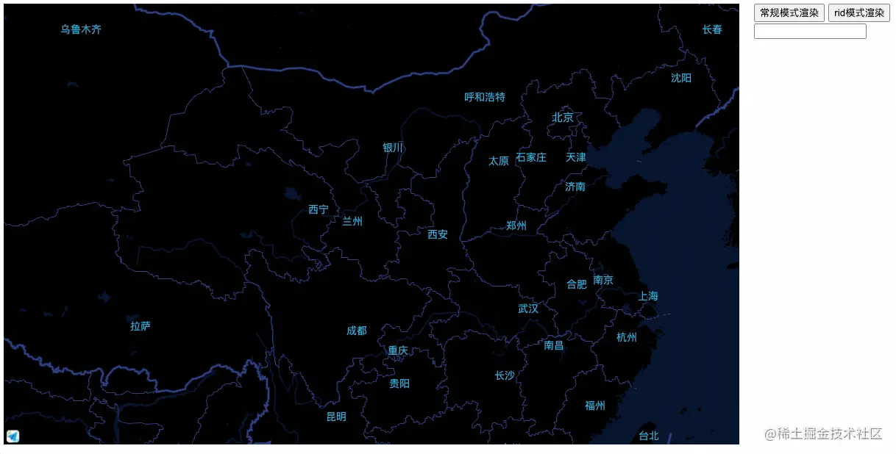
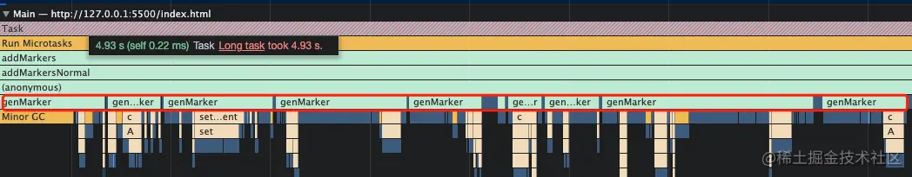
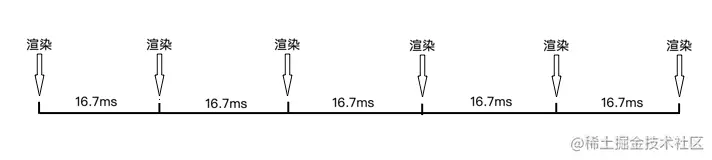
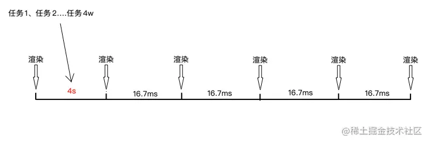
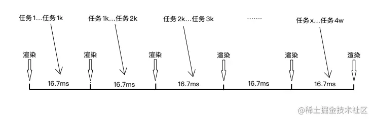
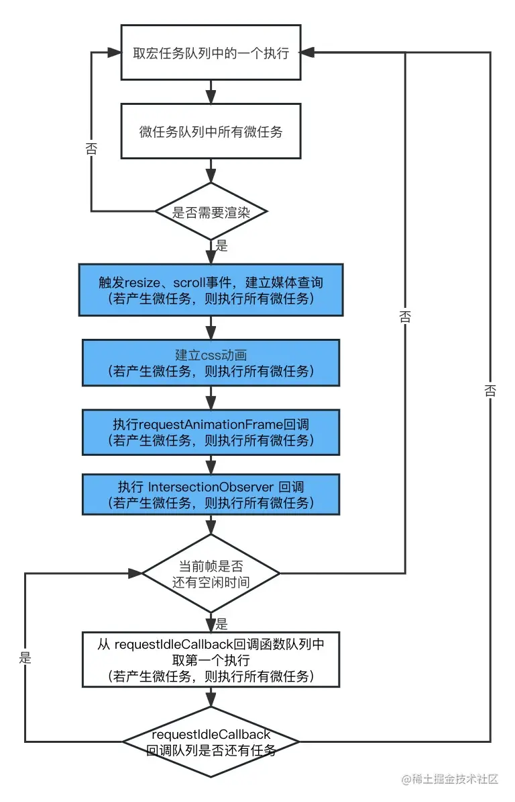
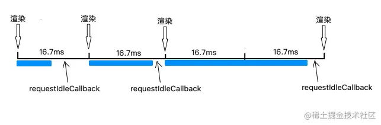
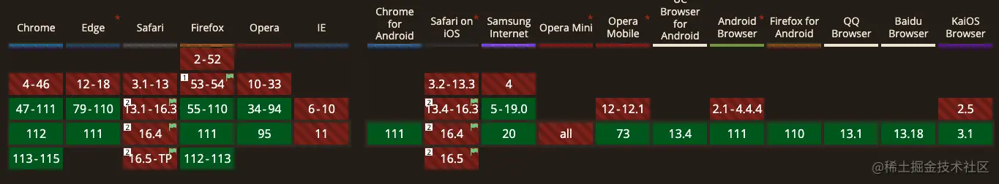
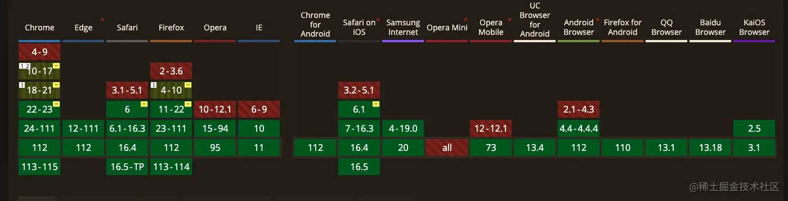
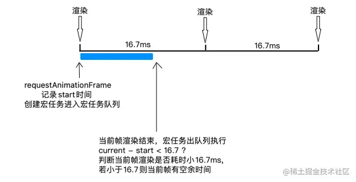

## 需求背景
需要基于高德地图展示海量点位(大概几万个),点位样式要自定义(创建DOM),虽然使用了聚合点，但初始化时扔需要将几万个点位的DOM结构都创建出来

:::tip
这里补充一句，高德地图在2.0版本对这种方式进行了优化，但同时少了某些功能，我的需求要使用1.4版本的这种方式渲染。
:::

## 问题及定位分析
功能实现后,发现从开始加载点位，到点位出现的过程中，页面会卡死，无法响应用户交互，可以点击[demo]
(https://huangx.top/static/rid-map/)的常规模式查看效果（实际业务下有更多逻辑，阻塞时间会更久）。


可以看到，当我开始渲染点位后，点击输入框进行输入，是没有立即响应的，点位加载后才会对之前的交互做响应

### 问题分析
其实从上面高德地图的点位渲染逻辑很容易想到主要是批量创建点位的DOM结构占用了主线程


可以看到，批量的genMarker任务占用了大量时间，getMarker会在每次创建点位时执行一次，一次创建4w个点位，就会连续执行4w次
```js
// 生成点位，创建DOM自定义样式
getMarker(device) {
    const innerHTML = `<div class="camera"></div>`;
    const size = [48, 49];
    const markerOffset = new AMap.Pixel(-size[0] / 2, -size[1] / 2);
    const marker = new AMap.Marker({
        position: device.lnglat,
        extData: device,
        size,
    })
    const container = document.createElment('div');
    container.className = 'map-marker';
    container.innerHTML = innerHTML;
    marker.setContent(container);
    marker.setOffset(markerOffset);
    marker.selected = false;
    return marker;
}
```
## 页面显示机制


动的画面其实是由一帧一帧的静态图快速切换组成的，人眼的反应速度有限，当画面切换的够快，人眼看着就是连续的动画了。

对于人眼来说，当每秒切换60张图片时，就会认为是连贯的。所以主流的显示器是60HZ，1s刷新60次，那么每16.7ms需要刷新一次，浏览器会自动适配这个频率，这时对应我们前端页面就是每16.7ms需要渲染一次



<span style="color: red">页面每隔16.7ms才会渲染一次，那么在两次渲染的中间时间，就是浏览器的空闲时间, 在这段空闲时间执行的任务，是不会阻塞到页面渲染的流畅性的</span>

<span style="color: red">反之，对于上面的案例，数万个genMarker在一帧区间内连续的执行，下一帧一直不能渲染，页面看起来就被卡主了</span>



## 任务拆分
:::tip
对于大量的计算或许首先考虑的是Web Worker使其不占用主线程，但是由于要操作DOM，不适合当前场景
:::
对于页面的流畅性来说,这些点位的创建属于「低优先级任务」。既然卡顿的原因是这些genMarker任务一个接一个「连续」的在执行，一直占用着主线程，那么我们可以将这些批量的任务进行拆分，保证这些任务只能在空闲时间执行。每次执行下一个任务的时候，先检查是否该渲染下一帧了，这时需要「把主线程让出来」，让页面进行渲染(了解react的人应该感觉很熟悉了， 思路来自react的Fiber)



### requestIdleCallback
「让出主线程」，关键一点在于我们如何知道什么时候是空闲时间，什么时候空闲时间结束，该进行渲染了。

<span style="color: red">**requestIdleCallback就是浏览器提供给我们用来判断这个时机的api，它会在浏览器的空闲时间来执行传给它的回调函数。另外如果指定了超时时间，会在超时后的下一帧强制执行**</span>

```js
const id = window.requestIdleCallback((deadline) => {
    // 当前帧剩余时间大于0,或任务已超时
    if(deadline.timeRemaining() > 0 || deadline.didTimeout) {
        // do something
        console.log(1)
    }
}, { timeout: 2000 }); // 指定超时时间
// window.cancelIdleCallback(id) 与定时器类似，支持取消
```
requestIdleCallback在Event Loop的执行时机如下图所示，蓝色区域代表一帧内的渲染人物，当这些任务执行完后，剩余的时间被认为是空闲时间





### 举个🌰

[demo](https://code.juejin.cn/pen/7220600966628769792)
> 点击常规模式，页面会被卡住；点击rid模式，页面流畅渲染

以一个简单的任务(singTask)为例，以常规模式连续执行2w次，全部执行完需要大概2s时间(以来机器性能变化)，这期间主线程一直被占用，页面会被卡住

```js
function singleTask() {
    const now = performance.now();
    while(proformance.now() - now < 0.0.1) {
        // 模拟耗时操作，每次任务耗时约0.001ms
    }
}

const data = new Array(20000).fill(1);
function normarlRun() {
    for(let i = 0; i < data.length; i++) {
        // 2w个任务连续执行
        singleTask(data[i]);
    }
    result('done')
}
```
对其使用requestIdleCallback进行拆分，只在空闲时间执行部分任务，若当前帧的空闲时间结束，则暂停批量任务，让出主线程
```js
function ridRun() {
    let i = 0; 
    let option = { timeout: 200 }; // 任务超时时间

    function handler(idleDeadline) {
        // 每次执行任务前，判断当前帧是否还有空闲时间
        while((idleDeadline.timeRemaining() > 0 || idleDeadline.didTimeout) && i < data.length) {
            // 当前帧有剩余时间，或任务已等待超时强制执行
            singleTask(data[i++]);
        }

        // idleDeadline.timeRemaining() === 0 当前帧已没有空闲时间，让出主线程

        if(i < data.length) {
            window.requestIdleCallback(handler, option); // 任务未执行完，继续等待下次空闲时间执行
        } else {
            result('done'); 
        }
    }
    window.requestIdleCallback(handler, option);
}
```
### 模拟requestIdleCallback
不幸的是requestIdleCallback兼容性不够好，Safari完全不支持



参考react的实现，我们可以使用requestAnimationFrame 和 MessageChannel 来模拟实现一个 requestIdleCallback



<span style="color: red">**requestAnimationFrame在每一帧开始渲染前执行(见上面的Event Loop图)，当帧开始渲染前，我们标记开始时间(start),并使用MessageChannel创建一个宏任务，根据上面的Event Loop流畅，渲染完毕后，会执行刚才创建出的宏任务，这时在宏任务中判断当前帧渲染耗费的时间(current- start),判断渲染耗时是否小于16.7ms(current - start < 16.7),来判断当前是否是空闲时间**</span>



:::tip
setTimeout 即使指定时间为0 浏览器时机也会延迟几毫秒后才执行(chrome大概为4ms),因此使用MessageChannle而不是setTimeout来创建宏任务
:::
<span style="color: red">模拟 requestIdleCallback 的具体实现</span>

```js
const genId = (function () {
  let id = 0
  return function () {
    return ++id
  }
})()

const idMap: {
  [key: number]: number
} = {}

const _requestIdleCallback: (
  cb: (idleDeadline: IdleDeadline) => void,
  options?: { timeout: number }
) => number = function (cb, options) {
  const channel = new MessageChannel()
  const port1 = channel.port1
  const port2 = channel.port2
  let deadlineTime: number // 超时时间
  let frameDeadlineTime: number // 当前帧的截止时间
  let callback: (idleDeadline: IdleDeadline) => void

  const id = genId()

  port2.onmessage = () => {
    const frameTimeRemaining = () => frameDeadlineTime - performance.now() // 获取当前帧剩余时间
    const didTimeout = performance.now() >= deadlineTime // 是否超时

    if (didTimeout || frameTimeRemaining() > 0) {
      const idleDeadline = {
        timeRemaining: frameTimeRemaining,
        didTimeout
      }
      callback && callback(idleDeadline)
    } else {
      idMap[id] = requestAnimationFrame((timeStamp) => {
        frameDeadlineTime = timeStamp + 16.7
        port1.postMessage(null)
      })
    }
  }

  idMap[id] = window.requestAnimationFrame((timeStamp) => {
    frameDeadlineTime = timeStamp + 16.7 // 当前帧截止时间，按照 60fps 计算
    deadlineTime = options?.timeout ? timeStamp + options.timeout : Infinity // 超时时间
    callback = cb
    port1.postMessage(null)
  })

  return id
}

const _cancelIdleCallback = function (id: number) {
  if (!idMap[id]) return
  window.cancelAnimationFrame(idMap[id])
  delete idMap[id]
}

export const requestIdleCallback = window.requestIdleCallback || _requestIdleCallback
export const cancelIdleCallback = window.cancelIdleCallback || _cancelIdleCallback
```

### 使用requestIdleCallback拆分点位生成
将genMarker批量任务进行拆分，只在空闲时间 进行拆分

```js
addMarkersByRid() {
    cancelIdleCallback(this.ridId);
    const { markerList, points, genMarker, genCluster } = this;
    let index = 0;
    const ridOption = { timeout: 20 };
    const handler = (idleDeadline) => {
        const { timeRemaining } = idleDeadline;
        // 只有空闲时间生成点位
        while(timeRemaining() > 0 && index < points.length) {
            const device = points[index];
            const marker = genMarker(device);
            markerList.push(marker);
            index++;
        }
        if(index < points.length) {
            this.ridId = requestIdleCallback(handler, ridOption);
        } else {
            console.log('done'); // 全部点位生成完毕
        }
    }
    this.ridId = requestIdleCallback(handler, ridOption)
}
```
可以看到，点位的渲染并没有再影响到页面的响应了，可以在[这里](https://huangx.top/static/rid-map/)自己体验一下差异。


## 资料
[批量任务导致页面卡死？试试requestIdleCallback对任务进行拆分](https://juejin.cn/post/7221793823705268284)