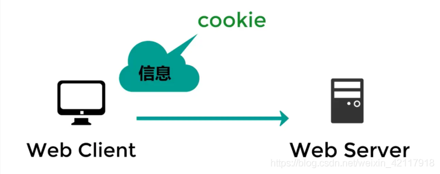
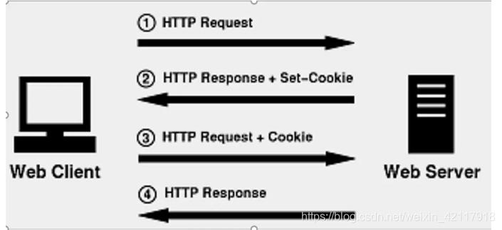
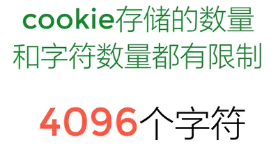
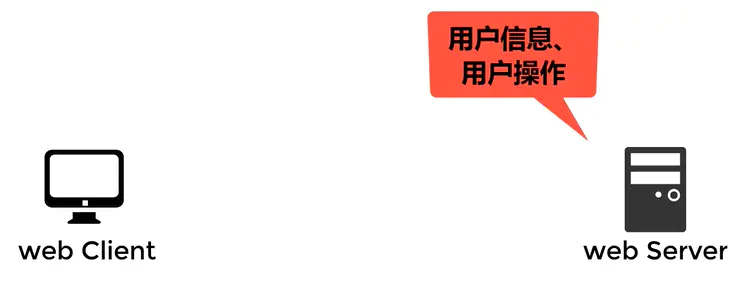
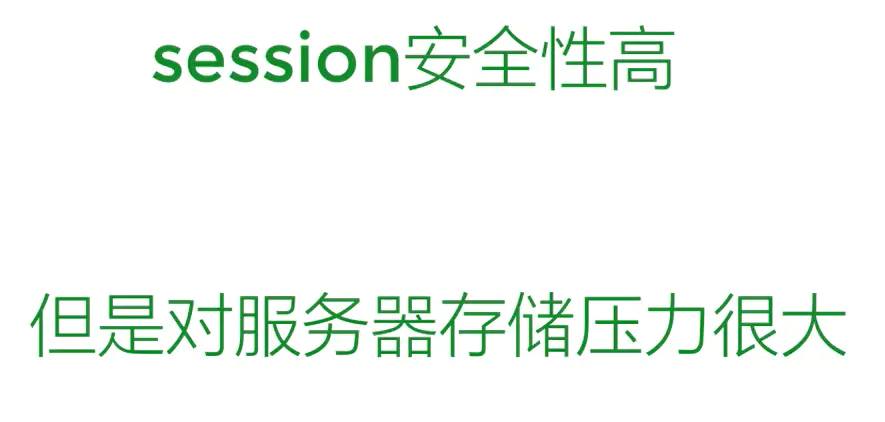
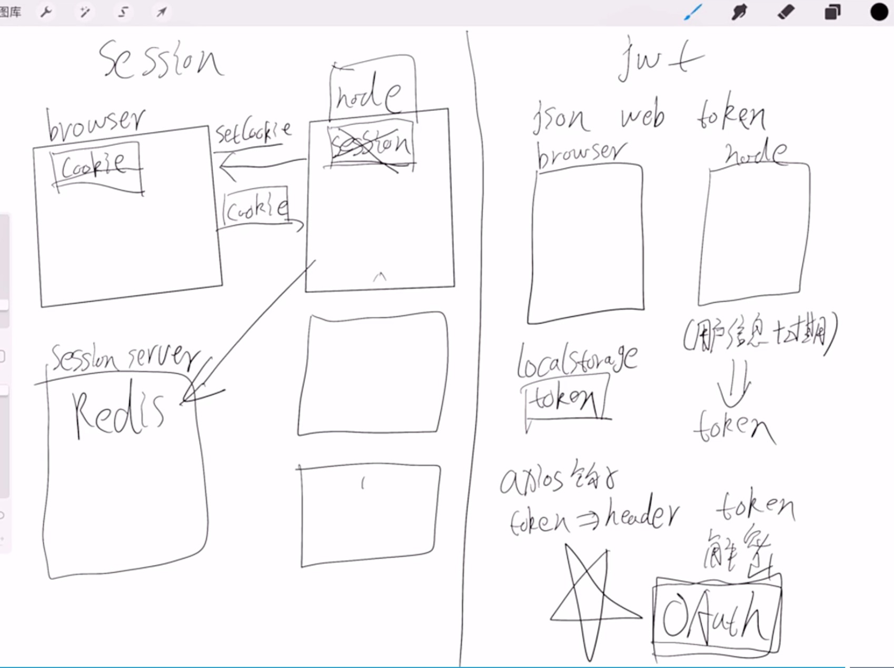

## 概念理解
首先，要了解session和cookie的区别先要了解以下几个概念
1. 无状态的HTTP协议

协议，是指计算机通信网络中两台计算机之间进行通信所必须遵守的规定或规则，超文本传输协议(HTTP)是一种通信协议，它允许将超文本标记语言(html)文档从WEB服务器传送到客户端浏览器

HTTP协议是无状态的协议。一旦数据交换完毕，客户端与服务端的连接就会关闭，再次交换数据需要重新建立新的了解。**这就意味着服务器无法从连接上跟踪会话**。


> 我们浏览网页使用的HTTP协议是无状态的协议，就是说网页一关闭，浏览器和服务端的连接就会断开，下次打开网页又要重新连接，服务器无法从你一打开的连接上恢复上一次的会话，服务器不知道是你又回来了。

2. 会话跟踪

会话，指用户登录网站后的一系列动作，比如浏览商品添加到购物车并购买。会话跟踪是Web程序中常用的技术，用来**跟踪用户的整个会话**。常会的会话跟踪技术是Cookie和Session。**Cookie通过客户端记录信息确定用户身份，Session通过服务端记录信息确定用户身份**。


## Cookie

由于HTTP是一种无状态的协议，服务器单从网络连接无从知道客户身份。用户A购买了一件商品放入购物车内，当再次购买商品时已经无法判断该购买行为是属于用户A的会话还是用户B的会话了。怎么办呢？就给客户端颁发一个通行证，每人一个，无论是谁访问都必须携带自己的通行证，这样服务器就能从通行证上确定客户身份了。这就是Cookie的工作原理。




> 我们之前把你的信息记录在cookie里，在你打开网页和服务器建立连接的时候，把cookie记录的你的信息一起发送给服务器，这样服务器就能从cookie接收到的信息里识别你的身份，让页面为你提供特别属于你的内容



我们访问浏览器的时候，浏览器会发送一个HTTP请求到服务器端；

服务器会发送一个HTTP响应到客户端，其中包括Sst-Cookie，意思就是浏览器建立一个cookie保存服务器指定的内容，比如用户信息和用户操作信息；

浏览器保存好信息之后，下次我们再次访问网站的时候，浏览器再发送HTTP请求到服务器端时都会携带之前保存的cookie；

服务器端会从收到的cookie中识别用户身份，就能让页面为你提供专门属于你的内容了




1. 会话cookie和持久cookie

若不设置过期时间，则表示这个cookie的生命周期为浏览器的会话期间，关闭浏览器窗口，cookie就消失。这种生命期为浏览器会话期的cookie称为会话cookie，会话cookie一般不存储在硬盘上而是保存在内存里，当然这种行为并不苏规范规定的。

若设置了过期时间，浏览器就会把cookie保存在硬盘上，关闭后再次打开浏览器，这些cookie仍然有效指导超过过期时间。称为持久cookie

2. Cookie具有不可跨域名性

就是说，浏览器访问百度不会带上谷歌的cookie

## Session

Session是另一种记录客户状态的机制，不同的是Cookie保存在客户端浏览器中，而Session保存在服务器上，客户端浏览器访问服务器的时候，服务器把客户端信息以某种形式记录在服务器上，这就是Session；客户端浏览器再次访问只需要从该Session中查找该用户的状态就可以了。


客户端浏览器访问网站的时候


服务器会向客户浏览器发送一个每个用户特有的会话编号sessionID，让他进入到cookie里。



服务器同时也把sessionID和对应的用户信息、用户操作记录在服务器上，这些记录就是session。


客户端浏览器再次访问时，会发送cookie给服务器，其中就包含sessionID。


服务器从cookie里找到sessionID，再根据sessionID找到以前记录的用户信息就可以知道他之前操控些、访问过哪里。




## 总结

1. Cookie数据存放在客户的浏览器上，session数据存放在服务器上
2. Cookie不是很安全，别人可以分析存放在本地的cookie并进行欺骗，考虑到安全应该使用session
3. Session会在一定事件内保存在服务器上，当访问增多，会比较占用你的服务器性能，考虑奸情服务器性能压力，应当使用cookie
4. 单个cookie保存数据不能超时4k,很多浏览器限制一个站点最多保存20个Cookie
5. 可以考虑将登陆信息等重要的信息存放在session，其他信息如果需要保留，可以放在cookie中

## Json Web Token(JWT)

目前最流行的跨域认证解决方案

### 跨域认证的问题

互联网服务离不开用户认证。一般流程是下面这样。

::: tip
1. 用户向服务器发送用户名和密码
2. 服务器验证通过后，在当前对话(session)里面保存相关数据，比如用户角色、登录时间等等。
3. 服务器向用户返回一个session_id,写入用户的Cookie。
4. 用户随后的每一次请求，都会通过Cookie，将session_id传回服务器
5. 服务器收到session_id，找到前期保存的数据，由此得知用户的身份
:::

这种模式的问题在于，扩展性(scaling)不好。单机没有问题，如果是服务器集群，或者是跨域的服务导向架构，就要求session数据共享，每台服务器都能读取session

举例，A网址和B网址都是同一家公司的关联服务。现在要求，用户只要在一个网站登录，在访问另一个网站就会自动登录，怎么实现。

一种解决方案是 session 数据持久化，写入数据库或别的持久层。各种服务收到请求后，都向持久层请求数据。这种方案的优点是架构清晰，缺点是工程量比较大。另外，持久层万一挂了，就会单点失败。

另一种方案是服务器索性不保存 session 数据了，所有数据都保存在客户端，每次请求都发回服务器。JWT 就是这种方案的一个代表。

### JWT的原理
JWT的原理，服务器认证以后，生成一个JSON对象，发回给用户

```
{
    "姓名": "张三",
    "角色": "管理员",
    "到期时间": "2021年7月1日"
}
```
以后，用户与服务端通信得时候，都要发回这个JSON对象。服务器完全只靠这个对象认定用户身份。为了防止用户篡改数据，服务器在生成这个对象得时候，会加上签名(详见后文)。

服务器就不保存任何session数据了，也就是说，服务器编程了无状态了，从而比较容易实现扩展 

### JWT得数据结构

实际上得JWT大概就想下面这样 


它是一个很长得字符串，中间用点(.)分割成三个部分。注意，JWT内部是没有换行得，这里只是为了便于展示，将他写成机场。

JWT的三个部分依次如下。

::: tip
- Header (头部)
- Payload (负载)
- Signature (签名)
:::

写成一行，就是下面这个样子。

```
Header.Payload.Signature
```


下面依次介绍这三个部分

#### Header--头部

Header部分是一个JSON对象，描述JWT的元数据,通常是下面的样子

```
{
    "alg": "HS256",
    "typ": "JWT"
}
```
上面代码中，alg属性表示签名的算法(algorithm)，默认是HMAC SHA256(写成HS256);typ属性表示这个令牌(token)的类型(type),JWT令牌统一写为JWT.

最后，将上面的JSON对象使用Base64URL算法转成字符串。

#### Payload---载荷

Payload部分也是一个JSON对象，用来存放实际需要传递的数据。JWT规定了7个官方字段，供选用。

::: tip
- iss (issuer): 签发人
- exp (expiration time): 过期时间
- sub (subject)：主题
- aud (audience): 受众
- nbf (Not Before)： 生效时间
- iat (Issued  At): 签发时间
- jti (JWT ID): 编号
:::

除了官方字段，你还可以在这个部分定义私有字段,例如

```
{
    sub: '123445',
    name: 'John Doe',
    admin: true
}
```

注意，JWT默认是不加密的,任何人都可以读到，所以不要把秘密信息放在这个部分。

这个JSON对象也要使用Base64URL算法转成字符串

#### Signature---签名

**Signature部分是对前两部分的签名，防止数据篡改。**

首先,需要指定一个密钥(secret)。这个密钥只有服务器才知道,不能泄露给用户。然后，使用Header里面指定的签名算法(默认是HMAC SHA256)，按照下面的公式产生签名

```
HMACSHA256(
  base64UrlEncode(header) + "." +
  base64UrlEncode(payload),
  secret)
```
算出签名以后，把Header、Payload、Signature三个部分拼成一个字符串，每个部分之间用"点"(.)分割，就可以返回给用户。

#### Base54URL

前面提到，Header和Payload串型化的算法是Base64URL。这个算法跟Base64算法基本类似，但是有一些小的不同。

JWT作为一个令牌(token)，有些场合可能会放到URL(比如api.example.com/?token=xxx).Base64有三个字符+、/和=,在URL里面有特殊函数，所以要被替换掉：=被省略、+被替换成-，/替换成_。这就是Base64URL算法。

### JWT的使用方式

客户端收到服务器返回的JWT,可以存储在Cookie里面，也可以存储在localStorage.

此后，客户端每次与服务器通信，都要带上这个JWT.你可以把它放在Cookie里面自动发送，但是这样不能跨域，所以更好的做法是放在HTTP请求的头信息Authorization字段里面

```
Authorization: Bearer <token>
```
另一种做法是，跨域的时候，JWT就放在POST请求的数据提里面。

### JWT的几个特点

1. JWT默认是不加密的，但也是可以加密的，生成原始Token以后，可以用密钥在加密一次
2. JWT不加密的情况下，不能将秘密数据写入JWT
3. JWT不仅可以用于认证，也可以用于交换信息。有效使用JWT，可以降低服务器查询数据库的次数
4. JWT的最大缺点是，由于服务器不保存session状态，因此无法在使用过程中废某个token，或者更改token的权限。也就是说，一旦JWT签发了，在到期之前就会始终有效，除非服务器部署额外的逻辑
5. JWT本身包含了认证信息，一旦泄露，任何人都可以获得该令牌的所有权限。为了减少盗用，JWT的有效期应该设置的比较短。对于一些比较重要的权限，使用时应该再次对用户进行认证。
6. 为了减少盗用，JWT不应该使用HTTP协议明码传输，要使用HTTPS协议传输


[参考地址](http://www.ruanyifeng.com/blog/2018/07/json_web_token-tutorial.html)

## oauth

核对签名 载荷 过期时间？

[OAuth 2.0 的一个简单解释](http://www.ruanyifeng.com/blog/2019/04/oauth_design.html)

[OAuth 2.0 的四种方式](https://www.ruanyifeng.com/blog/2019/04/oauth-grant-types.html)


## SSO--单点登录

[参考地址](https://www.jianshu.com/p/75edcc05acfd)

[参考地址](https://blog.csdn.net/zhang_java_11/article/details/107690042)