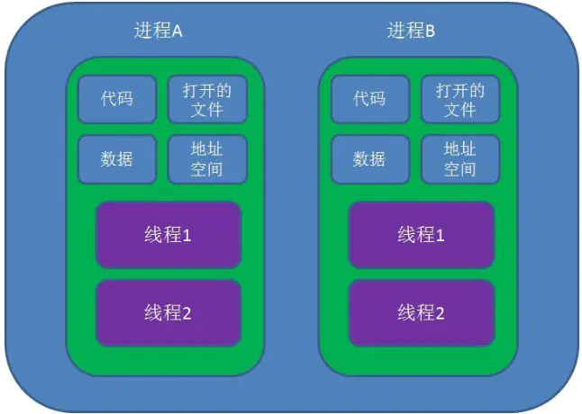
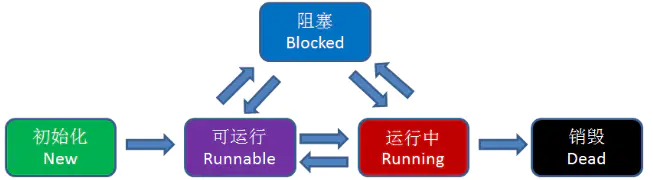
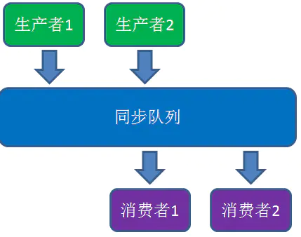
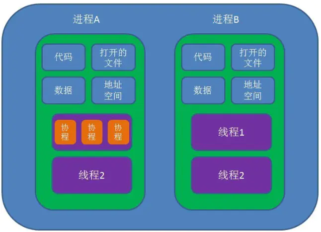

## 什么是进程和线程

进程是应用程序的启动实例，进程拥有代码和打开的文件资源、数据资源、独立的内存空间。

线程从属于进程，是程序的实际执行者，一个进程至少包含一个主线程，也可以有更多的子线程，线程拥有自己的栈空间

对操作系统而言，线程是最小的执行单元，进行是最小的资源管理单元。无论是进程还是线程，都是有操作系统所管理的

线程的状态：初始化、可运行、运行中、 阻塞、销毁

线程之间是如何进行协作的呢？

最经典的例子就是生产者/消费者模式，即若干个生产者线程向队列中添加数据，若干个消费者从队列中消费数据

生产者/消费者模式的性能问题是什么？

    - 涉及到同步锁
    - 涉及到线程阻塞状态和可运行状态之间的切换
    - 涉及到线程上线文的切换

## 什么是协程呢？

协程(Coroutines)是一种比线程更加轻量级的存在，正如一个进程可以拥有多个线程一样，一个线程可以拥有多个协程。

协程不是被操作系统内核所管理的，而是完全有程序所控制，也就是在用户态执行。这样带来的好处是性能大幅度的提升，因为不会像线程切换那样消耗资源。

协程不是进程也不是线程，而是一种特殊的函数，这个函数可以在某个地方挂起，而且可以重新在挂起处继续运行。所以说，协程与进程、线程相比并不是一个纬度的概念。

一个进程可以包含多个线程，一个线程也可以包含多个协程。简单来说，一个线程内可以由多个这样的特殊函数在运行，但是有一点必须明确的是，一个线程的多个协程的运行是串行的。如果是多核CPU，多个进程或一个进程内的多个线程是可以并行运行的，但是一个线程内协程却绝对是串行的，无论CPU有多少核。毕竟协程虽然是一个特殊的函数，但仍然是一个函数.一个线程内可以运行多个函数，但是这些函数都是串行的。当一个协程运行时，其他协程必须挂起。

## 进程、线程、协程的对比

- 协程既不是进程也不是线程，协程仅仅是一个特殊的函数，协程和进程、线程不是一个纬度的
- 一个进程可以包含多个线程,一个线程可以包含多个协程
- 一个线程内的多个协程虽然可以切换，但是多个协程是串行执行，只能在一个线程内运行，没有办法利用CPU多核能力的。
- 协程与进程一样，切换是存在上下文切换问题的

上下文切换

- 进程的切换者是操作系统，切换时机是根据操作系统自己的切换策略，用户是无感知的。进程的切换内容包括页全局目录、内核栈、硬件上下文，切换内容保存在内存中。进程切换过程是由“用户态到内核态到用户态”的方式，切换效率低。

- 线程的切换者是操作系统，切换时机是根据操作系统自己的切换策略，用户无感知。线程的切换内容包括内核栈和硬件上下文。线程切换内容保存在内核栈中。线程切换过程是由“用户态到内核态到用户态”， 切换效率中等。

- 协程的切换者是用户（编程者或应用程序），切换时机是用户自己的程序所决定的。协程的切换内容是硬件上下文，切换内存保存在用户自己的变量（用户栈或堆）中。协程的切换过程只有用户态，即没有陷入内核态，因此切换效率高。

[原文链接](https://www.jianshu.com/p/6dde7f92951e)