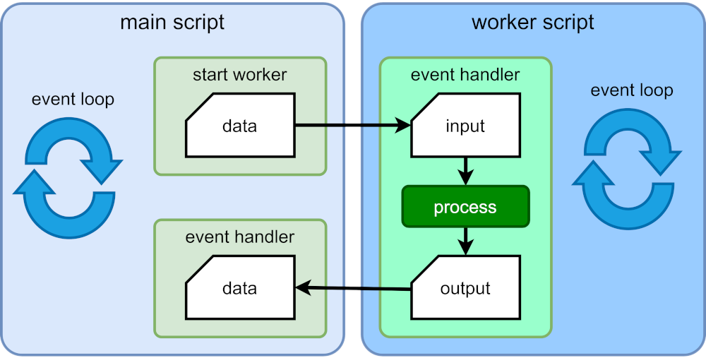
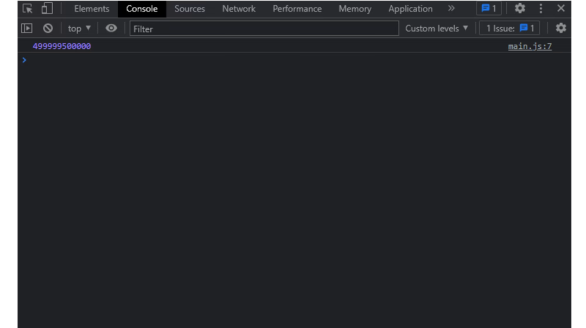
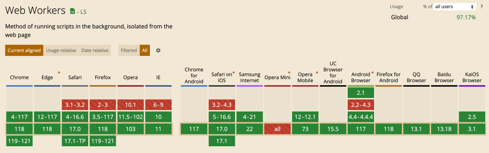

多线程是现代软件开发中用于增强应用的性能和响应能力的重要技术。然而,Javascript是一门单线程语言，它天生是不支持多线程的。为了客服这一限制，引入了Web Workers。本文就来探讨 Web Workers对web多线程的重要性，以及使用他们的限制和注意事项

## Web Workers 概述

### 概念
Web Workers 是现代 Web 开发的一项强大功能，于 2009 年作为 HTML5 规范的一部分引入。它们旨在提供一种在后台执行 JavaScript 代码的方法，与网页的主执行线程分离，以提高性能和响应能力。

由于 Javascript 是单线程，当执行比较耗时的任务时,就会阻塞主线程病导致页面无法响应，这就是 Web Workers 发挥作用的地方。它允许在一个单独的线程(**成为工作线程**)中执行耗时的任务。这使得 Javascript 代码可以在后台执行，而不会阻塞主线程并导致页面无响应。

Web Workers 是一个作为后台线程运行的脚本，具有自己的引擎实例和事件循环。它与主线程并行运行，并且不会阻塞事件循环。

主线程(或工作线程本身)可以启动任意数量的工作线程。生成worker脚本：

1. 主线程(或另一个工作线程)向新工作线程发送一条消息，其中包含所有必要的数据。
2. 工作线程中的事件处理程序执行并开始处理数据
3. 完成(或失败)时，工作线程将一条带有计算结果的消息发送会主线程
4. 主线程中的事件处理程序执行、解析传入结果病运行必要的操作(例如显示值)



### 区别
那Web Workers 与主线程有什么区别呢

Web Worker 和主线程之间的一个关键区别是<span style="color: red">Web Workers 没有访问DOM或者UI的权限。</span>这意味着它不能直接操作页面上的HTML元素或与用户交互。实际上，<span style="color:red">Web Workers被设计用于执行不需要直接访问UI的任务，例如数据处理、图像操作或计算</span>

另一个区别是，<span style="color: red">Web Workers被设计成在与主线程分离的沙箱中运行</span>，这意味着它们对系统资源的访问收到限制，并且不能访问某些API，如 localStorage 或 sessionStorage API。不过它可以通过消息传递系统与主线程进行通信，从而允许两个线程之间交换数据

### 重要性
Web Workers 为开发人员提供了在 Web 上实现多线程的方式，这对于构建高性能的 Web 应用至关重要。通过将耗时的任务在后台独立于主线程中执行，Web Workers 提高了网页的整体响应性，并使用户体验更加流畅。以下是 Web Workers 在 Web 多线程中的重要性和好处：

- 通过资源利用率

    通过允许耗时任务在后台运行，Web Workers 更有效的利用系统资源，实现更快速高效的数据处理，并提高整体性能。这对于涉及大量数据处理或图像的web应用尤为重要，因为Web Workers可以在不影响用户界面的情况下执行这些任务

- 增加稳定性和可靠性

    通过将耗时任务隔离到单独的 worker 线程中，Web Workers 帮助防止在主线程上执行大量代码时发生崩溃和错误。这使得开发人员更容易编写稳定可靠的 Web 应用，减少用户的烦恼和数据丢失的可能性。

- 增加安全性

    Web Workers 在与主线程分离的隔离环境中运行，这有助于提高 Web 应用的安全性。此隔离防止恶意代码访问或修改主线程或其他 Web Workers 中的数据，降低数据泄露或其他安全漏洞的风险。

- 更好的资源利用率

    Web Worker 可以通过将耗时计算放到后台，使主线程用于处理用户输入和其他任务来帮助提高资源利用率。这有助于提高系统的整体性能并减少崩溃或错误的可能性。此外，通过利用多个 CPU 核心，Web Workers 可以更有效地利用系统资源，实现更快速和高效的数据处理。

    Web Workers 还能够实现更好的负载均衡和扩展应用。通过允许任务在多个 worker 线程之间并行执行，Web Worker 可以帮助将工作符合均匀分配到多个核心或处理器上，实现更快速和高效的数据处理。这对于经历高流量或需求的应用尤为重要，因为Web Worker可以帮助确保应用可以处理增加的负载而不影响性能

## Web Worker客户端使用
使用 Javascript 创建 Web Worker 的步骤如下

1. 创建一个新的Javascript文件，其中包含要在工作线程中运行的代码(耗时任务)。该文件不应包含对DOM的引用，因为在工作线程中无法访问DOM。
2. 在主 Javascript 文件中，使用Worker构造函数创建一个新的 Worker 对象。此构造函数接受一个函数，即在步骤1中创建的 Javascript 文件的URL。

    ```js
    const worker = new Worker('worker.js');
    ```
3. 向 worker 对象添加事件监听器以处理主线程和工作线程之间发送的消息。onmessage 用于处理从工作线程发送来的消息，postMessage 用于向工作线程发送消息

    ```js
    worker.onmessgae = function(event) {
        console.log('Worker: ' + event.data);
    }

    worker.postMessage('Hello, worker!');
    ```
4. 在 Web Worker 的Javascript文件中，使用 self 对象的 onmessage 属性添加一个事件监听器来处理从主线程发出的消息。可以使用 event.data 属性访问发送的消息数据

    ```js
    self.onmessage = function(event) {
        console.log('Main: ' + event.data);
        self.postMessage('Hello, Main!')
    }
    ```
接下来就运行应用并测试 Worker。可以在控制台看到以下信息，表示主线程和Worker 线程之间发送和接收了消息

```js
Main: Hello worker!
Worker: Hello Main!
```
我们可以使用 terminate() 函数来终止一个工作线程，或者通过调用 self上的close()函数使其自行中止。

```js
// 从应用中终止一个工作线程
worker.terminate();
// 让一个工作线程自行终止
self.close();
```
可以使用 importScripts() 函数将库或文件导入到工作线程中，该函数可以接受多个文件。以下示例将 script1.js 和 script2.js 加载到工作线程worker.js中

```js
importScripts('script1.js', 'script2')
```

可以使用 onerror 函数来处理工作线程抛出的错误

```js
worker.onerror = function(err) {
    console.log('遇到错误')
}
```

## Web Worker服务端应用
服务器端 Javascript 运行时也支持 Web Worker；
- Node.js 在版本10中实现了类似 Web Worker 的功能，称为 Worker thread(工作进程)
- Deno 复制了 Web Worker API，因此语法与浏览器代码完全相同。它还提供了兼容模式，可以填充 Node.js API，以便可以使用该运行时的工作线程语法
- Bun 将支持浏览器和Node.js 的Web Worker API。

### 基本使用
要在Node.js中使用 Web Worker，主脚本必须定义一个 Worker对象，其中包含相对于项目根目录的 Web Worker 脚本的名称。第二个参数定义了一个对象，其中包含一个 workerData 属性，该属性包含要发送的数据

```js
const worker = new Worker('./worker.js', {
    workerData: {a: 1, b: 2, c: 3}
})
```
与浏览器中的 Web Worker 不同，它在启动时无需运行 worker.postMessage().如果需要的话，可以调用该方法并稍后发送更多数据，它会触发 parentPort.on('message') 事件处理程序

```js
parentPort.on('message', e => {
    console.log(e);
})
```
一旦工作线程完成处理，它会使用以下方法将结果数据发送回主线程

```js
parentPort.postMessage(result);
```
浙江在主脚本中触发 message 事件，主线程接收到 worker 返回的结果

```js
worker.on('message', result => {
    console.log(result);
})
```
在发送完消息后，worker 就会终止。这也会触发一个 exit 事件，如果希望运行清理或其他函数，可以利用这个事件

```js
worker.on('exit', code => {
    //...
})
```
除此之外，还支持其他事件处理
- messageerror: 当worker收到无法反序列化的数据时触发
- online: 当worker开始执行时触发
- error: 当worker脚本中发生 Javascript 错误时触发

在服务端，一个单独的 Node.js 脚本文件可以同时包含主线程和工作线程。脚本必须使用 isMainThread 检查自身是否在主线程上运行，然后将自身作为工作线程进行调用(可以在ES模块中使用 import.meta.url 作为文件引用，或者在CommonJS中使用 __filename)。

```js
import { Worker, isMainThread, workerData, parentPort } from 'node:worker_threads';

if(isMainThread) {
    // 主线程
    const worker = new Worker(import.meta.url, {
        workerData: {a: 1, b: 2, c: 3}
    })

    worker.on('message', msg => {});
    worker.on('exit', code => {})
} else {
    // 工作线程
    const result = runSomeProcess(workerData);
    parentPort.postMessage(result);
}
```
这种方式更快，并且对于小型、自包含的但脚本项目来说是一个选择。如果是大型项目，将 worker 脚本文件分开会更容易维护。

### 数据通信
主线程和工作线程之间的通信涉及到了数据序列化。可以使用表示固定长度原始二进制数据的 SharedArrayBuffer 对象在线程之间共享数据。以下是一个示例，主线程定义了一个从0到99的100个数字元素，并将其发送给工作线程。

```js
import { Worker } from "node:worker_threads";

const
  buffer = new SharedArrayBuffer(100 * Int32Array.BYTES_PER_ELEMENT),
  value = new Int32Array(buffer);

value.forEach((v,i) => value[i] = i);

const worker = new Worker('./worker.js');

worker.postMessage({ value });
```

工作线程可以接收 value对象：

```js
// worker.js
import { parentPort } from 'node:worker_threads';

parentPort.on('message', value => {
    value[0] = 100;
})
```
主线程或工作线程都可以更改值数组中的元素，数据将在两个线程之间保持一致。这可能会提高性能，但有一些缺点：

- 只能共享整数数据。
- 可能仍需要通知另一个线程更改。
- 存在两个线程可能同时更新同一值并且失去同步的风险。

### Node.js 子进程
在 Node.js 中，除了使用工作线程外，还可以使用子进程来实现类似的功能。子进程用于启动其他应用、传递数据并接收结果。它们与工作线程类似，但通常效率较低，进程开销较大。

子进程和工作线程的选择取决于具体的应用场景。**如果只需要在 Node.js 中执行其他任务或命令，子进程是一种更好的选择。但如果需要在 Node.js 中进行复杂的计算或处理任务，Web Worker 可能更适合**。

## Web Worker 应用场景
Web Workers 在实际应用中有许多常见且有用的应用场景。

### 处理CPU密集型任务
假设有一个应用需要执行大量的CPU密集型计算。如果在主线程中执行这些计算，用户界面可能会变得无响应，用户体验将受到影响。为了避免这种情况,可以使用Web Worker 在后台执行这些计算。

在主线程中
```js
// 创建一个新的 Web Worker
const worker = new Worker('worker.js');

// 定义一个函数来处理来自Web Worker 的消息
worker.onmessage = function(event) {
    const result = event.data;
    console.log(result);
}

// 向Web Worker 发送一个消息，以启动计算
worker.postMessage({ num: 100000})
```
在worker.js中

```js
// 定义一个函数来执行计算
function compute(num) {
    let su = 0;
    for(let i = 0; i < num; i++) {
        sum += i;
    }
    return sum;
}

// 定义一个函数来处理来自主线程的消息
onmessage = function(event) {
    const num = event.data.num;
    const result = compute(num);
    postMessage(result);
}
```
在这个例子中，创建了一个新的Web Worker，并定义了一个函数处理来自 Web Worker 的消息。然后，向 Web Worker 发送一条消息，并提供一个参数(num),指定要执行计算的迭代次数。Web Worker接收到这条消息后，在后台执行计算。当计算完成后，Web Worker向主线程发送一条包含结果的消息。主线程收到这个消息后，将结果记录到控制台中



在上面的例子中，向 Web Worker 的compute()函数传递了数字 1000000。这意味着compute函数将需要将从 0 到一百万的所有数字相加。这涉及大量的额外操作，可能需要很长时间才能完成，特别是如果代码在较慢的计算机上运行或在浏览器标签中同时处理其他任务。

通过将这个任务分配给 Web Worker，应用的主线程可以继续平稳运行，而不会被计算密集型的任务阻塞。这使得用户界面保持响应，并确保其他任务（如用户输入或动画）可以在没有延迟的情况下处理。

### 处理网络请求
假设有一个应用需要发起大量的网络请求。如果在主线程中执行这些请求，可能会导致用户界面无响应，用户体验差。为了避免这个问题，可以利用Web Worker在后台处理这些请求。通过这样做，主线程可以同时执行其他任务，而Web Worker 负责处理网络请求，从而提高性能和改善用户体验

在主线程中

```js
// 创建一个新的 Web Worker
const worker = new Worker('worker.js');

// 定义一个函数来处理来自Web Worker 的消息
worker.onmessage = function(event) {
    const reponse = event.data;
    console.log(response)
}

// 向 Web Worker 发送一个消息，以启动计算
worker.postMessage({ urls: ['https://api.example.com/foo', 'https://api.example.com/bar'] });
```
在 worker.js 中：

```js
// 定义一个函数来执行网络请求
function request(url) {
    return fetch(url).then(response => response.json());
}

// 定义一个函数来处理来自主线程的消息
onmessage = async function(event) {
    const urls = event.data.urls;
    const result = await Promise.all(urls.map(request));
    postMessage(results);
}
```
从这个例子中，创建一个新的Web Worker 并定义一个函数来处理来自Worker的消息。然后，向 Worker 发送一个包含一组 URL 请求的信息。Worker 接收到这个消息后，在后台使用 fetch API 执行请求。当所有请求完成后，Worker 向主线程发送包含结果的消息。主线程接收到这个消息后，将结果记录到控制台中

### 并行处理
假设应用需要执行大量独立计算。如果在主线程中一次执行这些计算，用户界面将变得无响应，用户体验将受到影响。为了避免这种情况，可以实例化多个 Web Worker 来并行执行计算

在主线程中
```js
// 创建三个新的 Web Worker
const worker1 = new Worker('worker.js');
const worker2 = new Worker('worker.js');
const worker3 = new Worker('worker.js');

// 定义三个处理来自worker的消息函数
worker1.onmessage = handleWorkerMessage;
worker2.onmessage = handleWorkerMessage;
worker3.onmessage = handleWorkerMessage;

function handleWorkerMessage(event) {
    const result = event.data;
    console.log(result);
}

// 将任务分配给不同的 worker 对象，并发送消息启动计算
worker1.postMessage({num: 100000})
worker1.postMessage({num: 200000})
worker1.postMessage({num: 300000})
```
在 worker.js 中

```js
// 定义一个函数来执行单个计算
function compute(num) {
    let sum = 0;
    for(let i = 0; i < num; i++) {
        sum += i;
    }
    return sum;
}

// 定义一个函数处理来自主线程的消息
onmessage = funciton(event) {
    const result = compute(event.data.num);
    postMessage(result);
}
```
在这个例子中，创建三个新的 Web Worker 并定义一个函数来处理来自该 Worker 的消息。然后，向三个 Worker 分别发送一个要计算的数字消息。Worker 接收到这个消息后执行计算。当计算完成后，Worker 向主线程发送包含结果的消息。主线程接收到这个消息后，将结果记录到控制台中。

## Web Workers 使用限制
Web Worker 是一个提高 Web 应用性能和响应能力的强大工具，但它们也有一些限制和注意事项。
### 浏览器支持
目前所有主流浏览器、Node.js、Deno 和 Bun都支持Web Worker。



### 对DOM的访问受到限制
Web Worker 在单独的线程中运行,无法直接访问主线程中的DOM或其他全局对象。这意味着不能直接在Web Worker 中操作DOM，也不能访问像 window或者document这样的全局对象。

为了解决这个限制,可以使用 postMessage 方法与主线程进行通信，间接的更新DOM或访问全局对象。例如，使用postMessage将数据发送到主线程，然后根据接收到的消息来更新 DOM 或全局对象。

另外，还有一些哭可以帮助解决这个问题。例如 [WorkerDOM]( https://github.com/ampproject/worker-dom)库允许在Web Worker中运行DOM，从而加快页面的渲染速度并提高性能。

现代桌面浏览器支持共享工作线程，即在不同窗口、iframes或工作线程中可被多个脚本访问的单个脚本，它们通过独立的端口进行通信。但是，大多数移动浏览器不支持共享共享工作线程，所以对于大多数web来说，它们并不适用

### 通信开销大
Web Worker 使用 postMessage 方法与主线程进行通信，这可能会引入通信开销。通信开销指的是在两个或多个计算系统之间建立和维护通信所需的时间和资源量，比如在Web应用中，Web Worker 与主线程之间的通信。这可能导致消息处理延迟，潜在的减慢应用程序的速度。为了最小化这种开销，，应该只在线程之间发送必要的数据，避免发送大量数据或频繁发送消息。

### 调试工具有限
与在主线程中调试代码相比，调试 Web Worker 可能更具挑战性，因为可用的调试工具较少。为了简化调试过程，可以使用控制台 API 在 Worker 线程中记录消息，并使用浏览器开发者工具检查线程之间发送的消息。

### 代码复杂度
使用 Web Worker 可能会增加代码的复杂性，因为需要管理线程之间的通信，并确保数据正确传递。这可能会使编写、调试和维护代码更加困难，因此应该仔细考虑是否有必要在应用中使用 Web Worker。

## Web Workers 最佳实践
上面提到了在使用 Web Workers 时，可能会出现的一些潜在问题。下面就来看看如何缓解这些问题。
```js
worker.on('message', result => {
    console.log(result)
})
```
### 消息批处理
消息批处理涉及将多个消息组合成一个批处理消息,这比单独发送个别消息更有效。这种减少了主线程和Web Worker 之间往返的数量，它有助于最小化通信开销并提高应用的整体性能。

为了实现消息批量处理，可以使用队列来累积消息，并在队列达到一定阀值或经过设定时间后将消息批量发送。下面在Web Worker中简单实现消息的批处理

```js
// 创建一个消息队列累积消息
const messageQueue = [];

// 创建一个将消息添加到队列的函数
function addToQueue(message) {
  messageQueue.push(message);

  // 检查队列是否达到阈值大小
  if (messageQueue.length >= 10) {
    // 如果是，请将批处理消息发送到主线程
    postMessage(messageQueue);

    // 清除消息队列
    messageQueue.length = 0;
  }
}

// 将消息添加到队列中
addToQueue({type: 'log', message: 'Hello, world!'});
// 在添加另一条消息到队列中
addToQueue({type: 'error', message: 'An error occurred.'});
```
在这个例子中， 创建了一个消息队列，用于累积需要发送到主线程的消息。每当使用addToQueue函数将消息添加到队列时，检查队列是否已达到阈值大小（10）。如果是，则使用postMessage方法将批处理消息发送到主线程。然后，清除消息队列，以准备进行下一次批处理。

通过以这种方式批处理消息，可以减少主线程和 Web Worker 之间发送的消息总数，从而提高应用性能。

### 避免同步方法
同步方法是阻塞其他代码执行的Javascript函数或操作。同步方法可以阻塞主线程,导致应用变的无响应。为了尽量避免在Web Worker Worker 中使用同步方法。而应该使用 setTimeout() 或者 setInterval() 等异步方法来执行长时间运行的计算

```js
// 在 Web Woker中
self.addEventListener('message', (event) => {
    if(event.data.action === 'start') {
        // 使用setTimeout累异步执行计算
        setTimeout(() => {
            const result = doSomeComputation(event.data.data);

            // 将结果发送回主线程
            self.postMessage({ action: 'result', data: result });
        }, 0);
    }
})
```

### 注意内存使用情况
Web Workers 有自己的内存空间，这个空间根据用户的设备和浏览器设置可能是有限的。为了避免内存问题，应该注意你的 Web Worker 代码使用的内存量，并避免不必要地创建大对象。例如：

```js
self.addEventListener('message', (event) => {
  if (event.data.action === 'start') {
    // 使用for循环处理一个数据数组
    const data = event.data.data;
    const result = [];

    for (let i = 0; i < data.length; i++) {
      // 处理数组中的每个项，并将结果添加到结果数组中
      const itemResult = processItem(data[i]);
      result.push(itemResult);
    }

    // 将结果发送回主线程
    self.postMessage({ action: 'result', data: result });
  }
});
```
在这段代码中，Web Worker 处理一个数据数组，并使用postMessage方法将结果发送回主线程。然而，用于处理数据的 for 循环可能耗时较长。

导致这个问题的原因是代码一次性处理了整个数据数组，这意味着所有的数据都必须同时加载到内存中。如果数据集非常大，这可能导致 Web Worker 消耗大量的内存，甚至超过浏览器为 Web Worker 分配的内存限制。

为了缓解这个问题，可以考虑使用内置的 JavaScript 方法，如forEach或reduce，它们可以逐项处理数据，避免一次性加载整个数组到内存中。

### 浏览器兼容性
大多数现代浏览器都支持 Web Worker，但某些较旧的浏览器可能不支持它们。 为了确保与各种浏览器的兼容性，应该在不同的浏览器和版本中测试 Web Worker 代码。 还可以使用功能检测来检查 Web Worker 是否受支持，然后再在代码中使用它们，如下所示：

```js
if (typeof Worker !== 'undefined') {
  const worker = new Worker('worker.js');
} else {
  console.log('Web Workers are not supported in this browser.');
}
```
这段代码会检查当前浏览器是否支持 Web Workers，并在支持时创建一个新的 Web Worker。如果 Web Workers 不受支持，则该代码记录一条消息到控制台，表示该浏览器不支持 Web Workers。


## 总结
随着 Web 应用变得越来越复杂和要求越来越高，有效的多线程技术（如 Web Workers）的重要性可能会增加。Web Workers 是现代 Web 开发的一个基本特性，它允许开发人员将 CPU 密集型任务放到单独的线程中执行，从而提高应用的性能和响应能力。然而，在处理 Web Workers 时需要记住一些重要的限制和注意事项，例如无法访问 DOM 和数据类型之间传递的限制等。为了避免这些潜在问题，可以采用上面提到的策略，如使用异步方法并注意卸载的任务的复杂性。在未来，使用 Web Workers 进行多线程似乎仍然是提高 Web 应用程序性能和响应能力的重要技术。

此外，许多库和工具可帮助开发人员使用 Web Workers。例如，Comlink[2] 和 Workerize[3] 提供了与 Web Workers 通信的简化 API。这些库抽象了一些管理 Web Workers 的复杂性，使利用它们变得更容易。


## 资料
[原文](https://mp.weixin.qq.com/s/yhZPpbSiaN2zCqsymxrTog)