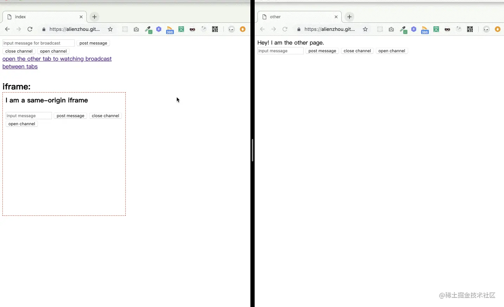
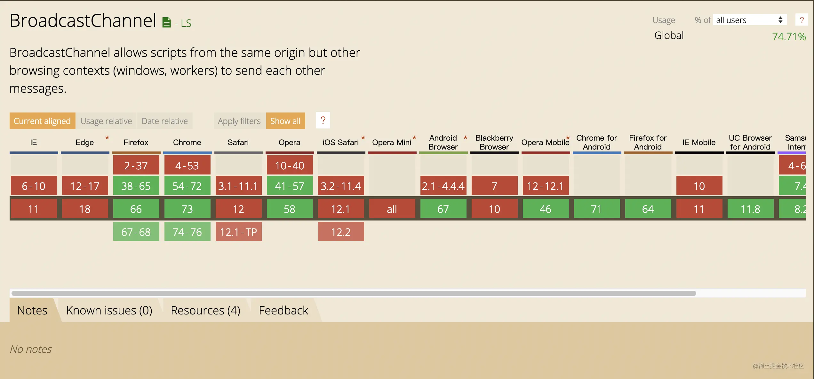

## Broadcast Channel是什么？
在前端，我们经常会用到postMessage来实现页面间的通信，但这种方式更像是点对点的通信。对于一些需要广播(让所有页面知道)的消息，用postMessage不是非常自然。Broadcast Channel就是用来弥补这个缺陷的。

<span style="color: red">顾名思义,Broadcast Channel会创建一个所有同源页面都可以共享的(广播)频道，因此其中一个页面发送的消息</span>

## 如何使用
Broadcast Channel的API非常简单易用

### 创建
首先我们会使用构造函数创建一个示例
```js
const bc = new BroadcastChannel('alienzhou')
```
可以接受一个DOMString作为name，用以标识这个channel。在其他页面，可以通过传入相同的name来使用同一个广播频道。用MDN上的haul来解释就是

> There is on single channel with this name for all browsing contexts with the ame origin.

该name值可以通过实例的.name属性获得
```js
console.log(bc.name)
```
### 监听消息
Broadcast Channel创建完成后，就可以在页面监听广播的消息
```js
bc.onmessage = function(e) {
    console.log('receiver:', e.data)
}
```
对于错误也可以绑定监听
```js
bc.onmessageerror = function(e) {
    console.log('error:', e)
}
```
> 除了为.onmessage赋值这种方式，也可以使用addEventListener 来添加'message'监听

### 发送消息
Broadcast Channel实例也有一个对应的postMessage用于发送消息
```js
bc.postMessage('hello')
```

### 关闭
可以看到，上述短短几行代码就可以实现多个页面间的广播通信，非常方便。而有时我们希望取消当前页面的广播监听：
- 一种方式是取消或者修改相应的'message'事件监听
- 另一种简单的方式就是使用Broadcast Channel实例为我们提供的close方法
```js
bc.close();
```
两者是有区别的

取消'message'监听只是让页面不对广播消息进行响应，Broadcast Channel仍然存在;而调用close方法这会切断与Broadcast Channel的连接，浏览器才能够尝试回收该对象，因此此时浏览器才会知道已经不需要使用广播频道了。

在关闭后调用postMessage会出现如下报错


如果之后又在需要广播，则可以重新创建一个相同name的Broadcast Channel

## Demo
[可以戳这里查看在线 Demo >>](https://alienzhou.github.io/broadcast-channel/)

下面是Broadcast Channel Demo的演示效果


## 兼容性如何
Broadcast Channel是一个非常好用的多爷们消息同步API，然而兼容性却不是很乐观



好在我们还有些其他方案可以作为补充（或者作为polyfill），其他的前端跨页面通信可以参考我的另一篇文章[《前端跨页面通信的方法》](https://juejin.cn/post/6844903811232825357)。


## 资料
[前端广播式通信：Broadcast Channel](https://juejin.cn/post/6844903811228663815)