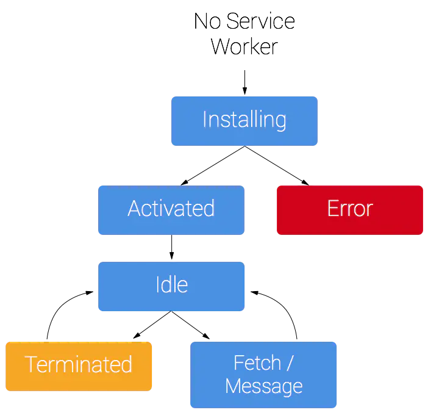

## Service Worker是什么

### 一句话概括

<span style="color: blue">一个服务器与浏览器之间的中间人角色，如果网站中注册了service worker那么它可以拦截当前网站所有的请求，进行判断(需要编写响应的判断程序)，如果需要向服务器发起请求的就转给服务器，如果可以直接使用缓存的就直接返回缓存不再转给服务器。从而大大提高浏览体验。</span>

### 一下是一些细碎的描述

+ <span style="color: blue">基于web worker</span>(一个独立于JavaScript主线程的独立线程，在里面执行需要消耗大量资源的操作不会堵塞主线程)
+ <span style="color: blue">在web worker的基础上增加了离线缓存的能力</span>
+ <span style="color: blue">本质上充当Web应用程序(服务器)与浏览器之间的代理服务器</span>(可以拦截全站的请求，并做出相应的动作->由开发者指定的动作)
+ <span style="color: blue">创建有效的离线体验(将一些不常更新的内容缓存在浏览器，提高访问体验)</span>
+ <span style="color: blue">由事件驱动的，具有生命周期</span>
+ <span style="color: blue">可以访问cache和indexDB</span>
+ <span style="color: blue">支持推送</span>
+ <span style="color: blue">并且可以让开发者自己控制缓存的内容以及版本</span>

## Service Worker的生命周期

service worker有完全独立于web页面的生命周期。

如果你要给你的网站使用servide worker，你需要在指定的页面的JavaScript中注册。注册service worker后，浏览器会默默地在背后安装service worker。

在安装这一步中，你可能需要缓存一些静态资源。如果所有这些文件缓存成功，则service worker安装成功；相反，如果有文件下载缓存失败，则安装步骤失败，此时service worker不会被激活(没装上)。但是别担心，稍后还是会继续安装的

安装成功后，会启动激活步骤，此时非常适合用来处理旧缓存

激活成功后，service worker会控制其范围内的所有页面。第一次注册service worker的页面，会等到页面加载成功后，才会接受控制。一旦service worker在控制页面，它只会有两种状态：要么停止运行，要么处理页面中的fetch和message事件(当叶茂中有网络请求或消息时)

下面这种图显示了service worker第一次安装时的生命周期：




## 如何使用

1. 注册Service Worker在你的index.html加入一下内容

```js
// 判断当前浏览器是否支持serviceWorker
if ('serviceWorker' in navigator) {
    // 当页面加载完成就创建一个serviceWorker
    window.addEventListener('load', function() {
        // 创建并指定对应的执行内容
        // scope参数是可选的，可以用来指定你想让service worker控制的内容的子目录。在这个例子里，我们指定了'/'，表示根网络下的所有内容。这也是默认值
        navigator.serviceWorker.register('./serviceWorker.js', {scope: './'}).then(function(registration) {
            console.log('ServideWorker registration successful with scope: ', registration.scope);
        }).catch(function(err) {
            console.log('ServiceWorker registration failed:', err);
        })
    })
}
```

2. 安装woker: 在我们指定的处理程序serviceWorker.js中书写对应的安装及拦截逻辑

```js
// 监听安装事件，install事件一般是被用来设置你的浏览器的离线缓存逻辑
this.addEventListener('install', function(event) {
    // 通过这个方法可以防止缓存未完成，就关闭serviceWorker
    event.waitUntil(
        // 创建一个名叫v1的缓存版本
        caches.open('v1').then(function(cache) {
            // 指定要缓存的内容，地址为相对于根域名的访问路径
            return cache.addAll([
                './index.html'
            ])
        })
    )
})

// 注册fetch事件，拦截全站请求
this.addEventListener('fetch', function(event) {
    event.respondWith(
        // magic goes here
        // 在缓存中匹配对应请求资源直接返回
        caches.match(event.request);
    )
})
```

> 以上为一个最简单的使用例子，更多内部api请查看[mdn service worker](https://developer.mozilla.org/zh-CN/docs/Web/API/Service_Worker_API)

## 注意事项

Service worker运行在worker上下文-->不能访问DOM

它设计为完全异步，同步API(如XHR和localStorage) 不能在service worker中使用

出于安全考量，Service Worker只能由HTTPS承载

在Firefox浏览器的用户隐私模式，Service Worker不可用

其生命周期与页面无关(关联页面未关闭时，它也可以退出，没有关联页面时，它也可以启动)

## 有趣的事

在MDN的兼容情况中可以看到Safari 对于Service workers的全线不支持，这是因为通过Service workers可以在浏览器上实现一种类似小程序的功能（PWA）。这将绕过苹果的app store导致苹果不能再和开发者37开分成，所以苹果不喜欢这项技术。ps:不过还是在18年开始支持了