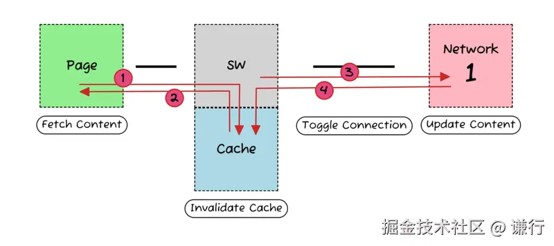

## Service Worker是什么

### 一句话概括

<span style="color: blue">一个服务器与浏览器之间的中间人角色，如果网站中注册了service worker那么它可以拦截当前网站所有的请求，进行判断(需要编写响应的判断程序)，如果需要向服务器发起请求的就转给服务器，如果可以直接使用缓存的就直接返回缓存不再转给服务器。从而大大提高浏览体验。</span>

### 一下是一些细碎的描述

+ <span style="color: blue">基于web worker</span>(一个独立于JavaScript主线程的独立线程，在里面执行需要消耗大量资源的操作不会堵塞主线程)
+ <span style="color: blue">在web worker的基础上增加了离线缓存的能力</span>
+ <span style="color: blue">本质上充当Web应用程序(服务器)与浏览器之间的代理服务器</span>(可以拦截全站的请求，并做出相应的动作->由开发者指定的动作)
+ <span style="color: blue">创建有效的离线体验(将一些不常更新的内容缓存在浏览器，提高访问体验)</span>
+ <span style="color: blue">由事件驱动的，具有生命周期</span>
+ <span style="color: blue">可以访问cache和indexDB</span>
+ <span style="color: blue">支持推送</span>
+ <span style="color: blue">并且可以让开发者自己控制缓存的内容以及版本</span>

## Service Worker的生命周期

service worker有完全独立于web页面的生命周期。

如果你要给你的网站使用servide worker，你需要在指定的页面的JavaScript中注册。注册service worker后，浏览器会默默地在背后安装service worker。

在安装这一步中，你可能需要缓存一些静态资源。如果所有这些文件缓存成功，则service worker安装成功；相反，如果有文件下载缓存失败，则安装步骤失败，此时service worker不会被激活(没装上)。但是别担心，稍后还是会继续安装的

安装成功后，会启动激活步骤，此时非常适合用来处理旧缓存

激活成功后，service worker会控制其范围内的所有页面。第一次注册service worker的页面，会等到页面加载成功后，才会接受控制。一旦service worker在控制页面，它只会有两种状态：要么停止运行，要么处理页面中的fetch和message事件(当叶茂中有网络请求或消息时)

下面这种图显示了service worker第一次安装时的生命周期：


## 如何使用

1. 注册Service Worker在你的index.html加入一下内容

```js
// 判断当前浏览器是否支持serviceWorker
if ('serviceWorker' in navigator) {
    // 当页面加载完成就创建一个serviceWorker
    window.addEventListener('load', function() {
        // 创建并指定对应的执行内容
        // scope参数是可选的，可以用来指定你想让service worker控制的内容的子目录。在这个例子里，我们指定了'/'，表示根网络下的所有内容。这也是默认值
        navigator.serviceWorker.register('./serviceWorker.js', {scope: './'}).then(function(registration) {
            console.log('ServideWorker registration successful with scope: ', registration.scope);
        }).catch(function(err) {
            console.log('ServiceWorker registration failed:', err);
        })
    })
}
```

2. 安装woker: 在我们指定的处理程序serviceWorker.js中书写对应的安装及拦截逻辑

```js
// 监听安装事件，install事件一般是被用来设置你的浏览器的离线缓存逻辑
this.addEventListener('install', function(event) {
    // 通过这个方法可以防止缓存未完成，就关闭serviceWorker
    event.waitUntil(
        // 创建一个名叫v1的缓存版本
        caches.open('v1').then(function(cache) {
            // 指定要缓存的内容，地址为相对于根域名的访问路径
            return cache.addAll([
                './index.html'
            ])
        })
    )
})

// 注册fetch事件，拦截全站请求
this.addEventListener('fetch', function(event) {
    event.respondWith(
        // magic goes here
        // 在缓存中匹配对应请求资源直接返回
        caches.match(event.request);
    )
})
```

> 以上为一个最简单的使用例子，更多内部api请查看[mdn service worker](https://developer.mozilla.org/zh-CN/docs/Web/API/Service_Worker_API)

## 注意事项

Service worker运行在worker上下文-->不能访问DOM

它设计为完全异步，同步API(如XHR和localStorage) 不能在service worker中使用

出于安全考量，Service Worker只能由HTTPS承载

在Firefox浏览器的用户隐私模式，Service Worker不可用

其生命周期与页面无关(关联页面未关闭时，它也可以退出，没有关联页面时，它也可以启动)

## 有趣的事

在MDN的兼容情况中可以看到Safari 对于Service workers的全线不支持，这是因为通过Service workers可以在浏览器上实现一种类似小程序的功能（PWA）。这将绕过苹果的app store导致苹果不能再和开发者37开分成，所以苹果不喜欢这项技术。ps:不过还是在18年开始支持了

## 使用 Service Worker 让首页秒开
在大部分场景预加载是页面性能优化的利器，而对于类似首页这种承担用户第一次访问的页面却无法使用预加载，这时候我们可以使用 Stale-White-Revalidate 加速页面访问，策略分为 3步
1. 在收到页面请求时首先检查缓存，如果命中缓存就直接从缓存中返回给用户
2. 将缓存返回用户的同时，在后台异步发起网络请求，尝试获取资源的最新版本
3. 获取成功后更新缓存，下次使用



而这一切的幕后功臣便是 Service Worker，作为一个后台代理在网络与缓存之间搭建桥梁，提供了丰富的缓存管理和资源控制能力，从而实现这一高效策略

### Service 基础概念
[Service Worker 基础概念可以在这里了解](https://www.yuque.com/sunluyong/fe-interview/gdm3wi1xwbw1e5ml)

### 拦截修改 Response 对象
使用 event.respondWith 可以在 fetch 事件中拦截网络请求并提供自定义响应，一旦调用浏览器会等待提供的Promise解析，并将其结果作为响应返回给发起请求的代码

```js
self.addEventListener('fetch', event => {
    event.respondWith(
        // 自定义响应逻辑
    )
})
```
比如实现拦截特定请求，可以首先尝试从缓存中获取资源，如果缓存命中则返回缓存内容，否则从网络获取资源并缓存
```js
self.addEventListener('fetch', event => {
    // 过滤非页面请求
    const url = new URL(event.request.url);
    if(!url.pathname.startsWith('/page/')) return;

    event.respondWith(caches.match(event.request)).then(cachedResponse => {
        if(cachedResponse) {
            return cachedResponse; // 缓存命中，返回缓存内容
        }
        // 缓存未命中，从网络获取
        return fetch(event.request);
    })
})
```
必须在fetch事件监听器内部的第一时间调用 event.respondWidth，否则浏览器将继续使用默认的网络处理方式

### clone Response对象缓存
在 Service Worker 中处理网络请求和缓存时,经常会遇到需要clone响应对象。
```js
const responseToCache = newworkResponse.clone();
```
这是由于 Response 对象是一个可读流，而流具有以下特性

- 单次消费:Streams在被消费后就会关闭，不能重新读取
- 节省资源：适合处理大型数据，如视频流、文件下载等

当读取 Response 的 body返回给浏览器后，Stream 会被读取并关闭，之后无法再次读取用于缓存。通过clone Response 对象，可以创建一个独立的副本，确保每个副本的Stream都可单独消费
```js
fetch(event.request).then(networkResponse => {
    // 克隆相应用于缓存
    const responseToCache = networkResponse.clone();

    // 返回给客户端
    event.respondWith(networkResponse);

    // 缓存克隆的响应
    caches.open(CACHE_NAME).then(cache => {
        cache.put(event.request, responseToCache);
    })
})
```
### event.waitUntil 确保异步任务完成
Service Worker 事件都是异步的，浏览器可能在这些异步操作完成之前终止 Service Worker，导致关键任务(如缓存资源或清理就缓存)无法正确完成。

通过调用 event.waitUntil(promise),可以告诉我浏览器要"等待"某个 Promise 完成之后，才认为事件处理完成，这确保了浏览器不会再关键异步操作完成之前终止 Service Worker。

比如在激活阶段，通常需要请求旧的缓存
```js
self.addEventListener('activate', event => {
    console.log('[Service Worker] Activate Event');
    const cacheWhitelist = ['my-cache-v2'];

    caches.keys().then(cacheNames => {
        return Promise.all(
            cacheNames.map(cacheName => {
                if(!cacheWhitelist.includes(cacheName)) {
                    console.log(`[Service Worker] Deleting old cache: ${cacheName}`);
                    return caches.delete(cacheName);
                }
            })
        )
    })
})
```
浏览器可能在异步缓存清理任务完成之前终止激活过程，导致旧缓存可能未被正确删除，使用 event.waitUntil 可以确保所有清理操作完成
```js
self.addEventListener('activate', event => {
  console.log('[Service Worker] Activate Event');
  const cacheWhitelist = ['my-cache-v2'];
  
  event.waitUntil(
    caches.keys().then(cacheNames => {
      return Promise.all(
        cacheNames.map(cacheName => {
          if (!cacheWhitelist.includes(cacheName)) {
            console.log(`[Service Worker] Deleting old cache: ${cacheName}`);
            return caches.delete(cacheName);
          }
        })
      );
    })
  );
});
```
## Stale-While-Revalidate 实现
### 1. 创建目录结构
```shell
.
.
├── app
│   └── index.js
├── package.json
└── public
    ├── favicon.ico
    ├── index.html
    └── sw.js
```
因为 Service Worker 需要服务端配合，为了简单实用 express 演示
```shell
npm install --save express
```
### 2. 提供web服务
修改app/index.js，public目录对外服务,为了演示缓存更新效果，添加了一个滴啊有页面版本号的自定义响应头 x-page-version

```js
const express = require('express');
const path = require('path');

const app = express();
const port = 3000;

app.use(express.static(path.join(__dirname, '../public'), {
    setHeaders: res => {
        res.set('x-page-version', Math.ceil(Date.now() / 5000));
    }
}))

app.listen(port, () => {
    console.log(`Example app listening at http://localhost:${port}`);
})
```
### 3. Service Worker实现
首先是最基础的安装、激活，代码量并不大，主要是添加了很多log方便观测 Service Worker执行过程

```js
const CACHE_NAME = 'HOMEPAGE_CACHE_v1'; // 缓存 key，sw.js 更新了可以升级版本

// 配置需要缓存的资源，demo 中只缓存主文档，静态资源浏览器自己就会缓存
const urlsToCache = [
  '/',
];

// 安装事件：预缓存一些关键资源
self.addEventListener('install', (event) => {
  console.log('[Service Worker] Install Event');
  event.waitUntil(
    caches.open(CACHE_NAME).then((cache) => {
      console.log('[Service Worker] Caching pre-defined resources');
      return cache.addAll(urlsToCache);
    }).catch((error) => {
      console.error('[Service Worker] Failed to cache resources during install:', error);
    })
  );
});

// 激活事件：清理旧版本的缓存
self.addEventListener('activate', (event) => {
  console.log('[Service Worker] Activate Event');
  const cacheWhitelist = [CACHE_NAME];
  event.waitUntil(
    caches.keys().then((cacheNames) => {
      return Promise.all(
        cacheNames.map((cacheName) => {
          if (!cacheWhitelist.includes(cacheName)) {
            console.log(`[Service Worker] Deleting old cache: ${cacheName}`);
            return caches.delete(cacheName);
          }
        })
      );
    }).then(() => self.clients.claim()) // 确保 SW 控制所有客户端
  );
});
```
### 4. 劫持页面请求
```js
// 获取事件：实现「Stale-While-Revalidate」资源
self.addEventListener('fetch', event => {
    const requestUrl = new URL(event.request.url);
    // 仅处理需要缓存的请求
    if(!urlsToCache.includes(requestUrl.pathname)) return;

    // 处理fetch事件
    event.respondWith(
        caches.match(event.request).then(cachedResponse => {
            if(cachedResponse) {
                // 如果缓存存在，立即返回缓存内容
                console.log(`[Service Worker] Serving from cache: ${event.request.url}`);

                // 后台发起网络请求以更新缓存
                event.waitUntil(
                    fetch(event.request).then(networkResponse => {
                        if(networkResponse && networkResponse.status === 200) {
                            return caches.open(CACHE_NAME).then(cache => {
                                // 缓存最新内容，下次使用
                                cache.put(event.request, networkResponse.clone());
                                console.log(`[Service Worker] Fetched and cached (background): ${event.request.url}`);
                            })
                        }
                    }).catch(error => {
                        console.log(`[Service Worker] Background fetch failed for: ${event.request.url}`, error);
                    })
                )

                return cachedResponse
            }

            // 如果缓存不存在，从网络获取最新资源
            return fetch(event.request).catch(error => {
                console.error(`[Service Worker] Fetch failed for: ${event.request.url}`, error);
            })
        })
    )
})
```
这样就基本实现了 Stale-While-Revalidate

### 5. 注册 Service Worker
在主线程激活 Service Worker
```js
if ("serviceWorker" in navigator) {
  navigator.serviceWorker.register("/sw.js").then(registration => {
    console.log(`Service Worker registered with scope: ${registration.scope}`);
  }).catch(error => {
    console.log(`Service Worker registration failed: ${error}`);
  });
}
```
## 更进一步
可以对上面demo改进一下，当获取到最新版本页面后和缓存对比，如果发现版本已更新，可以给主线程发送通知，让页面重新发请求，获取最新版本缓存
```js
// 获取事件：实现 "Stale-While-Revalidate" 策略
self.addEventListener('fetch', (event) => {
  const requestUrl = new URL(event.request.url);
  // 仅处理需要缓存的请求
  if (!urlsToCache.includes(requestUrl.pathname)) return;

  // 处理 fetch 事件
  event.respondWith(
    caches.match(event.request).then((cachedResponse) => {
      if (cachedResponse) {
        // 如果缓存存在，立即返回缓存内容
        console.log(`[Service Worker] Serving from cache: ${event.request.url}`);

        // 后台发起网络请求以更新缓存
        event.waitUntil(
          fetch(event.request).then((networkResponse) => {
            if (networkResponse && networkResponse.status === 200 && networkResponse.type === 'basic') {
              // 获取缓存响应中的版本
              const cachedVersion = cachedResponse.headers.get('x-page-version');
              // 获取网络响应中的版本
              const networkVersion = networkResponse.headers.get('x-page-version');
              console.log(`[Service Worker] Cached Version: ${cachedVersion}`);
              console.log(`[Service Worker] Network Version: ${networkVersion}`);
              // 如果页面版本已更新
              if (networkVersion !== cachedVersion) {
                return caches.open(CACHE_NAME).then((cache) => {
                  cache.put(event.request, networkResponse.clone());
                  console.log(`[Service Worker] Fetched and cached (background): ${event.request.url}`);

                  // 通知客户端刷新，展示最新内容
                  return sendMessage({
                    version: networkVersion,
                    action: 'update',
                    url: event.request.url,
                  });
                });
              }
            }
          }).catch((error) => {
            console.error(`[Service Worker] Background fetch failed for: ${event.request.url}`, error);
          })
        );

        return cachedResponse; // 立即返回缓存内容
      }

      // 如果缓存不存在，从网络获取最新资源
      return fetch(event.request).catch((error) => {
        console.error(`[Service Worker] Fetch failed for: ${event.request.url}`, error);
      });
    })
  );
});

// 辅助函数：发送消息给客户端
function sendMessage(data) {
  return self.clients.matchAll().then((clients) => {
    clients.forEach((client) => {
      client.postMessage(data);
    });
  });
}
```
更新主线程，添加接收来自 Service Worker 消息事件

```js
navigator.serviceWorker.addEventListener("message", event => {
  console.log('Received a message from Service Worker:', event.data);
  if (event.data.action === "update") {
    if (event.data.url === window.location.href ) {
      console.log('load lasted version');
      location.href = event.data.url;
    }
  }
});
```
这就是 alibaba.com 秒开的秘籍

<!-- 18 + 18 = 36 + 7 = 43 + 5 = 48 -->


[使用 Service Worker 让首页秒开](https://juejin.cn/post/7443159206318686246#heading-3 )