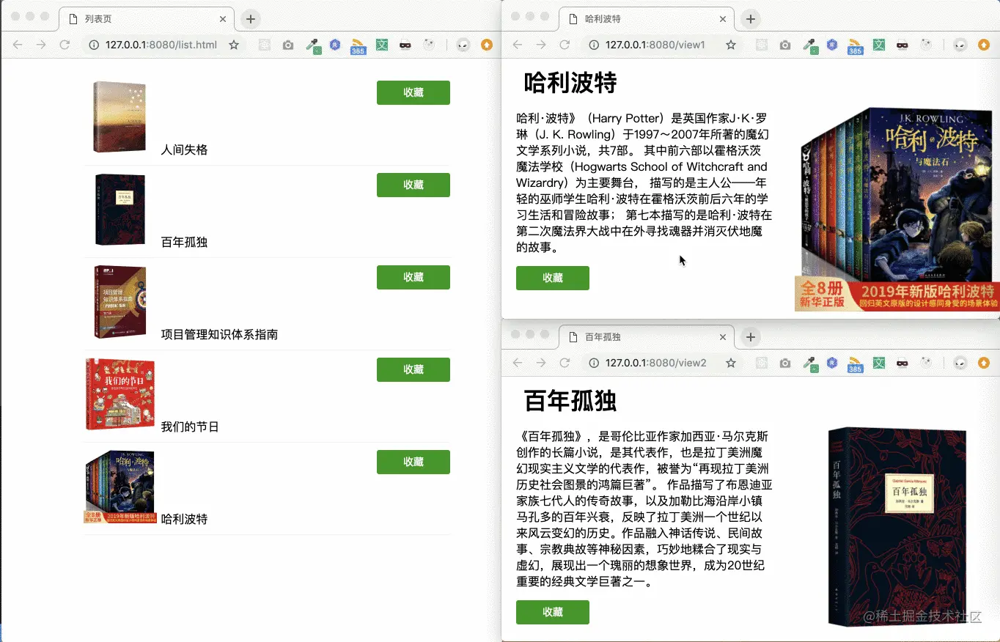
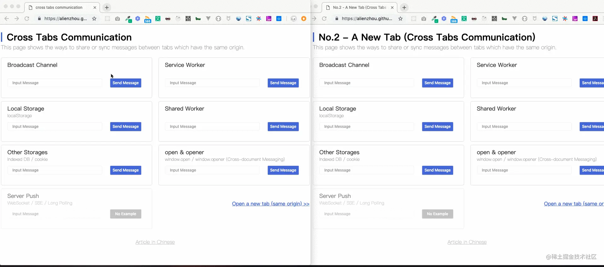
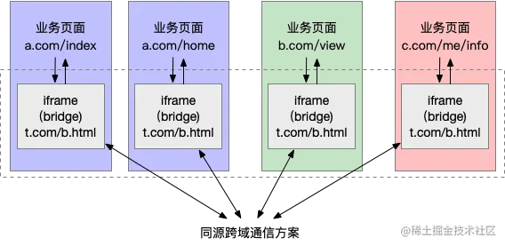

## 引言
在浏览器中,我们可以同时打开多个Tab页,每个Tab页可以粗略理解为一个"独立"的运行环境，即使是全局对象也不会在多个Tab间共享。然而有些时候，我们希望能够在这些"独立“的Tab页面之间同步页面的数据、信息或状态

正如下面的例子：我在列表页点击收藏后，对应的详情页按钮会自动更新为已收藏状态；类似的，在详情页点击收藏后，列表页中按钮也会更新



这就是我们所说的前端跨页面通信。

你知道哪些页面通信的方式呢？如果不清楚，下面我就带大家来看看七种跨页面通信的方式

## 一、同源页面间的跨页面通信
> 以下各种方式的[在线Demo可以戳这里](https://alienzhou.github.io/cross-tab-communication/)

浏览器的同源策略在下述的一些跨页面通信方法中依然存在限制。因此，我们先来看看，在满足同源策略的情况下，都有哪些技术可以用来实现跨页面通信
### 1. BroadCast Channel
BroadCast Channel可以帮我们创建一个用于广播的通信频道。当所有页面都监听同一个频道的消息时，其中某一个页面通过它发送的消息就会被其他所有页面收到。它的API和用法都非常简单。

下面的方式就可以创建一个标识为 AlienZHOU的频道
```js
const bc = new BroadcastChannel('AlienZHOU');
```
各个页面可以通过onmessage来监听被广播的消息
```js
bc.onmessage = function(e) {
    const data = e.data;
    const text = `[receive] ${data.msg} --- tab ${data.from}`;
    console.log('[BroadcastChannel] receive message:', text)
}
```
要发送消息时值需要调用实例上的postMessage方法既可
```js
bc.postMessage(mydata)
```
Broadcast Channel 的具体的使用方式可以看这篇[《【3分钟速览】前端广播式通信：Broadcast Channel》](https://juejin.cn/post/6844903811228663815)。

### 2. Service Worker
Service Worker是一个可以长期运行在后台的Worker,能够实现与页面的双向通信。多页面共享间的Service Worker可以共享，将Service Worker作为消息的处理中心(中央站)即可实现广播效果

> Service Worker 也是 PWA 中的核心技术之一，由于本文重点不在 PWA ，因此如果想进一步了解 Service Worker，可以阅读我之前的文章[【PWA学习与实践】(3) 让你的WebApp离线可用](https://juejin.cn/post/6844903588691443725)。

首先，需要在页面注册Service Worker
```js
// 页面逻辑
navigator.serviceWorker.register('../util.sw.js').then(function() {
    console.log('Service Worker 注册成功')
})
```
其中../util.sw.js是对应Service Worker脚本。Service Worker本身并不自动具备"广播通信"的功能，需要我们添加些代码，将其改造成消息中转站

```js
// util.sw.js Service Worker逻辑
self.addEventListener('message', function(e) {
    console.log('service worker receiver message', e.data);
    e.waitUntil(
        self.clients.matchAll().then(function(clients) {
            if (!clients || clients.length === 0) {
                return;
            }
            clients.forEach(function (client) {
                client.postMessage(e.data);
            });
        })
    )
})
```
我们在Service Worker中监听了message事件，获取页面(从Service Worker的角度叫client)发送的消息。然后通过self.clients.matchAll()获取当前注册了该Service Worker的所有页面，通过调用每个Client(即页面)的postMessage方法，想页面发送消息。这样就把从一处（某个Tab页面）收到的消息通知给了其他页面。

处理完Service Worker，我们需要在页面监听Service Worker发送来的消息
```js
navigator.serviceWorker.addEventListener('message', function(e) {
    const data = e.data;
    const text = '[receive] ' + data.msg + '---tab ' + data.from;
    console.log('[Service Worker] receive message:', text);
})
```
最后，当需要同步消息时，可以调用 Service Worker 的postMessage方法：
```js
navigator.serviceWorker.controller.postMessage(mydata)
```

### 2. LocalStorage
LocalStorage作为前端最常用的本地存储，大家应该已经非常熟悉了；但StorageEvent这个与它相关的时间有些同学可能会比较陌生。

当LocalStorage变化时，会触发storage事件。利用这个特性，我们可以在发送消息时，把消息写入到某个LocalStorage中;然后再各个页面内，通过监听storage事件既可收到通知

```js
window.addEventListener('storage', function(e) {
    if(e.key === 'ctc-msg') {
        const data = JSON.parse(e.newValue);
        const text = '[receive] ' + data.msg + ' --tab ' + data.from;
        console.log('[Storage I] receive message:', text);
    }
})
```
在各个页面添加如上的代码，即可监听到LocalStorage的变化。当某个页面需要发送消息时，只需要使用我们熟悉的setItem方法既可
```js
mydata.st = +(new Date);
window.localStorage.setItem('ctc-msg', JSON.stringify(myData))
```
注意，这里有一个细节：我们在mydata上添加了一个取当前毫秒时间戳的.st属性。这是因为，storage事件只有在值真正改变时才会触发。举个例子：
```js
window.localStorage.setItem('test', '123');
window.localStorage.setItem('test', '123');
```
由于第二次的值'123'与第一次的值相同，所以以上的代码只会在第一次setItem时触发storage事件。因此我们通过设置st来保证每次调用时一定会触发storage事件。

[怎么监听LocalStorage的变化的](/front-end/JavaScript/browser_localStorage.md)
### 小憩一下
上面我们看到了三种实现跨页面通信的方式，不论是建立广播频道的Broadcast Channel，还是使用Service Worker的消息中转站，亦或是些tricky的storage事件，其都是广播模式：一个页面将消息通知给一个中央站，再由这个中央站通知给各个页面
> 在上面的例子中，这个"中央站"可以是一个BroadCast Channel实例、一个Service Worker或是LocalStorage

<span style="color:red">下面我们会看到另外两种跨页面通信方式，我把它成为"共享存储 + 轮训模式"</span>

### 4. Shared Worker
Shared Worker 是Worker家族的另一个成员。普通的Worker之间是独立运行、数据互不相通；而多个Tab注册的Shared Worker则可以实现数据共享。

Shared Worker在实现跨页面通信时的问题在于，它无法主动通知所有页面，因此，我们会使用轮训的方式，来拉取最新的数据。思路如下：

<span style="color: red">让Shared Worker支持两种消息。一种是post,Shared Worker收到后将该数据保存下来；另一种是get,Shared Worker收到消息后会将保存的数据通过postMessage传给注册它的页面。也就是让页面通过get来主动获取(同步)最新消息。</span> 具体实现如下：

首先，我们会在页面中启动一个Shared Worker，启动方式非常简单
```js
// 构造函数的第二个参数是Shared Worker 名称，也可以留空
const shareWorker = new SharedWorker('../util.shared.js', 'etc');
```
然后，在该Shared Worker中支持get与post形式的消息
```js
/* ../util.shared.js: Shared Worker 代码 */
let data = null;
self.addEventListener('connect', function(e) {
    const port = e.ports[0];
    port.addEventListener('message', function(event) {
        // get 指令则返回存储的消息数据
        if(event.data.get) {
            data && port.postMessage(data);
        }
        // 非get 指令则存储该消息数据
        else {
            data = event.data;
        }
    });
    port.start();
})
```
之后，页面定时发送get指令的消息给Shared Worker,轮训最新的消息数据，并在页面监听返回消息
```js
// 定时轮训，发送get指令的消息
setInterval(function() {
    sharedWorker.port.postMessage({ get: true })
}, 1000)

// 监听get消息的返回数据
sharedWorker.port.addEventListener('message', (e) => {
    const data = e.data;
    const text = '[receive] ' + data.msg + ' —— tab ' + data.from;
    console.log('[Shared Worker] receive message:', text);
}, false);
sharedWorker.port.start();
```
最后，当要跨页面通信时，只需给Shared Worker postMessage 即可
```js
sharedWorker.port.postMessage(mydata)
```
:::tip
注意，如果使用addEventListener来添加 Shared Worker 的消息监听，需要显式调用MessagePort.start方法，即上文中的sharedWorker.port.start()；如果使用onmessage绑定监听则不需要。
:::
### 4. IndexedDB
除了可以利用Shared Worker 用来共享存储数据，还可以使用其他一些"全局性"(支持跨页面)的存储方案。例如IndexedDB 或者cookie

:::tip
鉴于大家对 cookie 已经很熟悉，加之作为“互联网最早期的存储方案之一”，cookie 已经在实际应用中承受了远多于其设计之初的责任，我们下面会使用 IndexedDB 来实现。
:::

<span style="color: blue">其思路很简单：与Shared Worker方案类似，消息发送方将消息存至IndexedDB中；接收方(例如所有页面)则通过轮训去获取最新的消息。在这之前，我们先简单封装几个IndexedDB的工具方案</span>

- 打开数据库连接

    ```js
    function openStore() {
        const storeName = 'ctc_aleinzhou';;
        return new Promise(function(resolve, reject) {
            if(!('indexedDB' in window)) {
                return reject('do not support indexedDB');
            }
            const request = indexedDB.open('CTC_DB', 1);
            request.onerror = reject;
            request.onsuccess = e => resolve(e.target.result);
            request.onupgradeneeded = function(e) {
                const db = e.srcElement.result;
                if (e.oldVersion === 0 && !db.objectStoreNames.contains(storeName)) {
                    const store = db.createObjectStore(storeName, {keyPath: 'tag'});
                    store.createIndex(storeName + 'Index', 'tag', {unique: false});
                }
            }
        })
    }
    ```
- 存储数据

    ```js
    function saveData(db, data) {
        return new Promise(function(resolve, reject) {
            const STORE_NAME = 'ctc_aleinzhou';
            const tx = db.transaction(STORE_NAME, 'readwrite');
            const store = tx.objectStore(STORE_NAME);
            const request = store.put({tag: 'ctc_data', data});
            request.onsuccess = () => resolve(db);
            request.onerror = reject;
        })
    }
    ```

- 查询/读取数据

    ```js
    function query(db) {
        const STORE_NAME = 'ctc_aleinzhou';
        return new Promise(function (resolve, reject) {
            try {
                const tx = db.transaction(STORE_NAME, 'readonly');
                const store = tx.objectStore(STORE_NAME);
                const dbRequest = store.get('ctc_data');
                dbRequest.onsuccess = e => resolve(e.target.result);
                dbRequest.onerror = reject;
            }
            catch (err) {
                reject(err);
            }
        });
    }
    ```
剩下的工作就非常简单了。首先打开数据连接，并初始化数据：
```js
openStore().then(db => saveData(db, null))
```
对于消息读取，可以在连接与初始化后轮询：
```js
openStore().then(db => saveData(db, null)).then(function (db) {
    setInterval(function () {
        query(db).then(function (res) {
            if (!res || !res.data) {
                return;
            }
            const data = res.data;
            const text = '[receive] ' + data.msg + ' —— tab ' + data.from;
            console.log('[Storage I] receive message:', text);
        });
    }, 1000);
});
```
最后，要发送消息时，只需向 IndexedDB 存储数据即可：
```js
openStore().then(db => saveData(db, null)).then(function (db) {
    // …… 省略上面的轮询代码
    // 触发 saveData 的方法可以放在用户操作的事件监听内
    saveData(db, mydata);
});
```
### 小憩一下
<span style="color: red">在"广播模式"外，我们又了解了"共享存储+长轮训"这种模式。也许你会任务长训轮没有监听模式优雅，实际上，有些时候使用"共享存储"的形式时，不一定要搭配长轮训</span>

例如，在多Tab场景下，我们可能会离开Tab A到另一个Tab B中操作；过了一会我们从TabB切换会Tab A时，希望将之前在将之前在 Tab B 中的操作的信息同步回来。这时候，其实只用在 Tab A 中监听visibilitychange这样的事件，来做一次信息同步即可。

下面，我会再介绍一种通信方式，我把它称为**“口口相传”**模式。

### 6.window.open + window.opener
当我们使用window.open打开页面，方法会返回一个被打开页面window的引用。而在未显示指定 noopener 时，被打开的页面可以通过 window.opener 获取到打开它的页面的引用--通过这种方式我们就将这些页面简历起了联系(一种树形结构)

首先，我们把window.open打开的页面的window对象收集起来：
```js
let childWins = [];
document.getElementById('btn').addEventListener('click', function() {
    const win = window.open('./some/sample');
    childWins.push(win)
})
```
然后，当我们需要发送消息的事后，作为消息的发起方，一个页面需要同事通知它打开的页面与打开他的页面
```js
// 过滤掉已经关闭的窗口
childWins = childWins.filter(w => !w.closed);
if (childWins.length > 0) {
    mydata.fromOpenner = false;
    childWins.forEach(w => w.postMessage(mydata));
}
if (window.opener && !window.opener.closed) {
    mydata.fromOpenner = true;
    window.opener.postMessage(mydata);
}
```
注意，我这里先用.closed属性过滤掉已经被关闭的 Tab 窗口。这样，作为消息发送方的任务就完成了。下面看看，作为消息接收方，它需要做什么。

此时，一个收到消息的页面就不能那么自私了，除了展示收到的消息，它还需要将消息再传递给它所“知道的人”（打开与被它打开的页面）

> 需要注意的是，我这里通过判断消息来源，避免将消息回传给发送方，防止消息在两者间死循环的传递。（该方案会有些其他小问题，实际中可以进一步优化）

```js
window.addEventListener('message', function (e) {
    const data = e.data;
    const text = '[receive] ' + data.msg + ' —— tab ' + data.from;
    console.log('[Cross-document Messaging] receive message:', text);
    // 避免消息回传
    if (window.opener && !window.opener.closed && data.fromOpenner) {
        window.opener.postMessage(data);
    }
    // 过滤掉已经关闭的窗口
    childWins = childWins.filter(w => !w.closed);
    // 避免消息回传
    if (childWins && !data.fromOpenner) {
        childWins.forEach(w => w.postMessage(data));
    }
});
```
这样，每个节点（页面）都肩负起了传递消息的责任，也就是我说的“口口相传”，而消息就在这个树状结构中流转了起来。

### 小憩一下
显然，“口口相传”的模式存在一个问题：如果页面不是通过在另一个页面内的window.open打开的（例如直接在地址栏输入，或从其他网站链接过来），这个联系就被打破了。

除了上面这六个常见方法，其实还有一种（第七种）做法是通过 WebSocket 这类的“服务器推”技术来进行同步。这好比将我们的“中央站”从前端移到了后端。

关于 WebSocket 与其他“服务器推”技术，不了解的同学可以阅读这篇《各类“服务器推”技术原理与实例（Polling/COMET/SSE/WebSocket）》

此外，我还针对以上各种方式写了一个 在线演示的 Demo >>



## 二、非同源页面之间的通信
上面我们介绍了七种签到卡跨页面通信的方法，但它们大都受到同源策略的限制。然而有时候，我们有两个不同域名的产品线，也希望它们下面的所有页面之间能无障碍的通信。那该怎么办呢？

<span style="color: red">要实现该功能，可以使用一个用户不可见的iframe作为"桥"。**由于iframe与父页面可以通过指定origin来忽略同源限制，因此可以在每个页面中嵌入一个iframe(例如：http://sample.com/bridge.html), 而这些iframe由于使用的是一个url，因此属于同源页面，其通信方式可以复用上面第一份部分提到的各种方式**</span>

页面与iframe通信非常简单，首先需要在页面中监听iframe发来的消息，做相应的业务处理：
```js
// 业务页面代码
window.addEventListener('message', function(e) {
    // ...do something
})
```
然后，当页面要与其他的同源或非同源页面通信时候，会先给iframe发送消息：
```js
// 业务页面代码
window.frames[0].window.postMessage(mydata, '*');
```
其中为了简便此处将 postMessage 的第二个参数设为'*',你也可以设为iframe的URL。iframe收到消息后，会使用某种跨页面消息通信技术在所有iframe间同步消息,例如下面使用的Broadcast Channel：

```js
// iframe内代码
const bc = new BroadcastChannel('AlienZHOU');

// 收到来自页面的消息后，在iframe间进行广播
window.addEventListener('message', function(e) {
    bc.postMessage(e.data)
})
```
其他iframe收到通知后，则会将该消息同步给所属的页面
```js
// iframe内代码
// 对于收到的(iframe)广播消息，通知给所属的业务页面
bc.onmessage = function(e) {
    window.parent.postMessage(e.data, '*')
}
```
下图就是使用iframe作为』桥『的非同源页面间通信模式图



其中"同源跨域通信方案"可以使用文章第一部分提到的某种技术

## 总结
对于同源页面，常见的方式包括
- 广播模式：Broadcast Channel/Service Worker/LocalStorage + StorageEvent
- 共享存储模式： Shared Worker/IndexDB/cookie
- 口口相传模式：window.open + window.opener
- 基于服务端：Websocket/Comet/SSE等

对于非同源页面，则可以通过嵌入同源iframe作为桥，将非同源页面通信转换为同源页面通信


## 资料
[面试官：前端跨页面通信，你知道哪些方法？](https://juejin.cn/post/6844903811232825357)