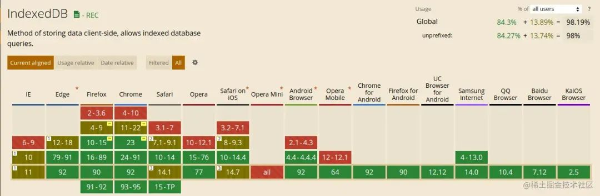
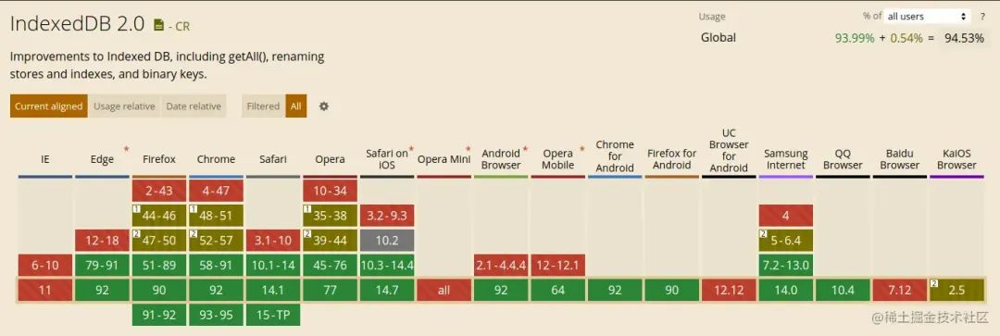
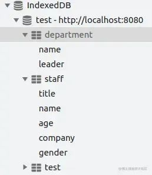
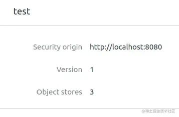
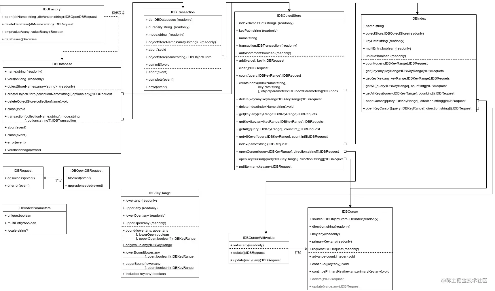

## IndexedDB概述
众所周知,前端存储无外乎LocalStorage和Cookie，后者功能和空间受限，可以几乎无视，LocalStorage方便，但是如果遭遇要存储的数据较多的场景中，显得力不从心。一方面是来自存储空间的

:::tip
IndexedDB的存储空间(虽有访问的网站总和)为磁盘可用空间的50%,或根据浏览器的设定分配
:::

另外一方面，用LocalStorage只能保存字符串，如果是其他的类型，那就必须用JSON.stringify来转换为字符串后在保存，而IndexedDB则可以直接保存。此外，还具备一般DBMS的常用功能，例如遍历、筛选等。

就目前(2021年)，IndexedDB的兼容性已经足够好，可以满足绝大多数场景的应用，甚至2.0版本也没问题

IndexedDB是类 NoSQL 类型数据库,可以说是没有结构的。通过预设索引，可以快速的根据索引值进行筛选查询；并且可以将任意Javascript变量类型或对象直接存入数据库，而不需要手动转换。一个数据库中可以包含多种对象集合，相对于SQL数据库来说就是多个表；在一个域(名)下，还可以有多个数据库。但是不能跨域访问别的域名之下的数据库。

IndexedDB有一个与普通数据库不同的"版本"概念,考虑到是因为提升用户体验，提高相应速度，才将部分数据存储在客户端，那么如何保持数据同步就会是一个显著的问题。每当因程序更新而需要同步更新数据库时，IndexedDB便提供了很好的支持

IndexedDB所有操作(CRUD)，都是基于事务的，这在一定程序上保证了数据的一致性。当出现问题时会自动回滚。同事，大多数数据库也是异步完成的，需要通过在中间对象中绑定成功与失败的相应事件来进一步处理；

## 应用
大致介绍完IDB，就进入正题，先看下IndexedDB的'全家福'

上图列举了IndexedDB所涉及的对象(视作为"类"更容易理解)，结合后文的案例和过程，阅读起来更方便；

### 关键概念
在讲应用之前，先跟大家介绍几个关键概念(上图的主要对象)

- 工厂IDBFactory: 浏览器为数据库操作的提供的入口，全局静态方法，通过它才能打开一个数据库，open之后获得一个异步对象;
- 异步对象: 前文说过，大多数数据库的操作都是异步的，返回的异步对象参照上图的IDBRequest;可以把这个对象看做是一个连接当前与异步结果的媒介。它有成功和错误(失败)两个待绑定的事件；在成功之后传入的后续对象一般会在event.target.result中，也可以使用this指针，使用this.result;所有异步的操作都是通过它来传递;另外它还有唯一子类IDBOpenDBRequest，是在打开数据库时专用的异步对象，特殊之处在于它有一个处理数据库升级的专用事件onupgradeneeded和数据库被独占的事件blocked;
- 数据库升级 onupgradeneeded:首次运行程序创建数据库，或原有数据库结构变化执行升级过程，都会出发这个事件。另外，但凡是数据结构上的变动，都必须在这个事件中处理，也会使当前数据页处于独占模式；例如创建集合（一种对象）createObjectStore、删除集合deleteObjectStore或修改对象索引；

## 资料
[15分钟，带你了解indexedDB，这个前端存储方案很重要！](https://juejin.cn/post/6995112265766666247)