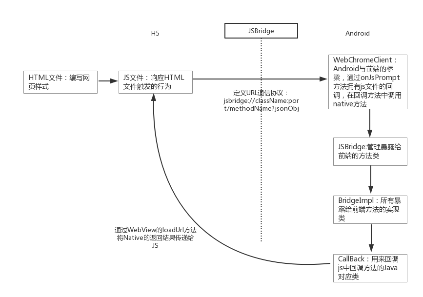
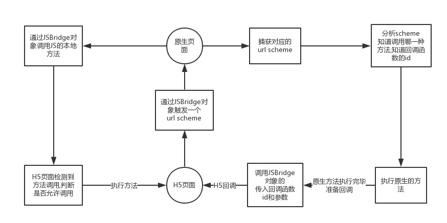
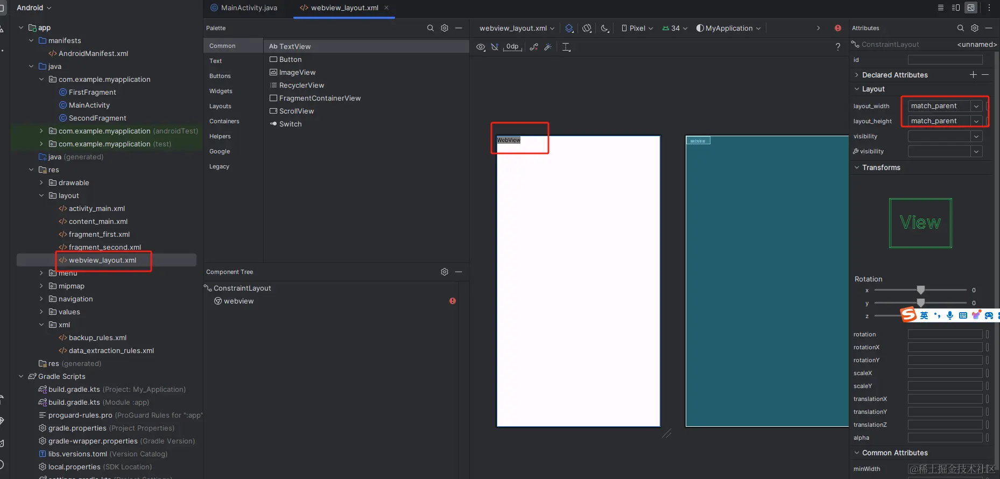

## 原理

> Android中的JSBridge是H5与Native通信桥梁,其作用是实现H5与Native间的双向通信。

现H5与Native的双向通信，解决如下四个问题接口
- Java如何调用JavaScript
- JavaScrip如何调用Java
- 方法参数以及回调如何处理
- 通信的数据格式是怎么样的

#### 1.Java如何调用JavaScript
在Android中，Java和JavaScript的一切交互都是依托于WebView的，可通过如下方法来完成，其中Function()即为Javascript代码，来实现相应的具体H5功能
```js
WebView.loadUrl('Javascript:function()')
```
#### 2、JavaScript如何调用Java
要实现在JavaScript中调用Java，就需要在JavaScript中有触发Java方法的对象和方法。在JavaScript中，当调用window对象的prompt方法时，会触发Java中的WebChromeClient对象的onJsPrompt方法，因此可以利用这个机制来实现js调用native的代码

#### 3、方法参数以及回调处理
任何IPC通信都涉及到参数序列化的问题，同理，Java与JavaScript之间只能传递基础类型（包括基本类型和字符串），不包括其他对象或者函数。所以可以采用json格式来传递数据。JavaScript与Java相互调用不能直接获取返回值，只能通过回调的方式来获取返回结果。

#### 4、通信的数据格式
Java与JavaScript通信需要遵循一定的通信协议，可以仿照HTTPS协议来将此协议定义为jsbridge协议：
```js
jsbridge://className:port/methodName?jsonObj
```
当js调用native功能，应当制定native层要完成某个功能调用的类名(className)和方法名(methodName)，以及传递过来的参数(jsonObj)。port值是指当native需要将操作结果返回给js时，在js中定义的一个callback,并将这个callback存储在指定的位置上，这个port就定义了callback的存储位置。


#### 总结
<span style="color: blue">JSBridge的基本原理为:H5 -> 通过某种方式触发一个url -> Native捕获到url,进行分析 -> 原生做处理 -> Native调用H5的JSBridge对象传递回调。<br/></span>
如下图



参考地址：[https://www.jianshu.com/p/2ec3f06d6087?from=singlemessage](https://www.jianshu.com/p/2ec3f06d6087?from=singlemessage)

### WebView
WebView是一种嵌入式浏览器，原生应用可以用它来展示网络内容<br/>
第一：原生应用(app)<br/>
第二：嵌入式浏览器<br/>

开发人员可以使用各种受支持的方式来覆盖默认的安全行为，并让Web代码和原生应用代码相互通信。这种沟通通常称为bridge。Bridge可视化为Native Bridge和JavaScript Bridge的一部分；详细了解这些bridge内容超出本文范围，但要点如下：为Web编写的相同Javascript不仅可以在WebView中运行，还可以调用原生API并帮助苏你应用更升入得集成炫酷的系统级功能，如传感器，存储和，日历/联系人等；

[jsbridge总结](https://www.jianshu.com/p/be491bfbca0d)


[前端视角下的JSBridge](https://juejin.cn/post/7382892371225362472)

## App和H5通信
App和H5通信和JSBridge是两个概念，不要混淆。App和H5通信有多种，而JSBridge只是其中一种方式。

常见的App和H5通信方式
 
1. URL Scheme

    URL Scheme是一种自定义的URL协议,允许H5页面通过链接到特定的格式出发APP内部操作。例如，当H5页面中的链接被点击时,可以利用URL Scheme唤起APP并执行预定义的动作，或者传递参数给APP。这种方式适用于简单的跳转和数据传递。且用户体验可能因需要先打开系统浏览器跳转至app而收到影响。

2. postMessage是HTML5引入的一个API，它允许来自不同源的脚本在浏览器环境中进行异步通信。在原生APP嵌入H5页面的场景中，可以利用postMessage来实现两者的双向通信 [app与H5通信--postMessage](https://juejin.cn/post/7294425916549152783?searchId=20240616180900E36608F8E33497BA71DC)

3. APP与H5之间可以通过WebSocket进行通信。WebSocket是一种在单个TCP连接上进行全双工通信的协议，它提供了浏览器和服务器之间的低延迟、持久化连接，非常适合实时数据传输场景

4. JSBridge：JSBridge的核心目的就是搭建一个桥梁，让运行在WebView中的JavaScript代码能够与宿主的原生应用程序(比如Android或IOS应用)互相通信

本文的重点在于介绍第4种 App 和 H5 的通信方式即 JSBridge。为了彻底搞懂大家说的 JSBridge 是什么，我在网上翻阅了很多博客，然后自己摸摸索索，把实现 JSBridge 的代码写了一遍，这样直接看代码解释起来会更清晰。

### Android开发环境配置
以Android未来，来看下JSBridge的视线，先配置Android的开发环境

Java环境配置: [blog.csdn.net/u014454538/…](https://blog.csdn.net/u014454538/article/details/88085316)

android: [blog.csdn.net/a910247/art…](https://blog.csdn.net/a910247/article/details/138012201)

配置腾讯云 gradle 镜像，解决下载Gradle文件慢问题：[www.cnblogs.com/tc310/p/180…](https://www.cnblogs.com/tc310/p/18027940)
传统

### 传统做法
传统做饭利用的是Android系统提供的android.webkit.WebView 初始化一个 WebView,通过 addJavascriptInterface 方法绑定放到到Javascript环境，实现Javascript与Android原生代码交互，这是实现JSBridge机制的基础



路径：MyApplication2\app\src\main\AndroidManifest.xml

```html
<!-- 添加网络权限 --> 
<uses-permission android:name="android.permission.INTERNET" />
```
android端关键代码：通过 addJavascriptInterface 方法在window上添加 JSBridge 对象，并将 sendDataToApp 方法绑定到JSBridge对象上，这样h5就可以通过window上JSBridge对象 sendDataToApp 跟App发送数据了

```java
public class MainActivity extends AppCompatActivity {
    private WebView webView;
    @Override
    protected void onCreate(Bundle savedInstanceState) {
        super.onCreate(savedInstanceState);
        setContentView(R.layout.webview_layout);
        webView = findViewById(R.id.webview);
        WebSettings webSettings = webView.getSettings();
        webSettings.setJavaScriptEnabled(true);
        // window 上添加 JsBridge 对象
        webView.addJavascriptInterface(new JsBridge(), "JsBridge");
        webView.loadUrl("http://10.168.2.149:5500/h5-test.html");
    }
    
    public class JsBridge {
        // 添加 sendDataToApp 到 window.JsBridge 上
        @JavascriptInterface
        public void sendDataToApp(String value) {
            // 获取数据
            sendResponseToH5(value);
        }
        // 执行 JS 的方法
        public void sendResponseToH5(final String data) {
            runOnUiThread(() -> {
                webView.evaluateJavascript("javascript:window.JsBridge.receiveDataFromApp('" + data + "')", null);
            });
        }
    }
}
```
html5的代码：页面点击按钮，触发 h5 的 sendDataToApp 方法，接着触发 window.JsBridge.sendDataToApp 方法向 App 发送数据，同时，h5 代码增加了 window.JsBridge.receiveDataFromApp，那么在 App 中就可以触发window.JsBridge.receiveDataFromApp 方法，从而实现 App 和 h5 的双向通信

```html
  <button onClick="sendDataToApp()">Send Data to App</button>
  <div id="log"></div>
  <div>我是app触发的：</div>
  <div id="app"></div>
  <script>
    function sendDataToApp(){
      if (window.JsBridge && typeof window.JsBridge.sendDataToApp === 'function') {
        window.JsBridge.sendDataToApp('Hello from Web');
        document.getElementById('log').innerHTML = 'Data sent to App';
      } else {
        document.getElementById('log').innerHTML = 'sent data failed';
      }
    }

    window.JsBridge.receiveDataFromApp = function(data) {
      document.getElementById('app').innerHTML = 'Received data from App: ' + data;
    }
  </script>
```
### 利用第三方包