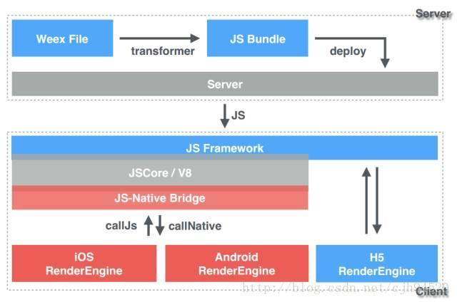

#### Weex渲染机制
主要简单介绍写weex的渲染机制，将重点放在V8引擎在解析完.js文件后，客户端这边如何反序列化生成各种组件，最后组成界面的过程；

如上图，是一张网络普传的Weex工作原理图。介绍一个工作机制
1. 首先通过编写.vue文件，完成界面组件设计以及逻辑编写代码;
2. Transformer:转换的意思，我们会借助Weex-Toolkit这个工具讲.vue文件转换成.js文件
3. deploy:意味着将这个.js文件上传到服务器，后面可以通过CMS下发到客户端
4. 客户端收到后，由JS FrameWork处理，对IOS和Android，会通过V8引擎解析，以json的形式返回给客户端。
5. 客户端最后通过json完成自己的渲染。