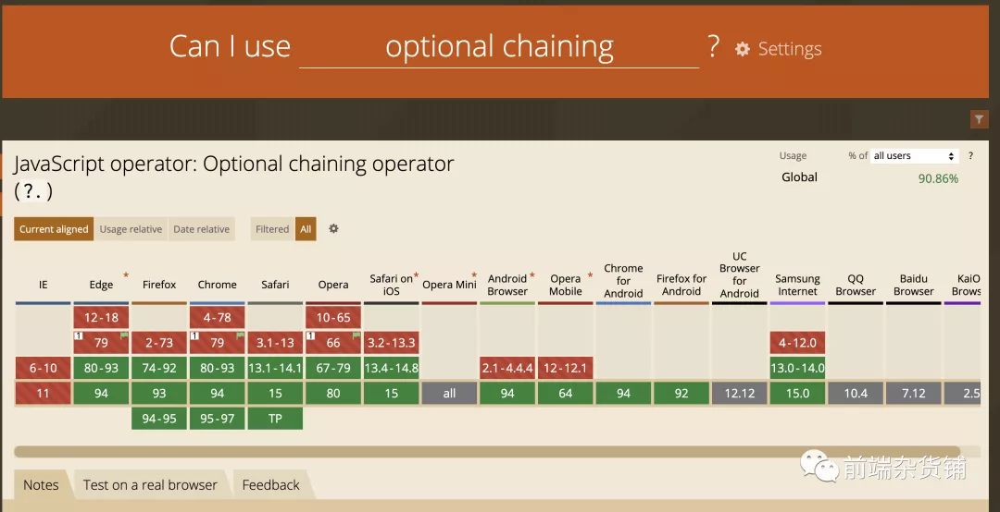

本文结合ES11中非常有用的特性，空值合并操作符(??)和可选链操作符(?.)来看看怎么在相中使用相关语法

## Javascript和ECMAScript的关系
Javascript是一种高级的、编译型型的编程语言。而ECMAScript是一种规范

**JavaScript是基于ECMAScript规范的脚本语言。**ECMAscript(以下简称ES)在2015年发布了ES6(ECMAScript 2015).而且TC39委员会决定每年发布一个ECMAScript版本,也就是我们看到的ES6/7/8/9/11/12

## ES11中有两个非常有用的特性

### 空值合并操作符(?？)
Nulish coalescing Operator(空值处理)只有null和undefined的时候猜人物真的是空。以下为使用方式
```js
let user = {
  u1: 0,
  u2: false,
  u3: null, 
  u4: undefined,
  u5: ''
}
let u1 = user.u1 || '用户1' // 用户1
let u2 = user.u2 || '用户2'; // 用户2
let u3 = user.u3 || '用户2'; // 用户3
let u4 = user.u4 || '用户4' // 用户4
let u5 = user.u5 || '用户5' //用户5
// es11语法[只有null 和undefined的时候才认为是真的空]
let u1 = user.u1 ?? '用户1' // 0
let u2 = user.u2 ?? '用户2' // false
let u3 = user.u3 ?? '用户3' // 用户3
let u4 = user.u4 ?? '用户4' // 用户4
lt u5 = user.u5 ?? '用户5' // ''
```
应用场景: 后端返回的数据中null和0表示的意义可能不一样，null表示为空，展示/。0还是有数值，展示0
```js
let a = 0;
console.log(a ?? '/'); // 0
a = null
console.log(a ?? '/') // '/'
```

### 可选链

:::danger
可选链操作符(?.)允许读取位于连接对象链深处的属性的值，而不必明确验证链中的每个引用是否有效。?.操作符的功能类似于.链式操作符，不同之处在于，在引用为空(nullish)(null 或 undefined)的情况下不会引起错误，该表达式短路返回值是。与函数调用一起使时，如果给定的函数不存在，则返回
:::
有点类似lodash工具库中的get 方法
```js
let user = {
  age: 18
}
let u1 = user.childer.name // TypeError: connot read property 'name' of undefined
// es11 语法
let u1 = user.childer?.name // undefined
```

## 浏览器兼容问题
虽然 ES 新的特性十分好用，但需要注意的是它们的兼容性问题。比如，可选链目前的兼容性[1]如下:

解决方法就是讲 ES 新特性的语法转换成 ES5 的语法。

## 使用Babel进行转换
Babel是一个Javascript编译器。它的输入是下一代Javascript语法书写的代码，输出浏览器兼容的javascript代码

我们可以通过Babel中的转换插件来进行语法转换。比如我们上面两个语法可以通过下面两个插件进行转换

控制合并操作符 @babel/plugin-proposal-nullish-coalescing-operator

使用
```js
npm install --save-dev @babel/plugin-proposal-nullish-coalescing-operator
```

配置文件
```js
{
  "plugins": ["@babel/plugin-proposal-nullish-coalescing-operator"]
}
```
就可以做到一下的转换
```js
var foo = object.foo ?? "default";

// 输出：
var _object$foo;

var foo =
  (_object$foo = object.foo) !== null && _object$foo !== void 0
    ? _object$foo
    : "default";
```
同理，可选链操作符可以看 @babel/plugin-proposal-optional-chaining[3]，还有其他的都可以在 @babel/preset-env 目录中找到。
## 测试
```js
const foo = null ?? 'default string';
console.log(foo);
// expected output: "default string"

const baz = 0 ?? 42;
console.log(baz);
```
运行上面代码报错

项目中使用成功。说明polyfil成功了


## 总结

JavaScript 是基于 ECMAScript 规范的脚本语言。ECMAScript 规范的发展给前端开发带来了很多的便利，但我们在使用的时候应该使用 Babel 这种 JavaScript 编译器将其转换成浏览器兼容的代码。


## 资料
[原文](https://mp.weixin.qq.com/s/902E6BMHRTuyYzE7stT0CA)