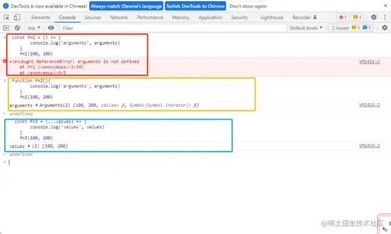
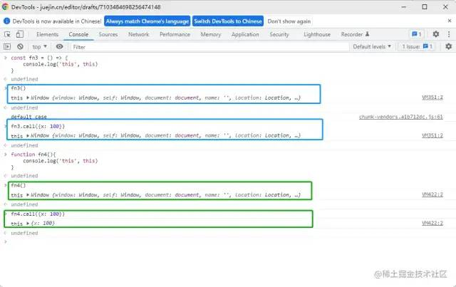
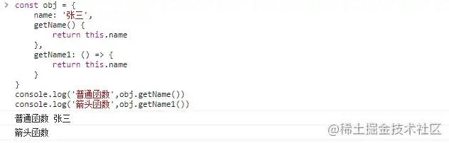

## 介绍

<span style="color: red">箭头函数表达式的语法比函数表达式更简洁，**并且没有自己的this、arguments、super和new.target**.箭头函数更适合用于本来需要匿名函数的地方，并且他们不能用作构造函数。</span>

> 因为箭头函数没有prototype, 所以箭头函数本身没有this.

><span style="color: red">箭头函数</span>内部没有constructor方法，也没有prototype，所以<span style="color: red">不支持new操作</span>。但是它对this的处理与一般的普通函数不一样，<span style="color: red">箭头函数的this始终指向函数定义时的this</span>，而非执行时。
## 注意事项

1. 返回对象

```js
const foo = () => ({bar: 'baz'});
```
由于大括号会被解释为代码块，所以利用箭头函数直接返回一个对象时，需要小括号包裹

2. 禁止构造函数

```js
const Foo = () => {};
const foo = new Foo(); // TypeError:Foo is not a constructor
```

3. 对象方法

```js
const foo = {
    bar: 'baz',
    baz: () => this.bar = 'foo'
}
```

箭头函数会继承父级作用域的this, 而对象没有作用域，此时this指向全局作用域(window)

## 日常使用

1. 闭包

```js
const add = (i = 0) => {return () => ++i};
const increase = add();
increase(); // 1
increase(); // 2
```

## 什么时候不能使用箭头函数
先看一个问题
```js
const obj = {
    name: '张三',
    getName() {
        return this.name;
    },
    getName1:() => {
        return this.name;
    }
}
obj.__proto__.getName2 = function() {
    return this.name;
}
obj.__proto__.getName3 = () => {
    return this.name;
}
console.log('普通函数', obj.getName()); // 普通函数 张三
console.log('普通函数', obj.getName2()); // 普通函数 张三
console.log('普通函数', obj.getName1()); // 普通函数 undefined
console.log('普通函数', obj.getName3()); // 普通函数 undefined
```
大家觉得会输出什么？

如果答错了，也别灰心，毕竟网络有着35的延迟，影响着你的操作和思考，看完这篇文章，保证你就不会答错了！

### 箭头函数有什么缺点？
1. <span style="color: red;font-weight:bold">没有arguments,如果要用，可以用rest参数代替。</span>这里我们定义一个箭头函数和一个普通函数还有一个舒勇rest参数的箭头函数

    ```js
    const fn1 = () => {
        console.log('arguments', arguments);
    }
    fn1(100, 200)

    function fn2() {
        console.log('arguments', arguments)
    }
    fn2(100, 200);

    const fn2 = (...values) => {
        console.log('values', values)
    }
    fn3(100, 200)
    ```
    

2. <span style="color: red;font-weight:bold">无法通过apply、call、bind改变this指向</span>

    ```js
    const fn3 = () => {
        console.log('this', this);
    }
    fn3();


    function fn4() {
        console.log('this', this);
    }
    fn4()
    ```
    箭头函数的this就是他父容器的this，不是在执行的时候确定的，而是在定义的时候确定的。
    

    如图，我们可以发现，**箭头函数的两次执行的thi都是指向了Window，使用call并没有发生改变；而普通函数第一次是指向了Windowws,第二次则是变成了我们传入的**

### 什么时候不能用箭头函数
1. <span style="color: blue">对象方法中，不适用箭头函数</span>

    ```js
    const obj = {
        name: '张三',
        getName() {
            return this.name;
        },
        getName1: () => {
            return this.name;
        }
    }
    ```
    我们在对象中定义了:普通函数getName 和箭头函数getName1,接下来我们来调用一下
    ```js
    console.log('普通函数', obj.getName());
    console.log('箭头函数', obj.getName1());
    ```
    
    我们发现剪头函数好像并没有获取到值

    **为什么对象方法中，箭头函数的this指向不是这个对象？**

    1. <span style="color: red">this永远指向函数的调用者</span>
    2. <span style="color: red">**在箭头函数中，this指向的是定义时所在的对象，而不是使用时所在的对象**。换句话说，箭头函数没有自己的this，而是继承父作用域中的this.</span>

    obj.getName()中this指向函数的调用者，也就是obj实例，因此this.name = '张三'。

    getName1()通过箭头函数定义，而箭头函数是没有自己的this，会继承父作用域的this

    因此obj.getName1()执行时，此时的作用域指向window，而window没有定义name属性，所以报空
2. <span style="color: blue">原型方法中，不适用箭头函数</span>

    ```js
    const obj = {
        name: '张三'，
    }
    obj.__proto__.getName = function() {
        return this.name;
    }
    obj.__proto__.getName1 = () => {
        return this.name;
    }
    ```
    我们又又又在对象中定义了普通函数：getName和箭头函数 getName1，接下来我们来调用一下：
    ```js
    console.log(obj.getName()); // 张三
    console.log(obj.getName1()); // ''
    ```
    **为什么呢？**

    出现问题的原因是this指向window对象，这和使用箭头函数在对象中定义方法十分类似

3. <span style="color: blue"> 构造函数中也不行</span>

    我们又又又定义了普通的构造函数：Foo和箭头函数 Foo1，接下来我们来调用一下：
    ```js
    function Foo (name, sex) {
        this.name = name
        this.sex = sex
    }
    const Foo1 = (name, sex) => {
        this.name = name
        this.sex = sex
    }
    console.log('普通的构造函数：', new Foo('张三', '男'))
    console.log('箭头函数：', new Foo1('张三', '男'))
    ```
    不仅不行，还报错了呢？

    **为什么呢？**
    :::danger
    构造函数是通过new关键字来生成对象实例，生成对象实例的过程也是通过构造函数给实例绑定this的过程，而箭头函数没有自己的this。因此不能使用箭头函数作为构造函数，也就不能通过new操作符来调用箭头函数
    :::

4. <span style="color: blue"> 动态上下文中的回调函数</span>

    比如，我们需要给一个按钮添加点击事件
    ```js
    const btn1 = document.getElementById('btn1');
    btn1.addEventListener('click',() => {
        this.innerHTML = 'clicked'
    })
    ```
    如果我们在回调中不需要使用到this，那就没啥问题，但是使用到了this，那么问题就大大了

    **为什么呢？**
    
    **箭头函数的this指向的是他的父作用与(这里就指向了window)**,而不是指向这个button。这时候我们需要使用普通函数才可以

5. <span style="color: blue">Vue生命周期和method也不能使用箭头函数</span>

    ```js
    default exports {
        data() {return {name: '双越'}},
        methods: {
            getName: () => {
                // 报错 Cannot read properties of undefined(reading 'name');
                return this.name;
            },
            getName() {
                return this.name; // 正常
            }
        },
        mounted: () => {
            // 报错 Cannot read properties of undefined (reading 'name)
            console.log('msg', this.name);
        }
        // mounted() {
            // console.log('msg', this.name); // 正常
        // }
    }
    ```
    **为什么不行呢？**

    Vue本质上是一个对象，我们说过对象方法中，不适用箭头函数。他的本质和对象方法中，不适用箭头函数是一样的。

    那么我有一个问题:Vue不行，作为热门react行吗？

    回答是：React行

    因为Vue组件本质上是一个JS对象；React组件(非hooks)他本质上是一个ES6的class

    不行的话我们测试一下就知道了
    ```js
    class Man {
        constructor(name, city) {
            this.name = name;
            this.city = city;
        }
        getName = () => {
            return this.name;
        }
    }
    const f = new Man('李四', '上海');
    console.log(f.getName());
    ```

### 划重点
- <span style="color: red">要熟练使用箭头函数，也要对函数this(重点)敏感</span>
- <span style="color: red">Vue组件本质上是一个JS对象；React组件(非Hooks)本质上是一个ES6的class,两者不同</span>

## 资料
[箭头函数](https://www.cnblogs.com/crazycode2/p/6682986.html)

[什么时候不能使用箭头函数](https://mp.weixin.qq.com/s/HL97cTYHn1_zS9tdjDz3yw)