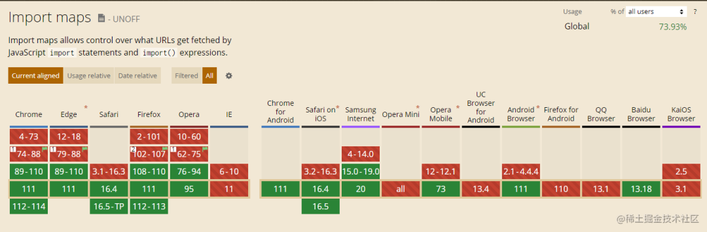

我主要从以下几个方面来简单介绍一下import maps：


## import maps是什么
import map直译过来就是 **导入映射**，它与模块的使用有关，一般我们在项目中导入模块，会调用require方法，或者使用import语句或方法，引入的模块通常使用npm之类的包管理器进行管理。但是  import map 提供了一种支持，让我们可以直接在页面页面上管理模块，不需要通过打包构建。

import maps已经成了一个Web标准，，并且在2021年7月正式通过了 W3C 的标准化流程；但是由于这个特性比较新，很多浏览器不支持，后面我们详细聊聊兼容情况。

接下来看一下import map怎么工作的...

##  import maps怎么使用
在 import maps中，可以使用一个 JavaScript 对象来定义模块标识符与对应URL的映射关系。例如：
```html
<script type="importmap">
    {
        "imports": {
            "lodash": "https://cdn.jsdelivr.net/npm/lodash@4.17.21/lodash.js",
            "react": "/node_modules/react/index.js"
        }
    }
</script>
```
在上述示例中，定义了lodash模块的URL为 https://cdn.jsdelivr.net/npm/lodash@4.17.21/lodash.js, 而react模块的URL则为相对路径/node_modules/react/index.js

通过importmap，可以在模块中使用字符串形式的模块名称来导入其他模块，而不必关心时机模块资源的URL，例如：
```html
<script type="module">
    import _ from 'lodash';
    import React from 'react';
</script>
```
这样，JavaScript引擎会自动根据导入映射中定义的映射关系来加载模块资源，并将其绑定到相应的模块变量上。

总之import maps使用其实非常简单，是通过在html文档的script标签中，使用json对象来配置所有需要在当前html文档中需要引入的模块。

如果这个json映射表内容比较多，我们还可以将它放到其他文件中，然后通过src属性去链接它，例如
```html
<script src="xxx_importmaps.json"></script>
```
上面一起简单的认识了 import maps相信不少人和我一样，都在想一个问题，这种实现方式有什么优势呢？或者说酒精能解决什么问题，呆着疑问我们进入下一节

## import maps有何优势？
换句话说，我们需要先知道import maps可以用来做什么？

### 动态加载模块
import maps支持动态加载模块，可以在需要的时候才进行加载，避免一次性加载所有模块的开销，提高应用程序的性能和用户体验

这里距离说明一下，例如在Vue2的项目中，文章页面支持播放视频，但是文章中没有视频时，我们可以不用加载播放器，项目中动态加载player.min.js
1. 首先在index.html文件中添加 import maps

    ```html
    <head>
        <script type="importmap">
            {
                "imports": {
                    "player": "https://example.com/path/to/player.min.js"
                }
            }
        </script>
    </head>
    ```
2. 在Vue组件中动态加载 player.min.js文件

    可以在需要使用播放器的vue组件中使用动态加载player.min.js文件的代码 例如：
    ```js
    export default {
        data() {
            return {
                player: null,
            }
        },
        methods: {
            loadPlayer() {
                if(this.player) {
                    return Promise.resolve(this.player);
                }
                return import('player').then((Player) => {
                    this.player = new Player.default();
                    return this.player;
                });
            },
            play() {
                this.loadPlayer().then((player) => {
                    player.play();
                });
            },
        }
    }
    ```
### 减少网络请求
使用import maps 可以减少网络请求的主要原因是，可以将多个模块合成一个请求，从而减少了网络请求的次数，提高页面的加载速度

如果一个页面需要引入多个模块，如果不使用 import maps，每个模块都需要通过一个独立的请求进行加载。而使用import maps，可以讲多个模块合并成一个请求，从而减少网络请求的次数。例如：

```html
<script type="importmap">
   {
  'lodash': 'https://cdn.jsdelivr.net/npm/lodash@4.17.21/lodash.min.js',
  'vue': 'https://cdn.jsdelivr.net/npm/vue@3.0.0/dist/vue.esm-browser.js',
  'axios': 'https://cdn.jsdelivr.net/npm/axios@0.21.1/dist/axios.min.js'
   };
</script>
```
```js
// 定义个映射表

// 加载模块
Promise.all([
    import('lodash'),
    import('vue'),
    import('axios')
]).then(([_, { createApp}, axios]) => {
    const app = createApp({/**.... */})
    axios.get(/*....*/)
})
```
在上面的代码中，在加载模块时，我们使用了Promise.all方法讲多个模块的导入操作合并到一个Promise对象中，这样浏览器就可以将多个模块的请求合并成一个请求，从而减少了网络请求的次数。需要注意的是，在使用import maps减少网络请求时，我们需要避免将过多的模块合并到一个请求中，否则可能会导致请求过大，影响页面的加载速度。通常建议将多个模块合并到一个请求中时，选择具有相似功能或关联度高的模块进行合并，同时需要进行适当的测试和优化，以确保页面的加载速度和性能

### 模块依赖关系管理
通过import maps中定义模块之间的依赖关系，可以更加方便的进行依赖管理，并且可以在不同的环境中(例如开发环境和生产环境)使用不同的导入映射，从而更好的控制依赖关系。假设我们有一个页面需要加载三个模块：module1.js、module2.js和module3.js。其中，module2.js和module3.js依赖于module1.js，也就是说，需要先加载module1.js，在加载module2.js和module3.js。在不适用Import Maps的情况下，我们需要手动管理这些模块的加载顺序，代码如下
```js
// 加载模块1 
const script1 = document.createElement('script');
script1.src = 'module1.js';
script1.onload = () => {
    // 加载模块2
    const script2 = document.createElment('script');
    script2.src = 'module2.js';
    script2.onload = () => {
        // 加载模块3
        const script3 = document.createElement('script');
        script3.src = 'module3.js';
        document.head.appendChild(script3)
    }
    document.head.appendChild(script2);
}
document.head.appendChild(script1);
```
上面的代码中，我们通过创建script标签来加载模块，并使用onload事件来控制模块的加载顺序，保证模块的依赖关系正确。这种方式需要手动管理模块的加载顺序，代码比较冗长，且容易出错

使用Import Maps可以简化这个过程，代码如下
```html
<script type="importmap">
    {
        'module1': 'module1.js',
        'module2': { deps: ['module1'], url: 'module2.js'},
        'module3': { deps: ['module1'], url: 'module3.js' },
    }
</script>
```
```js
// 加载模块
Promise.all([
    import(moduleMap('module1').url),
    import(moduleMap('module2').url),
    import(moduleMap('module3').url),
]).then(([module1, module2, module3]) => {
    //....
})
```
其中每个模块都定义了其依赖关系和对应的URL。然后在加载模块时，我们只需要按照模块依赖关系的顺序，依次导入每个模块即可，不需要手动管理模块的加载顺序。这种方式代码比较简洁，且可以更好的管理模块的依赖关系

## 其他用法
### 动态构建import map
import maps可以根据条件任意的动态配置，这个能力就相当于支持了动态加载模块，可以在需要的时候才进行加载，避免一次性加载所有的模块，提高应用程序的性能和用户体验。这里举例说明一下，例如我的文章页面支持播放视频，但是文章中没有视频我可以不用加载播放器
```html
<script>
  const importMap = {
    imports: {
      lazyload: "player.min.js",
    },
  };
  const imp = document.createElement('script');
  imp.type = 'importmap';
  imp.textContent = JSON.stringify(importMap);
  document.currentScript.after(im);
</script>
```
这种方式需要确保创建和插入import map脚本标签之前进行(如上所述),因为修改一个已经存在的import map对象不会有任何效果

### import maps引入同一个包的不同版本
通过import maps引入同一个包的不同版本是一件非常简单的时间，你只需要把不同版本的标识符在映射中写出来就行。就像下面这样。

```html
<script type="importmap">
      {
        "imports": {
          "vue@2/": "https://cdn.jsdelivr.net/npm/vue@2.0.0/dist/vue.esm-browser.js",
          "vue@3/": "https://cdn.jsdelivr.net/npm/vue@3.0.0/dist/vue.esm-browser.js"
        }
      }
</script>
```
## import maps can i use
最后说一下关于 import maps的兼容性问题，首先上一张 can i use上的截图



目前已经得到了多个主流浏览器的支持，但还没有被所有浏览器兼容。特别国内常用QQ浏览器、安卓手机常用的UC浏览器等。

然而，对于一些旧版本的浏览器或者不支持导入映射的浏览器，可以通过使用 polyfill 或者额外的加载器库（如 SystemJS）来实现导入映射的功能。

总之，虽然导入映射已经得到了多个主流浏览器的支持，但在开发过程中需要考虑到不同浏览器的兼容性问题。

## 资料
[又新学到了一个JavaScript知识点Import Maps](https://mp.weixin.qq.com/s/6KV1Q-7Wvwb-8E81fTooWA)