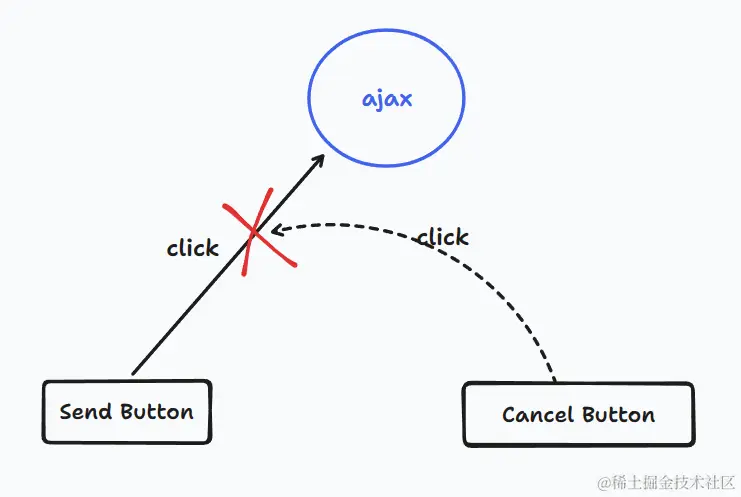
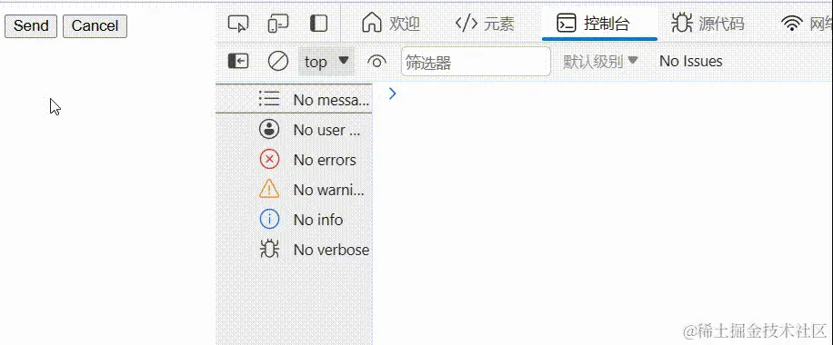
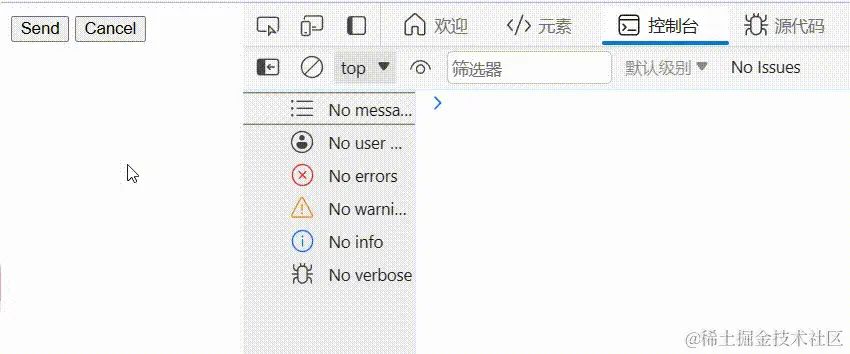
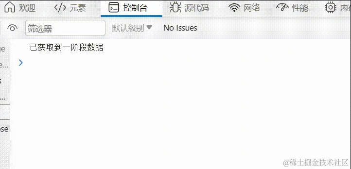

## 取消功能
我们都知道 Promise 的状态是不可逆的，也就是只能从 pending-> fulfilled 或 pending -> rejected,这一点是毋庸置疑的。

但现在可能会有这样的需求，在状态转换过程中我们可能不再想让他进行下去了，也就是说让他永远停留至pending状态。

奇怪了，想要一直停留在pending,那我就不调用 resolve 和 reject 不就行了

```js
const p = new Promise((resolve, reject) => {
    setTimeout(() => {
        // handler data, no resolve, and reject
    }, 1000)
})
console.log(p); // Promise {<pending>}
```
但注意我们的需求条件，**是在状态转换过程中**,也就是说必须有调用 resolve 和 reject，只不过中间可能由于某种条件，阻止了这两个调用。

其实这个场景和超时中断有点类似但还是不太一样，我们先利用 Promise.race 来看看：模拟一个发送请求，如果超时则提示超时错误：

```js
const getData = () => {
    new Promise((resolve) => {
        setTimeout(() => {
            console.log('发送网络请求获取数据');
            resolve('success get Data');
        }. 2500)
    })
}

const timer = () => {
    new Promise((_, reject) => {
        setTimeout(() => {
            reject('timeout');
        }. 2000)
    })
}

const p = Promise.race([getData(), timer()]).then(res => {
    console.log('获取数据', res)
}).catch(err => {
    console.log('超时', err)
})
```

问题是现在确实能够确认超时了,但race的本质是内部会遍历传入的promise数组对他们的结果进行判断，那好像并没有实现网络请求的中断，即使超时网络请求还会发出


而我们想要实现的取消功能是希望不借助 race 等其他方法并且不发送请求。

比如让用户进行控制，**一个按钮用来发送请求，一个按钮表示取消**，来中断promise的流程

> 当然这里我们不讨论关于请求的取消操作，重点在Promise上



其实按照我们的理解只用Promise是不可能实现这样的效果的，因为从一开始接触 Promise 就知道一旦调用了 resolve/reject 就代表着要进行状态转换了。不过  取消 这两个字一定不会陌生 clearTimeout、clearInterval 等

ok，如果你想到了这一点这个功能就出来了,我们直接先看来红宝书给出的答案

```html
<!DOCTYPE html>
    <head>
        <meta charset="UTF-8" />
        <meta name="viewport" content="width=device-width, initial-scale=1"/>
        <title>Document</title>
    </head>
    <body>
        <button id="send">Send</button>
        <button id="cancel">Cancel</button>
        <script>
            class CancelToken {
                constructor(cancelFn) {
                    this.promise = new Promise((resolve, reject) => {
                        cancelFn(() => {
                            console.log('delay cancelled');
                            resolve();
                        })
                    })
                }
            }
            const sendButton = document.querySelector('#send');
            const cancelButton = document.querySelector('#cancel');

            function cancellableDelayedResolve(delay) {
                console.log('prepare send request');
                return new Promise((resolve, reject) => {
                    const id = setTimeout(() => {
                        console.log('ajax get data');
                        resolve();
                    }, delay);

                    const cancelToken = new CancelToken((cancelCallback) => {
                        cancelButton.addEventListener('click', cancelCallback);
                    })

                    cancelToken.promise.then(() => clearTimeout(id));
                })
            }
            sendButton.addEventListener('click', () => cancellableDelayedResolve(1000));
        </script>
    </body>
</html>
```
这段代码说实话是有一点绕的，而且个人觉得是有多余的地方，我们一点一点来看：

首先针对于 sendButton 的事件处理函数，这里传入了一个delay，可以把它理解为取消功能期限，超过期限就要真的发送请求了。我们看该处理函数内部返回了一个promise，而Promise的executor中开启了一个定时器，并且实例化了一个 CancelToken,而CancelToken中才给CancelButton 添加点击事件。

这里的 CancelToken 就是我觉得最奇怪的地方，可能没有体会到这个封装的技巧，路过的大佬如果有理解的希望能帮忙解释一下。它的内部创建了一个 Promise，绕了一圈后相当于 cancelButton 的点击处理函数是调用这个 Promise 的 resolve，最终是在其 pending -> fuilfilled，即 then 方法里才去取消定时器，那为什么不直接在事件处理函数中取消呢？难道是为了不影响主执行栈的执行所以才将其推到微任务处理🤔？

介于自己没理解，我就按照自己的思路封装个不一样的🤣：

```js
const sendButton = document.querySelector('#send');
const cancelButton = document.querySelector('#cancel');

class CancelPromise {
    // delay: 取消功能期限, request:获取数据请求(必须返回 promise)
    constructor(delay, request) {
        this.req = request;
        this.delay = delay;
        this.timer = null;
    }

    delayResolved() {
        return new Promse((resolve, reject) => {
            console.log('prepare request');
            this.timer = setTimeout(() => {
                console.log('send request');
                this.timer = null;
                this.req().then(res => {
                    resolve(res);
                }, err => reject(err));
            }, this.delay)
        })
    }

    cancelResolve() {
        console.log('cancel promise');
        this.timer && clearTimeout(this.timer);
    }
}
// 模拟网络请求
function getData() {
    return new Promise((resolve) => {
        setTimeout(() => {
            resolve('this is data');
        } 2000)
    })
}

const cp = new CancelPromise(1000, getData);

sendButton.addEventListener('click', () => {
    cp.delayResolve().then(res => {
        console.log('拿到数据', res);
    })
})

cancelButton.addEventListener('click', () => cp.cancelResolve());
```
正常发送请求获取数据



中断promise



## 进度通知功能
进度通知？那不就是类似发布订阅吗？还真是，我们看红宝书对这块的描述

:::tip
执行中的Promise可能会有不少离散的"阶段",在最终解决之前必须依次经过.某些情况下，监控 Promise 的执行进度会很有用
:::

这个需求就比较明确了，我们直接看红宝书的实现吧，核心思想就是扩展之前的 Promise，为其添加 notify 方法作为监听，并且在 executor 中添加额外的参数来让用户进行通知操作

```js
class TrackablePromise extends Promise {
  constructor(executor) {
    const notifyHandlers = [];
    super((resolve, reject) => {
      return executor(resolve, reject, (status) => {
        notifyHandlers.map((handler) => handler(status));
      });
    });
    this.notifyHandlers = notifyHandlers;
  }
  notify(notifyHandler) {
    this.notifyHandlers.push(notifyHandler);
    return this;
  }
}
let p = new TrackablePromise((resolve, reject, notify) => {
  function countdown(x) {
    if (x > 0) {
      notify(`${20 * x}% remaining`);
      setTimeout(() => countdown(x - 1), 1000);
    } else {
      resolve();
    }
  }
  countdown(5);
});

p.notify((x) => setTimeout(console.log, 0, "progress:", x));
p.then(() => setTimeout(console.log, 0, "completed"));
```
emm 就是这个例子总感觉不太好，为了演示这种效果还用了递归，大伙们觉得呢？

不好就自己再写一个🤣！不过这次的实现就没有多大问题了，基本功能都具备也没有什么阅读障碍，我们再添加一个稍微带点实际场景的例子吧：

```js
// 模拟数据请求
function getData(timer, value) {
    return new Promise((resolve) => {
      setTimeout(() => {
        resolve(value);
      }, timer);
    });
}

let p = new TrackablePromise(async (resolve, reject, notify) => {
  try {
    const res1 = await getData1();
    notify("已获取到一阶段数据");
    const res2 = await getData2();
    notify("已获取到二阶段数据");
    const res3 = await getData3();
    notify("已获取到三阶段数据");
    resolve([res1, res2, res3]);
  } catch (error) {
    notify("出错！");
    reject(error);
  }
});

p.notify((x) => console.log(x));
p.then((res) => console.log("Get All Data:", res));
```



## 资料
[面试官：能不能给 Promise 增加取消功能和进度通知功能... 我：？？？](https://juejin.cn/post/7312349904046735400?utm_source=gold_browser_extension)