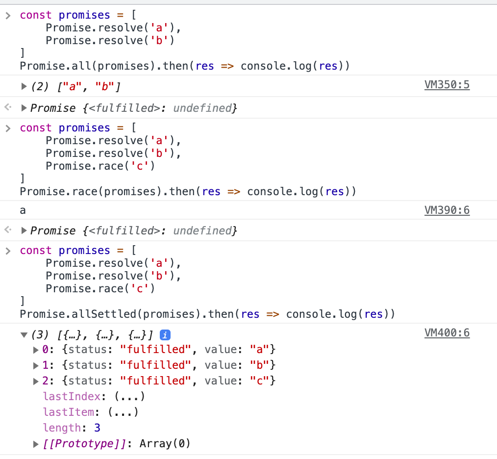
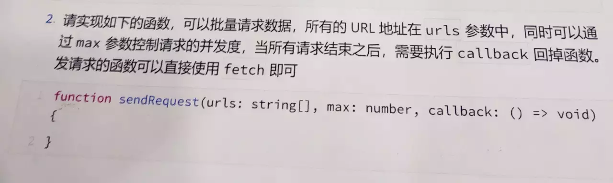

> Promise是ES6中定义的异步编程的一种解决方案。解决回调地狱的函数;


## 手写一个Promise
promise共有三种状态
- pending 过渡态
- fulfilled 完成态
- rejected 失败态

```bash
function Promise(exector) {
	let self = this;
    this.status = 'pending';
    this.value = undefined;
    this.reason = undefined;
    //成功执行
    function resolve(value) {
    	if (self.status === 'pending') {
        	self.value = value;
            self.status = 'resolve';
      	}
    }
    //执行失败
    function reject(reason) {
    	if(self.status === 'pending') {
        	self.reason = reason;
            self.status = 'reject';
        }
    }
    //对异常操作
    try{
    	exector(resolve, reject);
    } catch(e) {
    	reject(e);
    }
    //设置promise的then方法
    Promise.prototype.then = ((resolve, reject) => {
    	let self = this;
        if (this.status === 'resolve') {
        	resolve(self.value);
        }
        if(this.status === 'reject') {
        	reject(self.reason);
        }
    })
}
//new 一个promise  进行测试
let promise = new Promise((resolve,reject) => {
	resolve("return resolve");
});
promise.then(data => {
	console.log(`success ${data}`);

}, err => {
	console.log(`err ${err}`);

})
```

### 发布订阅模式的promise

```
function myPromise(fun) {
    var self = this;
    this.resolveList = [];
    this.rejectList = [];
    function resolve(value) {
        self.resolveList.forEach(f => {
            f(value);
        })
    }
    function reject(value) {
        self.rejectList.forEach(f => {
            f(value)
        })
    }
    try {
        fun(resolve, reject);
    } catch (e) {
        console.log(e);
    }
}
myPromise.prototype.then = function(fn) {
    this.resolveList.push(fn);
}

new myPromise(resolve => {
    setTimeout(() => resolve('hello promise'), 20);
}).then(res => {
    console.log(res);
})

// 第二种
function myPromise(exector) {
    this.resolveList = [];
    var resolve = (value) => {
        this.resolveList.push(value)
    }

    try {
        exector(resolve);
    } catch(e) {

    }
}
myPromise.prototype.then = function(resolve) {
    this.resolveList.forEach((value) => {
        resolve(value)
    })
}
new myPromise(resolve => {
    resolve('hello')
}).then(res => {
    console.log(res);
})
```

## 实现Promise.all方法
总结Promise.all的特点
<br/>
- 接收一个Promise实例的数组或者具有Iterator接口的对象
- 如果元素不是Promise对象，则使用Promise.resolve转成Promise对象
- 如果全部成功，状态为resolved,返回值组成一个数组传给回调
- 只要有一个失败，状态就变成rejected，返回值将直接传递给回调
<br/>
all()的返回值也是新的Promise对象

```bash
function promiseAll(promises) {
    return new Promise(function (resolve, reject) {
        if (!Array.isArray(promises)) {
            return reject(new TypeError('arguments must be an array'));
        }
        var resolvedCounter = 0;
        var promiseNum = promises.length;
        var resolvedValues = new Array(promiseNum);
        for (var i = 0; i < promiseNum; i++) {
            (function (i) {
                Promise.resolve(promises[i]).then(function (value) {
                    resolvedCounter++
                    resolvedValues[i] = value
                    if (resolvedCounter == promiseNum) {
                        return resolve(resolvedValues)
                    }
                }, function (reason) {
                    return reject(reason)
                })
            })(i)
        }
    })
}
var p1 = Promise.resolve(1),
    p2 = Promise.reject(2),
    p3 = Promise.resolve(3);
promiseAll([p1, p2, p3]).then(function (results) {
    //then方法不会被执行
    console.log(results);
}).catch(function (e){
    //catch方法将会被执行，输出结果为：2
    console.log(e);
});
```

## Promise.race的简单实现
1.作用
- 当想要实现一个方法，每次传入多个请求，哪个先返回就取消其他的，使用先返回的值
2.实现

```bash
//第一种方式
function promiseRace(entries) {
	var Constructor = this; // this 是调用 race 的 Promise 构造器函数。
    if (!Array.isArray(entries)) {
        return new Constructor(function (_, reject) {
            return reject(new TypeError('You must pass an array to race.'));
        });
    } else {
        return new Constructor(function (resolve, reject) {
            var length = entries.length;
            for (var i = 0; i < length; i++) {
                Constructor.resolve(entries[i]).then(resolve, reject);
            }
        });
    }
}
//第二种
function isPromise(obj) {
    return !!obj && (typeof obj === 'object' || typeof obj === 'function') && typeof obj.then === 'function';  
}

const promiseRace = (arr)=>{
    return new Promise((resolve,reject)=>{
        if(arr.length === 0){
            return 
        }else{
            for(let item of arr){
                if(isPromise(item)){
                    item.then((data)=>{
                        resolve(data);
                    },reject);
                }else{
                    resolve(item);
                }
            }
        }
    })
}

var promise1 = new Promise(function(resolve, reject) {
    setTimeout(resolve, 500, 'one');
});

var promise2 = new Promise(function(resolve, reject) {
    setTimeout(resolve, 100, 'two');
});

promiseRace([promise1, promise2]).then(function(value) {
  console.log(value);// two
})
```
## Promise中三兄弟.all,.race, allSettled()
[原文档](https://segmentfault.com/a/1190000020034361)

### 概述

+ Promise.all
```
Promise.all<T>(promises:Iterable<Promise<T>>): Promise<Array<T>>
```
promise.all(iterable)方法返回一个Promise实例，此实例在iterable参数内所有的promise都完成(resolved)或参数中不包含promise时回调完成(resolve);如果参数中promise有一个失败(rejected)，此实例回调失败(reject)，失败原因是第一个失败promise结果

+ Promise.race
```
Promise.race<T>(promises:Iterable<Promise<T>>): Promise<T>
```
promise.race(interable)方法返回一个promise，一旦迭代器中的某个promise解决或者拒绝，返回的promise就会解决或拒绝。

+ Promise.allSettled

```
Promise.allSettled<T>(promise:Iterable<Promise<T>>):Promise<Array<SettlementObject<T>>>
```
promise.allSettled()方法返回一个promise，该promise在所有给定的promise已被解析或被拒绝后解析，并且每个对象都描述每个promise的结果

### demo

```
const promises = [
    Promise.resolve('a'),
    Promise.resolve('b'),
    Promise.resolve('c')
]
Promise.all(promises).then(res => {
    console.log(res);
})
Promise.race(promises).then(res => {
    console.log(res);
})
Promise.allSettled(promises).then(res => {
    console.log(res);
})
```


## Js控制最大并发请求实现，promise

### 背景
多个异步处理之后执行会用到
```
Promise.alll(promises:[]).then(fun:function)
```
Promise.all可以保证，promises数组中所有的promiise对象都打到resolve状态，才执行then回调。
场景：如果你的promises数组中每个对象都是http请求，或者说每个对象包含了复杂的调用处理。而这样的对象有几十万个。
那么会出现的情况是，瞬间发出几十万http请求(tcp连接数不足可能造成等待)，或者堆积了无数调用栈导致内存溢出。
<b>这个时候，需要考虑对Promise.all做并发限制</b>
##### 实现
```bash
function asyncPool(poolLimit, array, iteratorFn) {
    let i = 0;
    const ret = [];
    const executing = [];
    const enqueue = function () {
        // 边界处理，array为空数组
        if (i === array.length) {
            return Promise.resolve();
        }
        // 每调一次enqueue，初始化一个promise
        const item = array[i++];
        const p = Promise.resolve().then(() => iteratorFn(item, array));
        // 放入promises数组
        ret.push(p);
        // promise执行完毕，从executing数组中删除
        const e = p.then(() => executing.splice(executing.indexOf(e), 1));
        // 插入executing数字，表示正在执行的promise
        executing.push(e);
        // 使用Promise.rece，每当executing数组中promise数量低于poolLimit，就实例化新的promise并执行
        let r = Promise.resolve();
        if (executing.length >= poolLimit) {
            r = Promise.race(executing);
        }
        // 递归，直到遍历完array
        return r.then(() => enqueue());
    };
    return enqueue().then(() => Promise.all(ret));
}
```
因为是promise加上递归，所以在代码注释上不太好标注执行顺序，但是大概的逻辑可以总结为：
- 从array第1个元素开始，初始化promise对象，同时用一个executing数组保存正在执行的promise
- 不断初始化promise，直到达到poolLimt
- 使用Promise.race，获得executing中promise的执行情况，当有一个promise执行完毕，继续初始化promise并放入executing中
- 所有promise都执行完了，调用Promise.all返回

使用方式
```
const timeout = i => new Promise(resolve => setTimeout(() => resolve(i), i));
return asyncPool(2, [1000, 5000, 3000, 2000], timeout).then(results => {
    ...
})
```
[js 多个异步 的并发控制](https://www.cnblogs.com/wjyz/p/10541581.html)

[JavaScript实现指定数量的并发限制](https://www.imooc.com/article/301681)

[利用js实现Ajax并发请求限制请求数量的示例代码](https://www.jb51.net/article/209009.htm)

### 总结
所谓promise并发限制，其实根源上就是控制promise的实例化。如果是通过第三方函数，那么就把创建promise的控制权交给第三方即可。

然而这样的实现效果，本质上来说已经抛弃了Promise.all而另辟蹊径。所以期待有一天promise标准能提供这个功能

Promise.any();有一个子实例成功就算成功，全部子实例失败才算失败；

Promise.all()；全部子实例的成功才算成功，一个子实例失败就算失败；

Promise.race()；rece是赛跑机制，看最先的promise子实例是成功还是失败。

[promise-finally](/front-end/JavaScript/es6-es7-es8.html#promise-finally)

## 实例
1.sleep实例
```bash
function sleep(time) {
	return new Promise((resolve, reject) => {
    	setTimeout(resolve, time)
    })
}
sleep(1000).then(() => {console.log(1)})
sleep(2000).then(() => {console.log(2)})
```
2.实例
```
function sleep(i){
    return new Promise((resolve, reject) => {
        setTimeout(function (){
            resolve(i);
        }, 1000);
    });
}

async function start(){
    console.time('g');
    for (let i = 0; i < 5; i++) {
        let res = await sleep({
            i:i,
        });
        console.log(res);
    }
    console.timeEnd('g');
}
start()
```
3.实例3
```bash
const fff = async () => {
      const paths = ['thats', 'power', 'deep', 'dark', 'fantasy'];
      const jsons = paths
        .map(path => 'https://www.easy-mock.com/mock/5a6eee29a08b4a27bdb4a0d3/' + path)
        .map(url => fetch(url).then(res => res.json()))
      const foo = await Promise.all(jsons)

      const total = foo.reduce((total, { score }) => total + score, 0)
      console.log(foo, total)
    }
```
4.实例
```
function getData(api) {
	return new Promise((resolve, reject) => {
    	setTimeout(() => {
        	var ok = Math.random() > 0.5;
            if(ok) {
            	resolve(`get ${api} data`);
            } else {
            	resolve('error');
            }
        }, 2000)
    })
}
function getDatas(arr) {
	var promises = arr.map(item => getData(item));
    return Promise.all(promises).then(values => {
    	values.map((v, index) => {
        	if(v === 'error') {
            	console.log(`第${index + 1}个请求失败`);
            } else {
            	console.log(v);
            }
        })
    }).catch(error => {
    	console.log(error);
    })
}
getDatas(['./api1', './api2', './api3', './api4']);
```
5.实例<br/>
async/await其实是基于Promise的。async函数其实是把Promise包装了一下
```
function getConstant() {
	return 1;
}
async function getAsyncConstant() {
	return new Promise((resolve, reject) => {
    	resolve(1);
    })
}
 async getPromise() {
  return new Promise((resolved, rejected)=> {
    resolved(1)
  });
 }
async function test() {
	let a = 2;
    let c = 1;
    await getConstant();
    let d = 3;
    await getPromise();
    let d = 4;
    await getAsyncConstant();
    return 2;
}
```
上面的代码其实真正的在解析执行的时候是这样的:
```
function getConstant() {
   return 1;
}

function getAsyncConstant() {
  return Promise.resolve().then(function () {
   return 1;
  });
}

function getPromise() {
  return Promise.resolve().then(function () {
   return new Promise((resolved, rejected) => {
    resolved(1);
   });
  });
}

  test() {
    return Promise.resolve().then(function () {
       let a = 2;
       let c = 1;
       return getConstant();
     }).then(function () {
       let d = 3;
       return getPromise();
     }).then(function () {
       let d = 4;
       return getAsyncConstant();
     }).then(function () {
       return 2;
     });
 }
 
```
通过上面的代码可以看出async/await的本身还是基于Promise的。

因为await本身返回的也是一个Promise,它只是把await后面的代码放到了await返回的Promise的.then后面，以此来实现的。
```
     function getJson(){
      return new Promise((reslove,reject) => {
        setTimeout(function(){
          console.log(2)
          reslove(2)
        },2000)
      })
     }
    async function testAsync() {
       await getJson()
       console.log(3)
    }

    testAsync()
```
上面的代码是会先打印2还是3？

答案是2，3

看过上面的童鞋应该知道其实他的真实代码是这样的：

```
function getJson(){
    return new Promise((reslove,reject) => {
      setTimeout(function(){
        console.log(2)
        reslove()
      },2000)
    })
}

function testAsync() {
    return new Promise((reslove,reject) => {
        getJson().then(function (res) {
          console.log(3)
        })
    })
}

testAsync()
```
[参考文档](https://www.cnblogs.com/zhengyufeng/p/11106901.html)
```
function sleep(i) {
    return new Promise((resolve, reject) => {
        setTimeout(() => resolve(i), 1000);
    })
}
async function test() {
    for (var i = 1; i< 11;i++) {
        const res = await sleep(i);
        console.log(res)
    }
}
test()//间隔一秒连续输出1-10
```
6.实例<br>

```
场景一：先调用getData1，再调用getData2，再调用getData3  ...
 
//创建一个Promise实例，获取数据。并把数据传递给处理函数resolve和reject。需要注意的是Promise在声明的时候就执行了。
var getData1=new Promise(function(resolve,reject){
    $.ajax({
        type:"get",
        url:"index.aspx",
        success:function(data){
            if(data.Status=="1"){
                resolve(data.ResultJson)//在异步操作成功时调用
            }else{
                reject(data.ErrMsg);//在异步操作失败时调用
            }
        }
    });
})
 
 
var getData2= new Promise(function(resolve,reject){
    $.ajax({
        type:"get",
        url:"index.aspx",
        success:function(data){
            if(data.Status=="1"){
                resolve(data.ResultJson)//在异步操作成功时调用
            }else{
                reject(data.ErrMsg);//在异步操作失败时调用
            }
        }
    });
})
 
var getData3=new Promise(function(resolve,reject){
    $.ajax({
        type:"get",
        url:"index.aspx",
        success:function(data){
            if(data.Status=="1"){
                resolve(data.ResultJson)//在异步操作成功时调用
            }else{
                reject(data.ErrMsg);//在异步操作失败时调用
            }
        }
    });
})
 
getData1.then(function(res){
　　return getData2(res)
}).then(function(res){
　　return getData3(res)
}).then(function(res){
　　console.log(res)
}).cache(function(error){
　　console.log(error)
})
 
场景二：getData3的执行依赖getData1和getData2
//Promise的all方法，等数组中的所有promise对象都完成执行
Promise.all([getData1,getData2]).then(function([ResultJson1,ResultJson2]){
    //这里写等这两个ajax都成功返回数据才执行的业务逻辑
 
　　getData3()
  })
```
7.实例<br>

[参考地址](https://www.imooc.com/article/301681)



```bash
// 首先实现一个分割数组得函数~
function group(list, max){
    let results = [];
    for (let i = 0; i < list.length; i += max ) {
        results.push(list.slice(i, i + max));
    }
    return results;
}

// function group(arr, num) {
//     const newArr = [];
//     arr.forEach((item, index) => {
//         const page = Math.floor(index / num)
//         console.log(page);
//         if (!newArr[page]) {
//             newArr[page] = [];
//         }
//         newArr[page].push(item);
//     })
//     return newArr;
// }

async function requestHeader(groupedUrl, callback) {
    if (!groupedUrl.length) return groupedUrl;
    const newGroupedUrl = groupedUrl.map(fn => fn());
    const reusltMapper = results => results.map(callback);
    const data = await Promise.allSettled(newGroupedUrl).then(reusltMapper);
    return data;
}
async function sendRequest(urls, max, callback) {
    if (!urls.length) return false;
    const groupedUrls = group(urls, max);
    const result = [];
    for (let groupedUrl of groupedUrls) {
        const result = await requestHeader(groupedUrl, callback);
        result.push(result);
        console.log('go');
    }
    console.log('done!');
    return result;
}
```
这里就是利用了for + async + await来限制并发。等每次并发任务结果出来之后在执行下一次得任务。

栗子
```
const p1 = () => new Promise((resolve, reject) => setTimeout(reject, 1000, 'p1'))
const p2 = () => Promise.resolve(2)
const p3 = () => new Promise((resolve, reject) => setTimeout(resolve, 2000, 'p3'))
const p4 = () => Promise.resolve(4)
const p5 = () => new Promise((resolve, reject) => setTimeout(reject, 2000, 'p5'))
const p6 = () => Promise.resolve(6)
const p7 = () => new Promise((resolve, reject) => setTimeout(resolve, 1000, 'p7'))
const p8 = () => Promise.resolve(8)
const p9 = () => new Promise((resolve, reject) => setTimeout(reject, 1000, 'p9'))
const p10 = () => Promise.resolve(10)
const p11 = () => new Promise((resolve, reject) => setTimeout(resolve, 2000, 'p10'))
const p12 = () => Promise.resolve(12)
const p13 = () => new Promise((resolve, reject) => setTimeout(reject, 1000, 'p11'))
const p14 = () => Promise.resolve(14)

const ps = [p1, p2, p3, p4, p5, p6, p7, p8, p9, p10, p11, p12, p13, p14]
sendRequest(ps, 3, ({reason, value, status}) => {
    console.log(reason || value, status)
})
```


[promise.allSettled](https://segmentfault.com/a/1190000020034361)