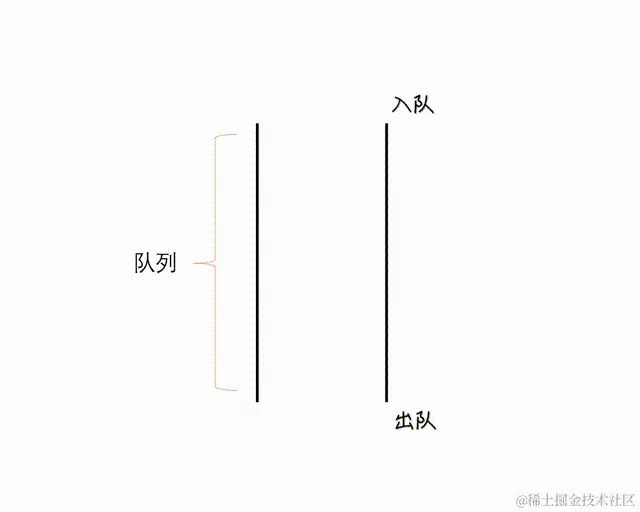
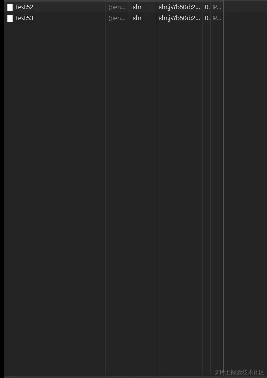

面试官：看你简历上做过图片或文件批量下载，那么假如我一次性下载几十个，如何去控制并发请求的？

让我想想，额~， 选中ID，循环请求？，八嘎！肯定不是那么沙雕的做法，这样做服务器直接崩溃啦！突然灵光一现，请求池！！！

我：利用Promise模拟任务队列，从而实现请求池效果。

面试官：大佬！

废话不多说，正文开始

众所周知，浏览器发起的请求最大并发数量一般都是6-8个，这是因为浏览器会限制同一域名下的并发请求数量，以避免对服务器造成过大的压力

首先让我们来模拟大量请求的场景
```js
const ids = new Array(100).fill('');

console.time();
for(let i = 0; i < ids.length; i++) {
    console.log(i);
}
console.timeEnd();
```
一次性并发上百个请求，要是配置低一点，又或者带宽不够的服务器，直接宕机都有可能，所以我们前端这边是需要控制并发数量为服务器排忧解难

## 什么是队列
先进先出就是队列，push一个的同时就会有一个呗shift。我们看下面的动图就会更加的理解



我们接下来就得操作就是模拟上图的队列行为

## 定义请求池主函数
```js
export const handQueue = (reqs) => {}
```
接受一个参数reqs，它是一个数组，包含需要发送的请求。函数的主要目的是对这些请求进行队列管理，确保并发请求的数量不会超过设定的上限

## 定义dequeue函数
```js
const dequeue = () => {
    while(current < concurrency && queue.length) {
        current++;
        const requestPromiseFactory = queue.shift(); // 出队
        requestPromiseFactory().then(() => {
            // 成功请求逻辑
        }).catch(error => {
            console.log(error);
        }).finally(() => {
            current--;
            dequeue();
        })
    }
}
```
这个函数用于从请求池中取出请求并发。它在一个循环中运行，直到当前并发请求数 current 达到最大并发数 concurrency 或者请求池 queue 为空。对于每个出队的请求，它首先增加current的值，然后调用请求函数 requestPromiseFactory() 发送请求。请求成功或失败后，它会减少current的值，并调用dequeue()函数来处理下一个请求。

## 定义返回请求入队函数
```js
return (requestPromiseFactory) => {
    queue.push(requestPromiseFactory);
    dequeue();
}
```
函数返回一个函数，这个函数接受一个参数requestPromiseFactory，表示一个返回Promise的请求工厂函数。这个返回的函数将请求工厂函数加入请求池queue,并调用dequeue来尝试发送新的请求，当然也可以自定义axios，利用Promise.all统一处理返回后的结果

## 实验
```js
const enqueue = requestQueue(6); // 设置最大并发数
for(let i = 0; i < reqs.length; i++) {
    enqueue(() => axios.get('/api/test' + i))
}
```


我们可以看到如上图所示,请求数确实被控制了，只有有请求响应成功的同时才会有新的请求进来，极大的降低里服务器的压力，后端的同学都只能喊6。

## 整合代码
```js
import axios from 'axios';

export const handQueue = reqs => {
    reqs = reqs || [];

    const requestQueue = concurrency => {
        concurrency = concurrency || 6;
        const queue = [];// 请求池
        let current = 0;

        const dequeue = () => {
            while(current < concurrency && queue.length) {
                current++;
                const requestPromiseFactory = queue.shift(); // 出列
                requestPromiseFactory().then(() => {
                    // 成功请求逻辑
                }).catch(error => {
                    console.log(error);
                }).finally(() => {
                    current--;
                    dequeue();
                })
            }
        }
        return requestPromiseFactory => {
            queue.push(requestPromiseFactory); // 入队
            dequeue();
        }
    }

    const enqueue = requestQueue(6);
    for(let i = 0; i < reqs.length; i++) {
        enqueue(() => axios.get('/api/test' + i))
    }
}
```
之前写过一篇关于web-worker大文件切片的案例文章，就是利用了此特性感兴趣的小伙伴可以看看[web-worker的基本用法并进行大文件切片上传（附带简易node后端）](https://juejin.cn/post/7351300892572745764)

## 原文
[原文](https://juejin.cn/post/7356534347509645375)

[实现一个批量请求函数](/front-end/interview/coding2.html#%E5%AE%9E%E7%8E%B0%E4%B8%80%E4%B8%AA%E6%89%B9%E9%87%8F%E8%AF%B7%E6%B1%82%E5%87%BD%E6%95%B0-multirequest-urls-maxnum)