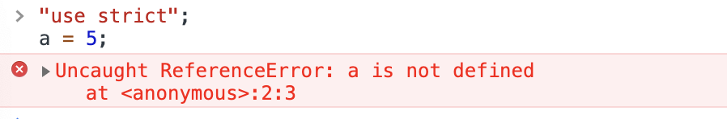

## 严格模式
js运行有两种模式：一种是普通模式；一种是严格模式

严格模式是ES5添加的，是比普通模式多一部分的js规则。如果在ES5之前js解析引擎，会忽略严格模式

<span style="color: orange">js一般默认是普通模式，ES6的模块和Class类默认是严格模式</span>

类(class)和模块的内部，默认就是严格模式，所以不需要使用<span style="color: orange"> use strict </span>指定运行模式。只要你的代码写在类或者模块之中，就有严格模式可用。

考虑到未来所有的代码，其实都是运行在模块之中，所以ES6实际上把整个语言升级到了严格模式 

## 严格模式的使用场景
严格模式的触发是使用：<span style="color: red">"use strict"</span>

<span style="color: red">有两种使用场合:一种是脚本范围；一种是函数范围</span>

### 脚本范围
1. 在html文件中，可以在&lt;script/&gt;标签内的顶部直接使用"use strict"

    <span style="color:red">"use strict"上面不能有可执行的代码，否则失效；但是上面可以有注释内容或空行</span>
    
    ❗️一个脚本内抛出异常，后面的代码不再执行；但是其他的脚本可以。如下
    ```html
    <script>
      console.log(1);
      'use strict'; // 上面有代码，自动失效
      a = 6;
    </script>
    <script>
      // 这个是脚本注释，并且上面空了一行
      'use strict'； // 严格模式;下面是声明时报错
      b = 6; // Uncaught ReferenceError: b is not defined
    </script>
    <script>
      'use strict'; // 严格模式
      c = 6; // Uncaught ReferenceError: c is not defined
    </script>
    ```
2. 在一个脚本文件中，在顶部声明'use strict';顶部有注释或空行也可以

    ```js
    //--- es5.js
    // 顶部的注释;并且有一个空行，整个文件都是严格模式

    "use strict";
    function test(a,a) { // Uncaught SyntaxError: Duplicate parameter name not allowed in this context
        // 严格模式不允许参数重复；声明时报错
    ```
    <span style="color: red">上面的写法有隐患，如果项目内部需要脚本合并,如严格模式A.js和普通模式B.js，如果A在前面，那么B也会被解释成严格模式；如果B在前，那么A的严格模式会失效</span>

    所以如果是单独的文件，可以使用立即执行函数包裹一下，这样可以避免脚本合并的BUG
    ```js
    // 这个是A.js的代码;代码效果和上面的相同，但是可以保证代码的独立
    (function() {
      "use strict"; // 函数内部严格模式
        function test(a,a) { // Uncaught SyntaxError: Duplicate parameter name not allowed in this context
        }
    })();
    ```
### 函数范围
在一个函数内顶部使用'use strict';那么在一个函数内是严格模式
```js
function test() {
  // 函数的注释
  'use strict'；
  t = 7;
}
// 声明时不报错;执行时报错
test();// Uncaught ReferenceError: t is not defined
```
### 浏览器控制台范围
开发者最方便的调试工具是console控制台;默认是普通模式，可以手动设置严格模式


## 严格模式的内容
### 显示报错
将普通模式中默默失败的错误，改为显示报错
1. 只读属性赋值报错;删除不可配置属性报错

    原来只读属性赋值或者删除不可删除配置属性，默默失败，不会抛出异常;严格模式下，会抛出异常
    ```js
    "use strict";
    class A {
    }
    class B{}
    // 类的prototype属性的writable,configurable,enumerable都是false
    A.prototype = new B(); // Uncaught TypeError: Cannot assign to read only property 'prototype' of function 'class A {}'
    delete A.prototype; // Uncaught TypeError: Cannot delete property 'prototype' of class A {}'
    ```
2. 只设置了取值器的对象不可写

    ```js
    "use strict";
    var a = {
        get prop() {
            return 1;
        }
    }
    a.prop = 5; //Uncaught TypeError: Cannot set property prop of #<Object> which has only a getter
    ```
3. 禁止扩展的对象不可扩展(不能添加新属性)

    ```js
    "use strict";
    var a = {};
    Object.preventExtensions(a);
    a.x = 0; //Uncaught TypeError: Cannot add property x, object is not extensible
    ```
4. eval,arguments不可用作标识名

    javascript中保留字在严格模式下都会报错；实际开发中注意变量不要是保留关键字。

    非严格模式下，会报错
    ```js
    "use strict";
    var eval = 5; //Uncaught SyntaxError: Unexpected eval or arguments in strict mode
    function test(arguments) { //Uncaught SyntaxError: Unexpected eval or arguments in strict mode
    }
    ```
5. 函数参数名不能重复
6. 禁止使用0前缀使用八进制数

    ES6中也有规定，八进制数应该使用“0o”表示。
    ```js
    "use strict";
    var a = 0o10;
    console.log(a); // 8
    var b = 010; // Uncaught SyntaxError: Octal literals are not allowed in strict mode.
    ```

### 加强安全
从语法书写上避免错误的产生
1. <span style="color: red">严格模式下，不允许this执行window</span>

    <span style="color: red">js引擎将其指向undefined。这个很好的解释了React类组件中方法必须绑定this.否则默认this是undefined。</span>

    <span style="color: red">这时fn.call()/fn.call(null)/fn.call(undefined)不早默认绑定window。</span>

2. <span style="color: red">不允许未声明的变量出现</span>

    即变量必须使用var,let等声明，否则报错。原来(普通模式)未声明的变量会默认成为全局变量
    ```js
    'use strict';
    a = 5; // Uncaught ReferenceError
    ```
  
3. 禁止使用fn.caller/fn.arguments

    首先fn.caller不是标准语法;生产环境禁止使用;fn.arguments已被废弃

    但是某些情况下也会使用。

    fn.caller是返回fn的调用栈，即触发该函数的函数；

    如果在全局环境下调用，fn.caller()是null。
    ```js
    // 这是非严格模式；只是为了解释caller的概念；严格模式下报错
    function test() {
        a();
        console.log(test.caller);//null
    }
    function a() {
        console.log(a.caller); // function test(){a();}
    }
    test();
    ```
4. 禁止使用arguments.callee/arguments.caller
5. <span style="color: red">不可删除声明的普通变量</span>

    普通模式下可以删除，并且可以删除成功
    ```js
    // 直接删除数据
    'use strict';
    delete 0; // true

    // 删除声明的变量 
    'use strict';
    let a = 6;
    delete a;//Uncaught SyntaxError: Delete of an unqualified identifier in strict mode.
    ```
6. 严格模式下原始类型的值不能复属性

    普通模式下不报错，会自动将原值值转为包装对象。
    ```js
    "use strict";
    (1).prop = 9; // Uncaught TypeError: Cannot create property 'prop' on number '1'
    ```

### 禁止出现动态作用域
普通模式下，eval()和with()会在执行时动态生成作用域。
1. 禁止使用with语法
2. 创建eval作用域

    严格模式下，eval()会创建一个eval函数内部的作用域。

    普通模式下, eval内部代码所在的作用域是函数所在的作用域。
    ```js
    // 普通模式下
    function test() {
        var x = 5;
        eval("var x = 6"); //相当于直接var x= 6;
        console.log(x); // 6
    }
    test();
    //  严格模式下
    "use strict"; // 1.第一种声明位置
    function test() {
        // "use strict"; // 2.也可以在这里声明
        var x = 5;
        eval("var x = 6"); // 只在eval内部有效
        // 3. 还可以如下声明
        // eval('"use strict"; var x= 6');
        console.log(x); // 5
    }
    test();

    ```


3. arguments对象不在随参数改变而改变

    ```js
    // 普通模式
    function test(a) {
      a = 2;
      return [a, arguments[0]];
    }
    console.log(test(1));  // [2, 2]
    // 严格模式
    "use strict";
    function test(a) {
      a = 2;
      return [a, arguments[0]]; 
    }
    console.log(test(1)); // [2, 1]
    ```
## 向未来版本过度


## 面试题
```js
// 1
window.name = 'sensors'

const aaa = () => {
  console.log(this.name);
}

const bbb = aaa.bind({name: 'test'});
bbb(); // sensors

// 示例二
window.name = 'sensors'

function AAA() {
  this.name = 'test';

  this.getName = function() {
    console.log(this.name);
  }
}

const aaa = new AAA();
const bbb = aaa.getName;
bbb();// sensors

// 示例3
window.name = 'sensors'

class AAA{
  constructor() {
    this.name = 'test';
  }

  getName() {
    console.log(this.name);
  }
}

const aaa = new AAA();
const bbb = aaa.getName;
bbb();


Promise.resolve().then(() => {
    console.log(1);
    Promise.resolve().then(() => {console.log(2)});
}).then(() => {
    console.log(3);
});
```

## 资料
[javascript严格模式](https://www.cnblogs.com/lyraLee/p/11710022.html)