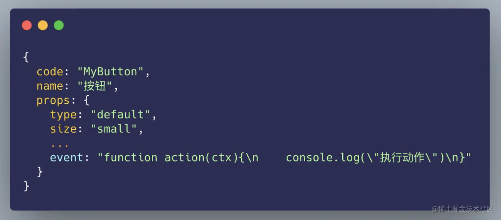
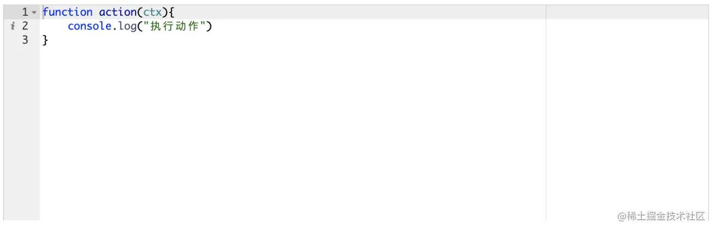

## 前言
大家好，我是多肉攻城狮，我们在[上一篇文章](https://juejin.cn/post/7015878414083031048)中主要介绍了低代码平台的页面设计器相关的一些功能原理，打通了页面设计器顶部操作栏、左侧组件列表、中间画布、右侧属性配置四个部分的关系。能够实现组件列表的展示、组件到画布的拖动，属性配置修改对组件渲染效果影响，并说明了页面设计器中设计好的页面是如何进行渲染的。

虽然我们看起来实现了通过组件拖拉拽完成页面的开发，但是目前的页面还是无法进行使用的，这是因为页面中的组件都是相互独立而又没有关联的。<span style="color: red">实际页面中的绝大多数组件都需要进行相互通讯。例如当我们点击某个按钮时,需要获取到组件的表单值进行提交；又比如我们点击了某个按钮会弹出一个弹窗。</span>我们这一片文章将重点分析一下在低代码开发中组件间交互的实现方式。

## 事件
<span style="color:red">我们主要依托于事件来进行组件间的交互</span>。为了满足组件与组件、组件与系统、组件与服务端的交互，我们大致可以将事件分为三个类别

1. <span style="color: blue">**组件方法**: 每个组件都会暴露处一些方法供其他组件进行调用。例如表格组件，我们可以暴露出查询表格数据方法；弹窗组件，可以暴露打开、关闭方法等等</span>
2. <span style="color: blue">**系统动作**: 有些方法并不属于某个组件，而是系统全局的动作。例如路由的跳转、全局的消息提示、页面加载动画的显隐等等</span>
3. <span style="color: blue">**API调用**: 这一类主要用于处理组件与服务端的交互，也就是服务端api接口的调用</span>

### 事件的定义
**系统动作和api调用的定义相对比较简单，我们可以在vue组件中methods中进行方法的定义，例如我们可以定义一个request方法用于api的调用，reques中调用了我们使用的axios封装好的统一的请求方法，request方法支持传入api的url、method、api参数等信息。这两个事件为全局事件，我们可以将这些方法放到mixins中，然后在各个组件中进行引用**

而对于组件方法，我们需要将组件暴露的方法定义在各个组件的methods中，并在组件加载时进行方法的监听
```js
window.vm.$on(`${id}-${methodName}`, params => {
    // TODO
})
```
在组件销毁时取消监听
```js
window.vm.$off(`${id}-${methodName}`)
```
还记得吗，我们在[上一篇文章](https://juejin.cn/post/7015878414083031048)页面设计器设计好页面时,生成的组件元数据项中附加了一个id字段，而这个字段在事件监听中也起到了重要的作用，能够有效的避免页面中相同组件重复的触发事件。

做好事件的监听后，我们就可以使用emit关键字触发事件了
```js
componentMethod(id, methodName, params) {
    window.vm.$emit(`${id}-${methodName}`, params)
```
在事件配置的时候只需要调用methods中的componentMethod方法就可以了

### 事件配置
上一篇文章中我们讲到，设计器的每一个组件都对应了一段json元数据，我们修改某个组件的属性，会到设计器属性配置区域进行表单值的修改，从而修改配置页面json中改组件所对应的这一段json，同理，当我们进行某个组件的事件配置时，也会对组件的事件属性进行赋值，我们将这个事件属性定义为event.

属性值为一段js函数字符串 如下图


这样，我们执行事件时，只需要将函数字符串转换为函数进行调用就可以了。

对于代码编辑器插件，推荐一下ace，相对比较成熟，功能丰富，上手简单。这里我们就不做详细介绍了，有兴趣的小伙伴可以看下[ace官网](https://ace.c9.io/)



### 事件的执行
上面将到，我们将事件配置成一段函数字符串，那如何来执行呢，相对于小伙伴来说并不难，我们可以使用eval或者function去执行，这里我们选择Function

首先我们定义个字符串函数解析方法funcStrParse
```js
function funcStrParse(funcStr) {
    return Function('"use strict"; return (' + funcStr + ')')()
}
```
这个方法的参数是一段函数字符串，返回值是一个函数。运行时，我们只需要调用funcStrParse返回的函数即可。
```js
funcStrParse('这是一段函数字符串')(ctx)
```
眼尖的小伙伴可能发现了，<span style="color: blue">**我们执行这段函数时,传入了一个ctx参数，实际上，这个ctx参数就是vue组件中的this**。上文中我们讲到，我们会在vue组件中的methods中定义一些系统方法(通过mixin引用)和组件方法。这样，我们在代码编辑器中编写事件时，就可以通过ctx变量调用vue组件methods中的方法了</span>

### 事件的参数
可能有些小伙伴还是有些疑问。我们已经可以通过配置去调用组件中的方法，那么我们如何获取到其他组件中的参数呢？我们知道，组件传参的传递方式有很多，最基本的是通过props属性或通过provite/inject进行传递。考虑到设计器中组件繁多，并且每个组件都有独特的互不相同的组件参数，这样会导致组件标签中传递的属性过多，并且取用十分不方便。<span style="color: blue">我们需要将各个组件暴露的参数放到一个公共的地方，这样在使用的时候就非常方便了。这个公共的地方定义到vuex中的store中还是比较合适的。我们以页面为单位注册store的module,将所有的组件变量都存到所在页面module中的state的pageParams对象变量中。</span>如下图所示，其中id就是组件的id,也就是在pageParams变量中，我们以组件的id为key，以组件的参数集合对象为value.这样就可以直接在事件配置中进行使用了
```js
{
    id1: {
        paramName1: paramValue1,
        paramName2: paramValue2,
        paramName3: paramValue3,
    },
    id2: {
        paramName1: paramValue1,
        paramName2: paramValue2,
        paramName3: paramValue3,
    }
}
```


## 资料
[原文](https://juejin.cn/post/7017351830896115726#heading-2)