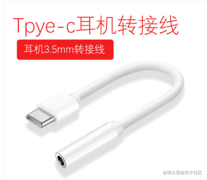

## 什么是适配器模式
<span style="color: red">**适配器模式(Adapter)是将一个类(对象)的接口(方法或属性)转化为客户希望的另外一个接口(方法或属性)，适配器模式使的原版由于接口不兼容而不能一起工作的那些类(对象)可以一起工作，又称为包装器(wapper)**</span>

打个比方：

最近新买了一台手机，坐在车上突然想听歌，由于我有点晕车，希望通过听歌来转移注意力，拿出以前的耳机打算插上手机耳机孔，找了半天，我擦，什么鬼，耳机孔都没有，这怎么听歌，然后问了客户，请原谅我是手机小白，原来我买的手机听歌的地方就是充电的地方，是用typec接口插耳机的，可这是我又没有这种耳机，于是我机智的在某宝上买了如下转接头，插上我原来的耳机，我又能愉快的听歌了

看到这，我想大家也知道了，就是原来我的耳机不兼容我现在的手机，然后需要用个转接头才能再次使用我原来的耳机



## 适配器代码的实现
下面这是一段实现上面例子的代码
```js
// typetypec耳机
class Cellular {
    charge() {
        return 'typec耳孔'
    }
}
// 适配器转换为普通耳机孔
class Adaptor {
    constructor() {
        this.Cellular = new Cellular();
    }
    charge() {
        let v = this.Cellular.charge();
        return `${v}=>普通耳机圆孔`
    }
}
// 然后就能正常使用了
class Headset {
    constructor() {
        this.Adaptor = new Adaptor();
    }
    use() {
        console.log(this.Adaptor.charge())
    }
}
let headset = new Headset();
headset.use();
```
## 适配器应用场景
在平时我们开发中，我们可能会遇到这样的场景:当我们试图调用某个模块或者对象的接口时，却发现这个接口的格式不符合我们的需求。这时有两种解决方法:第一种是修改原来的接口实现，但如果原来的代码很复杂，例如是一个库或框架，更改原代码就显得很不现实了。所以这时就需要使用今天所讲的第二种办法:创建一个适配器，将原接口转换为客户希望的另一个接口，客户只需要使用适配器即可。

比如我们需要请求后端数据，但我们默认请求的方法是GET请求，但后端用的是post请求，还有后端返回的是数据格式是字符串的，但我们需要的是对象类型的数据，因此前端就需要兼容处理

- 对请求参数的适配
- 对后端返回的数据进行适配
```js
function ajax(options) {
    let defaultOptions = {
        methods: 'GET',
        dataType: 'json'
    }
    for(let attr in options) {
        // 这里对请求参数做了适配
        defaultOptions[attr] = options[attr] || defaultOptions[attr];
    }
}
function transfrom(str) {
    return JSON.parse(str)
}
ajax({
    url: 'http://www.baidu.com',
    methods: 'post',
    success(str) {
        // 服务器返回的是一个纯json字符串
        // 我们可以转换成我们想要的格式
        let result = transform(str);
    }
})
```

## 资料
[js设计模式--深入理解适配器模式](https://juejin.cn/post/6844903936919355400)

[javascript 设计模式之适配器模式](https://juejin.cn/post/6962470884527308836)

[JavaScript设计模式--适配器、装饰器、代理](https://www.jianshu.com/p/b8440c67883c)