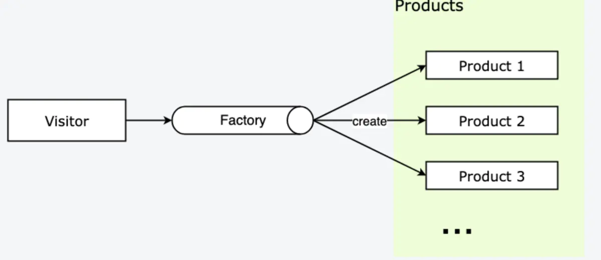

## 工厂模式
- 定义：定义一种创建对象的接口，让子类决定实例化哪一个工厂类，工厂模式使创建过长延迟到子类中执行

- 如何解决: 让其子类实现工厂接口，返回的也是一种抽象的产品



<span style="color:red">Factory: 工厂，负责返回产品实例</span>

<span style="color:red">Product: 产品，访问者从工厂拿到产品实例</span>

- 应用实例

    你需要一辆汽车，可以直接从工厂里面提货，而不用去管这辆汽车是怎么做出来的，以及这个汽车里面的具体实现

    ES6实现
    ```js
    // 实体类 Dog,Cat等
    class Dog {
        run() {
            console.log('Dog----')
        }
    }
    class Cat {
        run() {
            console.log('Cat-----')
        }
    }
    // 工厂类Animal
    class Animal {
        constructor(type) {
            switch (type) {
                case 'dog': 
                    return new Dog();
                case 'cat':
                    return new Cat();
                default: 
                    break;
            }
        }
    }
    let dog = new Animal('dog');
    dog.run();
    let cat = new Animal('cat');
    cat.run()
    ```

<span style="color: blue">**总结: 工厂模式实现起来比较简单，主要是注意工厂模式不需要知道传入的实例是什么，只关心工厂里面输出的是什么**</span>

就比如上面的例子，假如Animal是一个肉品加工厂，不需要关注是如何加工的，只需要给它一头猪，能够给我相应的猪肉相关的产品，比如经过一系列加工的香肠，本人最爱吃的猪肉脯等等，**只需要知道名称，不关心其如何实现，这就是工厂模式的核心**。

- 工厂模式的优点

    1. 调用者想创建对象，只需要知道其名称即可，不需要知道里面是如何实现的
    2. 扩展性高，如果想增加一个产品，扩展一个工厂类即可
    3. 屏蔽产品的具体实现，调用者只关心产品的接口

- 缺点

    每次增加一个产品时，都需要增加一个具体类和对象实现工厂，使得系统中类的个数成倍增加，在一定程度上增加了系统的复杂度，同时也增加了系统具体类的依赖。这并不是什么好事。

### 下面来看主流框架对工厂模式的使用

1. Vue/React源码中的工厂模式

    ```js
    createElement('h3', { class: 'main-title' }, [
        createElement('img', { class: 'avatar', attrs: { src: '../avatar.jpg' } }),
        createElement('p', { class: 'user-desc' }, '长得帅老的快，长得丑活得久')
    ])

    // React
    React.createElement('h3', { className: 'user-info' },
    React.createElement('img', { src: '../avatar.jpg', className: 'avatar' }),
    React.createElement('p', { className: 'user-desc' }, '长得帅老的快，长得丑活得久')
    )
    ```
    createElement 结构大致如下
    ```js
    class Vnode (tag, data, children) { ... }

    function createElement(tag, data, children) {
        return new Vnode(tag, data, children)
    }
    ```
    可以看到 createElement 函数内会进行 VNode 的具体创建，创建的过程是很复杂的，而框架提供的 createElement 工厂方法封装了复杂的创建与验证过程，对于使用者来说就很方便了。

2. vue-router源码中的工厂模式

    ```js
    // src/index.js
    export default class VueRouter {
        constructor(options) {
            this.mode = mode    // 路由模式
            
            switch (mode) {           // 简单工厂
                case 'history':       // history 方式
                    this.history = new HTML5History(this, options.base)
                    break
                case 'hash':          // hash 方式
                    this.history = new HashHistory(this, options.base, this.fallback)
                    break
                case 'abstract':      // abstract 方式
                    this.history = new AbstractHistory(this, options.base)
                    break
                default:
                    // ... 初始化失败报错
            }
        }
    }
    ```
    稍微解释一下这里的源码。mode 是路由创建的模式，这里有三种 History、Hash、Abstract，前两种我们已经很熟悉了，History 是 H5 的路由方式，Hash 是路由中带 # 的路由方式，Abstract 代表非浏览器环境中路由方式，比如 Node、weex 等；this.history 用来保存路由实例，vue-router 中使用了工厂模式的思想来获得响应路由控制类的实例。

    源码里没有把工厂方法的产品创建流程封装出来，而是直接将产品实例的创建流程暴露在 VueRouter 的构造函数中，在被 new 的时候创建对应产品实例，相当于 VueRouter 的构造函数就是一个工厂方法。


## 抽象工厂模式
- **定义**: 抽象工厂模式就是：<span style="color:blue">围绕一个超级工厂类，创建其他工厂类;在围绕工厂类，创建实体类</span>

    <span style="color: red">相较于传统的工厂模式，它多出了一个超级工厂类</span>

- 主要解决: 主要解决接口选择的问题。

- 何时使用: 系统的产品有多于一个的产品族，而系统之消费其中某一族的产品

- 应用举例: 比如你附近可能有一些肯德基店铺、肯德基旗下的炸鸡分类下有许多产品，但是我只想要其中的一种炸鸡，比如喜欢吃原味鸡，或者允指鸡，有的小伙伴喜欢孜然鸡等。这时候抽象工厂就发挥作用了

```js
// 首先准备我们的实体类,还是使用之前的工厂模式的案例讲解
class Dog {
    run() {
        console.log('Dog----')
    }
}
class Cat {
    run() {
        console.log('Cat----')
    }
}
// *********
class Male {
    run() {
        console.log('male-----');
    }
}
class Femail {
    run() {
        console.log('female-------')
    }
}
// 然后准备我们的工厂类
// 假设Cat 和 Dog，属于Animal工厂的产品；Male 和 Female属于Person工厂的产品，所以需要实现 2 个工厂类：Animal和Person
// * 由于工厂类上面还有个超级工厂，为了方便工厂类生产实体，工厂类应该提供生产实体的方法接口
// * 为了更好的约束工厂类的视线，先视线一个抽象工厂类
class AbstrctFactory {
    getPerson() {
        throw new Error('请先实现子类方法')
    }
    getAnimal() {
        throw new Error('请先实现子类方法')
    }
}
// 实现了抽象工厂之后，开始我们的Person工厂和Animal工厂的创建
class PersonFactory extends AbstrctFactory {
    getPerson(person) {
        switch(person) {
            case 'male': 
                return new Male();
            case 'female': 
                return new Female();
            default:
                break;
        }
    }
    getAnimal() {
        return null;
    }
}
class AnimalFactory extends AbstrctFactory{
    getAnimal(animal){
        animal = animal.toLowerCase();
        switch (animal) {
            case 'dog':
                return new Dog();
            case 'cat':
                return new Cat();
            default:
                break;
        }
    }

    getPersion(){
        return null;
    }
}
// 最后实现我们的超级工厂类
class superFactory{
    constructor(type){
        switch (type) {
            case 'persion':
                return new PersonFactory();
            case 'animal':
                return new AnimalFactory();
            default:
                break;
        }
    }
}
// 最后开始我们的调试代码测试
// 首先我们根据抽象工厂创建person工厂，可以获取到getPerson方法
let person = new superFactory('person')

// 然后根据person工厂类便可以获取真正的person分类个体mail与female
let male = person.getPerson('male');
// 最后调用子类的具体方法
male.run();

// 注意：最上面的抽象工厂中，如果子类工厂persion或者animal没有实现getPersion或者getAnimail方法，那么会抛出错误

// 以下为AnimalFactory测试
let animal = new superFactory('animal');
let dog = animal.getAnimal('Dog');
dog.run();

// 细心的小伙伴发现了我在创建animal工厂的时候加入了一行统一小写的代码---->  animal = animal.toLowerCase();
// 其实正常来说，为了防止报错，不管调用者传入的名称是大写还是 小写都能找到对应的方法去实例化
```
- 使用场景

    1. QQ换皮肤，一整套一起换
    2. 生成不同操作系统的程序
    3. 网页字体更换，UI主体更换等等

- 优点

    当一个产品族中的多个对象被设计成一起工作时，它能保证客户端始终只使用同一个产品族中的对象

- 缺点

    产品族扩展非常困难，要增加一个系列的某一产品，既要在抽象的Creator里加代码，又要在具体的里面加代码


## 资料
[JS设计模式之抽象工厂模式](https://www.jianshu.com/p/700ba17565de/)

[JS设计模式之工厂模式的实现](https://www.jianshu.com/p/cd171b6e4b07)