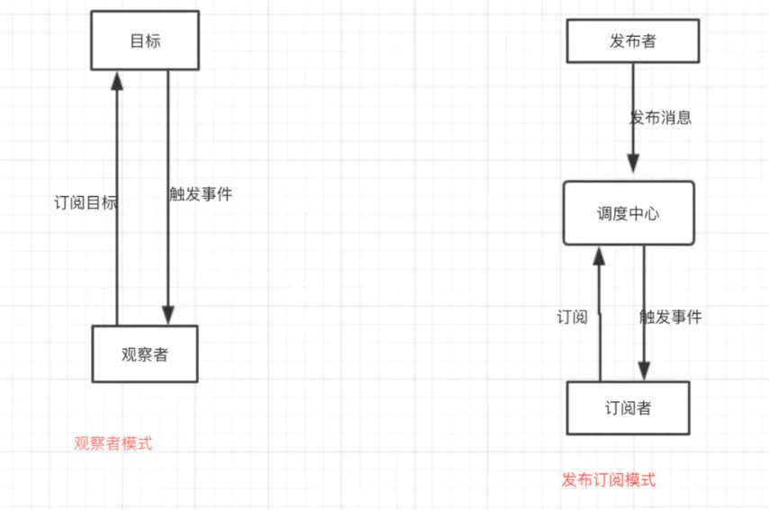
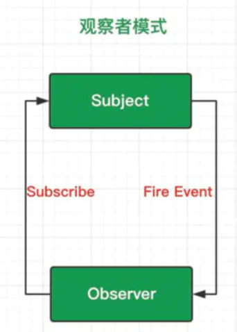
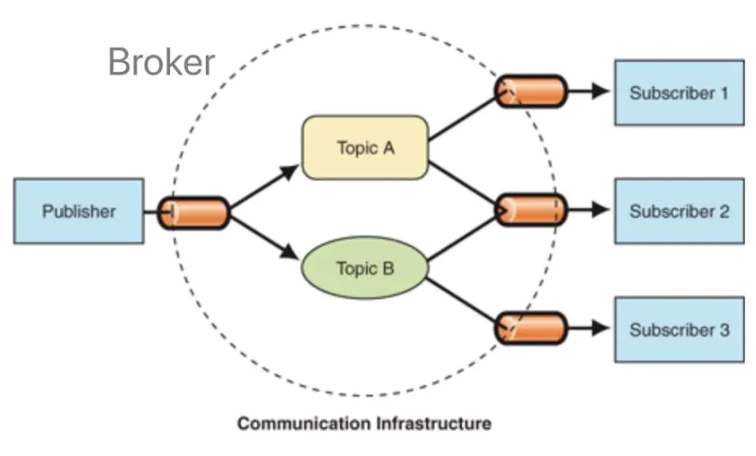

## 对比


- <mark>以结构来分辨模式，发布订阅模式相比观察者多了一个调度中心</mark>
- 以意图来分辨模式，都是实现了对象间的一种一对多的依赖关系，当一个对象的状态发生改变时，所有依赖他的对象都将得到通知，并自动更新，那么他们就说同一种模式
- 发布订阅模式是在观察者模式的基础上做的优化升级。观察着模式是发布订阅模式的一种特殊实现

<mark>观察者和被观察者，是松耦合的关系</mark>
<mark>发布者和订阅者, 则是完全解耦</mark>

<span style="color: red">观察者模式，多用于单个应用内部</span>

<span style="color: red">发布订阅者，则更多的是一种跨应用的模式(cross=application pattern),比如我们常用的消息中间件</span>

- 在观察者模式中，观察者是知道Subject的，Subject一直保持着对观察者进行记录。然后在发布订阅者模式中，发布和订阅者不知道对方的存在。它们只能通过消息代理进行通信。
- 观察者模式大多数是同步的，比如当事件触发，Subject就回去调用观察者的方法。而发布-订阅模式大多数时候是异步的(使用消息队列)

## 观察者模式
观察者模式: 观察者(Observer)直接订阅(Subscribe)主题(Subject)，而当主题被激活的时候，会触发(Fire Event)观察者里的事件



```js
class Observer {
    constructor(name) {
        this.name = name;
    }
    update(price) {
        console.log(`${this.name},你好，我是房东A,我的房子刚刚降价到${price}万，赶紧来买!`)
    }
}
class Subject {
    constructor(price) {
        this.price = price;
        this.observerlist = [];
    }
    registerObserver(observer) {
        this.observerlist.push(observer);
    }
    notifyObserver() {
        this.observerlist.forEach(observer => observer.update(this.price));
    }
    state(price) {
        this.price = price;
        if(price <= 500) {
            this.notifyObserver();
        }
    }
}
const A = new Subject(550);
const B = new Observer('B');
const C = new Observer('C');
const D = new Observer('D');
A.registerObserver(B);
A.registerObserver(C);

setTimeout(function() {
    A.state(510);
    // 1个月后，D也告诉房东500w一下他也想买
    // 只要D也有update方法，我们直接注册，并不用改变以后的逻辑代码
    // 实现了解耦，维护性好
    A.registerObserver(D);
}, 1000)
setTimeout(function() {
    A.state(490)
}, 3000)
```
<mark>观察者模式由具体目标调度，每个被订阅的目标里面都需要有对观察者的处理，会造成代码冗余</mark>

```js
//有一家猎人工会，其中每个猎人都具有发布任务(publish)，订阅任务(subscribe)的功能
//他们都有一个订阅列表来记录谁订阅了自己
//定义一个猎人类
//包括姓名，级别，订阅列表
function Hunter(name, level) {
    this.name = name;
    this.level = level;
    this.list = [];
}
Hunter.prototype.publish = function(money) {
    console.log(this.level + '猎人' + this.name + '寻求帮助');
    this.list.forEach(function(item, index) {
        item(money);
    })
}
Hunter.prototype.subscribe = function(target, fn) {
    console.log(this.level + '猎人' + this.name + '订阅了' + target.name);
    target.list.push(fn)
}
// 猎人公会走来了几个猎人
let hunterMing = new Hunter('小明', '黄金')
let hunterJin = new Hunter('小金', '白银')
let hunterZhang = new Hunter('小张', '黄金')
let hunterPeter = new Hunter('Peter', '青铜')
// Peter等级较低，可能需要帮助，所以小明，小金，嚣张都订阅了Peter
hunterMing.subscribe(hunterPeter, function(money){
    console.log('小明表示：' + (money > 200 ? '' : '暂时很忙，不能') + '给予帮助')
})
hunterJin.subscribe(hunterPeter, function(){
    console.log('小金表示：给予帮助')
})
hunterZhang.subscribe(hunterPeter, function(){
    console.log('小金表示：给予帮助')
})
hunterPeter.publish(198)   //Peter遇到困难，赏金198寻求帮助
//猎人们(观察者)关联他们感兴趣的猎人(目标对象)，如Peter，当Peter有困难时，会自动通知给他们（观察者）
```
## 发布订阅模式
发布者只需告诉Broker，我要发的消息，topic是AAA,

订阅者只需告诉Broker，我要订阅topic是AAA的消息；

当Broker收到发布者发过来的消息，并且topic是AAA时，就会把消息推送给订阅了topic是AAA的订阅者。当然也有可能是订阅者自己来拉取，看具体实现



<span style="color: red">发布订阅模式中统一由调度中心进行处理，订阅者和发布者互不干扰。这样一方面实现了解耦，还有就是可以实现更细粒度的一些控制。比如发布者发布了很多消息，但是不想所有的订阅者都接收到，就可以在调度中心做一些处理，类似于权限控制之类的。还可以做一些节流操作。</span>

```js
class Event {
    constructor() {
        this.list = {};
    }
    on(name, fn) {
        if(!this.list[name]) this.list[name] = [];
        this.list[name].push(fn);
    }
    emit(name, data) {
        this.list[name] && this.list[name].forEach(fn => fn(data));
    }
}
const event = new Event();
event.on('卖房',function(price) {
    if (price>=500) {
        console.log(`现在房价${price}万。太高了，再等等吧`)
    } else {
        console.log(`现在房价${price}万。赶紧通知BCD买房`)
    }
})
event.emit('卖房',550)
setTimeout(()=>{event.emit('卖房',520)},1000)
setTimeout(()=>{event.emit('卖房',450)},2000)
```
发布订阅模式则统一由调度中心处理，消除了发布者和订阅者之间的依赖。

```js
//定义一家猎人工会
//主要功能包括任务发布大厅(topics)，以及订阅任务(subscribe)，发布任务(publish)
let HunterUnion = {
    type: 'hunt',
    topics: Object.create(null),
    subscribe: function (topic, fn){
        if(!this.topics[topic]){
            this.topics[topic] = [];  
        }
        this.topics[topic].push(fn);
    },
    publish: function (topic, money){
        if(!this.topics[topic])
            return;
        for(let fn of this.topics[topic]){
            fn(money)
        }
    }
}
//定义一个猎人类
//包括姓名，级别
function Hunter(name, level){
    this.name = name
    this.level = level
}
//猎人可在猎人工会发布订阅任务
Hunter.prototype.subscribe = function (topic, fn){
    console.log(this.level + '猎人' + this.name + '订阅了狩猎' + topic + '的任务')
    HunterUnion.subscribe(topic, fn)
}
Hunter.prototype.publish = function (topic, money){
    console.log(this.level + '猎人' + this.name + '发布了狩猎' + topic + '的任务')
    HunterUnion.publish(topic, money)
}
//猎人工会走来了几个猎人
let hunterMing = new Hunter('小明', '黄金')
let hunterJin = new Hunter('小金', '白银')
let hunterZhang = new Hunter('小张', '黄金')
let hunterPeter = new Hunter('Peter', '青铜')
//小明，小金，小张分别订阅了狩猎tiger的任务
hunterMing.subscribe('tiger', function(money){
    console.log('小明表示：' + (money > 200 ? '' : '不') + '接取任务')
})
hunterJin.subscribe('tiger', function(money){
    console.log('小金表示：接取任务')
})
hunterZhang.subscribe('tiger', function(money){
    console.log('小张表示：接取任务')
})
//Peter订阅了狩猎sheep的任务
hunterPeter.subscribe('sheep', function(money){
    console.log('Peter表示：接取任务')
})  
//Peter发布了狩猎tiger的任务
hunterPeter.publish('tiger', 198)
//猎人们发布(发布者)或订阅(观察者/订阅者)任务都是通过猎
```


## 资料
[观察者模式VS发布订阅模式区别](https://www.jianshu.com/p/39f618e1e31b)