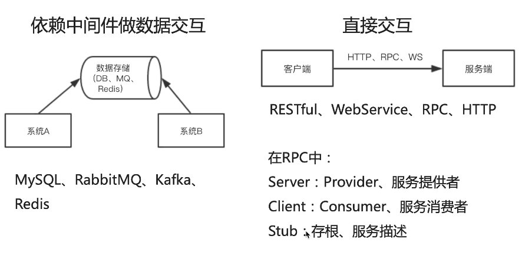

## RPC指远程过程调用
常用调用，比如web端和远程服务器交互，这是客户端与服务器之间的交互

RPC是指服务器与服务器之间的调用

## 服务器之间的交互形式

- **依赖中间件做数据交互**，比如MySQL、RabbitMQ、Redis等作为中间依赖的调用方式，A服务器向B服务器发送请求时 需要经过中间件，这类交互形式不需要B服务器立即给出处理结果，一般适合处理数据挤压类型的架构，比如双十一订单量巨大，B服务器处理能有有限，先把订单数据积压在中间件中，然后B服务器慢慢去处理

- **直接交互**,没有中间件，通过HTTP、RPC、WS等方式进行通信，这类架构的特点是快速响应，A服务器发送请求到B服务器，并会一直等待B服务器响应

RPC有server(一般叫Provider)和Client(一般叫Consumer)的概念，只不过两者都是服务器，Client服务器属于服务器消费者，Server属于服务提供者

RPC可以理解为：服务器可以像调用本地方法一样调用远程方法

## 资料
[RPC 指远程过程调用](https://github.com/Vibing/blog/issues/39)

[gRPC的简单使用](https://github.com/Vibing/blog/issues/40)
