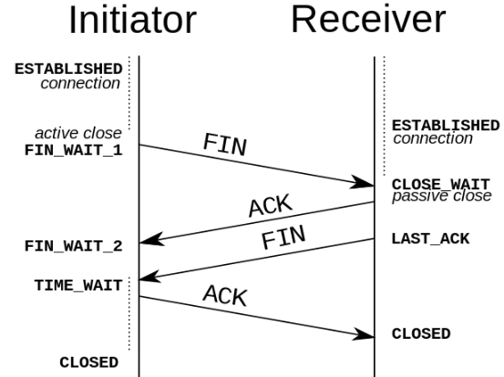

:::tip
网络协议是每个前端工程师都必须掌握的知识，TCP/IP中有两个具有代表性的传输层协议，分别是TCP和UDP
:::

## TCP/IP网络模型(OSI)

计算机与网络设备要相互通信，双方就必须基于相同的方法。比如，如何探测到通信目标、由哪一边先发起通信、使用哪种语言进行通信、怎么结束通信等规则需要事先确定。不同的硬件、操作系统之间的通信，所有的这一切都需要一种规则。这我们把这种规则成为协议(protocol)

TCP/IP是互联网相关的各类协议族的总成，比如:TCP、UDP、IP、FTP、HTTP、ICMP、SMTP等都属于TCP/IP族内的协议

TCP/IP模型是互联网的基础，它是一系列网络协议的总成。这些协议可以华为四层，分别为链路层、网络层、传输层、应用层

- 链路层:负责封装和解封装IP报文，发送和接收ARP/RARP报文等
- 网络层:负责路由以及把分组的报文发送给目标网络或主机.
- 传输层:负责对报文进行分组和重组，并以TCP和UDP协议格式封装报文。
- 应用层:负责向用户提供应用程序,比如HTTP、FTP、Telnet、DNS、SMTP等

在网络体系结构中网络通信的建立必须是在通信双方的对等层进行，不能交错。在整个数据传输过程中，数据在发送端时都要附加上响应层的协议头和协议尾(仅数据链路层需要封装协议尾)部分，也就是要对数据进行协议封装，以识别对应层所用的通信协议。接下去介绍TCP/IP中两个具有代表性呢的传输层协议---TCP和UDP.

## UDP

UDP协议全称是用户数据包协议，在网络中它与TCP协议一样用于处理数据包，是一种无连接的协议。在OSI模型中，在第四层---传输层，处于IP协议的上一层。UDP是不提供数据包分组、组装和不能对数据包进行排序的缺点，也就是说，当报文发送之后，是无法得知是否完全完整到达的。

> 特点

### 面向无连接
首先UDP是不需要和TCP一样在发送数据钱进行三次握手建立连接的，想发数据就可以开始发送了。并且也只是数据报文的搬运工，不会对数据报文进行任何拆分和拼接操作的。

具体来说就是
    - 在发送端，应用层将数据传递给传输层的UDP协议，UDP只会给数据增加一个UDP头标识是UDP协议，然后就传递给网络层了
    - 在接收端，网络层将数据传递给传输层，UDP只会去除IP报文头就传递给应用层了，不会任何拼接操作

### 有单播，多播，广播的功能
UDP不止支持一对一的传输方式，同样支持一对多，多对多，多对一的方式，也就是说UDP提供了单播，多播，广播的功能

### UDP是面向报文的
发送方的UDP对应程序交下来的报文，在添加收部后就向下交付IP层。UDP对应用层交下来的报文，即不合并，也不拆分，二十保留这些报文的边界。因此，应用程序必须选择合适大小的报文

### 不可靠性
首先不可靠性体现在无连接上，通信都不需要建立连接，想发就发，这样情况肯定不可靠。

并且收到什么数据就传递什么数据，并且也不会备份数据，发送数据也不会关心对方是否已经正确收到数据了。

在着网络环境时好时坏，但是UDP因为没有拥塞控制，一直会以恒定的速度发送数据。即使网络条件不好，也不会对发送速率进行调整。这样实现的弊端就是在网络条件不好的情况下可能会导致丢包，但是优点也很明显，在某些时效性要求高的场景(比如电话会议)就需要使用UDP而不是TCP

从上面动态图可以得知，UDP只会把想发的数据报文一股脑的丢给对方，并不在意数据有误完整的到达。

### 头部开销小，传输数据报文时很高效的

UDP头部包含了一下几个数据

    - 两个十六位的端口号，分别为源端口(可选字段)和目标端口
    - 整个数据报文的长度
    - 整个数据报文的检验和(IPv4可选字段)，该字段用于发现头部信息和数据中的错误

因此UDP的头部开销小，只有八字节，相比TCP的至少二十字节要少的多，在传输数据报文时是很高效的

## TCP

当一条计算机要与另一台计算机通讯时，两台计算机之间的通信需要畅通且可靠，这样才能保证首发数据。例如，当你想查看网页或查看电子邮件时，希望完整且顺序查看网页，而不丢失任何内容。当你下载文件时，希望获得的是完整的文件，而不仅仅是文件的一部分，因为如果数据丢失或者乱序，都不是你希望得到的结果，于是就用到了TCP。

TCP协议全称是传输控制协议是一种面向连接的、可靠的、基于字节流的传输层通信协议。由IETF的RFC793定义。TCP是面向连接的、可靠的流协议。流就是指不间断的数据结构，你可以把它想象成排水管中的水流

### TCP连接过程

如下图，可以看到建立一个TCP连接过程(三次握手的过程)

**第一次握手**

客户端向服务端发送连接请求报文段。该报文段中包含自身的数据通讯初始序号。请求发送后，客户端便进入SYN-SENT状态

**第二次握手**

服务的收到连接请求报文段后，如果同意连接，则会发送一个应答，该应答也会包含自身的数据通讯初始序号，发送完成后边进入SYN-RECEIVED状态

**第三次握手**

当客户端收到连接同意的应该后，还要向服务的发送一个确认报文。客户端发送完这个报文段后便进入ESTABLISHED状态，服务的收到这个应答后也进入ESTABLISHED状态，此时连接成功建立。

这里可能疑惑：为什么TCP简历需要三次握手，而不是两次？这是因为为了防止出现失效的连接请求报文段被服务的接收的情况，从而产生错误。

### TCP断开连接

TCP是全双工的，在断开连接时两段都需要发送FIN和ACK。

**第一次握手**

若客户端A认为数据发送完成，则它需要想服务的B发送连接释放请求

**第二次握手**

B接收到连接释放请求后，会告诉应用层要释放TCP链接。然后会发送ACK包，并进入CLOSE_WAIT状态，此时表明A到B的连接已经释放，不再接收A发的数据了。但是因为TCP连接是双向的，所以B仍旧可以发送数据给A

**第三次握手**

B如果此时还有没有发完的数据会继续发送，完毕后会向A发送连接释放请求，然后B便进入LAST-ACK状态

**第四次握手**

A收到释放请求后，在B发送确认应答，此时A进入TIME-WAIT状态。该状态会持续2MSL(最大段生存期，指报文段在网络中生存的时间，超时会被抛弃)事件，若该时间段内没有B的重发请求的话，就进入CLOSED状态。当B收到确认应答后，也便进入CLOSE状态

### TCP协议状态

- 面向连接

  面向连接,是指发送数据之前必须在两端建立连接。建立连接的方法是三次握手，这样能建立可靠的连接。建立连接，是为数据的可靠传输打下基础。

- 仅支持单向传输

    每条TCP传输连接只能有两个端点，只能进行点对点的数据传输，不支持多播和广播的传输方式。

- 面向字节流

    TCP不像UDP一样那样一个个报文独立的传输，而是在不保留报文边界的情况下以字节流方式进行传输。

- 可靠传输

    对于可靠传输，判断丢包，误码靠的是TCP的段编号以及确认号。TCP为了保证报文传输的可靠，就给每个包一个序号，同时序号也保证了传入到接收端实体的包的按序接收。然后接收端实体对已成功收到的字节返回一个相应的确认ACK；如果发送端实体在合理的往返时延(RTT)内为收到确认，那么对应的数据(假设丢失了)将会被重传

- 提供拥塞控制

    当网络出现拥塞的时候，TCP能够减少向网络注入数据的速率和数量，缓解拥塞

- TCP提供全双工通信

    TCP允许通信双方的应用程序在任何时候都能发送数据，因为TCP连接的两段都设有缓存，用来临时存放双向通信的数据。当然TCP可以立即发送一个数据段，也可以缓存一段事件以便一次发送更多的数据段(最大的数据段大小取决于MSS)

## TCP和UDP的比较

1. 对比

    name | UDP | TCP
    ---|---|---
    是否连接 | 无连接 | 面向连接
    是否可靠 | 不可靠传输，不使用流量控制和拥塞控制 | 可靠传输，使用流量控制和拥塞控制
    连接对象个数 | 支持一对以，一对多，多对一，多对多交互通讯 | 只能一对一通信
    传输方式 | 面向报文 | 面向字节流
    首部开销 | 首部开销小，仅8字节 | 首部最小20字节，最大60字节
    使用场景 | 适用于实时应用(IP电话、视频会以、直播等) | 适用于要求可靠传输的应用，例如文件传入

2. 总结
    - TCP向上层提供面向连接的可靠服务，UDP向上层提供无连接不可靠服务。
    - 虽然UDP并没有TCP传输来的准备，但是也能在很多实时性要求高的地方有所作为
    - 对数据准确性要求搞，速度相对可以较慢的，可以选用TCP

## Quic浅析

### 简介
QUIC(Quick UDP Internet Connections)基于UDP的传输层协议，提供像TCP一样的可靠传输。在提高web应用性能上，可以选择在应用层使用HTTP2.0实现多路传输，在物理层使用CDN解决网络拥塞和最后一公里问题。在传输层，目前主要使用TCP，但由于TCP本身的问题(一个充满补丁的丑陋的协议)，成为了限制web应用性能的一个瓶颈

### 优势
- 避免前序包阻塞(HOL阻塞)

    多个数据在TCP连接上传输时，若一个数据包出现问题，TCP需要等待改包重传后，才能继续传输其他数据包。但在QUIC中，因为其基于UDP协议，UDP数据包在出问题需要重传时，并不会对其他数据包传输产生影响
    
- 零RTT建立连接

    目前TCP和SSL/TLS每次建连需要TCP三次握手+安全握手，需要4-5个RRT

    **第一次连接**
    
    客户端之前没有连接此服务器，那么它会发送一个Hello Packet。服务器接到之后，会回复一个数据包。里面包含了安全证书和对此客户端唯一的SYN cookie。客户端接到包之后，首先要做的就是解码，保存好SYN cookie。SYN cookie类似于令牌，能够验证客户端身份。它的生存周期较短，防止被盗用。这样建立连接至需要一个RTT。

    当客户端接收到服务器发来的第一个数据包，没有正确解码，那么它会再次发送一个包要求服务器重新发送它的安全证书，并将SYN cookie附加到这个请求包，一遍服务器验证请求正确性和有效性。此时，简历连接需要2个RTT.

    **重新连接**
    

- 优雅的丢包处理
    - FEC前向纠错

        QUIC协议的每个数据包除了本身的数据以外，会带有其他数据包的部分数据，在少量丢包的情况下，可以使用其他数据包的冗余数据完成数据组装而无需重传，从而提高数据的传输速度。具体实现类似于RAID5，将N个包的校验和（异或）建立一个单独的数据包发送，这样如果在这N个包中丢了一个包可以直接恢复出来。除此之外还可以用来校验包的正确性

    - 关键包发送
- 快速重启会话

    普通基于tcp的连接，是基于两端的ip和端口和协议来建立的。在网络切换场景，例如手机端切换了无线网，使用4G网络，会改变本身的ip，这就导致tcp连接必须重新创建。而QUIC协议使用特有的UUID来标记每一次连接，在网络环境发生变化的时候，只要UUID不变，就能不需要握手，继续传输数据。

- 安全
    - 前向安全。即使被人抓包存储起来，在未来某个时间点秘钥被破解后仍然不能解密
    - 内置的加密模块，支持SNI，因此支持一个IP部署多个证书，默认打开，相比TLS更高效的向前加密

### 使用场景
- 长距离传输
- 手机网络
- 请求的页面资源较多，并发连接数多
- 要求加密传输

## 资料
[Quic浅析](https://blog.csdn.net/b2222505/article/details/79391430)

[一泡尿的时间，快速读懂QUIC协议](https://www.cnblogs.com/imteck4713/p/11777310.html)