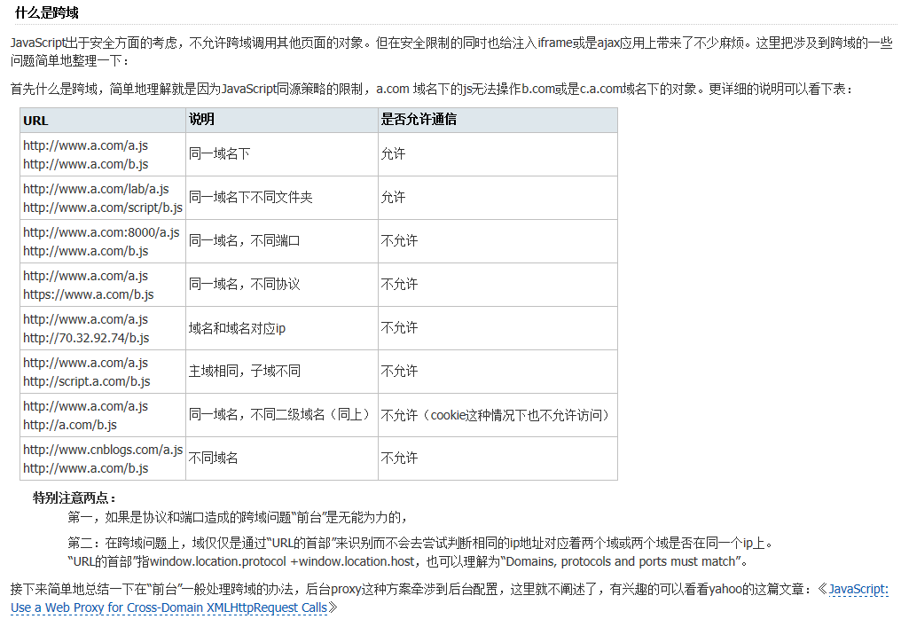

- [Content-Type: application/json](#application/json)
- [Content-Type: multipart/form-data](#multipart)
- [Content-Type: application/x-www-form-urlencoded](#urlencoded)
- [curl请求测试](#curl请求测试)

## Post提交数据的三中请求方式
### Content-Type:application/json

```
import axios from 'axios';
let data = {'code':'1234', 'name': 'yyyy'};
axios.post(`${this.$url}/test/testRequest`, data).then(res=> {
	console.log(res);
})
```


### Content-Type:multipart/form-data
```
import axios from 'axios';
let data = new FormData();
data.append('code', '1234');
data.append('name', 'yyyy');
axios.post(`${this.url}/test/testRequest`, data).then(res=> {
	console.log(res);
})
```


### Content-Type:application/x-www-form-urlencoded

```
import axios from 'axios';
import qs from 'Qs';
let data = {'code': '123', 'name': 'yyy'};
axios.post(`${this.$url}/test/testRequest`, qs.stringify({
	data
})).then(res => {
	console.log(res);
})
```


### 总结

1. 从jquery转到axios最难忘的就是设置Content-Type，还好现在都搞定了他们的原理
2. 上面三种方式对应后台的请求方式，这个也要注意，比如java的@RequestBody,HttpSevletRequest等等


## ajax请求携带cookie、自定义header总结

::: tip
错误：
1.ajax请求时是不会自动带上cookie的，要是想让他带上的话，必须设置withCredential为true。

正确：
1.ajax同域请求下，ajax会自动带上同源的cookie；

2.ajax同域请求下，ajax添加自定义请求头（或原装）header，前端、后台不需要增加任何配置，
并且不会因为增加自定义请求头header，而引起预检查请求（options）;

3.ajax跨域请求下，如果不需要携带cookie、请求头header，只需要在后台配置相应参数即可；

后台参数：

	（1）.Access-Control-Allow-Origin：设置允许跨域的配置， 响应头指定了该响应的资源是否被允许与给定的origin共享；

4.ajax跨域请求下，ajax不会自动携带同源的cookie，需要通过前端配置相应参数才可以跨域携带同源cookie，后台配置相应参数才可以跨域返回同源cookie；

前端参数：

	withCredentials: true(发送Ajax时，Request header中会带上Cookie信息)
后台参数：

	（1）.Access-Control-Allow-Origin：设置允许跨域的配置， 响应头指定了该响应的资源是否被允许与给定的origin共享；
		特别说明：配置了Access-Control-Allow-Credentials:true则不能把Access-Control-Allow-Origin设置为通配符*；
	（2）.Access-Control-Allow-Credentials:响应头表示是否可以将对请求的响应暴露给页面（cookie）。返回true则可以，其他值均不可以。

5.ajax请求任何时候都不会带上不同源的cookie（Cookie遵循同源策略）；

6.ajax跨域请求下，ajax添加自定义或者原装的请求头，请求会发送两次，第一次预检查请求，第二次正常请求，详细描述：

**post（或GET）跨域请求时，分为简单请求和复杂请求，跨域携带自定义或者原装请求头时是复杂请求。**

复杂请求会先发送一个method 为option的请求，目的是试探服务器是否接受发起的请求. 如果服务器说可以，再进行post（或GET）请求。

对于java后台web应用，跨域需要添加一个过滤器（过滤器详见下面案例代码），这个过滤器做的事就是，加了几个http header在返回中，

Access-Control-Allow-Origin 我能接受的跨域请求来源，配置主机名
Access-Control-Allow-Headers 表示能接受的http头部，别忘了加入你自己发明创造的头部
Access-Control-Allow-Methods 表示能接受的http mothed ，反正就那几种，全写上也无妨，猥琐点就只写 post, options
如果是OPTION返回空，设置返回码为202，202表示通过。

需要前端配置相应参数才可以跨域携带请求头，后台配置相应参数进行跨域携带请求头；

前端参数：

	crossDomain:true(发送Ajax时，Request header 中会包含跨域的额外信息，但不会含cookie（作用不明，不会影响请求头的携带）)

后台参数（配置预检查过滤器）：

	（1）Access-Control-Allow-Origin：设置允许跨域的配置， 响应头指定了该响应的资源是否被允许与给定的origin共享；
	（2）Access-Control-Allow-Credentials：响应头表示是否可以将对请求的响应暴露给页面（cookie）。返回true则可以，其他值均不可以；
	（3）Access-Control-Allow-Headers:用于预检请求中，列出了将会在正式请求的 Access-Control-Request-Headers 字段中出现的首部信息。（自定义请求头）；
	（4）Access-Control-Allow-Methods：在对预检请求的应答中明确了客户端所要访问的资源允许使用的方法或方法列表；
:::


亲测小结论：

1.ajax跨域请求下，后台不配置跨域Access-Control-Allow-Origin，同样能够执行后台方法，但是无法执行ajax的success的方法，控制台报跨域错误；

2.ajax跨域请求下，前端配置withCredentials: false,同样能够执行后台方法，但是无法携带同源cookie，后台无法获取；

3.ajax跨域请求下，前端配置withCredentials: true，后端没有配置Access-Control-Allow-Credentials:true，同样能够执行后台方法，并能够生成cookie并返回浏览器，但是无法执行ajax的success的方法，控制台报跨域错误；

4.ajax跨域请求下，前端配置withCredentials: false或不配置withCredentials，后端配置Access-Control-Allow-Credentials:true或者false，同样能够执行后台方法，并能够生成cookie并返回浏览器，但是无法携带同源cookie，能够执行ajax的success的方法；

5.Cookie携带只区分域名，不区分端口；

6.jsonp可以携带cookie，但只能携带所属域名的cookie（同源策略）；

7.jsonp可以跨域生成cookie，流程如下：跨域请求之后，在服务器端生成cookie，并在浏览器端记录相应的cookie；

8.静态资源同样会携带cookie（js和图片等），但是如果是和当前页面不同域只是在network中不显示cookie选项，但是后台能够获取到对应cookie；

9.ajax同域请求会自动带上同源的cookie，不会带上不同源的cookie；

10.这是MDN对withCredentials的解释： MDN-withCredentials ，我接着解释一下同源。

众所周知，ajax请求是有同源策略的，虽然可以应用CORS等手段来实现跨域，但是这并不是说这样就是“同源”了。ajax在请求时就会因为这个同源的问题而决定是否带上cookie，这样解释应该没有问题了吧，还不知道同源策略的，应该去谷歌一下看看。

总结：最好前端后台配置跨域，则同时配置相应的跨域配置，否则总会出现不可控的错误；

[参考地址](https://blog.csdn.net/menghuanzhiming/java/article/details/102736312)

## 跨域相关



JavaScript出于安全方面考虑，不允许跨域调用其他页面的对象。但在安全限制的同时也给注入iframe或ajax应用上带来了不少麻烦。

什么是跨域？简单的理解就是因为Javascript同源策略的限制，a.com域名下的js无法操作b.com或是c.a.com域名下的对象。更详细的说明可以看下表


URL | 说明 | 是否允许通信
---|--- | ---
http://www.a.com/a.js<br/>http://www.a.com/b.js | 同一域名下 | 允许
http://www.a.com/lab/a.js<br/>http://www.a.com/script/b.js | 同一域名下不同文件夹 | 允许
http://www.a.com:8080/a.js<br/>http://www.a.com/b.js | 同一域名,不同端口 | 不允许
http://www.a.com/a.js<br/>https://www.a.com/b.js | 同一域名,不同协议 | 不允许
http://www.a.com/a.js<br/>http://70.32.92.74/b.js | 域名和域名对应IP | 不允许
http://www.a.com/a.js<br/>http://script.a.com/b.js | 主域相同，子域不同 | 不允许
http://www.a.com/a.js<br/>http://a.com/b.js | 同一域名，不同二级域名 | 不允许
http://www.cnblogs.com/a.js<br/>http://a.com/b.js | 不同域名 | 不允许


## 测试请求curl

```
// get请求方式
curl -X GET --header 'Accept: application/json' 'http://10.138.36.142:8099/v2x/calibration/device/detail?id=12'

// post请求
curl -X POST --header 'Content-Type: application/json' --header 'Accept: application/json' -d '12' 'http://10.138.36.142:8099/v2x/calibration/device/delete'
```

## 相关问题
```
const res = await axios.post('zl/groupMember/linkAdd', data)

const res = await axios.post('/zl/groupMember/linkAdd', data)
```
:::danger
**axios的baseURL后自动加斜杠**
:::
## axios的transformRequest和transformResponse的作用
[原文](https://blog.csdn.net/weixin_43045869/article/details/126961166)
### transfromRequest 和 transformResponse的作用
- transformRequest

	允许你在将请求数据发送到服务器之前对其进行修改，这只使用与请求方法put、post和patch,如果值是数组，则数组中最后一个函数必须返回一个字符串或FormData、URLSearchParams、Blob等类型作为xhr.send方法的参数，而且在transform过程中可以修改hearders对象
- transformResponse

	允许你在把响应数据传递给then或者catch之前对它们进行修改。

	当值为数组的时候，数组的每一个函数都是一个转换函数，数组中的函数就像管道一样依次执行，前者的输出作为后者的输入

```js
// 例子
axios({
	transformRequest: [(function(data) {
		return qs.stringify(data);
	}), ...axios.defaults.transformRequest],
	transformResponse: [axios.defaults.transformResponse, function(data) {
		if(typeof data === 'object') {
			data.b = 2;
		}
		return data
	}], 
	url: '/config/post',
	method: 'post',
	data: {
		a: 1
	}
})
```