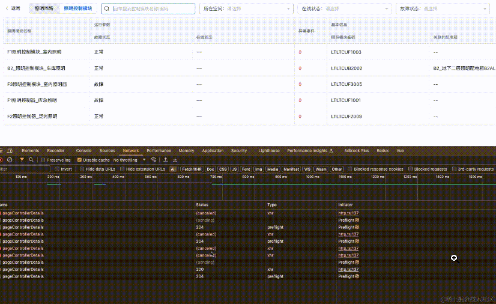

## 背景简介
我们日常开发中，经常会遇到点击一个 按钮 或者 进行搜索时，请求接口的需求。

如果我们不做优化，连续点击 按钮或者进行搜索，接口会重复请求

:::danger
首先，这会导致性能浪费！最重要的，如果接口响应比较慢，此时，我们在做其他操作会有一系列bug!
:::
那么，我们改如何规避这种问题呢？
## 如何避免接口重复请求

### 防抖节流方式(不推荐)
使用防抖节流方式避免重复操作是前端的老传统了，不多介绍了

- 防抖实现

    ```html
    <template>
        <div>
            <button @click="debouncedFetchData">请求</button>
        </div>
    </template>
    <script setup>
        import { ref } from 'vue';
        import axios from 'axios';

        const timeoutId = ref(null);
        function debounce(fn, delay) {
            return function(...args) {
                if(timeoutId.value) clearTimeout(timeoutId.value);
                timeoutId.value = setTimeout(() => {
                    fn(...args);
                }, delay)
            }
        }

        function fetchData() {
            axios.get('http://api/gcshi').then(response => {
                console.log(response.data);
            })
        }
        const debouncedFetchData = debounce(fetchData, 300);
    </script>
    ```
    防抖(Debounce)
    - 在setup函数中，定义了timeoutId用于存储定时器ID.
    - debounce函数创建了一个闭包，清除之前的定时器并设置新的定时器，只有在延迟时间内没有心调用时才执行detchData.
    - debouncedFetchData是防抖后的函数，在按钮点击时调用

- 节流实现

    ```html
    <template>
        <div>
            <button @click="throtledFetchData">请求</button>
        </div>
    </template>
    <script setup>
        import { ref } from 'vue';
        import axios from 'axios';

        const lastCall = ref(0);

        function throttle(fn, delay) {
            return function(...args) {
                const now = new Data().getTime();
                if(now - lastCall.value < delay) return;
                lastCall.value = now;
                fn(..args);
            }
        }

        function fetchData() {
            axios.get('http://api/gcshi').then(response => {
                console.log(response.data);
            })
        }

        const throttledFetchData = throttle(fetchData, 1000);
    </script>
    ```
    节流
    - 在setup函数,定义了lastCall用于存储上次调用的时间戳
    - throttle函数创建了一个闭包，检查当前时间与上次调用时间的差值，只有大于设定的延迟时间才执行fetchData.
    - throttledFetchData是节流后的函数，在按钮点击时调用

节流防抖这种方式感觉用在这里不是很丝滑，代码成本也比较高，因此不推荐

### 请求锁定(加loading状态)
请求锁定非常好理解，设置一个loading状态，如果第一个接口处于loading中，那么，我们不执行任何逻辑

```html
<template>
    <div>
        <button @click="fetchData">请求</button>
    </div>
</template>
<script setup>
    import { ref } from 'vue';
    import axios from 'axios';

    const loading = ref(false);

    function fetchData() {
        // 接口请求中，直接返回，避免重复请求
        if(loading.value) return;
        loading.value = true;
        axios.get('http://api/gcshi').then(response => {
            loading.value = false;
        })
    }
</script>
```
这种方式简单粗暴，十分好用！

**但是也有弊端,比如我搜索A后，接口请求中；但此时突然想搜B，就不会生效了，因为请求A还没有响应**

因此，请求锁定这种方式无法取消原先的请求，只能等待一个请求执行完才能继续请求

### axios.CancelToken 取消重复请求
axios其实内置了一个取消重复请求的方法：axios.CancelToken,我们可以利用axios.CancelToken 来取消重复的亲故去。

首先，我们要知道，axios有一个config的配置项，取消请求就是在这里配置的

```html
<template>
    <div>
        <button @click="fetchData">请求</button>
    </div>
</template>
<script setup>
    import { ref } from 'vue';
    import axios from 'axios';

    let cancelTokenSource = null;

    function fetchData() {
        if(cancelTokenSource) {
            cancelTokenSource.cancel('取消上次请求');
            cancelTokenSource = null;
        }

        cancelTokenSource = axios.CancelToken.source();

        axios.get('http://api/gcshi', { cancelToken: cancelTokenSource.token }).then(response => {
            loading.value = false;
        })
    }
</script>
```
我们测试下，如下图：可以看到，重复的请求会直接被终止掉！


## CancelToken官方示例

> 官方使用方法传送门:https://www.axios-http.cn/docs/cancellation

```js
const CancelToken = axios.CancelToken;
const source = CancelToken.source();

axios.get('/user/12345', {
  cancelToken: source.token
}).catch(function (thrown) {
  if (axios.isCancel(thrown)) {
    console.log('Request canceled', thrown.message);
  } else {
    // 处理错误
  }
});

axios.post('/user/12345', {
  name: 'new name'
}, {
  cancelToken: source.token
})

// 取消请求（message 参数是可选的）
source.cancel('Operation canceled by the user.');
```
也可以通过传递一个 executor 函数到 CancelToken 的构造函数创建一个 canceltoken:
```js
const CancelToken = axios.CancelToken;
let cancel;

axios.get('/user/12345', {
  cancelToken: new CancelToken(function executor(c) {
    // executor 函数接收一个 cancel 函数作为参数
    cancel = c;
  })
});

// 取消请求
cancel();
```
注意: 可以使用同一个 cancel token 或 signal 取消多个请求。

在过渡期间，您可以使用这两种取消 API，即使是针对同一个请求：
```js
const  controller = new AbortController();

const CancelToken = axios.CancelToken;
const source = CancelToken.source();

axios.get('/user/12345', {
    cancelToken: source.token,
    signal: controller.signal
}).catch(thrown => {
    if(axios.isCancel(thrown)) {
        console.log(`Request canceled`, thrown.message)
    } else {
        // 处理错误
    }
})

axios.post('/user/12345', {
  name: 'new name'
}, {
  cancelToken: source.token
})

// 取消请求 (message 参数是可选的)
source.cancel('Operation canceled by the user.');
// 或
controller.abort(); // 不支持 message 参数
```