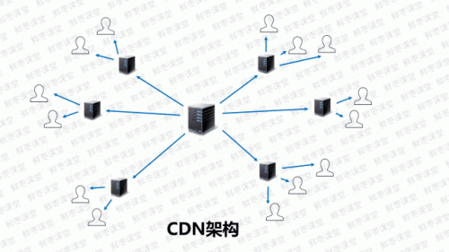
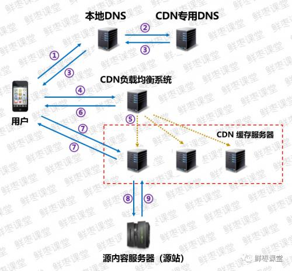
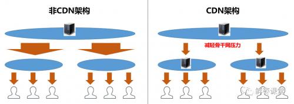
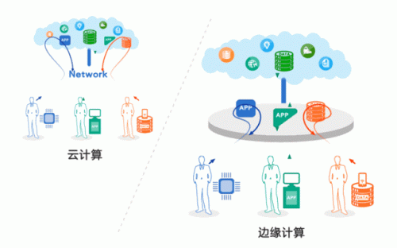

## CDN原理
CDN这个技术其实说起来并不复杂，它最初的核心理念，就是将内容缓存在终端用户附近

内容源不是远吗？那么我们就靠近用户的地方，建一个缓存服务器，把远端的内容，复制一份，放在这里，不就ok了？

因为这项技术是把内容进行了分发，所以它的名字就叫做CDN--Content Delivery Network，内容分发网络

具体来说，CDN就是采用更多的缓存服务器(CND边缘节点),布放在用户访问相对集中的地区或网络中。当用户访问网站时，利用全局负载技术，将用户的访问指向距离最近的缓存服务器上，由缓存服务器响应用户请求。(有点像电商的本地仓吧)

大家可能觉得，这不就是"镜像服务器"嘛？其实不一样。镜像服务器是原内容服务器的完整复制。而CDN，是部分内容的缓存，智能程度更高。

确切的来说，CDN=更智能的镜像+缓存+流量导流

而且还需要注意的是，CDN并不是只能缓存视频内容，它还可以对网站的静态资源(例如各类型图片、HTML、CSS/js等)进行分发，对移动应用APP的静态内容(例如安装包apk文件，APP内的图片视频等)进行分发

我们举个例子，看看CDN的具体工作流程--如果某个用户想要访问优酷的视频点播内容，那么：

具体步骤
1. 当用户点击APP上的内容，APP会根据URL地址去本地DNS（域名解析系统）寻求IP地址解析。
2. 本地DNS系统会将域名的解析权交给CDN专用DNS服务器。
3. CDN专用DNS服务器，将CDN的全局负载均衡设备IP地址返回用户。
4. 用户向CDN的负载均衡设备发起内容URL访问请求
5. CDN负载均衡设备根据用户IP地址，以及用户请求的内容URL，选择一台用户所属区域的缓存服务器。
6. 负载均衡设备告诉用户这台缓存服务器的IP地址，让用户向所选择的缓存服务器发起请求。
7. 用户向缓存服务器发起请求，缓存服务器响应用户请求，将用户所需内容传送给用户中端
8. 如果这台缓存服务器上并没有用户想要的内容，那么这台缓存服务器就要网站的源服务器请求内容。
9. 源服务器返回内容给缓存服务器，缓存服务器发给用户，并根据用户自定义的缓存策略，判断要不要把内容缓存到缓存服务器上。

## CDN的好处
采用CDN技术，最大的好处，就是加速了内容的访问--用户与内容之间的屋里距离缩短了，用户的等待时间也得以缩短。

而且分发至不同线路的缓存服务器，也让运营商之间的访问得以加速

例如中国移动手机用户访问中国电信网络的内容源，可以通过在中国移动架设CDN服务器，进行加速。效果是非常明显的。

此外，CDN还有安全方面的好处。内容进行分发后，源服务器的IP被隐藏，受到攻击的概率会大幅下降。而且，当某个服务器故障时，系统会调用临近的健康服务器 进行服务，避免对用户造成影响。

正因为CDN的好处很多，所以，目前所有主流的互联网服务提供商，都采用了CDN技术。所有的云服务提供商，也都提供了CDN服务（价格也不算贵，按流量计费）。

## CDN的弱点
CDN虽然有很多的优点，但它并不是万能的。在部分场景下，CDN并不适用。

- **首先，CDN适用于静态的内容，不适用动态的内容**。用户动态的实时交互数据，是难以缓存的。例如一些频繁修改的数据库表单内容等
- 其次，很多应用提供商和内容服务商，为了保护自身的数据私密，不允许第三方公司CDN缓存他们的数据，只允许自家CDN缓存自家的数据。这个对用户体验会造成一定影响
- 第三，建设CDN意味着不菲的资金投入。不管是自己买服务器搭建CDN，还是租用云服务提供商的CDN服务，都需要花钱。而且，区域越多，花的钱越多。这些CDN到底有没有人用，利用率是多少，很难精准预测。也许大部分时间里，利用率很低，就造成了资源浪费。

## CDN和通信
CDN是从传荣IT行业发展起来的一项服务。但是，对于我们通信行业来说,CDN也有非常大的价值。

互联网服务提供商采用CDN，是以存储换时延。花钱购置CDN服务器或云计算服务，以此换取更好的用户体验。

通信运营商也追捧CDN，但它们的目的，是以存储换带宽---通过服务"下沉"，减轻上层骨干网络的流量压力，避免硬件扩容，降低网络建设成本

这个很好理解啊，如果大量的业务流量数据在骨干网跑来跑去，骨干网肯定吃不消，要拼命扩容。如果这些业务流量数据在底层就被解决了。那么骨干网的带宽压力自然就减轻了。不是吗？

很多运营商将CDN下沉到地市级，以此减轻压力，同时可以提升用户体验

讲到这里，广大通信汪们是不是想到了什么？？**没错，这个和我们现在非常热门的移动边缘计算，有异曲同工之妙**

一直以来，随着网络能力的不断提升，内容资源和计算能力都在不断"往上走"，走到云计算中心。由一个核心云计算中心，对所有终端节点提供服务

结果，人们回过头来发现，对于非常大的面积区域，非常多的用户数量，尤其是国家级或世界级的服务，不管你把这个中心设在哪里，也不管你这个中心的能力有多强大，都无法克服物理距离上的障碍，会导致无法忍受的延时和网络拥塞。

于是乎，人们就开始把云计算中心进行部分“下沉”，这才有了雾计算、霾计算。甚至人们开始质疑，集中式计算是否会最终被分布式计算所取代？

>区块链，就是分布式计算的代表

不存在谁完全取代谁的问题。不同的场景带来不同的需求，不同的需求需要不同的网络架构。场景的多样化是现实存在的，所以，网络架构的灵活化，也是必然的选择。

## CDN和边缘计算到底是什么关系呢？
其实,我个人认为，CDN可以算是边缘计算的一种特殊形式。CDN主要是存储能力和少部分计算能力的下沉，功能较为有限。真正的MEC边缘计算，能力更强大，功能更全面，更加偏向算力下沉，而非内容下沉

## 资料
[什么是CDN？和边缘计算有什么区别？](https://rf.eefocus.com/article/id-335099)

