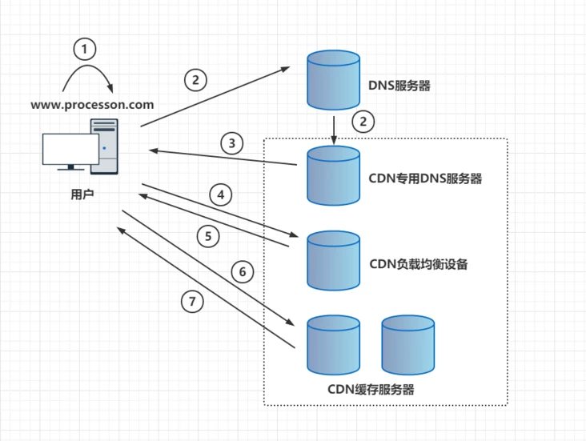
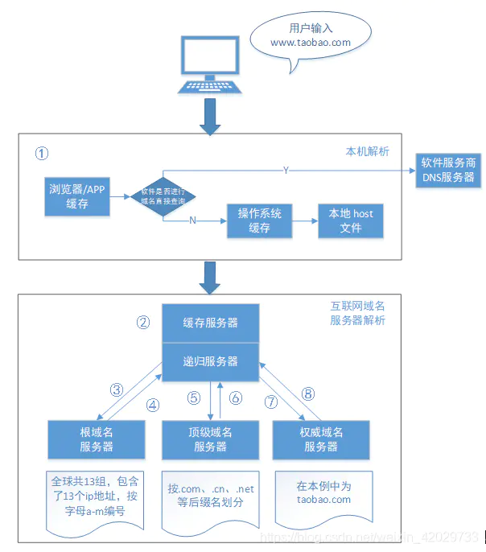
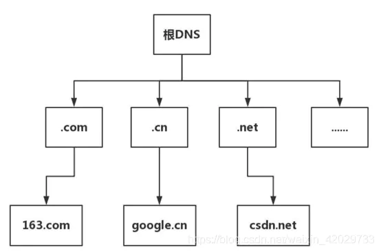

## 什么是CDN
CDN全称是Content Delivery Network,即内容分发网络,也成为内容传送网络。CDN是构建在现有网络基础上的智能虚拟网络，依靠部署在各地的边缘服务器，通过中心平台的负载均衡、内容分发、调度等功能模块，使用户就近获取所需内容，减低网络拥塞，提高用户访问响应速度和命中率。

简单理解了，CDN是利用缓存技术,解决如何将数据快速可靠从源站传递到用户的问题。用户获取数据时，不需要直接从源站获取，通过CDN分发，用户可以从一个较优的服务器获取数据，从而达到快速访问，并减少源站负载压力的目的

## CDN快速访问原有

## CDN原理

用户访问的网站使用CDN，其过程会变成一下这样

1. 用户向浏览器输入www.processon.com这个域名，浏览器第一次发现本地没有DNS缓存，则向网站的DNS服务器请求
2. 浏览器向DNS服务器请求对该域名的解析。由于CDN对域名进行了调整，DNS服务器最终会将域名的解析权交给CNAME指向CDN专用的DNS服务器；
3. CDN的DNS负载郡城系统解析域名，把对用用户响应速度最快的IP返回给用户
4. 用户向该IP地址(CDN服务器)发出请求
5. CDN负载均衡设备会为用户选择一台合适的缓存服务器提供服务器;
6. 用户向缓存服务器发出请求
7. 缓存服务器响应用户请求，将用户所需的内容返回给用户

## DNS名词解释
域名:是由一串用点分割的名字组成的Internet上某一台计算机或计算机组的名称，用于在数据传输时对计算机的定位标识

DNS:全称Domain Name System,中文名为域名系统，是因特网的一项核心服务，它作为可以将域名和IP地址相互映射的一个分布式数据库，能够使人更方便地访问互联网，而不用去记住能够被机器直接读取的IP数串。

以淘宝为例，www.taobao.com就是域名，但计算机并不能直接根据域名找到淘宝，必须转化成101.89.125.239(IP4)
或240e:e1:f300:1:3::3f9（IPV6）这样的IP地址才能准确读取，而且这边的ip地址可能会随着时间、网络、机器的变化而变化。

## DNS解析过程

### 1. 本地解析
用户在本机浏览器输入www.taobao.com后，计算机会先在本地进行解析(图中1),这里会分成三个小步
1. 先到浏览器的DNS缓存中查询是否有对应记录，如有则直接返回ip地址，完成解析，如果没有则下一步
2. 接着会进行一个判断：软件是否或浏览器是否进行域名直接查询。如果有的话，会直接连到软件服务商提供的DNS服务器上，并返回IP；没有没有，则继续查询操作系统的缓存：如有责直接返回ip地址，完成解析，如果没有则下一步；
3. 最后查看本地host文件，比如window的host文件一般位于“C:\Windows\System32\drivers\etc”，如果这里也没有的话就需要到本地dns服务器上查找了。

### 2. 本地DNS服务器
包括两部分:缓存服务器和递归服务器
1. 缓存服务器有两种，一种是公共DNS服务器，比如114 DNS（114.114.114.114）、Google DNS（8.8.8.8）；另一种是本地运营商提供的DNS服务器，比如我们上海电信的DNS服务器包括202.96.209.5、202.96.209.133、116.228.111.118和180.168.255.118。普通用户使用的都是运营商的本地域名服务器，这些服务器一般架设在离用户不远的地方，而且性能都很好，所以一般都会缓存域名解析结果，大约80%的域名解析都会在这一步完成（图中为②）。
2. 如果缓存服务器无法找到对应IP，则会把信息传递给递归服务器
### 3. 根域名服务器
当信息传递给递归服务器后，会根据内置的根域名服务器ip地址，寻求根域名服务器的帮助：：

1. dns域名服务器一般分为3种，分别是根域名服务器(.)、顶级域名服务器(.com)、权威域名服务器
2. 全球一共有13组根域名服务器（注：这里并不是指13台服务器，是指13个ip地址，按字母a-m编号），根域名服务器不会直接解析域名，二十把不同的解析请求分配给下面的其它服务器来完成，下面是dns域名系统的树状结构图：

    
3. 以www.taobao.com为例，当根域名接收到本地dns的解析请求后，获知后缀是.com，于是就把负责.com的顶级根域名服务器ip地址返回给本地dns（图中为③和④）
4. 本地dns获得返回的ip地址，再去找对应的顶级域名服务器，顶级域名又把负责该域名的权威服务器ip返回给本地dns（图中为⑤和⑥）。
5. 最后，本地dns根据ip找到对应的权威服务器，权威服务器把对应的主机ip返回给本地dns，至此完成了域名解析的全过程（图中为⑦和⑧）。

## 资料
[CDN实现原理](https://www.cnblogs.com/natee/p/15057123.html)

[浅析CDN原理](https://segmentfault.com/a/1190000039045541)

[高并发网站架构设计之DNS解析原理全过程](https://zhuanlan.zhihu.com/p/269239315)
