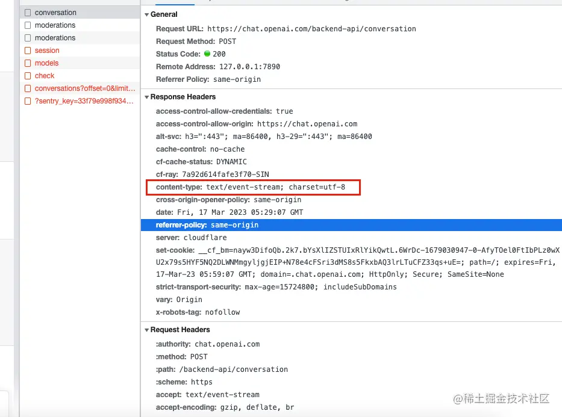
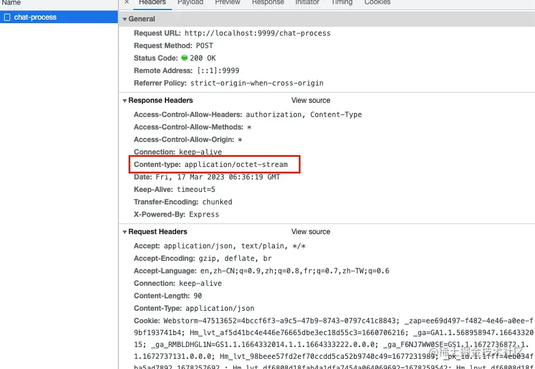
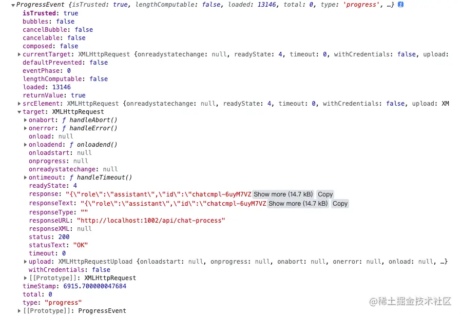
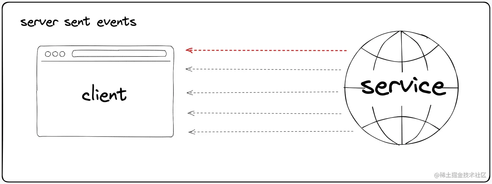
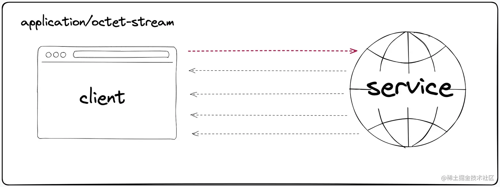

web通信方式
- 轮训
- 长轮训
- 数据流
- websocket
- eventsource

applicattion/octet-stream 和 text/event-stream 分别属于上述通信方式的长轮训和eventsource

- SSE(server send events) content-type: text/event-stream

    

- 数据流content-type: application/*,本次以 application/octet-stream 为例

    

## application/octet-stream
### application/octet-stream是什么？
application/octet-stream 是MIME中的一种。MIME的独立类型有如下几种

```shell
 text/plain
 text/html
 image/jpeg
 image/png
 audio/mpeg
 audio/ogg
 audio/*
 video/mp4
 application/*
 application/json
 application/javascript
 application/ecmascript
 application/octet-stream
 …
```
独立类型表明了对文件的分类
类型|描述|典型事例
---|---|---
text|表明文件是普通文本，理论上是人类可读|text/plain, text/html, text/css, text/javascript
image|表明是某种图像。不包括视频，但是动态图（比如动态 gif）也使用 image 类型|image/gif, image/png, image/jpeg, image/bmp, image/webp, image/x-icon, image/vnd.microsoft.icon
audio | 表明是某种音频文件 | audio/midi, audio/mpeg, audio/webm, audio/ogg, audio/wav
video | 	表明是某种视频文件 | video/webm, video/ogg
application|表明是某种二进制数据 | application/octet-stream, application/pkcs12, application/vnd.mspowerpoint, application/xhtml+xml, application/xml, application/pdf

二进制文件没有特定或已知的subtype,即使用 [application/octet-stream](https://developer.mozilla.org/zh-CN/docs/Web/HTTP/Basics_of_HTTP/MIME_types#applicationoctet-stream),这是应用程序文件的默认值。意思是 未知的应用程序文件，浏览器一般不会自动执行或询问执行。浏览器会像对象设置了HTTP头 Content-Disposition 值为 attachment的文件一样对待这类文件

说人话就是，<span style="color: blue">浏览器并不认得这是什么类型，也不知道应该如何展示，只知道这是一种二进制文件，因此遇到content-type为application/octet-stream文件时，浏览器会直接把它下载下来。这个类型一般会配合另一个响应头Content-Disposition，该响应头指示回复的内容该以何种形式展示，是以内联的形式(即网页或者页面的一部分)，还是以附件的形式下载并保存到本地</span>

### application/octet-stream能做什么？使用场景是什么？
看下下面的几种情况
```js
Content-Type: application/octet-stream
Content-Disposition: attachment; filename="pciture.png"
```
这个的意思是：我不知道这个传输过来的东西是什么东西，把它存储为一个文件，文件名叫做picture.png.

```js
Content-Type: image/png
Content-Disposition: attachment; filename="pciture.png"
```
这个的意思是：我知道传输过来的是个png结尾的图片，把它存储为一个文件，文件名叫做picture.png

```js
Content-Type: image/png
Content-Disposition: inline; filename="pciture.png"
```
这个的意思是：这是一个 png 图片，请显示它，除非你不知道如何显示 png 图片。否则，如果用户选择保存它，我们建议你保存它的文件名称为 picture.png。这个用户选择保存它一般是右键点击另存为的这个行为。

基于以上情况，可以了解到 application/octet-stream 的使用场景主要是配合 content-disposition做文件传输。如果不配合 content-disposition，返回的就是文件流内容

### 怎么使用application/octet-stream？
node
```js
 router.post('/chat-process', auth, async (req, res) => {
   res.setHeader('Content-type', 'application/octet-stream')
 ​
   try {
     const { prompt, options = {} } = req.body as { prompt: string; options?: ChatContext }
     let firstChunk = true
     await chatReplyProcess(prompt, options, (chat: ChatMessage) => {
       // **数据传输
       res.write(firstChunk ? JSON.stringify(chat) : `\n${JSON.stringify(chat)}`)
       firstChunk = false
     })
   }
   catch (error) {
     res.write(JSON.stringify(error))
   }
   finally {
     // ** 终止数据传输
     res.end()
   }
 })
```
客户端数据接收
```js
await fetchChatAPIProcess<Chat.ConversationResponse>({
    prompt: message,
    options,
    signal: controller.signal,
    onDownloadProgress: ({ event }) => {
        console.log(11111, event);
        const xhr = event.target;
        const { responseText } = xhr;
        // Always process the final line 
        const lastIndex = responseText.lastIndexOf('\n');
        let chunk = responseText;
        if(lastIndex !== -1) {
            chunk = responseText.substring(lastIndex)
        }
        try {
            const data = JSON.parse(chunk);
        } catch(error) {
            //
        }
    }
})
```
其中，拿到的event格式为：



当数据没有传输完毕时，每当数据有变化，都会源源不断的传到客户端来，客户端需要对拿到的event对象进行格式化处理
```js
const xhr = event.target;
const { responseText } = xhr;
const data = JSON.parse(responseText);
```
### 有哪些优缺点
使用 application/octet-stream 媒体类型来实现服务端推送也被称为基于长轮训的技术，其优缺点如下

优点：
- 能够在现有的HTTP协议基础上实现服务端推送，不需要额外的网络协议支持，因此非常容易部署和使用。
- 可以通过控制间隔实现近实时的数据传输，适用于需要实时更新、但是更新频率不高的场景
- 支持广泛，几乎所有支持HTTP的客户端都可以使用该技术进行数据交换

缺点
- 长训轮技术本身并没有提供完整的实时通讯解决方案，在复杂场景下需要自行设计通信协议和处理机制，增加了开发难度和成本
- 长轮训技术会占用大量服务器资源，因为每个连接需要在服务端保持打开状态，而且客户端也需要不断发送请求，增加了贷款和服务器负载压力
- 长轮训技术对消息的处理机制比较简单，不能很好的处理分发过程中的重试、ack等问题，容易出现消息丢失或重复消费等问题

总体而言，基于长轮训的技术适合于一些轻量级的实时通讯场景，如在线聊天、实时公告等，但是在复杂的实时通讯需求下可能需要考虑更为专业的实时通讯方案

类似 MIME分为为application/*的都可以一次进行数据传输





### 有哪些需要注意事项？
application/octxt-stream 是一种使用广泛的二进制流数据格式，它用于在Internet上发送二进制文件，例如图片、音频、视频等。以下是在使用application/octet-stream时需注意的几个要点：

- 基于MIME类型的检测 由于 application/octet-stream 是一种通用的MIME类型，因此在数据交换过程中需要进行 特定文件类型的预处理或后处理。为了避免处理错误的数据，您应该始终使用处理了MIME类型的实用程序或库。这样可以确保您的应用程序能够处理正确的数据类型。

- 考虑到文件大小 application/octet-stream 适用于发送大型二进制文件。当您从服务器下载大型文件时，它可以提高下载速度。但是，由于文件大小限制，如果您在发送数据时使用application/octet-stream，则需要考虑网络带宽带宽是否能够支持快速传输。

- 安全信息需要特别处理 由于 application/octet-stream传输的数据是二进制文件，因此可能包含一些敏感或机密的信息。在发送或接收这些文件时，您应该确保传输过程中所使用的传输协议是安全的。例如，您可以使用HTTPS协议来进行安全传输。

## text/event-stream
### text/event-stream 是什么？
text/event-stream是一种用于服务器向客户端推送消息、事件和通知的数据形式，属于HTML5的一部分。text/event-stream将消息视为一系列流事件，以文本形式发送。该格式适用于实现服务器发送事件(SSE)的应用程序，其中某些服务器可以在客户端通信时单向推送数据

- 工作原理

    客户端通过发送HTTP请求到服务器，请求获取特定资源的SSE流。当服务器有新的事件可以推送时，将推送到SSE流中。客户端会注意到流的变化，并从六中读取推送的时间。客户端可以使用Javascript EventSource 对象来消费推送的事件数据

### text/event-stream能做什么？使用场景是什么？
主要用于实时应用程序的开发，如在线游戏、社交媒体、消息推送等场景

- 实时游戏

    text/event-stream是实时游戏和在线游戏交互中常用的技术。服务器可以使用它向客户端推送有有关游戏中其他玩家的数据，以便玩家可以及时跟踪游戏中发生的事情

- 社交网络

    社交媒体网站使用text/event-stream的主要原因是实时通知其用户应用程序中新事件的发生。如果用户在聊天或其他活动中收到新消息或其他实时更新，则 text/event-stream可以在不需要用户刷新页面的情况下通知它们。

- 处理大量数据

    text/event-stream是处理大量数据的一种流行的技术，例如高解析度视频流或音频流。使用它可以轻松地传输大量的数据，从而提高应用程序的响应能力。

### 怎么使用text/event-stream
text/event-stream可以通过一下几个步骤使用：
- 服务器端设置SSE

    在服务器端，您需要向客户端提供一个SSE流。您可以使用Node.js编写服务器，并使用特定的npm包将SSE流添加到您的服务器中。
- 建立SSE连接

    在客户端，您需要建立与SSE流的连接。您可以使用Javascript中的EventSource对象来实现此操作。使用该对象可以连接到SSE流，并订阅来自服务器的事件信息。您还可以在EventSource对象中添加回调处理程序，以便处理由服务器推送的事件

- 推送事件

    在服务器端，您需要将要推送的事件写入您的SSE流中。您可以使用res.write()方法并将事件作为文本字符串添加到SSE流中。事件字符串应该遵循text/event-stream数据格式的结构。

- 关闭SSE连接
    最后，在页面或会话结束时，请确保关闭SSE连接。您可以使用JavaScript中的EventSource对象的close()方法来实现此操作。

服务器端的代码：
```js
 const http = require('http');
 ​
 http.createServer((req, res) => {
     res.writeHead(200, {
         'Content-Type': 'text/event-stream',
         'Cache-Control': 'no-cache',
         'Connection': 'keep-alive'
     });
 ​
     setInterval(() => {
         res.write('data: The server time is: ' + new Date() + '\n\n');
     }, 1000);
 ​
     req.connection.addListener('close', () => {
         console.log('SSE connection closed!');
     }, false);
 }).listen(8080);
 ​
 console.log('SSE Server listening on port 8080');
```
客户端代码
```js
const evtSource = new EventSource('http://localhost:8080');

evtSource.onmessage = function(event) {
    const serverTime = document.getElementById('serverTime');
    serverTime.innerHTML = event.data;
}
```
### 有哪些优缺点
- 实时更新数据，更改数据立即在客户端进行显示
- 可以消除像轮训这样的开销大的技术
- 可以更好的使用资源，因为它可以一次连接多个资源

### 有哪些注意事项
- 不要使用错误的数据格式
- 避免发送太多时间
- 考虑安全问题
- 避免浏览器兼容性问题


[fetchEventSource使用+源码解析](https://juejin.cn/post/7345379767787749395)